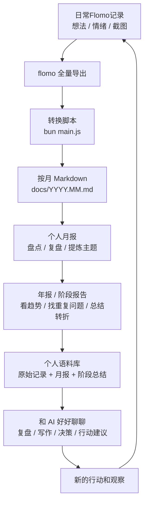

## 1. 缘起

- 个人知识管理里最容易断掉的一环：把日常记录变成可复盘、可写作、可对话的材料。
- 把一个月里散落的想法、情绪、行动、判断和问题重新捡起来，盘点盘点，复盘复盘。
- 从低成本记录开始：flomo 还是目前用过的**最好的记录工具**，没有之一。

## 2. 把 flomo 变成按月语料，再变成 AI 语料上下文

flomo 本身适合记录，但不一定适合做`长期整理和二次加工`。

所以我做了一个`很简单的转换脚本`：定期导出 flomo 数据，然后把导出的 HTML 解析成 Markdown，并按照月份生成文件。

生成后的结构大概是这样：

```text
flomo/
├── main.js           # 主处理脚本（使用 Bun 运行）
├── flomo@liguwe-YYYYMMDD/
│   ├── liguwe 的笔记.html
│   └── file/         # flomo 导出的附件目录
├── docs/
│   ├── YYYY.MM.md    # 按月生成的 Markdown 文件
│   └── files/        # Markdown 引用的附件
├── blog/             # 工作流相关文章与分享稿
└── README.md
```

> 每个 `YYYY.MM.md` 文件就是那个月的原始语料。里面保留了 memo 的时间、正文、图片和音频引用。

## 3. 从“流水账”变成“人生轨迹”

很多时候，人并不是缺少经历，而是缺少对经历的`二次组织`。没有组织，过去就只是过去了；组织起来，它才会变成能指导下一步的材料。

## 4. 最终目的是和 AI 好好聊聊

当我把原始 memo、月报、阶段报告都整理出来之后，我就可以把它们作为上下文和 AI 对话。这时的**对话会变得不一样**。

我可以问它：

- 过去半年我最稳定的关注点是什么？
- 哪些问题我一直在绕圈？
- 我的工具选择和工作方式有什么变化？
- 哪些项目只是冲动，哪些值得继续投入？
- 如果基于我过去几个月的记录，你会建议我下个月重点做什么？

## 5. 这个工作流的价值

整个流程其实很简单：

```text
日常 memo
  -> flomo 全量导出
  -> 按月 Markdown
  -> 个人月报
  -> 年报 / 阶段报告
  -> AI 对话语料
```

## 6. 真正重要的是

有了一种方式，可以带着自己的真实材料，和 AI 好好聊聊，认识自己，从`原始记录`里提炼出一个更清晰的自己。
