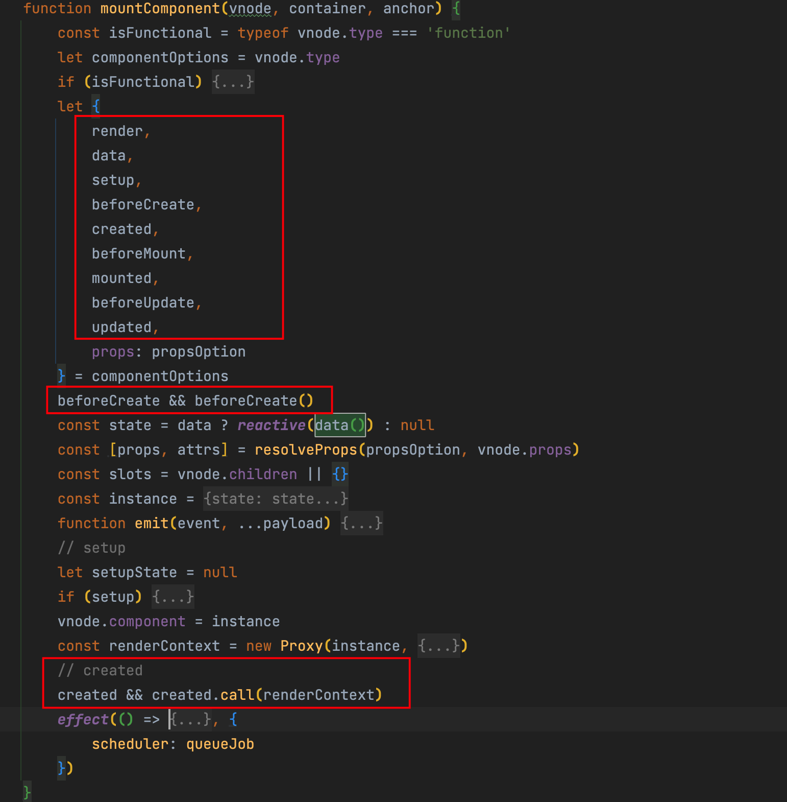
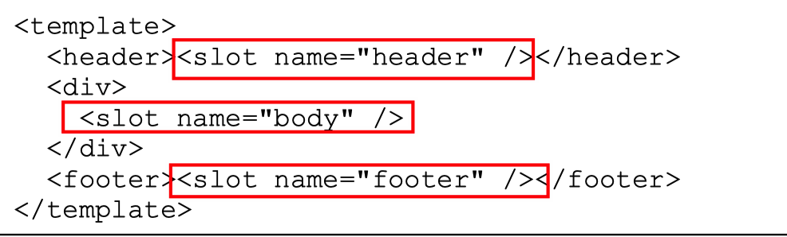
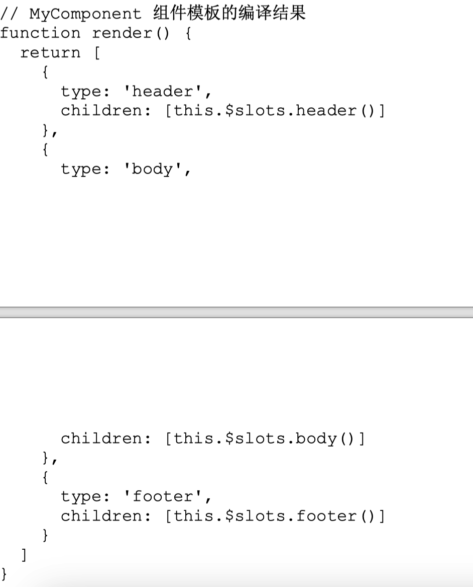
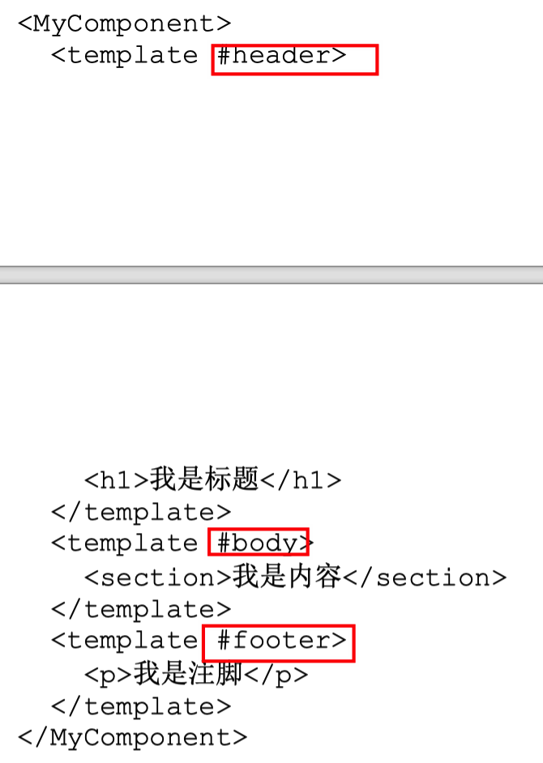
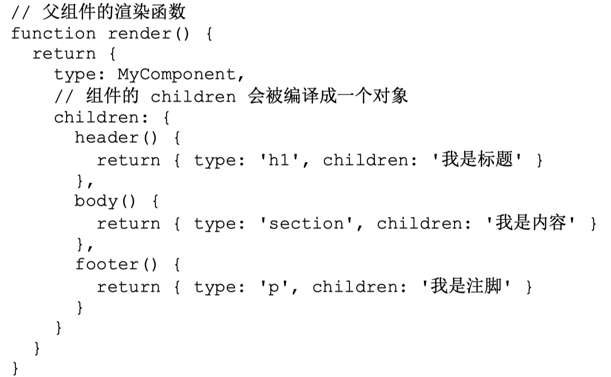
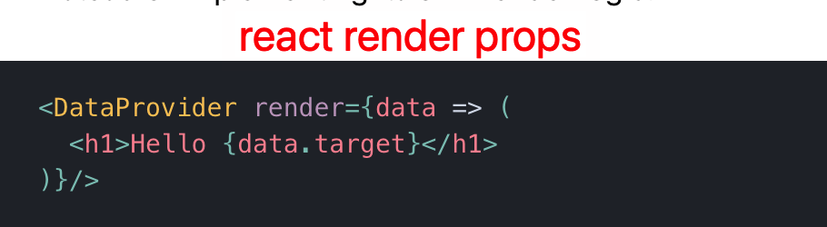
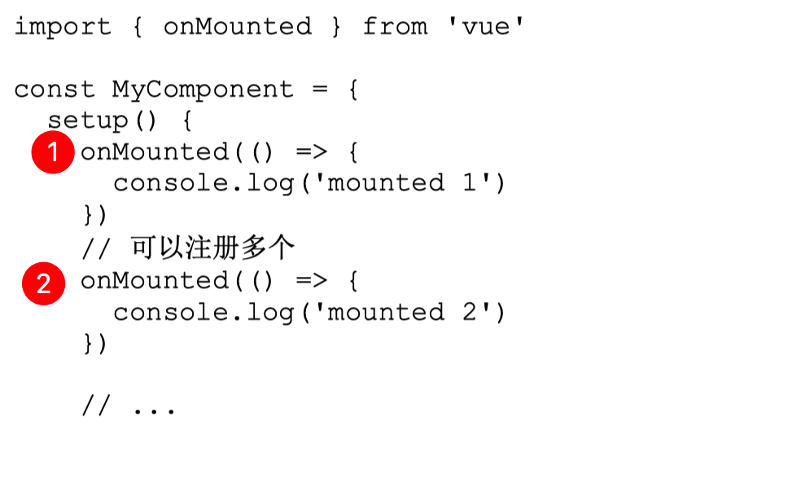

# 0035.Vue3 组件的实现原理


#vue #vue3 #2023/06/10 


## 一、渲染器、组件与 vdom 之间的关系


前文 [[0032.vue3 的渲染器原理]] 实现了对单个 `vdom` 的渲染，比如对下面 `vdom` 的渲染：

```javascript
const Fragment = Symbol()
const newVnode = {
  type: 'div',
  children: [
    {
      type: Fragment,
      children: [
        { type: 'p', children: 'text 1' },
        { type: 'p', children: 'text 2' },
        { type: 'p', children: 'text 3' }
      ]
    },
    { type: 'section', children: '分割线' }
  ]
}
```


但实际页面，会包括很多 `vdom` 甚至是各种嵌套的 `vdom`， 那么，**如何使用 `vdom` 来描述页面，描述 UI 呢？**

这里直接给出答案：如下结构

```javascript
const C1 = {
    name: 'C1',
    render() {
        return {
            type: 'div',
            children: [
                { type: 'p', children: 'text 1' },
                { type: 'p', children: 'text 2' },
                { type: 'p', children: 'text 3' }
            ]
        }
    }
}

```

两个要点：

- 包含 `render`
- `return` 一个 `vnode`

下图展示了： `渲染器、组件 、 vnode 的关系`：

https://www.figma.com/file/hT9k2YbVvV1UIITtUmbJ0C/2023.05.LOG?type=whiteboard&node-id=201-996&t=x2AAJuGlw9iHBGmM-4

总结下就是，渲染器会根据vdom 的类型，来判断它是否是否是`组件`，如果是，则会继续递归使用 `mountComponent` 或者 `patchComponent`来完成组件的挂载和更新，部分代码如下：

```javascript
if (typeof type === 'string') {
	if (!n1) {
		mountElement(n2, container, anchor)
	} else {
		patchElement(n1, n2)
	}
} else if (type === Text) {
	if (!n1) {
		const el = n2.el = createText(n2.children)
		insert(el, container)
	} else {
		const el = n2.el = n1.el
		if (n2.children !== n1.children) {
			setText(el, n2.children)
		}
	}
} else if (type === Fragment) {
	if (!n1) {
		n2.children.forEach(c => patch(null, c, container))
	} else {
		patchChildren(n1, n2, container)
	}
} else if (typeof type === 'object' || typeof type === 'function') {
	// component
	if (!n1) {
		mountComponent(n2, container, anchor)
	} else {
		patchComponent(n1, n2, anchor)
	}
}
```


## 二、如何保存组件状态，以及 状态改变了同步更新组件

如果保存组件状态呢？答案是 `data()` ，并且 需要让 data 数据是响应式的，所以代码应该如下 

```javascript
const state = data ? reactive(data()) : null
```

所以，每次更新 data ，会重新渲染，但是浏览器渲染是`同步任务`，所以需要有个调度器来调度，它通过`promise` 实现了一个`微任务队列`，避免重复渲染，去重任务队列等。

> 关于调度器微任务队列的实现，更多参考 [[0012.Vue 的响应式的系统设计原理#微任务队列]]

部分代码如下：注意下面的 `scheduler` 

```javascript
 const state = data ? reactive(data()) : null
 effect(() => {
	const subTree = render.call(renderContext, renderContext)
}, {
	scheduler: queueJob
})
```

## 三、组件实例与组件的生命周期

组件实例，本质就是一个对象，存储着组件运行过程的所有信息，比如 组件状态，是否卸载、组件的子树、生命周期等，如下：

```javascript
const instance = {
		state,
		props: shallowReactive(props),
		isMounted: false,
		subTree: null,
		slots,
		mounted: []
}
```

各类生命周期，就在具体位置上添加即可，如下：



> 一个组件可能存在多个同类型的组件，比如` mixin` 进来的组件，这时候就需要数组了。但核心原理不变


## 四、props 与组件的被动更新


`副作用自更新`所引起的子组件更新叫作`子组件的被动更新`。我们需要检查是否需要真的更新，比如 `props` 如果根本就没变？如果需要更新，需要同步更新子组件的 `props` 、`slots`  等内容，其实要 **完善 vue 中的 props 机制，需要编写大量的边界代码**


由于 props 数据与组件自身的状态数据都需要暴露到`渲染函数`中，并使得渲染函数能够通过 this 访问它们，因此我们需要封装一个`渲染上下文对象`， 渲染上下文（renderContext），它实际上是组件实例的代理对象。在渲染函数内访问组件实例所暴露的数据都是通过该代理对象实现的。

>   vue中，没有在 `props 选项`中的 props 数据都将存储到 `attrs` 对象中，


## 五、setup 函数的作用 与 实现


 `setup` 函数，它只会在挂载时执行一次，该函数是为了`组合式 API` 而生 的，所以我们要避免将其与 `Vue.js 2 中的“传统”组件选项（如 methods watch data）` 混合使用。 `setup` 函数的返回值可以是两种类型
 
 - 如果返回`函数`，则将该函数作为组件的渲染函数；
 - 如果返回`数据对象`，则将该对象暴露到渲染上下文中，暴露给模板使用。

```javascript
const InnerComp = {
    name: 'InnerComp',
    /**
     * expose: 暴露给父组件的属性
     * */
    setup(props, {emit, slots,attrs,expose}) {
        const count = ref(0);
        // 返回一个【数据对象】
        return {
            count,
        }
        // 返回一个【渲染函数】
        return () => ({
            type: 'span',
            children: 'inner'
        })
    }
}
```

## 六、组件事件与 emit

emit 函数包含在 `setupContext 对象`中，可以通过 emit 函数 发射组件的自定义事件。通过 `v-on` 指令为组件绑定的事件在经过`编译`后，会以 `onXxx` 的形式存储到 `props 对象`中。当 emit 函数执行时，会在 props 对象中寻找对应的事件处理函数并执行它。

## 七、插槽 slot

它借鉴了 Web Component 中 `<slot> 标签`的概念。**插槽内容会被编译为插槽函数，插槽函数的返回值就是向槽位填充的内容**。`<slot>` 标签则会被编译为插槽函数的调用，通过执行对应的插槽函数，得到外部向槽位填充的内容（即虚拟 DOM），最后将该内容渲染到`槽位`中。

我们以 `MyComponent` 组件为例，它的模板如下：



上面的代码会编译成如下：



具体使用 `MyComponent` 组件



上面的模板，会编译成如下`渲染函数`：



**插槽的实现是不是和 React render props 的概念很像？**，如下图：




## 八、注册生命周期

先看代码，下面注册两个 `onMounted` 




所以通过 `onMounted` 注册的生命周期函数会被注册到当前组件实例的 `instance.mounted 数组`中。为了维护当前正在初始化的组件实例，我们定义了`全局变量 currentinstance`，以及用来设置该变量的 `setCurrentInstance` 函数。

其他生命周期同理。


## 最后

一些具体代码实现细节，没有太抠，知道大致的原理即可，真有应用场景再仔细研究一下具体代码实现细节。

## 参考 

- 《Vue 设计与实现》
