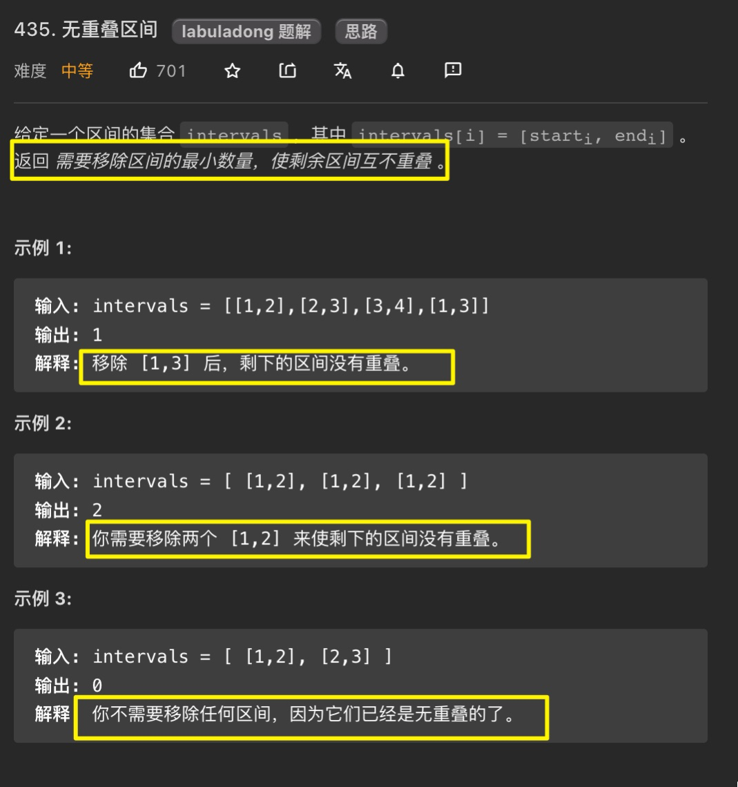
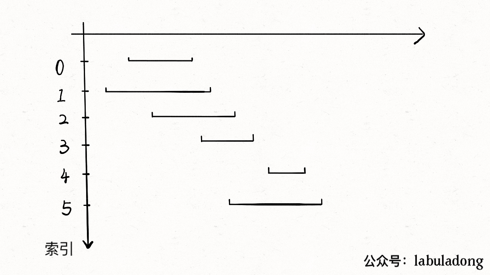
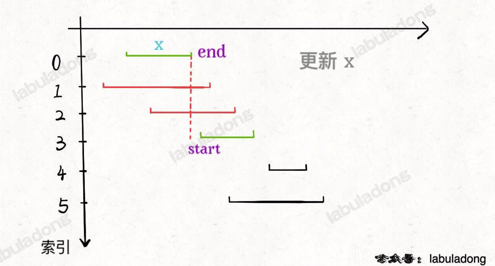
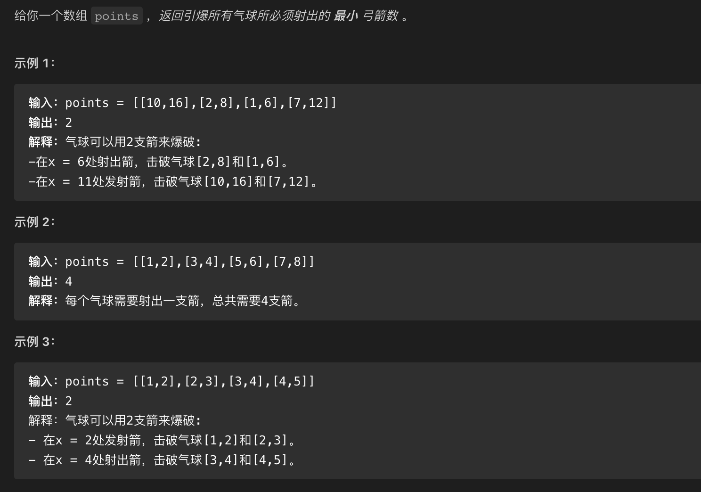
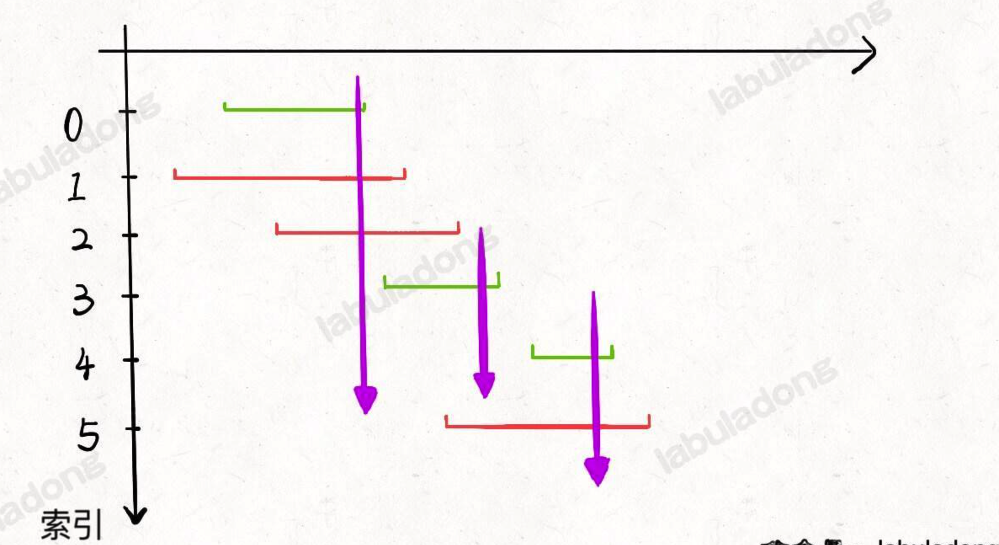
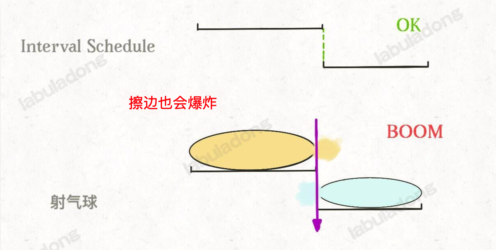

# 0067.贪心算法


#算法 


## 贪心算法的`特性`

### 特性 1：局部最优

**举个例子：**  比如你面前放着 100 张人民币，你只能拿`十张`，怎么才能拿最多的面额？显然每次选择剩下钞票中面值最大的一张，最后你的选择一定是最优的。

上面的`例子` ， 每一步都做出一个`局部最优`的选择，最终的结果就是`全局最优`

### 特性 2：符合贪心算法的线性规划问题复杂度比较低

一个算法问题使用暴力解法需要`指数级`时间，如果能使用动态规划消除重叠子问题，就可以降到`多项式级别`的时间，如果满足**贪心选择**性质，那么可以进一步降低时间复杂度，达到`线性级别`的。


## 第 1 题：无重叠区间问题 

https://leetcode.cn/problems/non-overlapping-intervals/



**需要移除区间的 `最小数量`，使剩余区间互不重叠** ，所以我们先找究竟 `有多少区间不重叠?` 


### 第一步：有多少个区间互不重叠呢？

1. 先按照 `end` 排序，选出区间 `x` 
		a. `count`  代表 `不重叠区间的个数` ，
		b.  所有**不与** `x` 相交的  ，`count + 1`
2. 重复上面的  a 、b


> [!danger]
>  注意，下面动图的`绿色的区间`个数使我们需要的，即 `count`，别管`红线区间`


如下动图：



下面的 `start` 代表当前遍历到`区间的左边的值` , 所以这里判断不相交的条件是是 `start >= end` ，看下图就明白了了



所以得出以下代码：

```javascript
var notCrossingIntervals = function (intervals) {
    // base case
    if (intervals.length === 0) return 0;
    // ::::第一步：先按照 `end` 排序，并选出区间 `x` ，`即` 第一个区间
    // 升序排列
    intervals.sort((a, b) => a[1] - b[1]);

    //  :::: 至少有一个区间不相交
    let count = 1;
    // 排序后，第一个区间就是 x
    let x = intervals[0][1];

    // ::::第二步：所有与 `x`  相交的，`移除个数 + 1`
    for (let i = 1; i < intervals.length; i++) {
        let start = intervals[i][0];
        // ，不相交，不相交，不相交，不相交
        if (start >= x) {
            console.log('不相交');
            count++;
            x = intervals[i][1];
        }
    }
    // 返回相交的个数，即为要移除的个数
    return count;
};
```


### 第二步：需要移除的个数，简单加减法即可

```javascript

/**
 * @param {number[][]} intervals
 * @return {number}
 */
var eraseOverlapIntervals = function (intervals) {
    return intervals.length - notCrossingIntervals(intervals);
};
```

## 第 2 题：用最少数量的箭引爆气球

https://leetcode.cn/problems/minimum-number-of-arrows-to-burst-balloons/



是的，这个和上题[[#示例 1：无重叠区间问题]] 一模一样，除了`擦边`也会爆炸之外，如下图所示：






下面是代码：

```javascript
var findMinArrowShots = function(points) {
    if (!points.length) return 0
    points.sort((a, b) => {
        return a[1] - b[1]
    })
    let count = 1;
    let x = points[0][1];
    for (let i = 1; i < points.length; i++) {
        // :::: 不相交
        if (points[i][0] > x) {
            x = points[i][1]
            count += 1
        }
    }
    return count
};

```

或者也行：

> [!question]
> 请思考，上面的不相交判断，为什么不需要`|| x > points[i][1]` 也行？


```javascript
var findMinArrowShots = function(points) {
    if (!points.length) return 0
    points.sort((a, b) => {
        return a[1] - b[1]
    })
    let count = 1;
    let x = points[0][1];
    for (let i = 1; i < points.length; i++) {
        // :::: 不相交
        if (points[i][0] > x || x > points[i][1]) {
            x = points[i][1]
            count += 1
        }
    }
    return count
};

```

## 第 3 题：跳跃游戏 I 

https://leetcode.cn/problems/jump-game/

## 第 4 题：跳跃游戏 II

https://leetcode.cn/problems/jump-game-ii/


<div class="liguwe-doc-footer" id="liguwe.site.blog-doc-footer">
            <div class="liguwe-doc-footer-edit-link">
                <p class="liguwe-doc-footer-p">
                    <svg t="1687912573060" class="icon" viewBox="0 0 1024 1024" version="1.1" xmlns="http://www.w3.org/2000/svg" p-id="1498">
                        <path d="M854.6 370.6c-9.9-39.4 9.9-102.2 73.4-124.4l-67.9-3.6s-25.7-90-143.6-98c-117.8-8.1-194.9-3-195-3 0.1 0 87.4 55.6 52.4 154.7-25.6 52.5-65.8 95.6-108.8 144.7-1.3 1.3-2.5 2.6-3.5 3.7C319.4 605 96 860 96 860c245.9 64.4 410.7-6.3 508.2-91.1 20.5-0.2 35.9-0.3 46.3-0.3 135.8 0 250.6-117.6 245.9-248.4-3.2-89.9-31.9-110.2-41.8-149.6z m-204.1 334c-10.6 0-26.2 0.1-46.8 0.3l-23.6 0.2-17.8 15.5c-47.1 41-104.4 71.5-171.4 87.6-52.5 12.6-110 16.2-172.7 9.6 18-20.5 36.5-41.6 55.4-63.1 92-104.6 173.8-197.5 236.9-268.5l1.4-1.4 1.3-1.5c4.1-4.6 20.6-23.3 24.7-28.1 9.7-11.1 17.3-19.9 24.5-28.6 30.7-36.7 52.2-67.8 69-102.2l1.6-3.3 1.2-3.4c13.7-38.8 15.4-76.9 6.2-112.8 22.5 0.7 46.5 1.9 71.7 3.6 33.3 2.3 55.5 12.9 71.1 29.2 5.8 6 10.2 12.5 13.4 18.7 1 2 1.7 3.6 2.3 5l5 17.7c-15.7 34.5-19.9 73.3-11.4 107.2 3 11.8 6.9 22.4 12.3 34.4 2.1 4.7 9.5 20.1 11 23.3 10.3 22.7 15.4 43 16.7 78.7 3.3 94.6-82.7 181.9-182 181.9z"
                              p-id="1499" ></path>
                    </svg>
                    <a href="https://www.yuque.com/liguwe/post/17d00493-ed04-56d9-81b7-c6ed480aef12" target="_blank" class="liguwe-doc-footer-edit-link-a">
                        View this page on Yuque（语雀）
                    </a>
                </p>
                <p class="liguwe-doc-footer-p">
                    <svg t="1687913054251" class="icon" viewBox="0 0 1024 1024" version="1.1" xmlns="http://www.w3.org/2000/svg" p-id="5173"><path d="M853.333333 501.333333c-17.066667 0-32 14.933333-32 32v320c0 6.4-4.266667 10.666667-10.666666 10.666667H170.666667c-6.4 0-10.666667-4.266667-10.666667-10.666667V213.333333c0-6.4 4.266667-10.666667 10.666667-10.666666h320c17.066667 0 32-14.933333 32-32s-14.933333-32-32-32H170.666667c-40.533333 0-74.666667 34.133333-74.666667 74.666666v640c0 40.533333 34.133333 74.666667 74.666667 74.666667h640c40.533333 0 74.666667-34.133333 74.666666-74.666667V533.333333c0-17.066667-14.933333-32-32-32z"  p-id="5174"></path><path d="M405.333333 484.266667l-32 125.866666c-2.133333 10.666667 0 23.466667 8.533334 29.866667 6.4 6.4 14.933333 8.533333 23.466666 8.533333h8.533334l125.866666-32c6.4-2.133333 10.666667-4.266667 14.933334-8.533333l300.8-300.8c38.4-38.4 38.4-102.4 0-140.8-38.4-38.4-102.4-38.4-140.8 0L413.866667 469.333333c-4.266667 4.266667-6.4 8.533333-8.533334 14.933334z m59.733334 23.466666L761.6 213.333333c12.8-12.8 36.266667-12.8 49.066667 0 12.8 12.8 12.8 36.266667 0 49.066667L516.266667 558.933333l-66.133334 17.066667 14.933334-68.266667z"  p-id="5175"></path></svg>
                    <a href="https://github.com/liguwe/liguwe.github.io/blob/master/post/17d00493-ed04-56d9-81b7-c6ed480aef12.md" target="_blank" class="liguwe-doc-footer-edit-link-a">Edit this page on Github</a>
                </p>
            </div>
            <div id="liguwe-comment"></div></div>