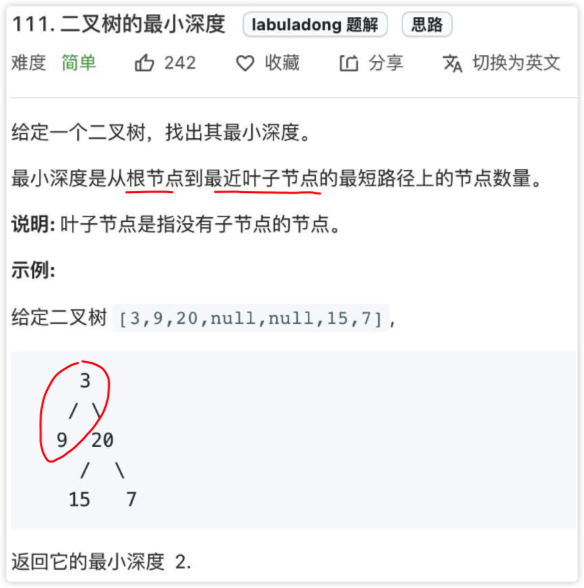
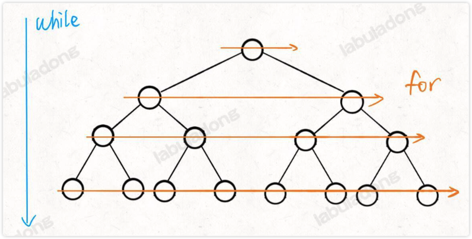
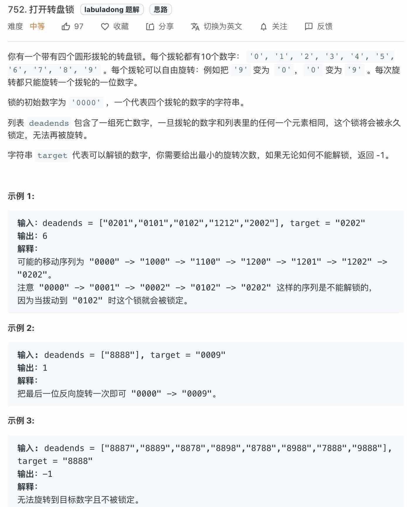

# 0028.BFS 算法
#算法/BFS算法 

## DFS 与 BFS 的区别

- 其实 `DFS 算法`就是 `回溯算法`
- `BFS 的核心思想`，就是把一些问题抽象成`图`，从一个点开始，向四周开始扩散。一般来说，我们写 BFS 算法都是用`「队列」`这种数据结构，每次将一个节点周围的所有节点加入`队列`。
- `BFS` 找到的路径一定是`最短`的，但代价就是 `空间复杂度` 可能比 `DFS` 大很多

## 算法框架
`BFS的本质` 就是，在一幅`「图」`中找到从`起点 start` 到 `终点 target` 的 `最近距离` 。
```javascript
var BFS = function(start, target) {
    var q = []; // 核心数据结构
    var visited = new Set(); // 避免走回头路
    q.push(start); // 将起点加入队列
    visited.add(start);
    var step = 0; // 记录扩散的步数
    
    while (q.length != 0) {
        var sz = q.length;
        /* 将当前队列中的所有节点向四周扩散 */
        for (var i = 0; i < sz; i++) {
            var cur = q.shift();
            
            /* 划重点：这里判断是否到达终点 */
            if (cur === target)
                return step;
            
            /* 将 cur 的相邻节点加入队列 */
            for (var x in cur.adj()) {
                if (!visited.has(x)) {
                    q.push(x);
                    visited.add(x);
                }
            }
        }
        
        /* 划重点：更新步数在这里 */
        step++;
    }
};
```
解释：

- `cur.adj()` 泛指 `cur` 相邻的节点，比如说`二维数组`中，cur `上下左右四面的位置`就是`相邻节点`
- `visited` 的主要作用是防止走回头路，但像二叉树结构，没有子节点到父节点的指针，不会走回头路就不需要 `visited`

## 力扣第 111 题「 二叉树的最小深度」
[https://leetcode.cn/problems/minimum-depth-of-binary-tree/](https://leetcode.cn/problems/minimum-depth-of-binary-tree/)



### 解法 1：BFS 解法
套用框架：`start` 是 `root根节点` ， `终点`就是最`靠近根节点的那个「叶子节点」` ，即
```javascript
// 到达叶子节点
if (cur.left == null && cur.right == null) 
```
套用框架，如下代码：
```javascript
var minDepth = function (root) {
    if (!root) {
        return 0;
    }
    let q = [root];
    let depth = 1;
    while (q.length > 0) {
        let size = q.length;
        /* 将当前队列中的所有节点向四周扩散 */
        for (let i = 0; i < size; i++) {
            let cur = q.shift();
            /* 判断是否到达终点 */
            if (cur.left === null && cur.right === null) {
                return depth;
            }
            /* 将 cur 的相邻节点加入队列 */
            if (cur.left !== null) {
                q.push(cur.left);
            }
            if (cur.right !== null) {
                q.push(cur.right);
            }
        }
        /* 这里增加步数 */
        depth++;
    }
    return depth;
}

```
这里注意这个 `while` 循环和 for `循环的配合` ，如下图：

- `while` 循环控制一层一层`往下走`
- `for` 循环利用 `sz 变量`控制从`左到右遍历每一层`二叉树节点


> 不用 visited，因为二叉树不会走`回头路` 


### 解法 2：分解问题的思路
```javascript
var minDepth = function (root) {
    
    if (!root) return 0;
    // 到叶子节点 返回 1
    if (!root.left && !root.right) return 1;
    // 只有右节点时 递归右节点
    if (!root.left)
        return 1 + minDepth(root.right);
    // 只有左节点时 递归左节点
    if (!root.right)
        return 1 + minDepth(root.left);
    // 左右节点都有时 取最小值
    return Math.min(minDepth(root.left), minDepth(root.right)) + 1;
};
```

## 再说说，BFS 与 DFS 的真正区别？
TODO

## 力扣第 752 题「 打开转盘锁」
[https://leetcode.cn/problems/open-the-lock/](https://leetcode.cn/problems/open-the-lock/)



## 参考
[https://labuladong.github.io/algo/di-ling-zh-bfe1b/bfs-suan-f-463fd/](https://labuladong.github.io/algo/di-ling-zh-bfe1b/bfs-suan-f-463fd/)
