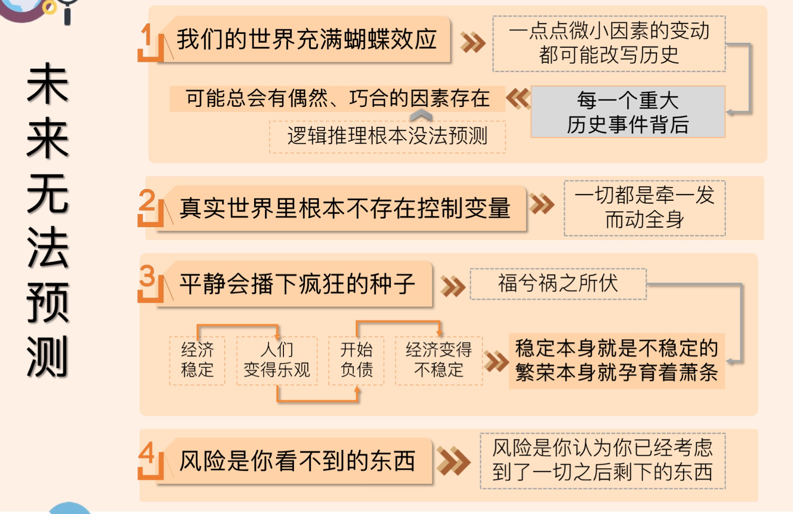
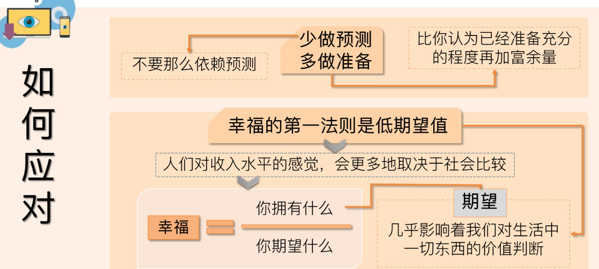
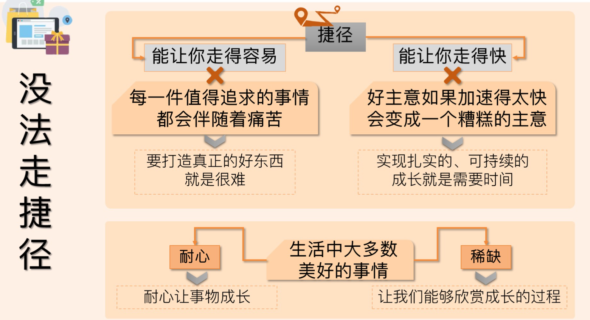
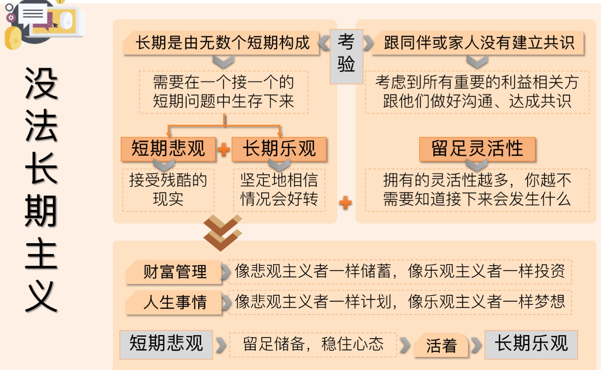

# Same as Ever 得到听书笔记
#得到 #2024/01/14 #books #听书 

## 原文
🔗 Source link: [https://www.dedao.cn/audioBook/deta](https://www.dedao.cn/audioBook/deta)...

## 讲什么

- “那些永远不变的常识”或者“那些永远不变的是什么”? 
- 财富、人性和幸福的永恒真相

## 真理一：你就是没法预测未来

- 以前认为：“如果你想知道我们未来会去往哪里，你必须先知道我们从前去过哪里。” 或者 **以史为镜，可以知兴替**
   - 但其实不对，如果你知道我们去过哪里，你会意识到，我们不知道我们未来会去哪里。
- 每一个重大历史事件的背后，它可能总会有一些偶然的、巧合的因素存在，这些是你用逻辑推理根本没法预测到的
- 平静会播下疯狂的种子，即 **“福兮祸之所伏”**
   - 即 稳定本身就是不稳定的，繁荣本身就孕育着萧条
- 风险是你认为你已经考虑到了一切之后剩下的东西
   - **未来十年最大的风险，最重要的新闻故事，都是今天没有人谈论的**

所以，**你就是没有办法预测未来。过去是，将来也是**

## 如何应对未来呢

那么，面对这样一个，无法预测的未来，我们应该怎么办呢？

- 少做预测，多做准备
- 少投资预测，多投资准备
- 幸福的第一法则是低期望值

今天的经济，擅长于创造三样东西

- 财富
- 炫耀财富的能力
- 还有对他人财富的妒忌。

与其患得患失，不如降低期待 —— 得不到是正常，得到了是惊喜——有这种心态，人生也会幸福很多。

## 你就是没法走捷径

什么叫**捷径**？

- 一是能让你走得容易
- 二是能让你走得快

每一件值得追求的事情，都会伴随着痛苦
我们人总是会对那种黑客技术、开挂技术、金手指着迷，因为它们能帮我们**跳过痛苦、跳过努力**。但是在现实世界中，这样的工具几乎不存在。这里引用了一句芒格的话，就是：如果你想得到什么，最安全的方式就是让你自己配得上你想要的东西。这才是永远不变的常识。
如果你效率很高，那么你的方法就错了。 正确的方法就是艰难的方法。所以，别想着一直追求效率，**慢即是快**
每一件值得追求的事情，都不是免费的，都会伴随着痛苦；如果在某个时刻，你觉得很容易、很有效率，你反而应该停下来好好想想，自己是不是正在用错误的方法，在走一条“有毒的捷径”。
**一个实验：**
连自然界都存在这个道理。研究人员曾经拿两组完全相同的小鱼，一组放在冷水里，一组放在暖水里。冷水里的鱼，长得慢，暖水里的鱼，长得快。后来，他们把两组鱼放回常温水里，让人惊讶的事情发生了。早期长得慢的鱼，寿命比平均值要长30% ，而那些早期长得太快、太容易的鱼，寿命比平均值要短15%。
生物学家说，这是因为，太快的生长会让身体组织受损。因为如果你长得太快，那你体内的所有资源就要用来支持生长，就没法去修复受损的身体了；而相反地，如果放慢生长速度，就能让身体得到更充分的修复。
所以，回到我们这一部分要讲的那句核心的话：**你就是没法走捷径。因为要实现扎实的、可持续的成长就是需要时间，要打造真正的好东西就是很难。过去是这样，未来也是这样。**

在《芒格之道》中，巴菲特和芒格信奉一句话：**走大道，大道人少。因为大道它难，它慢呀。**
耐心和稀缺，**耐心**让事物成长，而**稀缺**让我们能够去欣赏它成长的过程。
但是，我们回头去想想，当人们追求伟大事业时，最常用的策略是什么呢？**努力让它长得更快、更大、更多，这一直是个问题。过去是，未来是，永远都是。**

## 你就是没法坚持长期主义

“做一个长期主义者”，这句话讲出来很有气势，你讲出这句话之后，接下来要面对的才是真正的考验。

- 首先，长期是由无数个短期构成的
- 留足灵活性
- 短期悲观，长期乐观

现在人们经常嘲笑一些基金经理是短期思维。但问题是，很多基金经理根本就没有条件去坚持长期主义，因为他们的客户都是短期主义的，一遇到短期波动他们就想跑，那基金经理也只能跟着短期主义了。

我们讲过人为什么会需要长期主义，需要坚持。一个重要原因就是让**复利**有空间显示出它的力量。我们都知道，复利依赖的不是巨额回报，而是回报长期持续的累积。所以，那些能让你在赛场上留得更久的因素，就是在增强你的优势。
在这本Same as ever里面，豪泽尔也说，在任何领域，不管是财富、职业，还是人际关系，只有你能坚持足够长的时间，才能享受长期增长。

---

# 阅读原文

- [https://liguwe.github.io/post/27b086f5-4074-5ef2-908e-f697b587b80b](https://liguwe.github.io/post/27b086f5-4074-5ef2-908e-f697b587b80b)
