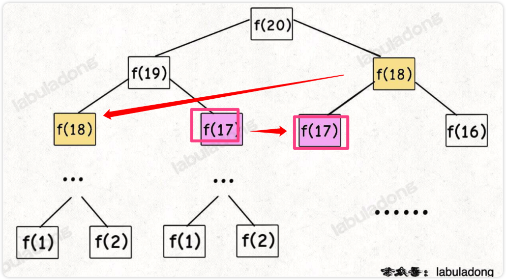
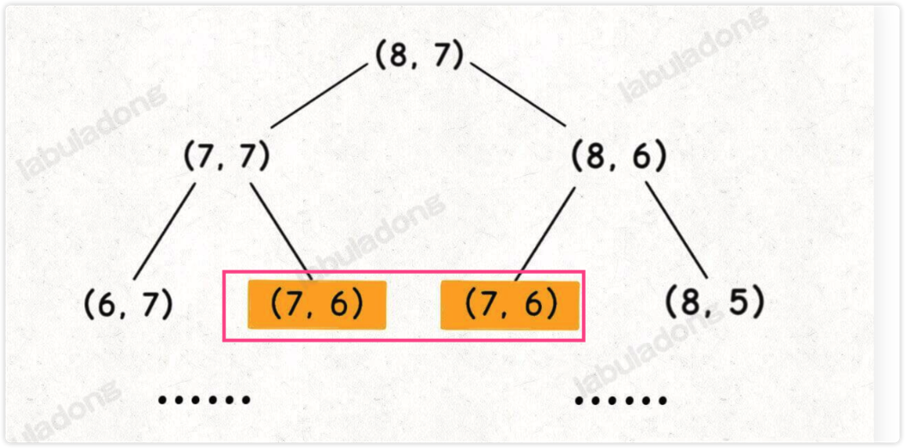
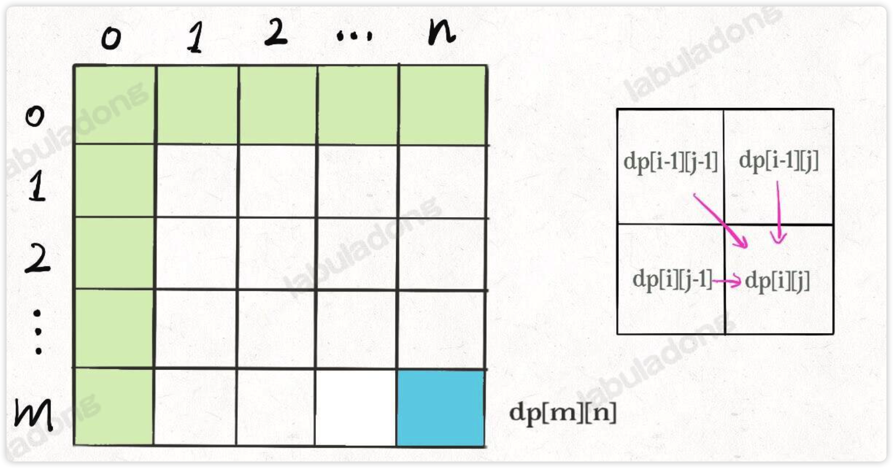

# 0013.最优子结构原理 和 DP 数组遍历方向
#算法/动态规划 

## 一、如何判断是否复合 `最优子结构`

- 找`全校最高分`， ==>  那么`每个班的最高分`，这是复合`最优子结构`的
- 找`全校最大分差`，并不能 通过找`每个班最大分差`来实现，这`不符合最优子结构`
   - 最优子结构失效情况 => **改造问题** ，即找出全校最高分 和 最低分 ，不就可以`转化为第一个问题吗？`
>  一棵二叉树的最大值，通过分解为求`左右子树（子问题`）的最大值，所以也是`符合最优子结构`的，但是它不是动态规划问题。 `最优子结构`是动态规划的`必要条件`，即动态规划一定是`有最优子结构`的，一定是让你`求最值`的。 

## 二、 如何判断是否有`重叠子问题`
1、画图，递归图，看看有没有`重复节点`，如 `fib` 问题，如下图：

2、通过`递归框架`判断，比如`状态 (i, j)` 转移到 `(i-1, j-1)` ，有`几种路径`？

- → `dp(i - 1, j)` → `dp(i - 1, j-1)`
- → `dp(i, j - 1)` → `dp(i - 1, j - 1)`

所以 `dp(i-1, j-1)` 会被多次计算，一定存在 `重叠子问题`，可以通过 `「备忘录」`或者`「DP table」` 来优化。

## 三、为什么经常看到将 `dp 数组`的大小设置为 `n + 1` 而不是 `n` ?
参考，[[0014.最小编辑距离]]  ，其实 dp数组大小设置多大，**取决于是否能够正确处理 base case** ,  另外，其实设置大一点也是可以的。

## 四、为什么动态规划遍历 `dp 数组`的方式五花八门，有的`正着遍历`，有的`倒着遍历`，有的`斜着遍历`。
其实只需要关注`两点`：
1、`遍历的过程中`，所需的状态必须是已经计算出来的。
2、`遍历结束后`，存储结果的那个位置必须已经被计算出来。
比如还是  [[0014.最小编辑距离]] 的示例，`dp[m][n]` 结果是通过 `dp[i-1][j]`, `dp[i][j-1],` `dp[i-1][j-1]` 转移而来，所以肯定是`正着遍历` ，如下图：

### 正着遍历的场景有哪些？
待补充

### 倒着遍历的场景有哪些？
待补充

### 斜着遍历的场景有哪些？
待补充

## 参考

- [https://labuladong.github.io/algo/di-er-zhan-a01c6/dong-tai-g-a223e/zui-you-zi-fbef6/](https://labuladong.github.io/algo/di-er-zhan-a01c6/dong-tai-g-a223e/zui-you-zi-fbef6/)
