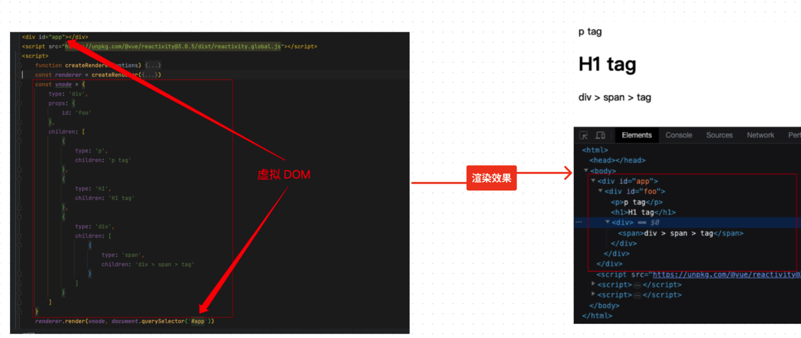
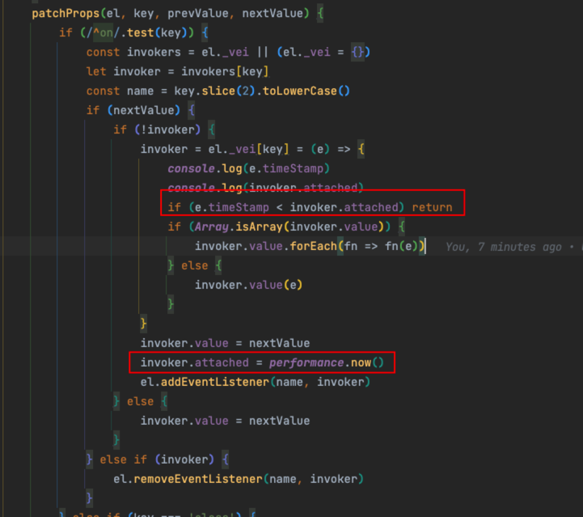

# 0032.vue3 的渲染器原理


#vue #2023/05/19  

## 一、何为渲染器？

以`浏览器平台`来说，如下的`renderer函数`就是一个`渲染器` 。

```javascript
function renderer(domString, container) {
  container.innerHTML = domString
}

renderer(`<h1>hello app</h1>`, document.getElementById('app'));
```

## 二、渲染器与响应式系统

即结合 `响应式能力`，实现 `自动`调用渲染器完成渲染和更新。如下代码，使用 `effect`, `ref` 两个变量。

```html
<div id="app"></div>
<script src="https://unpkg.com/@vue/reactivity@3.0.5/dist/reactivity.global.js"></script>
<script>

const { effect, ref } = VueReactivity; // ::::暴露的全局 API

function renderer(domString, container) {
  container.innerHTML = domString
}

const count = ref(1)

effect(() => {
  renderer(`<h1>${count.value}</h1>`, document.getElementById('app'))
})

count.value++

// 2s后更新
setTimeout(() => {
	count.value++;
},2000)

</script>

```

## 三、渲染的一些基本概念

1. `渲染器`与`渲染`：名词 和 动词 的区别
2. `挂载`： 即` mount` ，将 `虚拟 DOM` 渲染成  `真实 DOM 节点`
3. `容器`， 即渲染`到哪儿`？

下面来看一个如何实现一个`渲染器函数 createRender` 

```javascript
<div id="app"></div>
<script src="https://unpkg.com/@vue/reactivity@3.0.5/dist/reactivity.global.js"></script>
<script>
    function createRenderer() {
        /**
         * @desc 补丁函数
         * @param {VNode} oldNode 旧的 VNode
         * @param {VNode} newNode 新的 VNode
         * @param {HTMLElement} container 容器
         * */
        function patch(oldNode, newNode, container) {
        }
        function render(vnode, container) {
            if (vnode) {
                
                //// :::: 新 vnode 存在，将其与旧 vnode 一起传递给 patch 函数进行打补丁
                patch(container._vnode, vnode, container);
                
            } else {
                if (container._vnode) { // ::::卸载操作
                    // 旧 vnode 存在，且新 vnode 不存在，说明是 卸载(unmount)操作
                    // 只需要将 container 内的 DOM 清空即可
                    container.innerHTML = ''
                }
            }
            // 把 vnode 存储到 container._vnode 下，即后续渲染中的旧 vnode
            container._vnode = vnode
        }
        // 服务端渲染时会用到
        function hydrate() {
        
        }
        return {
            render,
            hydrate
        }
    }
    
    const renderer = createRenderer()
    
    // 首次渲染
    renderer.render(vnode1, document.querySelector('#app'))
    // 第二次渲染
    renderer.render(vnode2, document.querySelector('#app'))
    // 第三次渲染
    renderer.render(null, document.querySelector('#app'))
    
</script>
```

## 四、实现一个极简跨平台渲染器

如何实现一个渲染器，即不依赖于`具体宿主`，如浏览器的 `DOM API`

```javascript
function createRenderer(options) {
    // ::::为了实现跨平台，将渲染器的操作抽象为 options 对象::::
    // 如，创建元素 createElement，设置元素文本 setElementText，插入元素 insert
    const {
        createElement,
        insert,
        setElementText
    } = options;
    
    function mountElement(vnode, container) {
	    
	    // 这里的 createElement 依赖于具体宿主
        const el = createElement(vnode.type)
	    
	    // 说明是文本内容，调用 setElementText 插入
        if (typeof vnode.children === 'string') {
            setElementText(el, vnode.children)
        }
        
        insert(el, container)
    }
    
    function patch(n1, n2, container) {
        if (!n1) {
            mountElement(n2, container)
        } else {
            // n1 存在，这里需要打补丁
        }
    }
    
    function render(vnode, container) {
        if (vnode) {
            // 新 vnode 存在，将其与旧 vnode 一起传递给 patch 函数进行打补丁
            patch(container._vnode, vnode, container)
        } else {
            if (container._vnode) {
                // 旧 vnode 存在，且新 vnode 不存在，说明是卸载(unmount)操作
                // 只需要将 container 内的 DOM 清空即可
                container.innerHTML = ''
            }
        }
        // 把 vnode 存储到 container._vnode 下，即后续渲染中的旧 vnode
        container._vnode = vnode
    }
    return {
        render
    }
}
```

上面代码把，`创建、修改、及删除操作`等抽象可配置的对象。


比如在浏览器环境下，调用`浏览器`特定的 `DOM API` ，如下代码：

```javascript
const renderer = createRenderer({
  
  createElement(tag) {
    return document.createElement(tag)
  },
  
  setElementText(el, text) {
    el.textContent = text
  },
  
  insert(el, parent, anchor = null) {
    parent.insertBefore(el, anchor)
  }
  
})

const vnode = {
    type: 'h1',
    children: 'hello'
}

renderer.render(vnode, document.querySelector('#app'))

```

而在 `Nodejs 环境`下，如下代码：

```javascript

const renderer2 = createRenderer({
    createElement(tag) {
        console.log(`创建元素 ${tag}`)
        return {tag}
    },
    setElementText(el, text) {
        console.log(`设置 ${JSON.stringify(el)} 的文本内容：${text}`)
        el.text = text
    },
    insert(el, parent, anchor = null) {
        console.log(`将 ${JSON.stringify(el)} 添加到 ${JSON.stringify(parent)} 下`)
        parent.children = el
    }
});

const container = {type: 'root'};
renderer2.render(vnode, container);
```


## 五、如何挂载`子节点` 及 `子节点的属性`

### 首先看一个能够如何挂载子节点

以下是是一个能够跑起来的 `最简易的 DEMO` : 

```html
<div id="app"></div>
<script src="https://unpkg.com/@vue/reactivity@3.0.5/dist/reactivity.global.js"></script>
<script>
    function createRenderer(options) {
        const {
            createElement,
            insert,
            setElementText
        } = options
        function mountElement(vnode, container) {
            const el = createElement(vnode.type)
            if (typeof vnode.children === 'string') {
                setElementText(el, vnode.children)
                // :::::::::递归渲染子节点即可
            } else if (Array.isArray(vnode.children)) {
                vnode.children.forEach(child => {
                    patch(null, child, el)
                })
            }
            // :::::::::设置属性
            if (vnode.props) {
                for (const key in vnode.props) {
                    el.setAttribute(key, vnode.props[key])
                }
            }
            // ::插入到容器中
            insert(el, container)
        }
        function patch(n1, n2, container) {
            if (!n1) {
                mountElement(n2, container)
            } else {
                // // ::::补丁逻辑
            }
        }

        function render(vnode, container) {
            if (vnode) {
                // 新 vnode 存在，将其与旧 vnode 一起传递给 patch 函数进行打补丁
                patch(container._vnode, vnode, container)
            } else {
                if (container._vnode) {
                    // 旧 vnode 存在，且新 vnode 不存在，说明是卸载(unmount)操作
                    // 只需要将 container 内的 DOM 清空即可
                    container.innerHTML = ''
                }
            }
            // 把 vnode 存储到 container._vnode 下，即后续渲染中的旧 vnode
            container._vnode = vnode
        }

        return {
            render
        }
    }
    const renderer = createRenderer({
        createElement(tag) {
            return document.createElement(tag)
        },
        setElementText(el, text) {
            el.textContent = text
        },
        insert(el, parent, anchor = null) {
            parent.insertBefore(el, anchor)
        }
    })
    const vnode = {
        type: 'div',
        props: {
            id: 'foo'
        },
        children: [
            {
                type: 'p',
                children: 'p tag'
            },
            {
                type: 'h1',
                children: 'H1 tag'
            },
            {
                type: 'div',
                children: [
                    {
                        type: 'span',
                        children: 'div > span > tag'
                    }
                ]
            }
        ]
    }
    renderer.render(vnode, document.querySelector('#app'))


</script>

```

下图是最终`渲染的效果`：



https://www.figma.com/file/hT9k2YbVvV1UIITtUmbJ0C/2023.05.LOG?type=whiteboard&node-id=147-181&t=sZSmw8G9XgtflSer-4

两个注意点：

- 递归逻辑：如果存在 `children` 则接着遍历
- 设置属性使用  ` el.setAttribute(key,value)` ，我们也可以使用 `el[key] = value` 的方式，但是，**为元素设置属性比想象中的更复杂得多**

下面先区分 `HTML Attributes` 和 `DOM Properities`

### `HTML Attributes` 和 `DOM Properities`

浏览器解析完以下 `HTML 代码段`后，会创建 以之相符 的 `DOM 元素对象` ，比如

-  `id="app"` 对应 `el.id`
- `class="green"` 对应 `el.className` ，说明 两者并不是一一对应的。

```html
<div id="app" class="green"></div>
<div data-a="3" mmm="asdf" draggable="true"></div>
<form id="aaa"></form>

```

又比如下面的 HTML 片段，把 `foo` 改成 `bar`

```html
<input value="foo" form="aaa"/>
```

- `el.getAttribute('value')`  和 `el.defaultValue` 始终是 `foo`
- 只有 `el.value` 为 修改的值

又比如修改上面 input 的 type值： `el.type = 'xxx'` ，浏览器会矫正这个不合法的 `xxx` 为 `text`

**综上： `HTML Attributes` 是为 `DOM Properities`设置`初始值`的**


### 正常的设置属性


比如如下 `vnode`

```javascript
const vnode = {
  type: 'button',
  props: {
    disabled: '' // 需要处理成 false 
  },
  children: 'Button'
}

```

```javascript
// form是只读的，只能通过 setAttribute 来设置
function shouldSetAsProps(el, key, value) {
  if (key === 'form' && el.tagName === 'INPUT') return false
  return key in el
}

// 省略了很多逻辑
    if (vnode.props) {
      for (const key in vnode.props) {
        patchProps(el, key, null, vnode.props[key])
      }
    }

// 下面是传入的 patchProp 的场景
patchProps(el, key, preValue, nextValue) {
    if (shouldSetAsProps(el, key, nextValue)) {
      const type = typeof el[key];
      // 兼容 el.disabled = false 这种情况, 以及 el.disabled = '' 这种情况
      if (type === 'boolean' && nextValue === '') {
        el[key] = true
      } else {
        el[key] = nextValue
      }
    } else {
      el.setAttribute(key, nextValue)
    }
  }

```

上面代码展示了如何正确设置属性，即根据不同的标签类型，使用不同的设置属性的方法，另外需要关注下更新前后的值，如 `preValue, nextValue`

> 上面代码只展示了关键逻辑部分，完整代码见 `daily-coding`


## 六、`class属性` 与 `style属性` 的处理

如下节点，我们希望挂载子节点的class 属性，并且做增强

```javascript
const vnode = {
  type: 'p',
  props: {
    class: 'foo bar baz',
    class: {'foo': true},
    class: ['foo bar baz','abc'],
  },
  children: 'text'
}
```

主要逻辑如下：

```javascript
  patchProps(el, key, preValue, nextValue) {
	//************** here 这里  ************//
    if (key === 'class') {
      el.className = nextValue
    } else if (shouldSetAsProps(el, key, nextValue)) {
      const type = typeof el[key]
      if (type === 'boolean' && nextValue === '') {
        el[key] = true
      } else {
        el[key] = nextValue
      }
    } else {
      el.setAttribute(key, nextValue)
    }
  }
```

这里为什么要使用 `className` ，而不是 `el.classList` 和 `setAttribute('class','xxxx')` ，因为`性能更优`

另外，vue 也对 `style` 属性做了些增强，支持 `对象和字符串`

## 七、如何卸载一个节点

前面，我们自己通过 `InnerHTML` 的方式来卸载，有以下问题

1. 这个组件可能由多个组件组成，`没办法细粒度的控制每个组件的卸载`，即不能正确调用 `钩子生命周期函数`，如 `beforeUnmount` 或者 `unmounted` 等
2. 有些元素存在`指令`，卸载时，应该正确执行对应的 `指令钩子函数`
3. 没法正确移除 DOM 上绑定的`事件`

所以，我们需要通过以下方式来实现：

```javascript
function unmount(vnode) {
	const parent = vnode.el.parentNode
	if (parent) {
		parent.removeChild(vnode.el)
	}
	// 在这里，我们可以调用 改节点树下的指令钩子函数 和 生命周期函数
}

function render(vnode, container) {
	if (vnode) {
		patch(container._vnode, vnode, container)
	} else {
		if (container._vnode) {
			// 旧 vnode 存在，且新 vnode 不存在，说明是卸载(unmount)操作
			unmount(container._vnode)
		}
	}
	// 把 vnode 存储到 container._vnode 下，即 后续渲染中的旧 vnode
	container._vnode = vnode
}
```

单独提出 `unmount` ，好处见上面代码注释。

> [!info]
> 其实，卸载时，真正还有很多事情要搞，比如遍历 `虚拟 DOM树节点`，`递归卸载`子元素等等，这里只是给了一个简单的说明

## 八、为什么要区分 vnode 的 类型 ? 


看下面一个例子：

```javascript
const vnode = {
	type: 'p',
	props: {
		class: 'foo bar baz'
	},
	children: 'text'
}
renderer.render(vnode, document.querySelector('#app'))

const newVnode = {
	type: 'div',
	props: {
		id: 'foo'
	},
	children: 'hello'
}

setTimeout(() => {
	renderer.render(newVnode, document.querySelector('#app'))
}, 1000);

```

我们发现 `vnode` 的 `type` 值都发生变化了，由 `p` 变成 `div` ，这个时候，还需要`打补丁`吗？

是的，应该先把 `p 挂载` ，然后再将 `div 挂载`， 如下代码：

```javascript
function patch(n1, n2, container) {
	// 类型不同，直接卸载
	if (n1 && n1.type !== n2.type) {
		unmount(n1);
		n1 = null
	}
	// 挂载新的 vnode 
	const {type} = n2
	if (typeof type === 'string') {
		if (!n1) {
			mountElement(n2, container)
		} else {
			patchElement(n1, n2)
		}
	// 如果是 Object ，需要再特殊处理	
	} else if (typeof type === 'object') {
		// 组件
	}
}

```

- 如果是 `Object` ， 需要调用 `mountComponent` 和 `patchComponent` 来继续`递归处理`，直到遇到`普通的标签元素`，如 `div`

下面是`对具体元素打补丁`的逻辑：

```javascript
function patchElement(n1, n2) {
	const el = n2.el = n1.el
	const oldProps = n1.props
	const newProps = n2.props;
	
	// 对【新添加的元素属性】打补丁
	for (const key in newProps) {
		if (newProps[key] !== oldProps[key]) {
			patchProps(el, key, oldProps[key], newProps[key])
		}
	}
	// 对 【旧的的元素属性】 打补丁
	for (const key in oldProps) {
		if (!(key in newProps)) {
			patchProps(el, key, oldProps[key], null)
		}
	}
}
```

## 九、事件的处理

如何给 `vnode` 绑定事件呢？比如如 `虚拟节点`

```javascript

const vnode = {
	type: 'p',
	props: {
		onClick: [
			() => {
				alert('clicked 1')
			},
			() => {
				alert('clicked 2')
			}
		]
	},
	children: 'text'
}
```

我们直接来看代码实现，后面再说明一下为什么这么设计？

```javascript
patchProps(el, key, prevValue, nextValue) {
	if (/^on/.test(key)) {
		const invokers = el._vei || (el._vei = {})
		let invoker = invokers[key]
		const name = key.slice(2).toLowerCase()
		if (nextValue) {
			if (!invoker) {
				invoker = el._vei[key] = (e) => {
					if (Array.isArray(invoker.value)) {
						invoker.value.forEach(fn => fn(e))
					} else {
						invoker.value(e)
					}
				}
				invoker.value = nextValue
				el.addEventListener(name, invoker)
			} else {
				invoker.value = nextValue
			}
		} else if (invoker) {
			el.removeEventListener(name, invoker)
		}
	} else if (key === 'class') {
		
	} else if (shouldSetAsProps(el, key, nextValue)) {
		
	} else {
		
	}
}
})
```

说明：
-  `on` 开头的属性才需要处理
- `invokers：事件处理函数`  用于处理事件回调函数，真正的事件 callback 存在 `invokers.value` 中
	- 问：为什么要这样，解决性能问题，比如更新事件是，直接更新 `invokers.value` 即可，没必要每次都调用 `removeEventListener` 来移除上一次绑定的事件？
		- `el._vei[key]` 中存储着所有事件信息，它的数据结构可能是一个数组，比如同一事件如 `click` 有多个回调callback，所以才有 `invoker.value.forEach(fn => fn(e))` 
		- 它还能解决`事件冒泡`和`更新相互冲突`的问题，见下面：

## 十、事件冒泡与更新时机问题

看如下代码：

```javascript
const {effect, ref} = VueReactivity
const bol = ref(false)

effect(() => {
	const vnode = {
		type: 'div',
		props: bol.value ? {
			onClick: () => { 
				alert('父元素 clicked')
			}
		} : {},
		children: [
			{
				type: 'p',
				props: {
					onClick: () => {
						bol.value = true
					}
				},
				children: 'text'
			}
		]
	}
	renderer.render(vnode, document.querySelector('#app'))
})
```

一开始 `bol` 为 `false`， 所以 div 没有回调事件 ， p 有回调  ， 所以 `正常预期` 是 点击 `p 元素`，冒泡到 `div` ,  不 `alert`。

但是，竟然执行了，为什么呢？因为 `bol 是响应数据`， 变化了会导致 副作用执行，然后就给 div 绑定了事件；

如何解决呢？符合正常预期。如下代码：




即，屏蔽所有`绑定时间 晚于 真正执行时间`的执行 。


## 十一、如何更新子节点 

6种情况：`【新节点、老节点】  *  【文本节点、一组节点、null】`

需要在特定情况 调用 `旧节点卸载操作` 和 `新加点挂载操作` ，如下代码：

```javascript

function patchChildren(oldNode, newNode, container) {
    // 新节点是否是文本节点
    if (typeof newNode.children === 'string') {
        // 老节点是仅在是 是一组节点时，才需要遍历卸载
        if (Array.isArray(oldNode.children)) {
            oldNode.children.forEach((c) => unmount(c))
        }
        setElementText(container, newNode.children)
    //    新节点是一组节点
    } else if (Array.isArray(newNode.children)) {
        // 老节点是 一组节点
        if (Array.isArray(oldNode.children)) {
            oldNode.children.forEach(c => unmount(c))
            newNode.children.forEach(c => patch(null, c, container))
        } else {
            setElementText(container, '')
            newNode.children.forEach(c => patch(null, c, container))
        }
    } else {
        if (Array.isArray(oldNode.children)) {
            oldNode.children.forEach(c => unmount(c))
        } else if (typeof oldNode.children === 'string') {
            setElementText(container, '')
        }
    }
}

```

其实上面代码很简单粗暴，比如，如果旧节点是一组节点，简单粗暴的全部卸载，再全部挂载新节点操作；其实更好的方式是 `使用 Diff 算法，最大可能利用`，以提高性能。


## 十二、文本节点 与 注释节点

如果使用 `vnode` 描述 真实场景中的 `文本节点` 与 `注释节点` ？ 
答案是：使用 `Symbol()` ，如下代码：

```javascript
const Text = Symbol();
const Comment = Symbol();

const vnode1 = {
  type: Text,
  children: 'Some Text'
}

const vnode2 = {
  type: Comment,
  children: 'Some Comment'
}
```

然后根据具体节点类型，在挂载、更新、卸载等操作时根据具体情况处理即可。


## 十三、Fragment

存在的意义是什么 ？ 其实就是类似于React 的 `<></>` 和 `<fragment>`

如下 vnode ：

```javascript
const Fragment = Symbol()
const newVnode = {
  type: 'div',
  children: [
    {
      type: Fragment,
      children: [
        { type: 'p', children: 'text 1' },
        { type: 'p', children: 'text 2' },
        { type: 'p', children: 'text 3' }
      ]
    },
    { type: 'section', children: '分割线' }
  ]
}
```

**在挂载、更新、卸载操作是，不处理它本身，只处理它的子节点即可**


 


<div class="liguwe-doc-footer" id="liguwe.site.blog-doc-footer">
            <div class="liguwe-doc-footer-edit-link">
                <p class="liguwe-doc-footer-p">
                    <svg t="1687912573060" class="icon" viewBox="0 0 1024 1024" version="1.1" xmlns="http://www.w3.org/2000/svg" p-id="1498">
                        <path d="M854.6 370.6c-9.9-39.4 9.9-102.2 73.4-124.4l-67.9-3.6s-25.7-90-143.6-98c-117.8-8.1-194.9-3-195-3 0.1 0 87.4 55.6 52.4 154.7-25.6 52.5-65.8 95.6-108.8 144.7-1.3 1.3-2.5 2.6-3.5 3.7C319.4 605 96 860 96 860c245.9 64.4 410.7-6.3 508.2-91.1 20.5-0.2 35.9-0.3 46.3-0.3 135.8 0 250.6-117.6 245.9-248.4-3.2-89.9-31.9-110.2-41.8-149.6z m-204.1 334c-10.6 0-26.2 0.1-46.8 0.3l-23.6 0.2-17.8 15.5c-47.1 41-104.4 71.5-171.4 87.6-52.5 12.6-110 16.2-172.7 9.6 18-20.5 36.5-41.6 55.4-63.1 92-104.6 173.8-197.5 236.9-268.5l1.4-1.4 1.3-1.5c4.1-4.6 20.6-23.3 24.7-28.1 9.7-11.1 17.3-19.9 24.5-28.6 30.7-36.7 52.2-67.8 69-102.2l1.6-3.3 1.2-3.4c13.7-38.8 15.4-76.9 6.2-112.8 22.5 0.7 46.5 1.9 71.7 3.6 33.3 2.3 55.5 12.9 71.1 29.2 5.8 6 10.2 12.5 13.4 18.7 1 2 1.7 3.6 2.3 5l5 17.7c-15.7 34.5-19.9 73.3-11.4 107.2 3 11.8 6.9 22.4 12.3 34.4 2.1 4.7 9.5 20.1 11 23.3 10.3 22.7 15.4 43 16.7 78.7 3.3 94.6-82.7 181.9-182 181.9z"
                              p-id="1499" ></path>
                    </svg>
                    <a href="https://www.yuque.com/liguwe/post/483f2e40-8c18-5541-95ea-968c54cedc41" target="_blank" class="liguwe-doc-footer-edit-link-a">
                        View this page on Yuque（语雀）
                    </a>
                </p>
                <p class="liguwe-doc-footer-p">
                    <svg t="1687913054251" class="icon" viewBox="0 0 1024 1024" version="1.1" xmlns="http://www.w3.org/2000/svg" p-id="5173"><path d="M853.333333 501.333333c-17.066667 0-32 14.933333-32 32v320c0 6.4-4.266667 10.666667-10.666666 10.666667H170.666667c-6.4 0-10.666667-4.266667-10.666667-10.666667V213.333333c0-6.4 4.266667-10.666667 10.666667-10.666666h320c17.066667 0 32-14.933333 32-32s-14.933333-32-32-32H170.666667c-40.533333 0-74.666667 34.133333-74.666667 74.666666v640c0 40.533333 34.133333 74.666667 74.666667 74.666667h640c40.533333 0 74.666667-34.133333 74.666666-74.666667V533.333333c0-17.066667-14.933333-32-32-32z"  p-id="5174"></path><path d="M405.333333 484.266667l-32 125.866666c-2.133333 10.666667 0 23.466667 8.533334 29.866667 6.4 6.4 14.933333 8.533333 23.466666 8.533333h8.533334l125.866666-32c6.4-2.133333 10.666667-4.266667 14.933334-8.533333l300.8-300.8c38.4-38.4 38.4-102.4 0-140.8-38.4-38.4-102.4-38.4-140.8 0L413.866667 469.333333c-4.266667 4.266667-6.4 8.533333-8.533334 14.933334z m59.733334 23.466666L761.6 213.333333c12.8-12.8 36.266667-12.8 49.066667 0 12.8 12.8 12.8 36.266667 0 49.066667L516.266667 558.933333l-66.133334 17.066667 14.933334-68.266667z"  p-id="5175"></path></svg>
                    <a href="https://github.com/liguwe/liguwe.github.io/blob/master/post/483f2e40-8c18-5541-95ea-968c54cedc41.md" target="_blank" class="liguwe-doc-footer-edit-link-a">Edit this page on Github</a>
                </p>
            </div>
            <div id="liguwe-comment"></div></div>