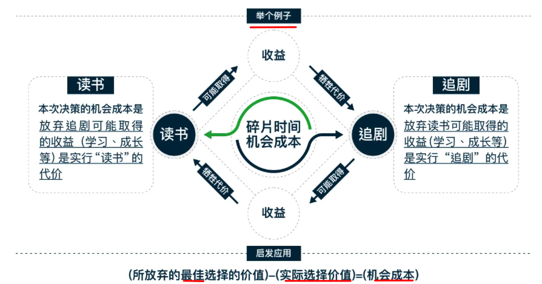

# 机会成本与沉没成本

<Badge type="danger">#思维模型</Badge> <Badge type="info">#2023/12/07</Badge> 

## 一、机会成本

>  *世界上没有白吃的午餐*
>  *鱼与熊掌不可兼得*

是指法策过程中**面临多项选择**，当中被放奔而价值**最高**的选择，又称为替代性成本。

你可以做出的另一个最佳选择的价值 

例如, 如果Abby可以把时间花在看电视或学习上，那么看电视一小时的机会成本就是她放弃学习的时间。

> [!abstract]
>  **机会成本 = 所放弃的最佳选择的价值 -  实际选择的价值**

比如，你当下有两个选择，读书  or  玩儿追剧，如下图：

- 选择 1：读书
	- 选择 1 的 `机会成本`  =  `放弃玩儿的收益`
	- 换言之，选择 1 的`代价` = `放弃玩儿的收益`
	- 机会成本 = 放弃玩儿读书的价值 -  看书的收益 
		- 很明显，为正数
- 选择 2：玩儿
	- 选择 2 的 `机会成本`  =  `放弃读书的收益`
	- 换言之，选择 2 的`代价` = `读书带来的收益` 
	- 机会成本 = 读书的价值 -  玩儿刷剧的收益 

简单来说，机会成本就是所牺牲的代价。机会成本所指的”机会”必须是决策者可选择的项目，若不是决策
者可选择的项目便不属于决策者的机会。机会成本二外显成本+隐含成本（外显成本即实际的支出；隐含成
本则为时间、效益等等)。

## 二、沉没成本

>  别为打翻的牛奶哭泣

### 1、概念

是指**已经发生且无法通过任何方式收回**的成本
### 2、两个**极端**

- **继续投入**，因为往往投入越多，对成本也痴迷，越停不下来，但
	- 成了：不负韶华
	- 不成：执迷不悟
- **立刻停止**，省得别人说你一根筋、牛角尖、或者不听劝，但
	- 不一定是 及时止损
	- 也可能是 功亏一篑 

### 3、需要根据实际情况做出决策

- **客观了解局势**
	- 实时求是，现状是什么？
- **主观判断能力**
	- 注意是判断能力，你有吗？

所以，权威或有充分理由的人可以做出正确的决定

比如，你是经验老道的水手，船要沉了，你如何决定？你需要听别人的吗？

但人们们很难全面了解客观状况，沉没成本只能事后看结果

---
# 阅读原文
- https://liguwe.github.io/post/57d16359-e2d9-50e3-b2e5-471c38db8b70