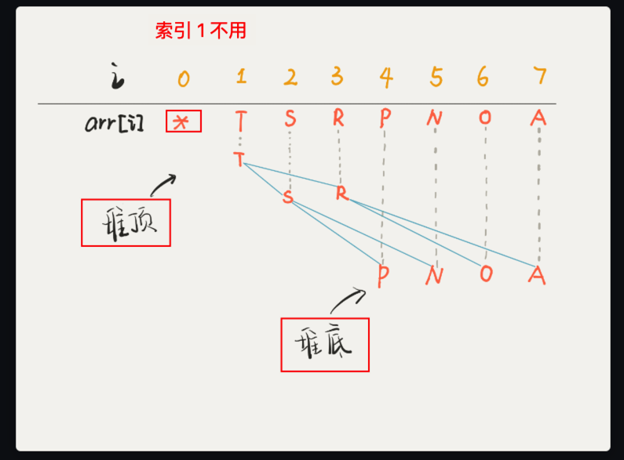

# 二叉堆与优先级队列的关系


<Badge type="info">#算法/树</Badge>  <Badge type="tip">#2023/06/20</Badge>   <Badge type="info">#算法/二叉树</Badge> 


## 二叉堆的概念

之前在 [[树的一些基本概念#堆、大顶堆、小顶堆]] 已经讲解过了。这里再看下

![[树的一些基本概念#堆的基本概念]]

`二叉堆`在逻辑上其实是一种特殊的**二叉树（完全二叉树）**，只不过存储在`数组`里。一般的链表二叉树，我们操作节点的`指针`，而在数组里，我们把`数组索引`作为指针

即：`链式存储-链表` 和 `顺序存储-数组` ，如下

![[树的一些基本概念#二叉树的存储方式]]

### 二叉堆的存储示意图



### 实现小顶堆示例

![[树的一些基本概念#实现一个`小顶堆`]]


> [!tip]
> 1、这种`二叉树`数据结构通过 `数组` 的方式存储
> 2、需要维护每个节点的关系，即大于或者小于它的两个子节点，所以有`上浮`和`下沉` 两个操作
> 3、关于循环，使用 while 或者 递归，比如一直`下沉`到具体什么条件，即递归。


## 二叉堆与优先级队列的关系

**优先级队列**这种数据结构，在`插入或者删除`元素的时候，元素会`自动排序`，这底层的原理就是`二叉堆`的操作，==就是这关系而已。== 

但真正在一些算法题里，不可能单独还在实现一个二叉堆的数据结构，所以往往只是实现部分逻辑，甚至都不采用这种堆数据结构，完全独立实现。如[[0068.链表的双指针技巧合集#第 3 题：合并 k 个有序链表| 合并 K 个有序链表]]  中的 **优先级入队函数**，其实和`二叉堆`没有什么区别。

```javascript
// 优先级队列，值最小的先入队，即优先级最高
let q = [];
// 优先队列的【入队函数】，值最小的先入队列
let enqueue = (node) => {
	if (q.length === 0) {
		q.push(node);
	} else {
		// 是否插入了
		let added = false;
		for (let i = 0; i < q.length; i++) {
			if (node.val < q[i].val) {
				q.splice(i, 0, node)
				added = true;
				break;
			}
		}
		// 没找到合适的插入位置，则添加到末尾
		if (!added) {
			q.push(node);
		}
	}
}
```

> 当然，还是因为 `JavaScript` 没有对应的公共数据结构库。对应 Java 就有 `PriorityQueue`


## 总结

- `二叉堆`就是一种 `完全二叉树`，所以适合存储在`数组`中，而且二叉堆拥有一些特殊性质。
- 二叉堆的操作很简单，主要就是 `上浮和下沉`，来维护堆的性质（`堆有序`）
- **优先级队列**是基于`二叉堆`实现的，主要操作是`插入和删除`。
	- 插入是**先插到最后**，然后**上浮到正确位置**；
	- 删除是 **调换位置后再删除**，然后**下沉**到正确位置。

## 优先级队列相关的习题

> 待补充


## 参考

https://labuladong.github.io/algo/di-yi-zhan-da78c/shou-ba-sh-daeca/er-cha-dui-1a386/#%E4%BA%94%E3%80%81%E6%9C%80%E5%90%8E%E6%80%BB%E7%BB%93

https://appktavsiei5995.pc.xiaoe-tech.com/p/t_pc/course_pc_detail/image_text/i_633faa64e4b0eca59c3a1aa3


---
# 阅读原文
- https://liguwe.github.io/post/5dd68a73-7991-5e3e-8bd6-3665771b24e5