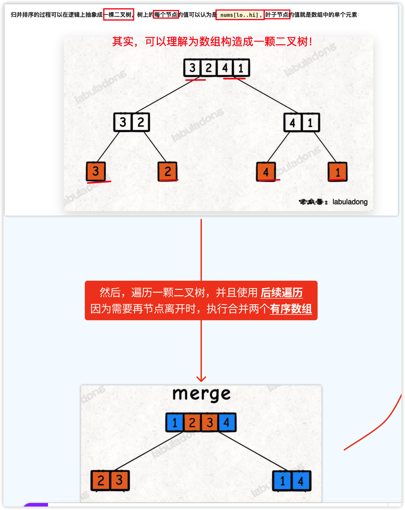
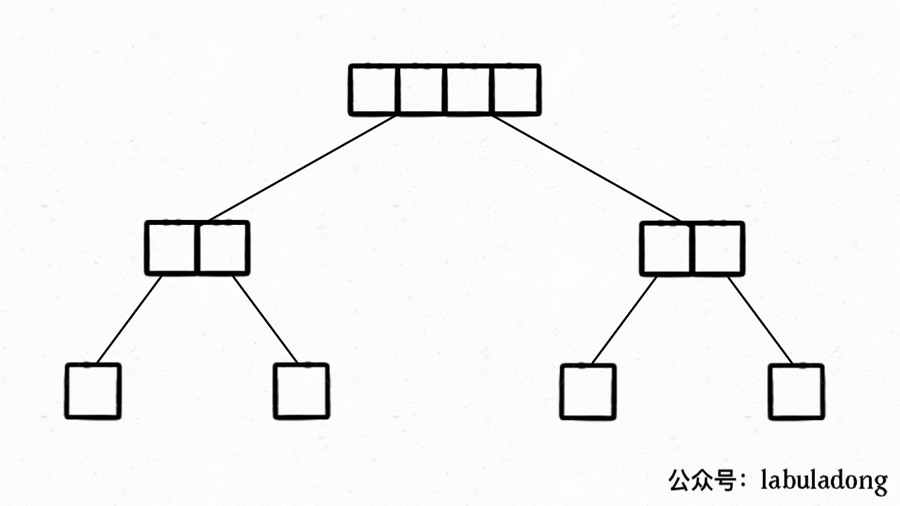
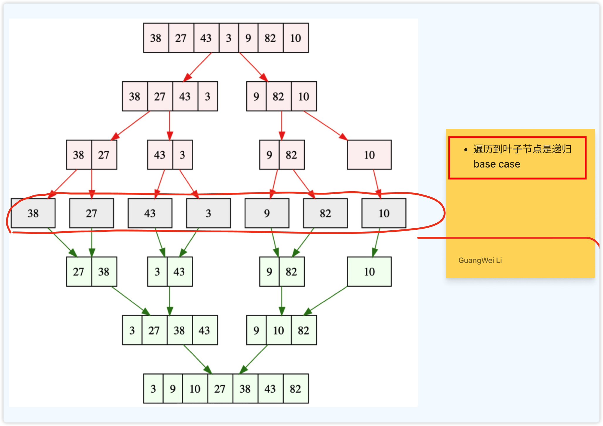
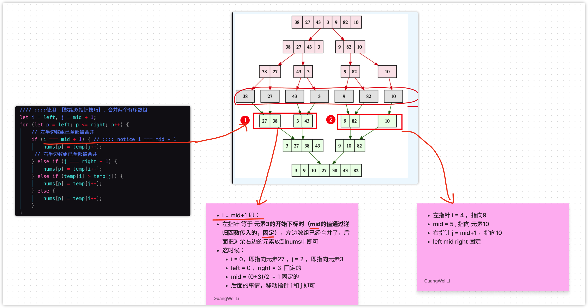
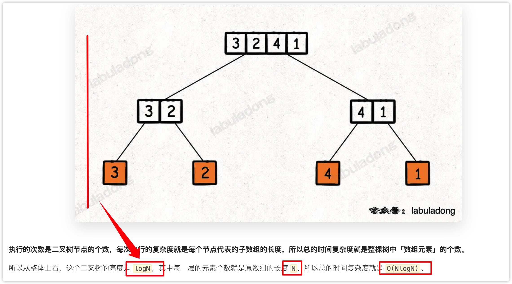
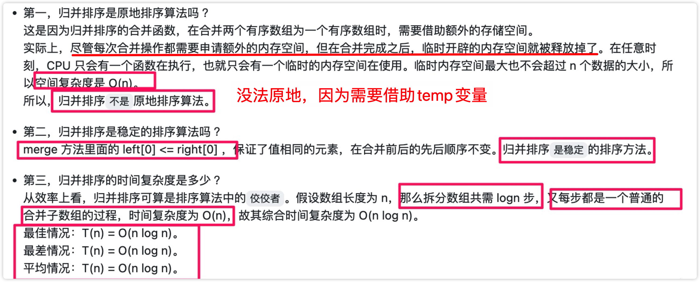

# 0021.深入理解归并排序


#算法/排序 


所有`递归`的算法，本质上都是在遍历一棵（递归）树，然后在节点（前中后序位置）上执行代码，你要写递归算法，本质上就是要告诉每个节点需要做什么。

## 如何理解`归归排序`是`二叉树的后序遍历`

- 首先，一句话描述 归并排序？
	- 先把`左半边数组`排好序，再把`右半边数组`排好序，最后`merge` 两个有序数组。

下图是，遍历通过`二叉树遍历思路`，即非线性的方式，二叉树的前序遍历，来遍历数组，然后再离开节点的时候，做merge操作，如下图：



下面是 merge 的`动图`：



完全流程：`先`拆解，拆到叶子节点，`然后`再merge ，如下图：




### 代码部分

测试用例：看 [ 力扣（LeetCode）](https://leetcode.cn/problems/sort-an-array/)

```javascript
/**
 * https://leetcode.cn/problems/sort-an-array/
 * */

function sort(nums, left, right) {
    if (left === right) {
        return;
    }
    const mid = Math.floor((left + right) / 2);
    // 利用定义，排序 nums[left..mid]
    sort(nums, left, mid);
    // 利用定义，排序 nums[mid+1..right]
    sort(nums, mid + 1, right);
    // ::::后序位置::::
    /*************************************************
     * ::::即，此时两部分子数组已经被排好序
     * ::::   合并两个有序数组，使 nums[left..right] 有序
     ************************************************/
    merge(nums, left, mid, right);
}

// 使用 【数组双指针技巧】，合并两个有序数组
function merge(nums, left, mid, right) {
    //  copy 到 temp 数组
    // ::::notice 不是 temp=[...nums]
    const temp = []
    for (let i = left; i <= right; i++) {
        temp[i] = nums[i];
    }
    //// ::::使用 【数组双指针技巧】，合并两个有序数组
    let i = left, j = mid + 1;
    for (let p = left; p <= right; p++) {
        // 左半边数组已全部被合并
        if (i === mid + 1) { // :::: notice i === mid + 1    
            nums[p] = temp[j++];
         // 右半边数组已全部被合并   
        } else if (j === right + 1) {
            nums[p] = temp[i++];
        } else if (temp[i] > temp[j]) {
            nums[p] = temp[j++];
        } else {
            nums[p] = temp[i++];
        }
    }
};

const arr = [5, 12, 13, 14, 4, 3, 15, 16, 2, 1, 2, 0, 2, 3, 9, 10, 11, 9, 17, 18, 19, 20, 21, 22];
sort(arr, 0, arr.length - 1);
console.log(arr);

```

- 都是`原地`排序
- 注意，`sort` 和 `merge` 函数的`入参`分别是什么？

### 真正理解上面代码的`双指针技巧`吗？

对于 `merge` 的双指针，不一定真的的理解，下面梳理下：

以下图为例：



总之:
- 都是原地直接修改 `nums`
- left , right , mid 都是递归函数传入的，固定的
- `双指针`根据 `left` 和 `mid` 来初始化
- `左指针i` 根据 `mid` 来判断 边界条件
- `j右指针`  根据 `right` 来判断判断边界条件

> [!info]
> 对于 `递归的理解`，还是一样，记住`模板`搞就是了，小脑袋瓜子，能递归几次？

### 另外一种解法：使用 `js` 的语法特性

```javascript
const mergeSort = arr => {
    // 采用自上而下的递归方法
    const len = arr.length;
    // 递归条件
    if (len < 2) {
        return arr;
    }
    let middle = Math.floor(len / 2),
        left = arr.slice(0, middle),
        right = arr.slice(middle); // 拆分为两个子数组

    const leftArr = mergeSort(left);
    const rightArr = mergeSort(right);
    
    // ::::后序位置
    return merge(leftArr, rightArr);
};

// 合并两个已经排好序的数组，无论left或者right里有多少元素
const merge = (left, right) => {
    const result = [];
    // :::: left和right都有元素，这判断大小后，取最小的放入结果集，注意使用shift了的副作用
    while (left.length && right.length) {
        //// :::: 注意: 判断的条件是小于或等于，如果只是小于，那么排序将不稳定.
        if (left[0] <= right[0]) {
            result.push(left.shift());
        } else {
            result.push(right.shift());
        }
    }
    // 走到这里，说明left和right其中一个为空，另一个不为空，遍历剩下的元素，放入结果集
    // :::: 每次都取最小的放入结果集，注意使用shift了的副作用
    while (left.length) result.push(left.shift());
    while (right.length) result.push(right.shift());
    return result;
};

const array = [5, 4, 3, 2, 1, 32, 2, 1, 0];
console.log('mergeSort ', mergeSort(array));

```

> [!bug]
> 当初面试，就写不出来，不知道是 `shift` ，还是 `left` ,`right` 这几个变傻分不清了

### 下面，分析一下复杂度





## 应用1：力扣第 315 题「 计算右侧小于当前元素的个数」


## 应用2：力扣第 493 题「 翻转对」


## 应用3：力扣第 327 题「 区间和的个数」


## 参考

[归并排序详解及应用 :: labuladong的算法小抄](https://labuladong.github.io/algo/di-yi-zhan-da78c/shou-ba-sh-66994/gui-bing-p-1387f/)
[912. 排序数组 - 力扣（LeetCode）](https://leetcode.cn/problems/sort-an-array/)

<div class="liguwe-doc-footer" id="liguwe.site.blog-doc-footer">
            <div class="liguwe-doc-footer-edit-link">
                <p class="liguwe-doc-footer-p">
                    <svg t="1687912573060" class="icon" viewBox="0 0 1024 1024" version="1.1" xmlns="http://www.w3.org/2000/svg" p-id="1498">
                        <path d="M854.6 370.6c-9.9-39.4 9.9-102.2 73.4-124.4l-67.9-3.6s-25.7-90-143.6-98c-117.8-8.1-194.9-3-195-3 0.1 0 87.4 55.6 52.4 154.7-25.6 52.5-65.8 95.6-108.8 144.7-1.3 1.3-2.5 2.6-3.5 3.7C319.4 605 96 860 96 860c245.9 64.4 410.7-6.3 508.2-91.1 20.5-0.2 35.9-0.3 46.3-0.3 135.8 0 250.6-117.6 245.9-248.4-3.2-89.9-31.9-110.2-41.8-149.6z m-204.1 334c-10.6 0-26.2 0.1-46.8 0.3l-23.6 0.2-17.8 15.5c-47.1 41-104.4 71.5-171.4 87.6-52.5 12.6-110 16.2-172.7 9.6 18-20.5 36.5-41.6 55.4-63.1 92-104.6 173.8-197.5 236.9-268.5l1.4-1.4 1.3-1.5c4.1-4.6 20.6-23.3 24.7-28.1 9.7-11.1 17.3-19.9 24.5-28.6 30.7-36.7 52.2-67.8 69-102.2l1.6-3.3 1.2-3.4c13.7-38.8 15.4-76.9 6.2-112.8 22.5 0.7 46.5 1.9 71.7 3.6 33.3 2.3 55.5 12.9 71.1 29.2 5.8 6 10.2 12.5 13.4 18.7 1 2 1.7 3.6 2.3 5l5 17.7c-15.7 34.5-19.9 73.3-11.4 107.2 3 11.8 6.9 22.4 12.3 34.4 2.1 4.7 9.5 20.1 11 23.3 10.3 22.7 15.4 43 16.7 78.7 3.3 94.6-82.7 181.9-182 181.9z"
                              p-id="1499" ></path>
                    </svg>
                    <a href="https://www.yuque.com/liguwe/post/6ab4f912-ece9-5cf0-88d8-4332c2412dfc" target="_blank" class="liguwe-doc-footer-edit-link-a">
                        View this page on Yuque（语雀）
                    </a>
                </p>
                <p class="liguwe-doc-footer-p">
                    <svg t="1687913054251" class="icon" viewBox="0 0 1024 1024" version="1.1" xmlns="http://www.w3.org/2000/svg" p-id="5173"><path d="M853.333333 501.333333c-17.066667 0-32 14.933333-32 32v320c0 6.4-4.266667 10.666667-10.666666 10.666667H170.666667c-6.4 0-10.666667-4.266667-10.666667-10.666667V213.333333c0-6.4 4.266667-10.666667 10.666667-10.666666h320c17.066667 0 32-14.933333 32-32s-14.933333-32-32-32H170.666667c-40.533333 0-74.666667 34.133333-74.666667 74.666666v640c0 40.533333 34.133333 74.666667 74.666667 74.666667h640c40.533333 0 74.666667-34.133333 74.666666-74.666667V533.333333c0-17.066667-14.933333-32-32-32z"  p-id="5174"></path><path d="M405.333333 484.266667l-32 125.866666c-2.133333 10.666667 0 23.466667 8.533334 29.866667 6.4 6.4 14.933333 8.533333 23.466666 8.533333h8.533334l125.866666-32c6.4-2.133333 10.666667-4.266667 14.933334-8.533333l300.8-300.8c38.4-38.4 38.4-102.4 0-140.8-38.4-38.4-102.4-38.4-140.8 0L413.866667 469.333333c-4.266667 4.266667-6.4 8.533333-8.533334 14.933334z m59.733334 23.466666L761.6 213.333333c12.8-12.8 36.266667-12.8 49.066667 0 12.8 12.8 12.8 36.266667 0 49.066667L516.266667 558.933333l-66.133334 17.066667 14.933334-68.266667z"  p-id="5175"></path></svg>
                    <a href="https://github.com/liguwe/liguwe.github.io/blob/master/post/6ab4f912-ece9-5cf0-88d8-4332c2412dfc.md" target="_blank" class="liguwe-doc-footer-edit-link-a">Edit this page on Github</a>
                </p>
            </div>
            <div id="liguwe-comment"></div></div>