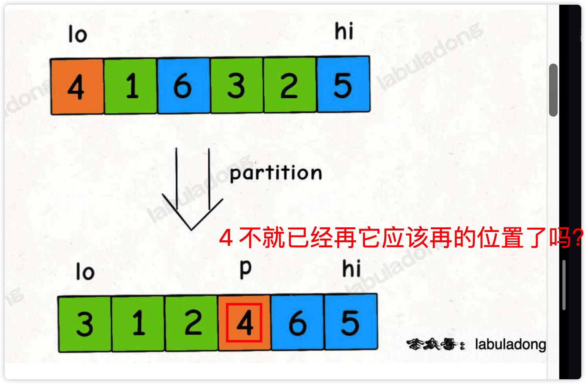
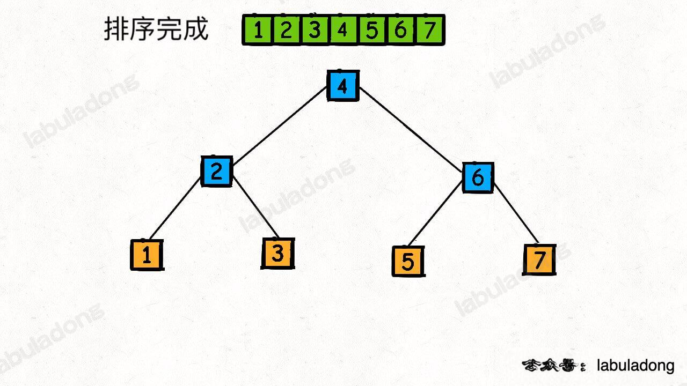
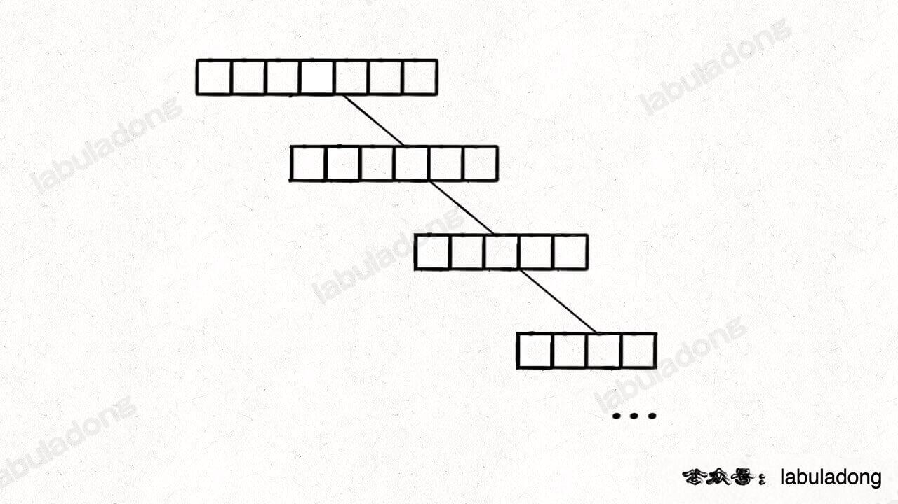
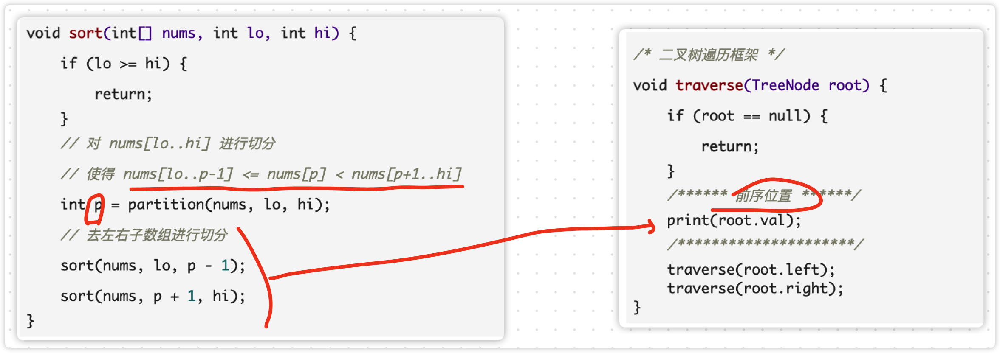
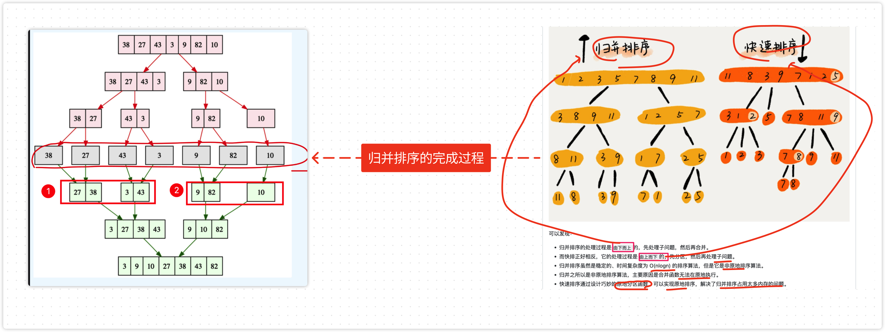

# 0020.深入理解快速排序


#算法/排序

## 快速排序

### 一句话总结 `快排排序` 

- `一句话总结`了归并排序：
	- 先把`左半边数组`排好序
		- base case：`lo === hi`
	- 再把`右半边数组`排好序
		-  base case：`lo === hi`
	- 然后把两半数组`合并`
		- `merge` 两个有序数组
- 那么，一句话总结 `快排` 呢？
	- `先将一个元素排好序`，
	- 然后再将`剩下的元素`排好序。如何理解？如下图：




###  `快速排序`的过程是一个 `构造二叉搜索树`的过程

看下图就明白了：


最后，可不就是一个`二叉搜索树`吗？如下图




构造时，如果运气特别不好，构造出一个`特别不平衡的二叉树` ，如下图，`解决方案`是：构造前洗牌数组先。




### 如何理解快速排序是 `二叉树前序遍历` ? 

看动图，这不就是 `二叉树的前序遍历` 吗？


再看`代码框架`



> 上面代码 `p 、 p-1 、 p+1` 分别都有具体含义的！

### 实现方式1：js的简易实现

```javascript
// 1、找基准值，然后分成两个数组
// 2、与该基准点数据比较，如果比它小，放左边；反之，放右边。
// 3、左右分别用一个空数组去存储比较后的数据。
// 4、最后递归执行上述操作，直到数组长度 <= 1
const quickSort1 = arr => {
    if (arr.length <= 1) {
        return arr;
    }
    // 取基准点
    const midIndex = Math.floor(arr.length / 2);
    // 取基准点的值，splice(index,1) 则返回的是含有被删除的元素的数组。
    const midIndexVal = arr.splice(midIndex, 1)[0];
    const left = []; // 存放比基准点小的数组
    const right = []; // 存放比基准点大的数组
    // 遍历数组，进行判断分配
    for (let i = 0; i < arr.length; i++) {
        if (arr[i] < midIndexVal) {
            left.push(arr[i]); //比基准点小的放在左边数组
        } else {
            right.push(arr[i]); //比基准点大的放在右边数组
        }
    }
    //递归执行以上操作，对左右两个数组进行操作，直到数组长度为 <= 1
    return quickSort1(left).concat(midIndexVal, quickSort1(right));
};
const array2 = [5, 4, 3, 2, 1];
console.log('quickSort1 ', quickSort1(array2));

```

使用 `splice` 就行分割，然后最后递归，遍历

另外，该实现没有完全参考上面的代码模板，使用了JavaScript 一些语言特性，但是，没有解决 前序遍历构造二叉树搜索树时，`运气特别差`的场景。

#### 算法复杂时分析


### 实现方式2：套用上面的模板，todo


## 使用快排思路，实现找到数组中第`k`大元素

[Loading Question... - 力扣（LeetCode）](https://leetcode.cn/problems/kth-largest-element-in-an-array/)

## 快排与归并排序的对比



- `归并排序` 是 `自下而上` 的，占用内存高些，没法原地，但 **稳定**
- 快排 是 自下而上的，他分解`子问题`，原地排序，不稳定


## 参考

- [解锁所有网页文章](https://appktavsiei5995.pc.xiaoe-tech.com/p/t_pc/course_pc_detail/image_text/i_62987955e4b01a4852072fa3?product_id=p_629871eee4b01a48520729f7&content_app_id=&type=6)
- [[0021.深入理解归并排序]]

