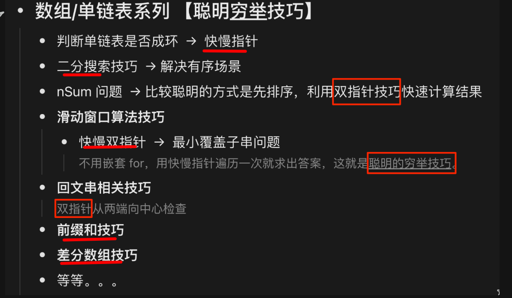
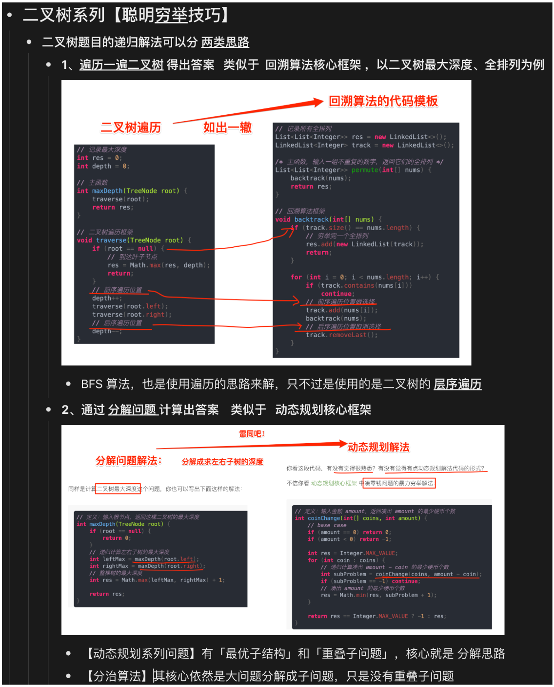
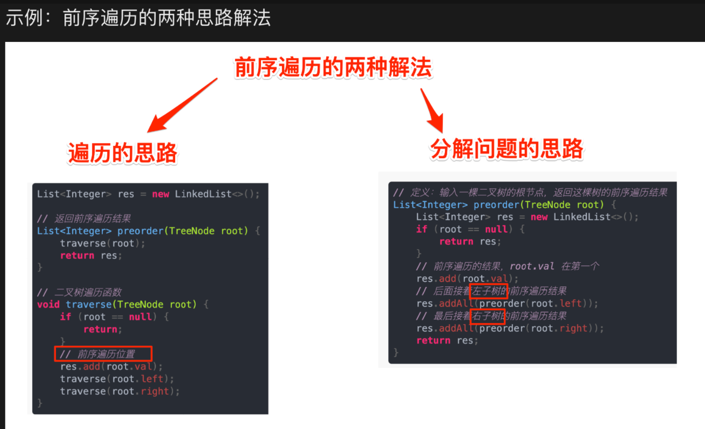
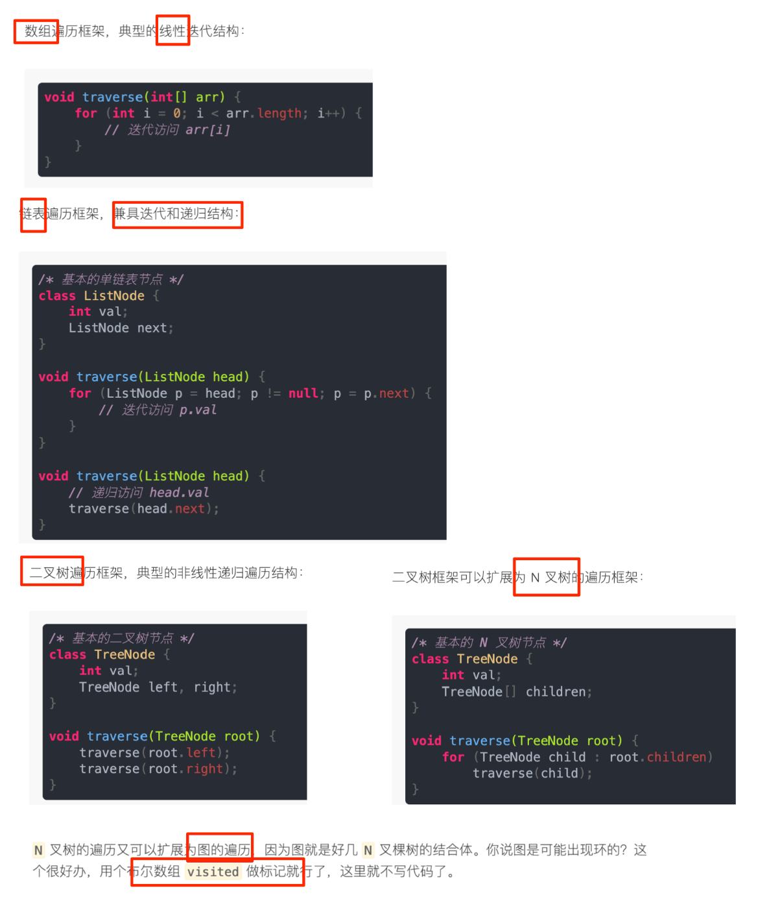

# 计算机算法的框架思维

<Badge type="warning">#2024/01/27</Badge>  <Badge type="danger">#算法</Badge> <Badge type="danger">#算法框架</Badge>

> [!tip]
> 另外可参考： <Badge type="warning">#语雀</Badge>   https://www.yuque.com/liguwe/agorithms/lcon8zy9vpocx0ak

## 先分清两种算法

先分清，两种算法，他们是**完全不同的思维**

- 计算机算法
	- 本质是 **穷举** ，因为计算机就是**快**
	- 难点
		- 一些算法的**难点**是**如何”无遗漏“的穷举所有可能**
		- 一些算法的难点是**如何”聪明“的穷举**
- 数学算法
	- 本质是 **数学**
	- 学数学的 **后遗症**  ， 别想着 能不能推导出一个什么数学公式

## 如何”无遗漏“的穷举所有

如递归类问题，最典型的是动态规划问题，它的**状态转移方程**是**最难**写出来的

## 技巧：如何”聪明“的穷举

至少  二分查找、快慢指针、左右指针、滑动窗口、前缀和数组、差分数组，这些你得知道

### 数组链表技巧

- 双指针**技巧**
	- 快慢指针**技巧**
	- 前后指针**技巧**
- 二分搜索**技巧**
- 前缀和**技巧**
- 差分数组**技巧**

如下图：

 
### 二叉树技巧

#### 两种思路

- 遍历的思路
- 分解问题的思路

 
#### 前序遍历的 **遍历思路** 和 **分解问题思路**

> [!bug]
> 是的，避免死磕，难道用锯子去挖石头，因为技巧储备还不够，一切是徒劳，很多属于会者不难。

## 算法与数据结构

- 各种算法像是精美的**拼图**
- 而数据结构是组成这些拼图的**模块**

### 其实底层就两种存储方式：链表 + 数组

- 链表（链式存储）
	- 栈、队列：可用 `链表`实现
	- 散列表： 可用`链表：拉链法`实现
	- 图：可使用 `链表：邻接表`实现
	- 树
		- 堆（完全二叉树）
			- 可使用`数组`实现吗 
		- 非完全二叉树
			- 可使用`链表`实现
- 数组（顺序存储）
	- 栈、队列：也可以`数组`实现
	- 散列表： 也可用`数组：线性探测法`实现
	- 图：可使用 `数组：邻接矩阵` 实现
	- 树
		- 堆（完全二叉树）
			- 可使用`数组`实现

> [!info]
>  1、上面的对应关系，旨在说明 数据存储 底层就两种存储方式：数组 和 链表
>  2、数组和链表才是「结构基础」

### 数据结构操作：其实就**遍历 + 访问（增删改查）** 两种

- 两种基本操作
	- 遍历 ，遍历又分两种
		- 线性迭代遍历
		- 非线性递归遍历
	-  访问（增删查改）
		- 数据结构存在的使命，不就是 尽可能高效的增删查改

#### 所有的遍历框架

---
# 阅读原文
- https://liguwe.github.io/post/8fbc80cc-ba66-5782-9643-31f176a3fa0a