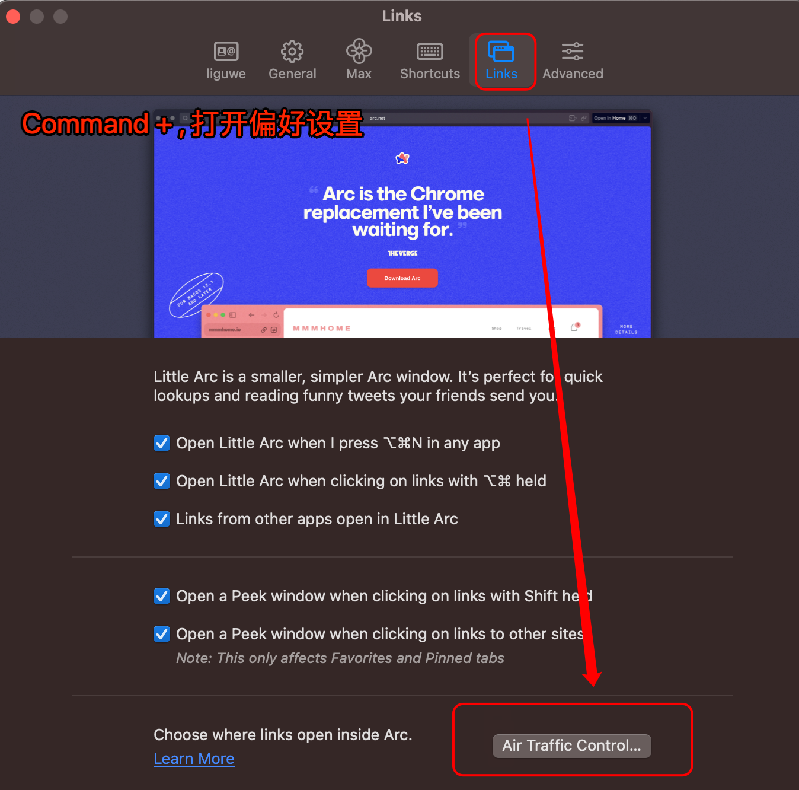
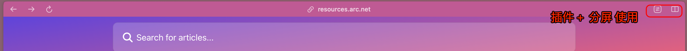

# Arc 浏览器使用技巧总结

#常用工具 #工具 #工具技巧 #浏览器  #2023/11/25

- 网站搜索

   - 可以配置，直接配置百度，京东搜索，但一般用不着，直接谷歌就好了
- 命令行

   - 可以完成任何操作
   - `Command-T → Tab`，然后输入具体命令
- 空间

   - 点击侧边栏底部的空间图标，进行添加
   - 可以通过 `Command-T`来快速定位到具体空间
- 文件夹

   - 类似于Chrome的书签
   - **左侧目录树，鼠标划过时可以搜索，太强大了**
   - 分类整理特别方便
- 固定标签 Pinned Tabs

   - 位置：位于侧边栏 水平线的上方
   - 作用：就类似于Chrome的**固定**
   - 快捷键：`Command + D` 切换，或拖动、或命令行
- 收藏夹 Favorites

   - 即顶部区域的 **最常访问的网站**，可以给每个空间设置
   - 如何操作：拖动 或 命令行
- Profiles: Separate Work & Personal Browsing

   - 个人资料：工作和个人浏览分开；
   - 比如密码、插件等；所以**其实用不着的**
- 闲置标签自动归档：Auto Archive

   - 闲置的 "未固定标签 "每 12 小时存档一次。可以设置
   - 查看或点击标签页都会重置计时器
   - **查看或者清除存档**：Command-T / View Archive
- 外部打开的链接，可以自动将链接导向正确的空间

   - 如何设置，参考下图

- 是否展示顶部Toolbar

   - 使用 `Shift + Win + D` ，这样会展示**插件的入口**或者**分屏**、**URL链接**
   - 
- 同步配置

   - 需要设置，mac上开启后经常会出现发烫
- 浏览器设置：输入 `arc://settings/`
- Arc Max : 人工智能

   - `Command + F` 可以搜索或者提问

      - 目测不太好用
   - 任何链接，鼠标滑过按住 `Shift` ，需要在特定网站上
   - 整洁标题：Pin 标签 AI 会**自动帮你命名网页** ，需要自己改
   - 下载整理：它会帮你整理
- 使用 ChatGPT

   - 命令行中，输入 Chatgpt 然后 Tab ，然后就可以问了

---

# 阅读原文

- [https://liguwe.github.io/post/a02c5897-1801-55ac-b0e0-6b4194b067fb](https://liguwe.github.io/post/a02c5897-1801-55ac-b0e0-6b4194b067fb)
