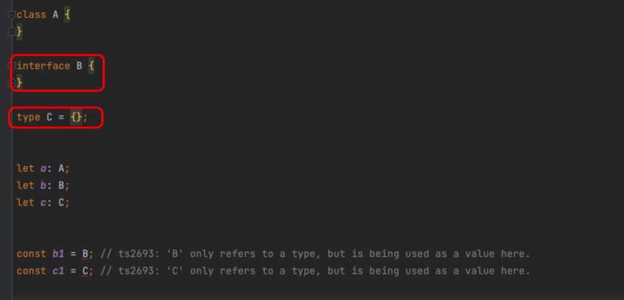
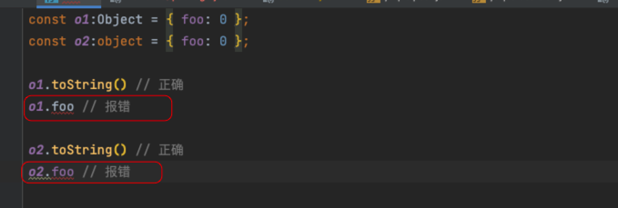
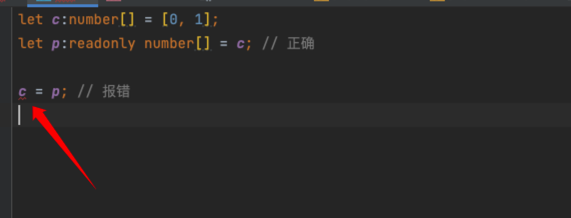
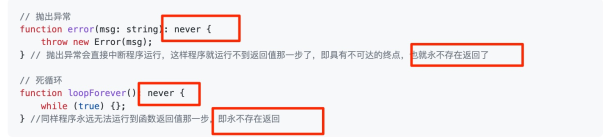
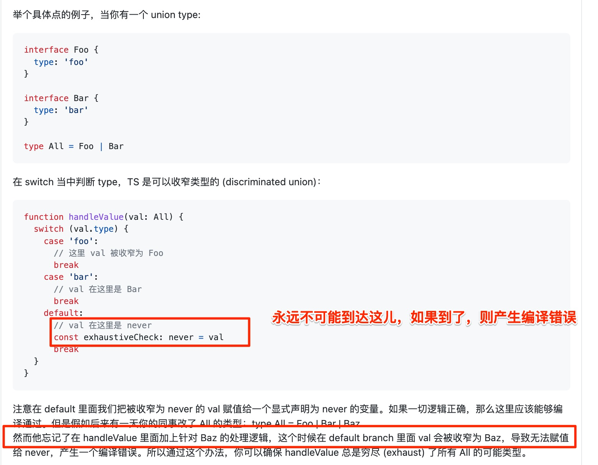

# 重新学习 Typescript

<Badge type="warning">#2023/12/23</Badge> <Badge type="warning">#typescript</Badge> 
## 一、编译


可通过 `tsconfig.json` 来指定哪些文件编译等编译选项，如

```json
{
  "files": [
    "./some/file.ts"
  ],
  "include": [
    "./folder"
  ],
  "exclude": [
    "./folder/**/*.spec.ts",
    "./folder/someSubFolder"
  ]
}
```

>  playground： http://www.typescriptlang.org/play/ 

可运行 `ts` 的编译工具

1、TypeScript 官方提供的编译器叫做 `tsc` 

2、**ts-node**

```bash
npx ts-node script.ts

# 或者
ts-node script.ts
```


## 二、声明空间

在 TypeScript 里存在两种声明空间：`类型声明空间`与`变量声明空间`
### （一）类型声明空间




即 `interface B{}`  只是一个`类型申明`，不能当做变量使用

>  看上图，`b1` 和 `c1` 都飘红警告了

### （二）变量声明空间


```javascript
/**
 * ① Class Foo 提供了一个类型 Foo 到类型声明空间
 * ② 把一个类来当做变量传递时，ts 会把这个类当做值来处理
 * */
class Foo {
}

const someVar: Foo = Foo;


/**
 * ① 一些用 var 声明的变量，也只能在变量声明空间使用，不能用作类型注解，如下示例
 */
const foo = 123;
let bar: foo; 
// ts2749: 'foo' refers to a value, but is being used as a type here. Did you mean 'typeof foo'?

```

### （三）总结

**总结就是：**

1.   `变量声明空间`可以直接当做变量赋值使用，但如`const foo = 123;` 中的 `foo`不能当做**类型注解**使用
2.   `类型声明空间` 都可以当做类型注解，但不能当做`类型注解` 使用

## 三、TS 模块

### （一）全局模块

你可以在项目中创建一个 `全局声明文件 global.d.ts`，用于声明全局变量。比如全局使用的 `JQuery`

```ts
declare var jQuery: (selector: string) => any;
```

>  需要使用 `declare` 关键词

### （二）文件模块

即 `文件模块系统`，耳熟能详的的 `CMD AMD ESM` 等等，这里只讨论 ESM ，而且只需要注意一下几种平时自己不常用的写法

主要是`as` 的几个写法，如下：

```typescript
export { someVar as aDifferentName };

import { someVar as aDifferentName } from './foo';

import * as foo from './foo';
```

## 四、命名空间

使用 `namespace` 关键词，如下：

```ts
namespace Utility {
  export function log(msg) {
    console.log(msg);
  }
  export function error(msg) {
    console.log(msg);
  }
}

// usage
Utility.log('Call me');
Utility.error('maybe');

```

以上 `ts` 最终转成 `js` 的样子如下，是的，是不是很类似之前` JQuery` 的实现方式。

```javascript
(function (Utility) {
  // 添加属性至 Utility
})(Utility || Utility = {});

```

## 五、动态导入表达式

其实就类似于 Webpack 的 `import()` （首选，ECMAScript 的提案）和 `require.ensure()` ，这样就能实现**代码分割能力** ，即`Code Splitting`  ，举个例子，比如我们需要懒加载 `mement`

```typescript
import(/* webpackChunkName: "momentjs" */ 'moment')
  .then(moment => {
    // 懒加载的模块拥有所有的类型，并且能够按期工作
    // 类型检查会工作，代码引用也会工作 
    const time = moment().format();
    console.log('TypeScript >= 2.4.0 Dynamic Import Expression:');
    console.log(time);
  })
  .catch(err => {
    console.log('Failed to load moment', err);
  });
```

## 六、Typescript 类型系统 

### （一）基本类型

即以下 8 种类型
- boolean
- string
- number
- bigint
- symbol
- object
- undefined
- null

1、**TypeScript 继承了 JavaScript 的类型设计**，以上8种类型可以看作 TypeScript 的基本类型。

2、`undefined` 和 `null` 既可以作为**值**，也可以作为**类型**，取决于在哪里使用它们。更多参考 [[#^d3044f]]

3、这里单独说下 `object` 根据 JavaScript 的设计，`object` 类型包含了所有对象、数组和函数。

```typescript
const x:object = { foo: 123 };
const y:object = [1, 2, 3];
const z:object = (n:number) => n + 1;
```

---

4、包装类型：5 种

（1）**`Symbol()` 和 `BigInt()` 不能作为构造函数使用** ，即他俩无法直接获取它们的**包装对象** 

- boolean：`Boolean()`
- string    `String()`
- number   `Number()`
- bigint  
- symbol

（2）包装对象类型与字面量类型：**大写类型同时包含包装对象和字面量两种情况，小写类型只包含字面量，不包含包装对象。**

- **包装对象** 和 **字面量**   ： 对应关系如下
- Boolean 和 boolean
- String 和 string
- Number 和 number
- BigInt 和 bigint
- Symbol 和 symbol

举例：

```typescript

① 即大写是小写形式的超集 

const s1:String = 'hello'; // 正确
const s2:String = new String('hello'); // 正确

const s3:string = 'hello'; // 正确
const s4:string = new String('hello'); // 报错


② 建议只使用小写类型，不使用大写类型。因为绝大部分使用原始类型的场合，都是使用字面量，不使用包装对象，

比如，Math.abs(小写类型)
const n1:number = 1;
const n2:Number = 1;

Math.abs(n1) // 1
Math.abs(n2) // 报错
```

（3）`Object` 类型与 `object` 类型 

先看 **大写的 Object** 

```typescript

①  大写的Object类型代表 JavaScript 语言里面的广义对象。
	所有可以转成对象的值，都是Object类型，这囊括了几乎所有的值

let obj:Object;
 
obj = true;
obj = 'hi';
obj = 1;
obj = { foo: 123 };
obj = [1, 2];
obj = (a:number) => a + 1;

② 事实上，除了undefined和null这两个值不能转为对象，其他任何值都可以赋值给Object类型，比如一下示例会报错

let obj:Object;

obj = undefined; // 报错
obj = null; // 报错


③ 空对象 {} 是Object类型的简写形式，所以使用Object时常常用空对象代替，如下：

let obj:{};
 
obj = true;
obj = 'hi';
obj = 1;
obj = { foo: 123 };
obj = [1, 2];
obj = (a:number) => a + 1;

④ 显然，无所不包的Object类型既不符合直觉，也不方便使用，所以不建议使用

```


> [!danger]
>  **无所不包的Object类型既不符合直觉，也不方便使用，所以不建议使用**


再看 **小写的 object**  ,  ==只包含对象、数组和函数==， 不包括原始类型的值，比如下面代码

```typescript
let obj:object;
 
obj = { foo: 123 };
obj = [1, 2];
obj = (a:number) => a + 1;
obj = true; // 报错
obj = 'hi'; // 报错
obj = 1; // 报错
```

注意，无论是大写的Object类型，还是小写的object类型，都 **只包含 JavaScript 内置对象原生的属性和方法**，用户自定义的属性和方法都不存在于这两个类型之中。

```typescript

const o1:Object = { foo: 0 };
const o2:object = { foo: 0 };

o1.toString() // 正确
o1.foo // 报错

o2.toString() // 正确
o2.foo // 报错

```

> 如下图，都报警告了，这个值得注意，即 object 其实不常用，最好直接定义 interface 类型
> 
>  

   
### （二）数组类型

#### 1、基本用法

```typescript
let a:boolean[]; // 同 let a:Array<boolean>;
let b:any[];   // 同 let b:Array<any>;
let arr:(number|string)[];  // 同 let arr:Array<number|string>;
```

#### 2、读取数组成员类型

TypeScript 允许使用方括号读取数组成员的类型。如下：

```typescript
① 读取数组成员的类型
type Names = string[];
type Name = Names[0]; // string

② 由于数组成员的索引类型都是number，所以读取成员类型也可以写成下面这样
type Name = Names[number]; // string

③ 那么这种写法是可以的吗？
type Name = Names[99999]

```

#### 3、数组的类型推断

为数组赋值时，TypeScript 会**自动更新类型推断**，如下：

```typescript
const arr = [];
arr // 推断为 any[]

arr.push(123);
arr // 推断类型为 number[]

arr.push('abc');
arr // 推断类型为 (string|number)[]

② 下面这种会推断初始值为 number 后面再赋值就会报错了
// 推断类型为 number[]
const arr = [123];

arr.push('abc'); // 报错
```

#### 4、只读数组

（1）`const` 命令声明的数组变量是可以改变成员的，如下：

```typescript
const arr = [0, 1];
arr[0] = 2;
```

（2）声明只读数组，即 `readonly`, 下面示例中，`arr` 是一个只读数组，删除、修改、新增数组成员都会报错。

```typescript
const arr:readonly number[] = [0, 1];

arr[1] = 2; // 报错
arr.push(3); // 报错
delete arr[0]; // 报错
```

（3）`number[]`其实是`readonly number[]`的子类型

```typescript
let c:number[] = [0, 1];
let p:readonly number[] = c; // 正确

c = p; // 报错
```

> 所以，这里有个用法就是，如果只是希望根据数组生成另外一个数组，比如过滤出数组等，就可以传入 readonly 的数组 ？ 


```typescript

① getSum()的参数s是一个数组，传入只读数组就会报错。原因就是只读数组是数组的父类型，父类型不能替代子类型
function getSum(s:number[]) {
  // ...
}

const arr:readonly number[] = [1, 2, 3];

getSum(arr) // 报错

② 使用 类型断言 as 解决报错

getSum(arr as number[])
```

---

疑惑：




> [!danger]
> **有点和自己理解的有偏差**，把 `readonly number[]` 当做是父类，`number[]` 子类，子类继承父类，所以会多出 比如 `pop` `push` 等可改变数组的方法

---

（4）使得数组可读的其他方法

```typescript
① readonly与数组的泛型写法一起使用，就会报错
// 报错
const arr:readonly Array<number> = [0, 1];

② TypeScript 提供了两个专门的泛型，用来生成只读数组的类型
const a1:ReadonlyArray<number> = [0, 1];
const a2:Readonly<number[]> = [0, 1];

③ as const告诉 TypeScript，推断类型时要把变量arr推断为只读数组，从而使得数组成员无法改变。

const arr = [0, 1] as const;
arr[0] = [2]; // 报错 

```

#### 5、多维数组

```typescript
① TypeScript 使用T[][]的形式，表示二维数组，T是最底层数组成员的类型

var multi:number[][] = [[1,2,3], [23,24,25]];
```
### （三）any 、null 、 undefined 、void 

1、`any`  告诉 **TypeScript 编译器**不要进行任何的类型检查，失去了类型检查的意义，另外会造成**类型污染** ，如下： ^4fa065 

```typescript
let user: any = {
  avatar: {
    url: '/user-1.png'
  }
};
let avatar = user.avatar; // any
let url = avatar.url; // any
```

使用场景：
- 老旧项目，年代久远的项目
- 其他特殊原因：需要关闭具体变量的类型检查

另外，可通过 `tsc --noImplicitAny app.ts` 启动 `any` 检查


2、`null` 、 `undefined`  : 任何类型，都能再赋值为  `null`  和 `undefined` ，如下代码 ^d3044f

```typescript
// strictNullChecks: false
let num: number;
let str: string;

// 这些类型能被赋予
num = null;
str = undefined;

它们的类型会被推断为any。
let a = undefined;   // any
const b = undefined; // any

let c = null;        // any
const d = null;      // any


// 打开编译设置 strictNullChecks = true
let a = undefined;   // undefined
const b = undefined; // undefined

let c = null;        // null
const d = null;      // null


// tsc --strictNullChecks app.ts
let age:number = 24;
age = null;      // 报错
age = undefined; // 报错


// 打开 strictNullChecks

let x:undefined = null; // 报错
let y:null = undefined; // 报错

```

**总之，打开 strictNullChecks 以后，undefined和null只能赋值给自身，或者any类型和unknown类型的变量**

```typescript
let x:any     = undefined;
let y:unknown = null;
```


3、`void`  标识 函数没有返回值，即**空值** ，其实可以理解为 `null | undefined` 

### （四）never

**代表永远不会发生** 的类型，是 TypeScript 中的 **底层类型** ， 看下面的两个示例：

1. 一个总是会抛出错误的函数
2. 一个从来不会有返回值的函数，因为里面包含 `while(true)` 



看一个具体**案例**：



或者如下代码，统一包装一个 `fail` 函数

```typescript
function foo(x: string | number): boolean {
  if (typeof x === 'string') {
    return true;
  } else if (typeof x === 'number') {
    return false;
  }

  // 如果不是一个 never 类型，这会报错：
  // - 不是所有条件都有返回值 （严格模式下）
  // - 或者检查到无法访问的代码
  // 但是由于 TypeScript 理解 `fail` 函数返回为 `never` 类型
  // 它可以让你调用它，因为你可能会在运行时用它来做安全或者详细的检查。
  return fail('Unexhaustive');
}

function fail(message: string): never {
  throw new Error(message);
}
```

>  1、注意：抛出异常后就直接中断程序了
>  2、**never 仅能被赋值给另外一个 never 类型**

### （五）Unknown 

1、使用 `any` 有很多弊端 ，参考如上： [[#^4fa065]] ，这就引出了 `unknown`

2、`any` 和 `unknown` 的 **本质区别**：

 `any` 和 `unknown` 的最大区别是, unknown 是 `top type` (任何类型都是它的 subtype) , 而  **any 即是 top type, 又是 bottom type** (它是任何类型的 `subtype` ) ，这导致 any 基本上就是放弃了任何类型检查。

**所以， `any` 和 `unknown`  的 交集 和 并集都是 `any`** , 如下代码：

```typescript
type U6 = unknown | any; // any
type U12 = unknown & any; // any;
```

3、 `unknown` 类型的值只能赋给 `unknown` 本身和 `any` 类型

4、联合类型取最大集合，即**并集** ， 交叉类型中，取最小集合，即**交集** ，那么 unknown 的 联合类型 和 交叉类型如何呢？

```typescript
// 联合类型
type U1 = unknown | null; // unknown
type U2 = unknown | undefined; // unknown
type U3 = unknown | number; // unknown
type U4 = unknown | boolean; // unknown
type U5 = unknown | string[]; // unknown
type U6 = unknown | any; // any

// 交叉类型
type U7 = unknown & null; // null;
type U8 = unknown & undefined; // undefined;
type U9 = unknown & number; // number;
type U10 = unknown & boolean; // boolean;
type U11 = unknown & string[]; // string[]
type U12 = unknown & any; // any;
```

总结一下就是： **unknown 也可以视为所有其他类型（除了any）的全集**

>  TypeScript 有两个“**顶层类型**”（`any`和`unknown`），但是 **“底层类型”** 只有`never`唯一一个 

### （六）值类型

即 单个值也是一种类型，称为“**值类型**”。

```typescript
let x:'hello';

x = 'hello'; // 正确
x = 'world'; // 报错

const x:5 = 4 + 1; // 报错
// 在4 + 1后面加上as 5，就是告诉编译器，可以把 4 + 1的类型 视为值类型5 
const x:5 = (4 + 1) as 5; // 正确

```

> 单个值的值类型，用处不大，更多是配合 **联合类型** 使用

### （七）联合类型

```typescript

① 常用示例

let x:string|number;

let setting:true|false;

let gender:'male'|'female';

let rainbowColor:'赤'|'橙'|'黄'|'绿'|'青'|'蓝'|'紫';

// strictNullChecks = true
let nullOrUndefined = undefined | null

// 方便书写
let x:
  | 'one'
  | 'two'
  | 'three'
  | 'four';

② 如果一个变量有多种类型，读取该变量时，往往需要进行“类型缩小”，比如：

function printId(
  id:number|string
) {
    console.log(id.toUpperCase()); // 报错
}

// 修改为 =========> 

function printId(
  id:number|string
) {
  if (typeof id === 'string') {
    console.log(id.toUpperCase());
  } else {
    console.log(id);
  }
}

③ “类型缩小”的另一个例子

function getPort(
  scheme: 'http'|'https'
) {
  switch (scheme) {
    case 'http':
      return 80;
    case 'https':
      return 443;
  }
}


```

>  实际上，联合类型本身可以看成是一种“**类型放大**”（type widening），处理时就需要“**类型缩小**”（type narrowing）

### （八）交叉类型

交叉类型 `A&B` 表示，任何一个类型必须同时属于 `A` 和`B`，才属于交叉类型 `A&B`，即交叉类型同时满足`A`和`B`的特征。下面是示例

```typescript

① 变量obj同时具有属性foo和属性bar
let obj:
  { foo: string } &
  { bar: string };

obj = {
  foo: 'hello',
  bar: 'world'
};

② x的类型实际是 never ，因为不可能有这样的 x 

let x:number&string;

③ 交叉类型常常用来为对象类型添加新属性。

type A = { foo: number };
type B = A & { bar: number };

```

### （九）type 命令

`type` 命令用来定义一个类型的`别名`

```typescript

① 别名 Age 类型
type Age = number;
let age:Age = 55;

② 别名不允许重名
type Color = 'red';
type Color = 'blue'; // 报错

③ 别名的作用域是块级作用域
type Color = 'red';
if (Math.random() < 0.5) {
  type Color = 'blue';
}

④ 别名支持使用表达式
type World = "world";
type Greeting = `hello ${World}`;
```

>  type命令属于类型相关的代码，编译成 JavaScript 的时候，会被 ==全部删除==

### （十） typeof 运算符

1、JavaScript 里面，`typeof` 运算符只可能返回 **八种结果**，而且都是**字符串**。

```javascript
typeof undefined; // "undefined"
typeof true; // "boolean"
typeof 1337; // "number"
typeof "foo"; // "string"
typeof {}; // "object"
typeof parseInt; // "function"
typeof Symbol(); // "symbol"
typeof 127n // "bigint"
```

2、TypeScript   `typeof` 运算符将返回 该值的 **TypeScript 类型**

```typescript
const a = { x: 0 };

type T0 = typeof a;   // { x: number }
type T1 = typeof a.x; // number
```

3、类型运算 与 值运算

- `typeof` 返回的是 TypeScript 类型，所以只能用在**类型运算**之中（即跟==类型相关的代码之中==），不能用在 **值运算**

- typeof 的参数不能是一个值的运算式，如下示例：

```typescript
// Date()需要运算才知道结果
type T = typeof Date(); // 报错
```

- `typeof` 命令的参数不能是类型。如下代码

```typescript
type Age = number;
type MyAge = typeof Age; // 报错
```

### （十一）类型声明的块级作用域

```typescript
存在两个代码块，其中分别有一个类型T的声明, 这两个声明都只在自己的代码块内部有效，在代码块外部无效。
if (true) {
  type T = number;
  let v:T = 5;
} else {
  type T = string;
  let v:T = 'hello';
}
```

### （十二） 子类型与父类型

即**子类型可以赋值给父类型**，但反过来不行，如下

```typescript

① 子类型 a 可以赋值给父类型 b

type T = number|string;

let a:number = 1;
let b:T = a; 

② 父类型 b 不可以赋值给 子类型 a

let a:'hi' = 'hi';
let b:string = 'hello';

b = a; // 正确
a = b; // 报错
```

### （十三）元组

#### 1、基本示例

```typescript
const s:[string, string, boolean] = ['a', 'b', true];

// 数组
let a:number[] = [1];
// 元组
let t:[number] = [1];
```

>  数组与元组的区别在于，`number[]` 与 `[number]`


#### 2、可选元素

添加`?` 表示可选，比如

```typescript
① 正常用法
let a:[number, number?] = [1];

② 它的成员数量可能有两个、三个和四个
type myTuple = [
  number,
  number,
  number?,
  string?
];

③ 扩展运算符（...），可以表示不限成员数量的元组
type NamedNums = [
  string,
  ...number[]
];
const a:NamedNums = ['A', 1, 2];
const b:NamedNums = ['B', 1, 2, 3];

type t1 = [string, number, ...boolean[]];
type t2 = [string, ...boolean[], number];
type t3 = [...boolean[], string, number];
```

#### 3、成员或者元素名

元组的成员可以添加成员名，这个**成员名**是说明性的

```typescript
type Color = [
  red: number,
  green: number,
  blue: number
];

const c:Color = [255, 255, 255];

```

#### 4、读取成员类型

元组可以通过方括号，**读取成员类型**

```typescript
type Tuple = [string, number];
type Age = Tuple[1]; // number

由于元组的成员都是数值索引，即索引类型都是number
type Tuple = [string, number, Date];
type TupleEl = Tuple[number];  // string|number|Date ,即 三种值的联合类型

```

#### 5、只读元组

```typescript
// 写法一
type t = readonly [number, string]

// 写法二：泛型 Readonly<T>
type t = Readonly<[number, string]>
```

只读元组是元组的父类型，所以 **谁可以给谁赋值知道了吗？**

如下代码，为什么传入`只读元组`就会报错呢？因为 **只读元组不能替代元组**

```typescript
function distanceFromOrigin([x, y]:[number, number]) {
  return Math.sqrt(x**2 + y**2);
}

let point = [3, 4] as const;

distanceFromOrigin(point); // 报错

问：如何解决这个报错问题呢？使用类型断言，如下：
distanceFromOrigin(
  point as [number, number]
)
```

#### 6、成员数量的推断

```typescript
① ts 发现 元组point的长度是2，不可能等于3，报错
function f(point: [number, number]) {
  if (point.length === 3) {  // 报错
    // ...
  }
}

② TypeScript 发现point.length的类型是1|2|3，不可能等于4。
function f(
  point:[number, number?, number?]
) {
  if (point.length === 4) {  // 报错
    // ...
  }
}

③ 使用了扩展运算符，TypeScript 就无法推断出成员数量；故不会报错
const myTuple:[...string[]]
  = ['a', 'b', 'c'];

if (myTuple.length === 4) { // 正确
  // ...
}
```

#### 7、扩展运算符与成员数量

```typescript

① 报错原因是函数add()只能接受两个参数，但是传入的是...arr，TypeScript 认为转换后的参数个数是不确定的
const arr = [1, 2];
function add(x:number, y:number){
  // ...
}
add(...arr) // 报错

② arr是一个拥有两个成员的元组，所以 TypeScript 能够确定...arr可以匹配函数add()的参数数量，就不会报错了
const arr:[number, number] = [1, 2];
function add(x:number, y:number){
  // ...
}
add(...arr) // 正确

或者 const arr = [1, 2] as const; 使用 as const 断言即可


③ 因为console.log()可以接受任意数量的参数
const arr = [1, 2, 3];
console.log(...arr) // 正确


```

### （十四）symbol


## 参考

> https://jkchao.github.io/typescript-book-chinese/project/dynamicImportExpressions.html
> https://ts.xcatliu.com/basics/primitive-data-types.html
>  https://www.fullstackbb.com/typescript/typescript-unknown-as-top-type/
>   https://wangdoc.com/typescript/any


---
# 阅读原文
- https://liguwe.github.io/post/a891fa95-1d24-524f-b241-c0cb7737d75e
<div class="liguwe-doc-footer" id="liguwe.site.blog-doc-footer">
            <div class="liguwe-doc-footer-edit-link">
                <p class="liguwe-doc-footer-p">
                    <svg t="1687912573060" class="icon" viewBox="0 0 1024 1024" version="1.1" xmlns="http://www.w3.org/2000/svg" p-id="1498">
                        <path d="M854.6 370.6c-9.9-39.4 9.9-102.2 73.4-124.4l-67.9-3.6s-25.7-90-143.6-98c-117.8-8.1-194.9-3-195-3 0.1 0 87.4 55.6 52.4 154.7-25.6 52.5-65.8 95.6-108.8 144.7-1.3 1.3-2.5 2.6-3.5 3.7C319.4 605 96 860 96 860c245.9 64.4 410.7-6.3 508.2-91.1 20.5-0.2 35.9-0.3 46.3-0.3 135.8 0 250.6-117.6 245.9-248.4-3.2-89.9-31.9-110.2-41.8-149.6z m-204.1 334c-10.6 0-26.2 0.1-46.8 0.3l-23.6 0.2-17.8 15.5c-47.1 41-104.4 71.5-171.4 87.6-52.5 12.6-110 16.2-172.7 9.6 18-20.5 36.5-41.6 55.4-63.1 92-104.6 173.8-197.5 236.9-268.5l1.4-1.4 1.3-1.5c4.1-4.6 20.6-23.3 24.7-28.1 9.7-11.1 17.3-19.9 24.5-28.6 30.7-36.7 52.2-67.8 69-102.2l1.6-3.3 1.2-3.4c13.7-38.8 15.4-76.9 6.2-112.8 22.5 0.7 46.5 1.9 71.7 3.6 33.3 2.3 55.5 12.9 71.1 29.2 5.8 6 10.2 12.5 13.4 18.7 1 2 1.7 3.6 2.3 5l5 17.7c-15.7 34.5-19.9 73.3-11.4 107.2 3 11.8 6.9 22.4 12.3 34.4 2.1 4.7 9.5 20.1 11 23.3 10.3 22.7 15.4 43 16.7 78.7 3.3 94.6-82.7 181.9-182 181.9z"
                              p-id="1499" ></path>
                    </svg>
                    <a href="https://www.yuque.com/liguwe/post/a891fa95-1d24-524f-b241-c0cb7737d75e" target="_blank" class="liguwe-doc-footer-edit-link-a">
                        View this page on Yuque（语雀）
                    </a>
                </p>
                <p class="liguwe-doc-footer-p">
                    <svg t="1687913054251" class="icon" viewBox="0 0 1024 1024" version="1.1" xmlns="http://www.w3.org/2000/svg" p-id="5173"><path d="M853.333333 501.333333c-17.066667 0-32 14.933333-32 32v320c0 6.4-4.266667 10.666667-10.666666 10.666667H170.666667c-6.4 0-10.666667-4.266667-10.666667-10.666667V213.333333c0-6.4 4.266667-10.666667 10.666667-10.666666h320c17.066667 0 32-14.933333 32-32s-14.933333-32-32-32H170.666667c-40.533333 0-74.666667 34.133333-74.666667 74.666666v640c0 40.533333 34.133333 74.666667 74.666667 74.666667h640c40.533333 0 74.666667-34.133333 74.666666-74.666667V533.333333c0-17.066667-14.933333-32-32-32z"  p-id="5174"></path><path d="M405.333333 484.266667l-32 125.866666c-2.133333 10.666667 0 23.466667 8.533334 29.866667 6.4 6.4 14.933333 8.533333 23.466666 8.533333h8.533334l125.866666-32c6.4-2.133333 10.666667-4.266667 14.933334-8.533333l300.8-300.8c38.4-38.4 38.4-102.4 0-140.8-38.4-38.4-102.4-38.4-140.8 0L413.866667 469.333333c-4.266667 4.266667-6.4 8.533333-8.533334 14.933334z m59.733334 23.466666L761.6 213.333333c12.8-12.8 36.266667-12.8 49.066667 0 12.8 12.8 12.8 36.266667 0 49.066667L516.266667 558.933333l-66.133334 17.066667 14.933334-68.266667z"  p-id="5175"></path></svg>
                    <a href="https://github.com/liguwe/liguwe.github.io/blob/master/post/a891fa95-1d24-524f-b241-c0cb7737d75e.md" target="_blank" class="liguwe-doc-footer-edit-link-a">Edit this page on Github</a>
                </p>
            </div>
            <div id="liguwe-comment"></div></div>