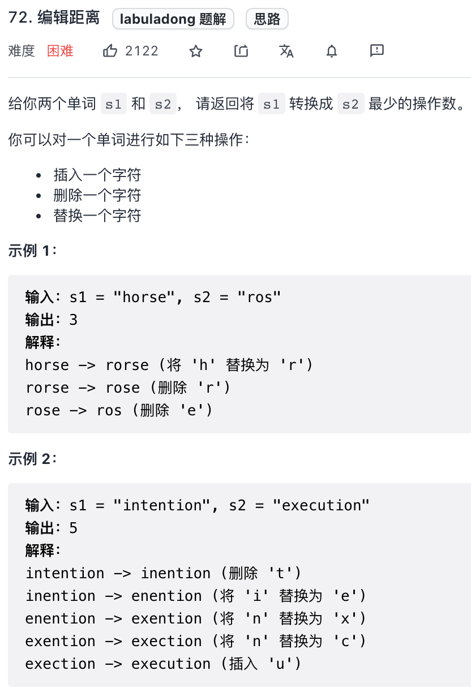
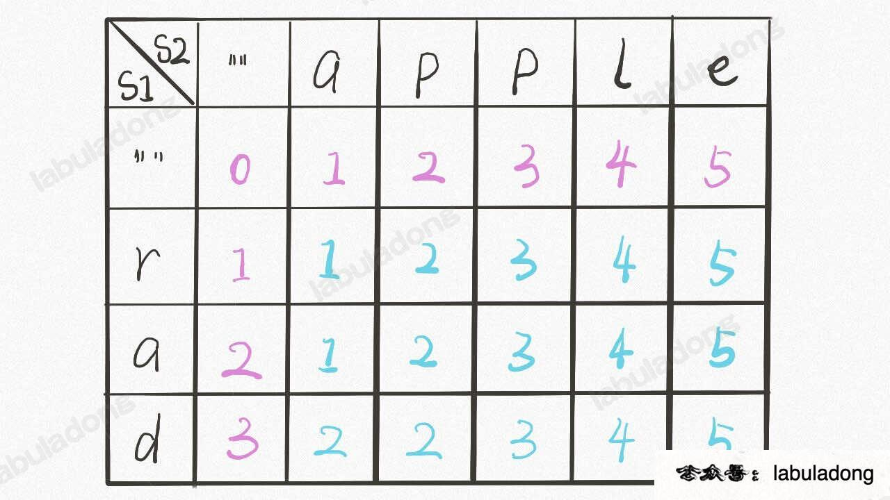
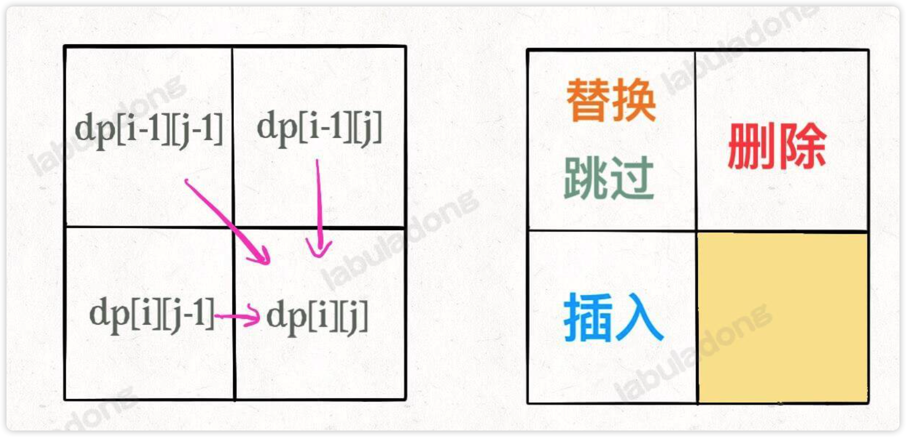
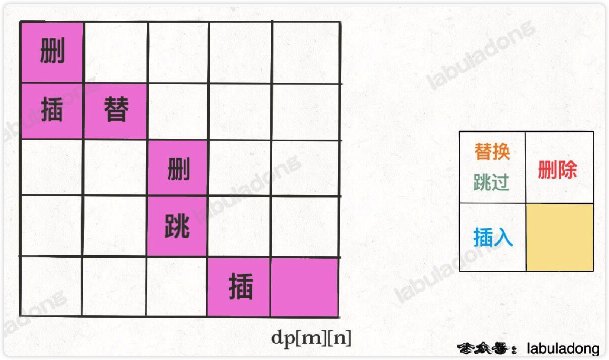

# 0014.最小编辑距离


#算法/动态规划 


## 题目

- https://leetcode.cn/problems/edit-distance/




## 分析

**解决两个字符串的动态规划问题**，一般都是用两个指针 `i, j` 分别指向两个字符串的`最后`，然后一步步`往前移动`，缩小问题的规模，如下面动动图：

- `s1 = "rad"`
- `s2 = "apple"`

把 `s1` 变成 `s2`


其实一共 **4 种操作**：

- 啥都别做（`skip`），直接移动 `i` 和 `j` 即可。
- 插入（`insert`）
- 删除（`delete`）
- 替换（`replace`）

**定义 dp 函数**：`dp(s1, i, s2, j)`  ，代表 `s1[0..i]` 和 `s2[0..j]` 的最小编辑距离，即` s1` 变成 `s2` 的 `最短编辑距离`。

> 注意：这里是倒着递归

## 自顶向下的递归解法 - 暴力


```javascript
var minDistance = function (s1, s2) {
    var m = s1.length, n = s2.length;
    // i，j 初始化指向最后一个索引
    return dp(s1, m - 1, s2, n - 1);
};

// 定义：返回 s1[0..i] 和 s2[0..j] 的最小编辑距离
var dp = function (s1, i, s2, j) {
    // base case
    // :::: 即 s1 = '' ,所以 s1 变成 s2 的最小编辑距离就是 s2 的长度,
    //  即一直插入
    if (i === -1) return j + 1;
    // :::: 即 s2 = '' ,所以 s1 变成 s2 的最小编辑距离就是 s1 的长度，
    //  即一直删除
    if (j === -1) return i + 1;
    
    // skip, 所以 i-1, j-1
    if (s1[i] === s2[j]) {
        return dp(s1, i - 1, s2, j - 1);
    }
    
    return Math.min(
        // 插入, s1[i] 插入到 s2[j] 前面, 所以 j-1
        dp(s1, i, s2, j - 1) + 1,
        // 删除，s1[i] 删除，所以 i-1
        dp(s1, i - 1, s2, j) + 1,
        // 替换, s2[j] 替换为 s1[i], 所以 i-1, j-1
        dp(s1, i - 1, s2, j - 1) + 1
    );
};

console.log(minDistance('horse', 'ros')); // 3
console.log(minDistance('intention', 'execution')); // 5
```

> [!tip]
> 注意看**注释**，另外这里的`状态` 与 `选择` 分别是什么？

> [!tip]
> LeetCode 执行超时！

## 自顶向下的递归解法  - 备忘录优化


```javascript
var minDistance = function (s1, s2) {
    var m = s1.length, n = s2.length;
    const memo = [];
    for (let i = 0; i < m; i++) {
        memo[i] = new Array(n).fill(-1);
    }
    // i，j 初始化指向最后一个索引
    return dp(s1, m - 1, s2, n - 1, memo);
};

// 定义：返回 s1[0..i] 和 s2[0..j] 的最小编辑距离
var dp = function (s1, i, s2, j, memo) {
    // base case
    // :::: 即 s1 = '' ,所以 s1 变成 s2 的最小编辑距离就是 s2 的长度,
    //  即一直插入
    if (i === -1) return j + 1;
    // :::: 即 s2 = '' ,所以 s1 变成 s2 的最小编辑距离就是 s1 的长度，
    //  即一直删除
    if (j === -1) return i + 1;

    // memo[i][j] 已经计算过
    if (memo[i][j] !== -1) return memo[i][j];

    // skip, 所以 i-1, j-1
    if (s1[i] === s2[j]) {
        return memo[i][j] = dp(s1, i - 1, s2, j - 1, memo);
    }
    return memo[i][j] = Math.min(
        // 插入, s1[i] 插入到 s2[j] 前面, 所以 j-1
        dp(s1, i, s2, j - 1, memo) + 1,
        // 删除，s1[i] 删除，所以 i-1
        dp(s1, i - 1, s2, j, memo) + 1,
        // 替换, s2[j] 替换为 s1[i], 所以 i-1, j-1
        dp(s1, i - 1, s2, j - 1, memo) + 1
    );
};

console.log(minDistance('horse', 'ros'));
console.log(minDistance('intention', 'execution'));

```

也直接使用`memo={}` 或者 `memo=new Map()`  来优化，避免初始化二维数组，如下代码：

```javascript
var minDistance = function (s1, s2) {
    var m = s1.length, n = s2.length;
    // 直接使用对象，而不是二维数组
    const memo = {};
    // i，j 初始化指向最后一个索引
    return dp(s1, m - 1, s2, n - 1, memo);
};

// 定义：返回 s1[0..i] 和 s2[0..j] 的最小编辑距离
var dp = function (s1, i, s2, j, memo) {
    // base case
    // :::: 即 s1 = '' ,所以 s1 变成 s2 的最小编辑距离就是 s2 的长度,
    //  即一直插入
    if (i === -1) return j + 1;
    // :::: 即 s2 = '' ,所以 s1 变成 s2 的最小编辑距离就是 s1 的长度，
    //  即一直删除
    if (j === -1) return i + 1;

    // memo[i][j] 已经计算过
    if (memo[`${i}-${j}`] !== undefined) return memo[`${i}-${j}`];

    // skip, 所以 i-1, j-1
    if (s1[i] === s2[j]) {
        return memo[`${i}-${j}`] = dp(s1, i - 1, s2, j - 1, memo);
    }
    return memo[`${i}-${j}`] = Math.min(
        // 插入, s1[i] 插入到 s2[j] 前面, 所以 j-1
        dp(s1, i, s2, j - 1, memo) + 1,
        // 删除，s1[i] 删除，所以 i-1
        dp(s1, i - 1, s2, j, memo) + 1,
        // 替换, s2[j] 替换为 s1[i], 所以 i-1, j-1
        dp(s1, i - 1, s2, j - 1, memo) + 1
    );
};

console.log(minDistance('horse', 'ros'));
console.log(minDistance('intention', 'execution'));
```


> [!danger]
> 注意：一点要在所有需要赋值给 `memo` 的地方赋值，搞了半天，发现少了赋值了

> [!info]
> 如果说 `memo` 为`对象`时，可以少了初始化工作，如果是`数组`时，初始化数组时，其实保证二维数组长度和宽度**大一点也没关系**。

## 至底向上的 dp table 解法



> [!warning]
> `dp 函数`的 base case 是 i, j 等于 `-1`，而 **dp数组索引至少是 0**，所以 dp 数组会偏移一位。

代码如下：

```javascript
let minDistance = function (s1, s2) {
    let m = s1.length, n = s2.length;
    // 定义：s1[0..i] 和 s2[0..j] 的最小编辑距离是 dp[i+1][j+1]
    let dp = [];
    for (let i = 0; i <= m; i++) {
        dp[i] = new Array(n + 1).fill(0);
    }
    // base case
    // ::::即 s2 = '' 
    for (let i = 1; i <= m; i++) {
        dp[i][0] = i;
    }
    // ::::即 s1 = ''
    for (let j = 1; j <= n; j++) {
        dp[0][j] = j;
    }
    // 自底向上求解
    for (let i = 1; i <= m; i++) {
        for (let j = 1; j <= n; j++) {
            if (s1[i - 1] === s2[j - 1]) {
                dp[i][j] = dp[i - 1][j - 1];
            } else {
                dp[i][j] = Math.min(
                    dp[i - 1][j] + 1,
                    dp[i][j - 1] + 1,
                    dp[i - 1][j - 1] + 1
                );
            }
        }
    }
    // 储存着整个 s1 和 s2 的最小编辑距离
    return dp[m][n];
};
```


> [!failure]
> 其实，dp数组，保证开始索引`大于 0`，`最大等于 length + 1` 即能保证范围正常，虽然大一点也行


## 空间复杂度 压缩成 `O(min(M, N))`



如上图，既然每个 `dp[i][j]` 只和它附近的三个状态有关，`空间复杂度`是可以压缩成 `O(min(M, N))` 的（`M`，`N` 是两个字符串的长度）

数据结构构造如下：

```javascript
function Node() {
    this.val = 0;
    this.choice = 0; // 0 代表啥都不做
                     // 1 代表插入
                     // 2 代表删除
                     // 3 代表替换
}
```


`val` 属性就是之前的 `dp 数组`的数值，`choice` 属性代表操作。在做最优选择时，顺便把操作记录下来，然后就从结果反推具体操作。

我们的最终结果不是 `dp[m][n]` 吗，这里的 `val` 存着`最小编辑距离`，choice 存着`最后一个操作`，比如说是`插入操作`，那么就可以`左移一格`

最终，到 `dp[0][0]`，如下图这样：



> 具体实现不展开，点到为止！

## 最后

- 这个题主要是`倒着遍历`
- 还是`递归备忘录`，不容易写出问题，dp 数组细节比较多
- 最后，还有个思路是如何`压缩空间复杂度`，取决于状态如何转移？ 很多动态规划的问题都可以压缩空间复杂度


