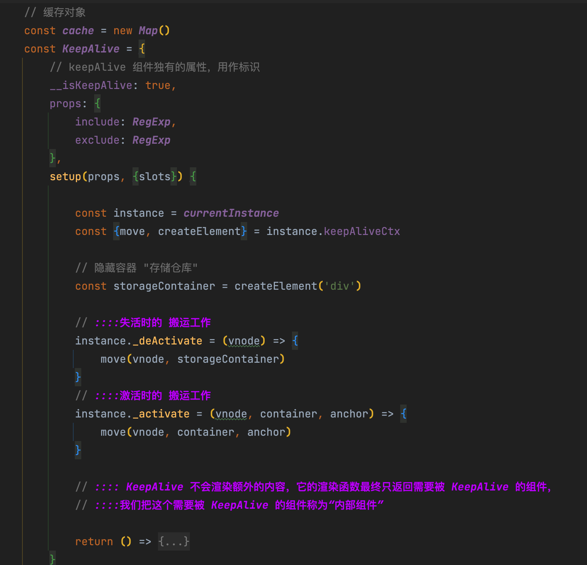
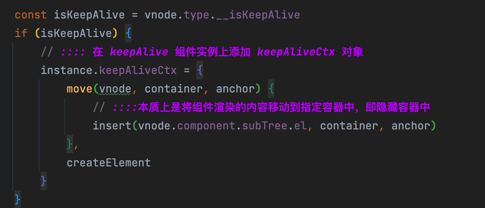

# 0074.Vue3 中 keepAlive组件的实现原理

---

#vue 

## 为什么需要 keepalive

类似于HTTP 中的 `keepAlive` , 为了避免频繁地销毁、创建 HTTP 连接会带来额外 的性能开销；故允许多个请求或响应共用一个 TCP 连接

同样的， `keepAlive组件` 可以避免 一个组件被 频繁地销毁/重建

## KeepAlive 的本质

**本质是缓存管理，再加上特殊的挂载/卸载逻辑**

具体如下图：

https://www.figma.com/file/yadsH3JL06697MH3uWxPXd/2023.06.LOG?type=whiteboard&node-id=11-37&t=h8yXeRi9xblhKVhW-4

## 具体的代码架子

>  当然，比如卸载时，需要看这个组件是否是`内部组件`，是的话会对特殊处理。

下面是 `move` 的一些具体逻辑：

## include 和 exclude

即能够显示的配置应该 被缓存的组件或不应该缓存的组件，**本质是通过内部组件的名称进行正则匹配，如果匹配到则直接渲染“内部组件”，不对其进行后续的缓存操作**

## 缓存管理

总结下就是：
- 如果缓存存在，则继承组件实例，并将用于描述`组件的 vnode 对象`标记为 `keptAlive`，这样渲染器就不会重新创建新的组件实例； 
- 如果缓存不存在，则设置缓存。
- 缓存策略：目前是`最近一次访问`，另外还需要关注是否设置`最大缓存容量`，如果设置了，还需要`修剪`

>  注1：缓存的是组件的实例

## 最后

具体代码见仓库，这里主要是列举了关键点

