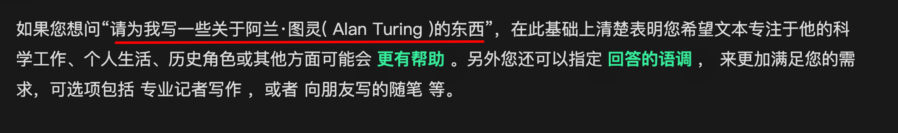

# 0085.提示词工程师

#AI 

## 一、何为提示工程

 Prompt Engineering，即是**针对特定任务构造能充分发挥大模型能力的 Prompt 的技巧**

- 将给大模型的**输入**称为 `Prompt`，将大模型返回的**输出**称为 `Completion`

## 二、两类大模型

- **tips：** 可使用API调用LLM快速构建软件应用程序
- 两类大模型
	- 基础LLM
		- 基于之前的文本，**递归** 预测下一个**字词**
	- 指令微调（Instruction Tuned）LLM  （==本课程重点介绍该方向==）
		- 人类反馈强化学习，即人工干预，产生更安全可靠的输出， 去掉有害回答

本课程将重点介绍针对指令微调 LLM 的最佳实践

## 三、提示工程的**两个关键原则**

###  1、编写清晰、具体的指令

> [!example]
>  

- **策略 1**：使用分隔符，比如 `单双引号、XML 标签、及任何能够明显的标点符号`
	-  Prompt 中的**墙**，将不同的指令、上下文、输入隔开，避免意外的混淆
- **策略 2**：结构化输出，比如输出 JSON、HTML 格式
	- 示例：`请生成包括书名、作者和类别的三本虚构的、非真实存在的中文书籍清单，并以 JSON 格式提供，其中包含以下键:book_id、title、author、genre`
		- **标点符号，很重要**
- **策略 3**： 要求模型检查是否满足条件
	- 其实就是写代码时边界异常情况，你需要明确指出，如 `如果文本中不包含一系列的指令，则直接写“未提供步骤”。"`
- **策略 4**：提供少量示例
	- 利用少样本样例，我们可以轻松**预热** 语言模型，让它为新的任务做好准备
		- 示例：爷孙一问一答示例

### 2、给模型充足的思考时间

大模型需要思考，需要给他足够的推理时间

- 指定完成任务所需的**步骤**
	- 比如指定它完成一个任务，那么请给出1 、 2、 3 等步骤
	- 也可以明确具体输出格式
- 指导模型在下结论之前找出一个**自己的解法** 作为示例
	- 可以再给一个我的解法，问他的解决方案是什么？

## 四、大模型的局限性

虚假知识 ：**模型偶尔会生成一些看似真实实则编造的知识**

yi

## 30 prompts everyone has to know

## 参考

- https://ywh1bkansf.feishu.cn/wiki/KMKewmuQaigLJTkeHuncjX96nKb
- https://datawhalechina.github.io/prompt-engineering-for-developers/#/C1/1.%20%E7%AE%80%E4%BB%8B%20Introduction
- 

            

                

                    <svg t="1687912573060" class="icon" viewBox="0 0 1024 1024" version="1.1" xmlns="http://www.w3.org/2000/svg" p-id="1498">
                        <path d="M854.6 370.6c-9.9-39.4 9.9-102.2 73.4-124.4l-67.9-3.6s-25.7-90-143.6-98c-117.8-8.1-194.9-3-195-3 0.1 0 87.4 55.6 52.4 154.7-25.6 52.5-65.8 95.6-108.8 144.7-1.3 1.3-2.5 2.6-3.5 3.7C319.4 605 96 860 96 860c245.9 64.4 410.7-6.3 508.2-91.1 20.5-0.2 35.9-0.3 46.3-0.3 135.8 0 250.6-117.6 245.9-248.4-3.2-89.9-31.9-110.2-41.8-149.6z m-204.1 334c-10.6 0-26.2 0.1-46.8 0.3l-23.6 0.2-17.8 15.5c-47.1 41-104.4 71.5-171.4 87.6-52.5 12.6-110 16.2-172.7 9.6 18-20.5 36.5-41.6 55.4-63.1 92-104.6 173.8-197.5 236.9-268.5l1.4-1.4 1.3-1.5c4.1-4.6 20.6-23.3 24.7-28.1 9.7-11.1 17.3-19.9 24.5-28.6 30.7-36.7 52.2-67.8 69-102.2l1.6-3.3 1.2-3.4c13.7-38.8 15.4-76.9 6.2-112.8 22.5 0.7 46.5 1.9 71.7 3.6 33.3 2.3 55.5 12.9 71.1 29.2 5.8 6 10.2 12.5 13.4 18.7 1 2 1.7 3.6 2.3 5l5 17.7c-15.7 34.5-19.9 73.3-11.4 107.2 3 11.8 6.9 22.4 12.3 34.4 2.1 4.7 9.5 20.1 11 23.3 10.3 22.7 15.4 43 16.7 78.7 3.3 94.6-82.7 181.9-182 181.9z"
                              p-id="1499" ></path>
                    </svg>
                    <a href="https://www.yuque.com/liguwe/post/d89613a5-d295-55d4-8d69-2307afad7a8c" target="_blank" class="liguwe-doc-footer-edit-link-a">
                        View this page on Yuque（语雀）
                    </a>
                

                

                    <svg t="1687913054251" class="icon" viewBox="0 0 1024 1024" version="1.1" xmlns="http://www.w3.org/2000/svg" p-id="5173"><path d="M853.333333 501.333333c-17.066667 0-32 14.933333-32 32v320c0 6.4-4.266667 10.666667-10.666666 10.666667H170.666667c-6.4 0-10.666667-4.266667-10.666667-10.666667V213.333333c0-6.4 4.266667-10.666667 10.666667-10.666666h320c17.066667 0 32-14.933333 32-32s-14.933333-32-32-32H170.666667c-40.533333 0-74.666667 34.133333-74.666667 74.666666v640c0 40.533333 34.133333 74.666667 74.666667 74.666667h640c40.533333 0 74.666667-34.133333 74.666666-74.666667V533.333333c0-17.066667-14.933333-32-32-32z"  p-id="5174"></path><path d="M405.333333 484.266667l-32 125.866666c-2.133333 10.666667 0 23.466667 8.533334 29.866667 6.4 6.4 14.933333 8.533333 23.466666 8.533333h8.533334l125.866666-32c6.4-2.133333 10.666667-4.266667 14.933334-8.533333l300.8-300.8c38.4-38.4 38.4-102.4 0-140.8-38.4-38.4-102.4-38.4-140.8 0L413.866667 469.333333c-4.266667 4.266667-6.4 8.533333-8.533334 14.933334z m59.733334 23.466666L761.6 213.333333c12.8-12.8 36.266667-12.8 49.066667 0 12.8 12.8 12.8 36.266667 0 49.066667L516.266667 558.933333l-66.133334 17.066667 14.933334-68.266667z"  p-id="5175"></path></svg>
                    <a href="https://github.com/liguwe/liguwe.github.io/blob/master/post/d89613a5-d295-55d4-8d69-2307afad7a8c.md" target="_blank" class="liguwe-doc-footer-edit-link-a">Edit this page on Github</a>
                

            

            

