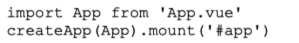
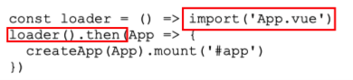
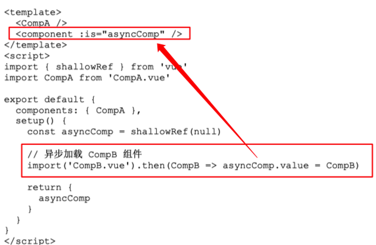
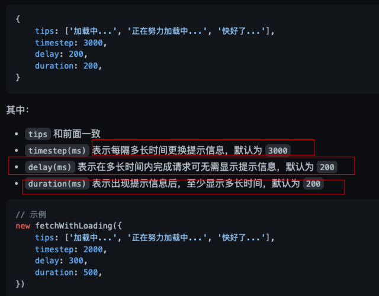
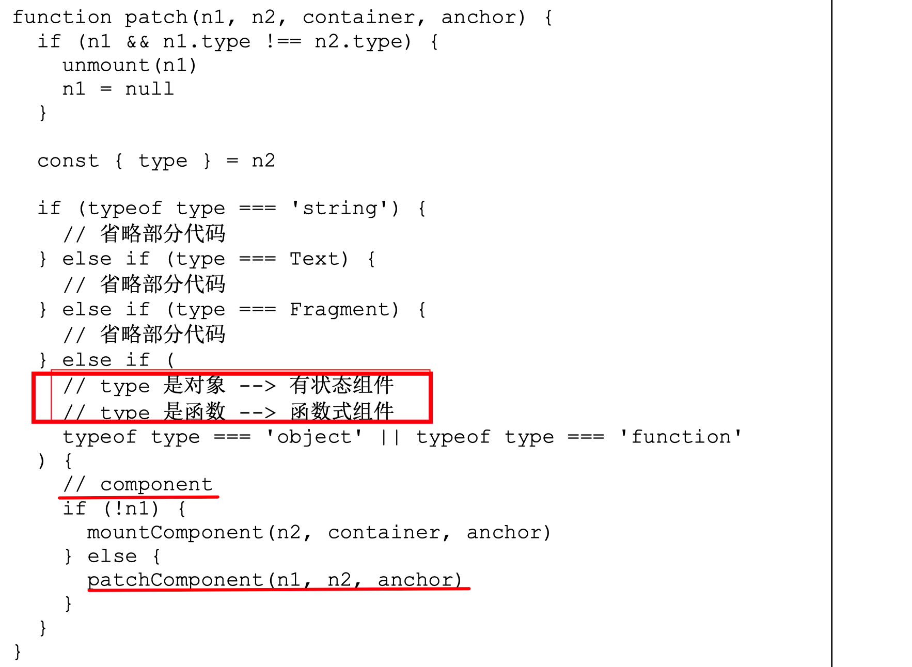
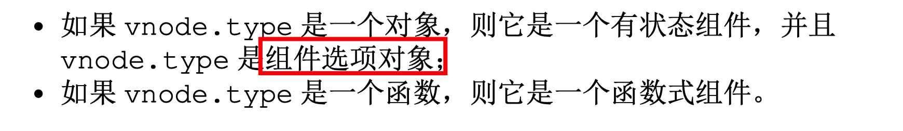
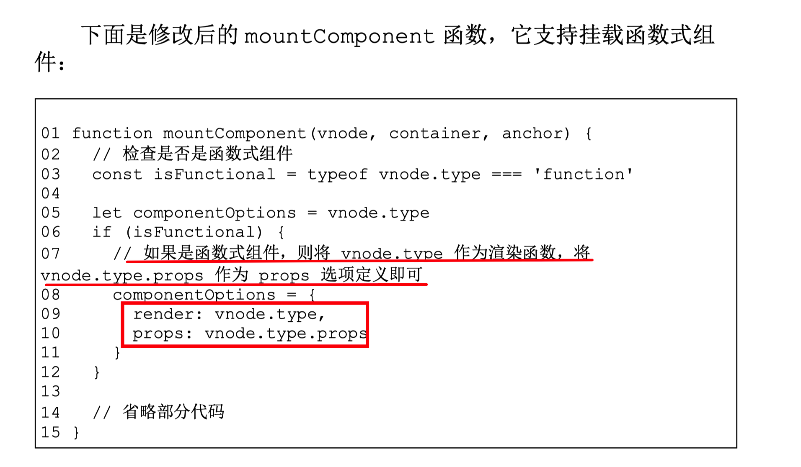

#vue #2023/06/20 

## 异步组件的概念
即，以异步的方式加载并渲染一个组件。 这在`页面性能` 、 `代码分割`、`服务端下发组件`等场景中尤为重要

## 异步组件的简易实现
同步渲染，如下面的代码就是同步渲染的

最简单的异步组件加载渲染实现：使用 `import()` 


### 只异步渲染页面的某一部分


> 关于 `is`，是`vue`内置的特殊 **Attributes** （其他的如 `key` 和 `ref`）, 用于绑定动态组件。 更多参考 [https://cn.vuejs.org/api/built-in-special-attributes.html#is](https://cn.vuejs.org/api/built-in-special-attributes.html#is)


### 待完善的点

- 如果组件加载失败或加载超时，是否要渲染 ==Error 组件==？
- 组件在加载时，是否要展示==占位==的内容？例如渲染一个 Loading 组件。
- 组件加载的速度可能很快，也可能很慢，是否要设置一个延迟展 示 Loading 组件的时间？==如果组件在 200ms 内没有加载成功才展示 Loading 组件==，这样可以避免由组件加载过快所导致的`闪烁`。 
- 组件加载失败后，是否需要==重试==？

> [!abstract]
从根本上来说，异步组件的实现可以完全在**用户层面**实现，而无须框架支持。但一个完善的异步组件仍需要考虑诸多问题，如下


## 完整的异步组件的实现原理

### 1、封装 defineAsyncComponent 函数
异步组件**本质上**是通过封装手段来实现友好的用户接口，从而降低**用户层面**的使用复杂度
具体看 `fj`
[https://www.figma.com/file/yadsH3JL06697MH3uWxPXd/2023.06.LOG?type=whiteboard&node-id=3-157&t=ldGx9XSTfYfsodhA-4](https://www.figma.com/file/yadsH3JL06697MH3uWxPXd/2023.06.LOG?type=whiteboard&node-id=3-157&t=ldGx9XSTfYfsodhA-4)


### 2、超时与兜底的 Error 组件
见 fj , 如上

### 3、延迟 与 Loading
见 fj , 如上

#### 延伸
> [!question]
如果加载需要 `201ms`  , `delay = 200` , 那么 loading 组件就展示 `1ms`  ？

上面提的问题，还是会导致`闪烁` ，所以应该再加一个参数，标识至少展示 `loading` 多久 ，所以参数应该如下：

>  具体代码参考： [https://github.com/yued-fe/fetch-with-loading/blob/main/fetch-with-loading.js](https://github.com/yued-fe/fetch-with-loading/blob/main/fetch-with-loading.js)


### 4、重试机制
见 `fj` , 如上

#### 延伸
如何重现发起请求，并控制次数
```javascript
Promise.retry = function (promiseFn, times = 3) {
    return new Promise(async (resolve, reject) => {
        while (times--) {
            try {
                let ret = await promiseFn();
                resolve(ret);
                // 832: 如果成功了，就直接break了
                break;
            } catch (error) {
                if (!times) reject(error);
            }
        }
    });
};
```

> [!tip]
 `while` 里直接使用 `break` 跳出循环，平时自己很少使用


## 函数式组件 与 有状态的组件
一个函数式组件**本质上**就是一个普通函数，该函数的**返回值**是虚拟 DOM ， 函数式组件**没有自身状态** ，需要通过 `props` 的方式传入。下面是一个 函数式组件的示例：
```javascript
function MyFuncComp(props) {
    return {type: 'h1', children: props.title}
}

MyFuncComp.props = {
    title: 'default title'
}
```
函数式组件**无需初始化**`data`**以及生命周期钩子**。从这一点可以看出，函数式组件的初始化性能消耗小于有状态组件，但其实在 Vue.js 3 中，即使是**有状态组件**，其初始化性能消耗也非常小，
下面是一个具体的代码实现：







## 最后
流程图： [https://www.figma.com/file/yadsH3JL06697MH3uWxPXd/2023.06.LOG?type=whiteboard&node-id=3-157&t=mQRERHjWVhTuLA2a-4](https://www.figma.com/file/yadsH3JL06697MH3uWxPXd/2023.06.LOG?type=whiteboard&node-id=3-157&t=mQRERHjWVhTuLA2a-4)


## 参考
《vue.js 设计与实现》
