updateAt: 2023.05.18
done: false
category: 算法
#算法/回溯  #算法/DFS


## 回溯算法 与 DFS 算法的区别？
其实`回溯算法`和我们常说的 `DFS 算法`非常类似，本质上就是一种**暴力穷举算法**。`回溯算法` 和 `DFS` 算法的细微差别是：

- `回溯算法`是在`遍历「树枝」`
- `DFS 算法`是在`遍历「节点」`

## 回溯算法 框架
```javascript
const result = [];

function backtrack('路径', '选择列表') {
    if ('满足结束条件') {
        result.add('路径');
        return;
    }
    for (let '选择' of '选择列表') {
        // 做选择;
        backtrack('路径', '选择列表');
        // 撤销选择;
    }
}
```
其核心就是 `for 循环里面的递归`

- 在`递归`调用之`前` `「做选择」`
- 在`递归`调用之`后`  `「撤销选择」`

关于这个框架的原理解释？ 见下面`全排列`的分析，你就明白了

## 第 46 题「 全排列」
[https://leetcode.cn/problems/permutations/](https://leetcode.cn/problems/permutations/)
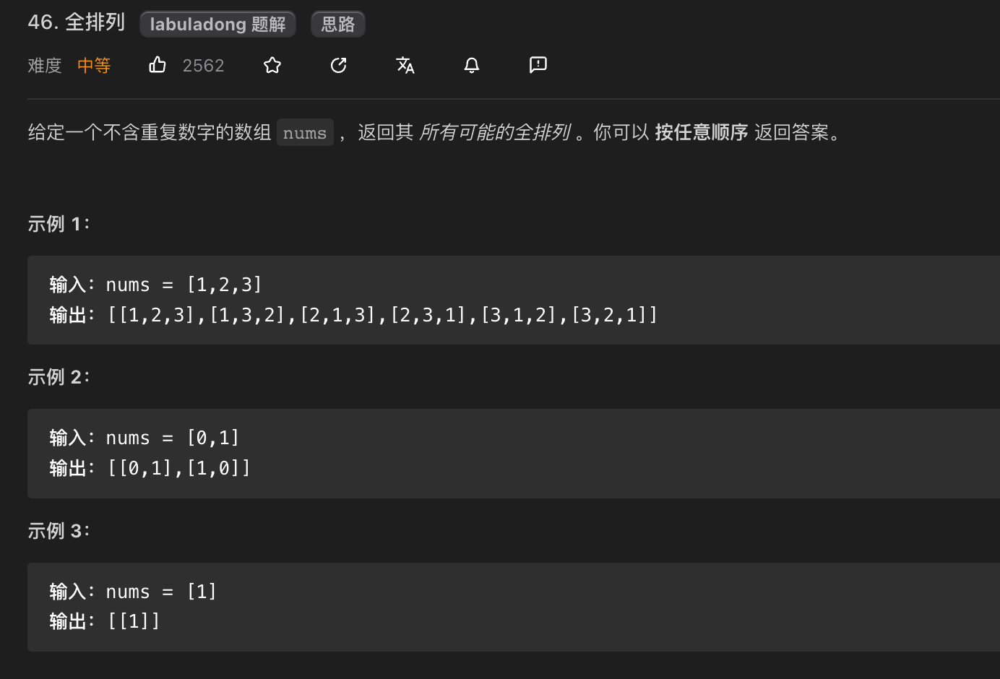
其实，就是一个排列组合的数学题，我们也知道 `n` 个不重复的数，全排列共有 `n!` 个 ，比方说给三个数 `[1,2,3]` ，我们来画一画这颗`决策树` ，如下：

① 中的 `[2]` 代表 `路径` ，记录你`已经做过的选择`
② 中的 `[1,3]`代表 `选择列表` ， 表示你当前可以做出的选择
③ 中的，代表你站在 这个`红色的节点`上，做决策，有两层意思

- 已经做了：你已经选择 2
- 准备做：然后再决定选择 谁？
④ 代表变 `「结束条件」`就是遍历到树的`底层叶子节点`，这里也就是`选择列表为空`的时候。

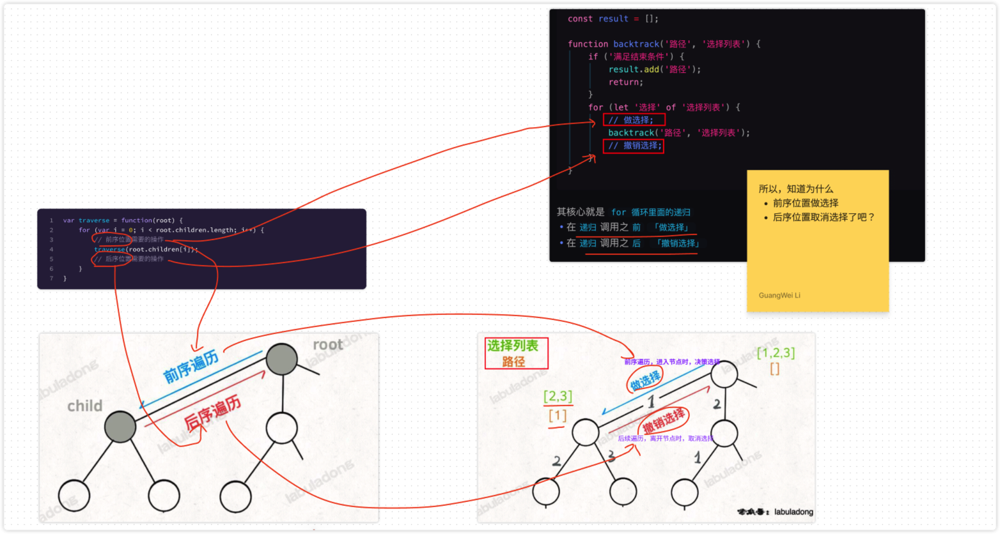
原图：
[https://www.figma.com/file/hT9k2YbVvV1UIITtUmbJ0C/2023.05.LOG?type=whiteboard&node-id=123-126&t=DWP6ZQ9UIUPHNXtX-4](https://www.figma.com/file/hT9k2YbVvV1UIITtUmbJ0C/2023.05.LOG?type=whiteboard&node-id=123-126&t=DWP6ZQ9UIUPHNXtX-4)

### 解法一：使用 ` Array.includes` 来判断是否选中过了
```javascript
var permute = function (nums) {
    const len = nums.length;
    const res = []; // 结果集
    /**
     * @param {Array} track 已经选择的列表
     * */
    function backtrack(track) {
        // 递归终止条件
        if (track.length === len) {
            return res.push(track)
        }
        for (let i = 0; i < len; i++) {
            // 已经选择过的数字不能再做选择
            if (!track.includes(nums[i])) {
                // 做选择
                track.push(nums[i]);
                backtrack([...track]);
                // 撤销选择
                track.pop()
            }
        }
    }
    backtrack([])
    return res
};

console.log(permute([1, 2, 3]));
console.log(permute([1, 2, 3, 4]));


```

### 解法二：使用 `used` 标识选择过的节点
```javascript
var permute = function (nums) {
    const len = nums.length;
    const res = []; // 结果集
    const used = new Array(nums.length).fill(false); 
    /**
     * @param {Array} track 已经选择的列表
     * */
    function backtrack(track) {
        // 递归终止条件
        if (track.length === len) {
            return res.push(track)
        }
        for (let i = 0; i < len; i++) {
            // 已经选择过的数字不能再做选择
            if(used[i]) continue;
            // 做选择
            track.push(nums[i]);
            used[i] = true;
            backtrack([...track]);
            // 撤销选择
            track.pop();
            used[i] = false;
        }
    }
    backtrack([]);
    return res
};

console.log(permute([1, 2, 3]));
console.log(permute([1, 2, 3, 4]));

```


### 变体：输出元素个数为 `k` 的所有排列？
只需要，修改下面的 **base case** 即可，代码如下：
```javascript
var permute = function (nums,k) {
    const len = nums.length;
    const res = []; // 结果集
    const options = []; // 选择列表
    function backtrack(options) {
        // ::::base case 选择完了
        if (options.length === k) {
            return res.push(options)
        }
        for (let i = 0; i < len; i++) {
            // 已经选择过的数字不能再做选择
            if (!options.includes(nums[i])) {
                // 做选择
                options.push(nums[i]);
                backtrack([...options]);
                // 撤销选择
                options.pop()
            }
        }
    }
    backtrack(options)
    return res
};

console.log(permute([1, 2, 3], 3));
console.log(permute([1, 2, 3], 2));

```


## SKU 排列
```javascript
let names = ["iPhone X", "iPhone XS"]
let colors = ["黑色", "白色"]
let storages = ["64g", "256g"]
let skus = {names,colors,storages};

// [
//     ["iPhone X", "黑色", "64g"],
//     ["iPhone X", "黑色", "256g"],
//     ["iPhone X", "白色", "64g"],
//     ["iPhone X", "白色", "256g"],
//     ["iPhone XS", "黑色", "64g"],
//     ["iPhone XS", "黑色", "256g"],
//     ["iPhone XS", "白色", "64g"],
//     ["iPhone XS", "白色", "256g"],
// ]

let combine = function (...skus) {
    let res = [];
    const backtrack = (opts, selectedArr, index) => {
        let options = opts[index];
        if (selectedArr.length === 3) {
            res.push([...selectedArr]);
            return;
        }
        for (let i = 0; i < options.length; i++) {
            // 选择
            selectedArr.push(options[i]);
            // ::::关键，选择下一个产品类型，即下一个数组
            backtrack(skus, selectedArr, index + 1);
            // 取消选择
            selectedArr.pop();
        }
    }
    backtrack(skus, [], 0)
    return res
}

console.log(combine(names, colors, storages));

```
> **关键点**，递归函数 `backtrack` 的入参上，即 `opts, selectedArr, index` 这三个参数上。


## 第 51 题「 N 皇后」
[https://leetcode.cn/problems/n-queens/](https://leetcode.cn/problems/n-queens/)
比如， `N = 4`，那么你就要在 `4x4` 的棋盘上放置 `4 个皇后`，返回以下结果（用 `.` 代表空`棋盘`，`Q` 代表`皇后`），如下图：
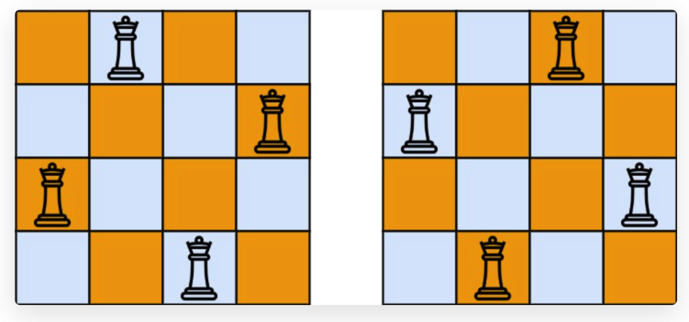
皇后可以攻击`同一行`、`同一列`、`左上左下` `右上右下`  四个方向的任意单位。


### 小插曲：`初始化`一个 `m*n` 的`二维数组`  最简便的方式
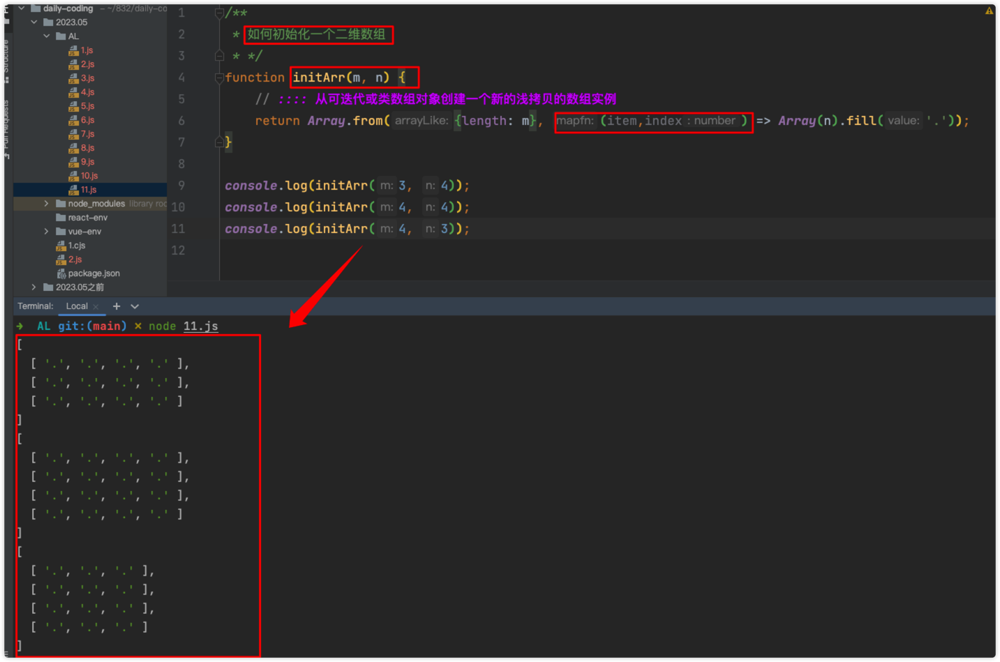
```javascript
/**
 * 如何初始化一个二维数组
 * */
function initArr(m, n) {
    // :::: 从可迭代或类数组对象创建一个新的浅拷贝的数组实例
    return Array.from({length: m}, (item,index) => Array(n).fill('.'));
}

console.log(initArr(3, 4));
console.log(initArr(4, 4));
console.log(initArr(4, 3));
```
另外可参考 [[二维数组的遍历技巧汇总#如何初始化一个二维数组|如何初始化一个二维数组]] ，常用的就两种方式。

### 代码实现：
```javascript
/**
 * https://leetcode.cn/problems/n-queens/
 * */
let solveNQueens = function (n) {
    let res = [];
    let board = Array.from({length: n}, () => Array(n).fill('.'));
    /**
     * @param board 棋盘二维数组
     * @param row 当前第几行
     * */
    let backtrack = function (board, row) {
        // :::: 满足结束条件, 即已经放置了 n 个皇后
        if (row === board.length) {
            // 看题设，需要输出这样的格式
            const item = board.map((row) => row.join(''));
            res.push(item);
            return;
        }
        // :::: 从选择列表中选择,这里的选择列表是【二维数组的第 row 行】
        // 换句话来说，从 第row行  中去选择 某一列
        let currentRow = board[row].length;
        for (let col = 0; col < currentRow; col++) {
            if (!isValid(board, row, col)) {
                continue;
            }
            // :::: 做选择
            board[row][col] = 'Q';
            backtrack(board, row + 1);
            // :::: 撤销选择
            board[row][col] = '.';
        }
    }; 
    let isValid = function (board, row, col) {
        let totalRow = board.length;
        // 检查 【当前列】 是否有皇后互相冲突
        // 所以 列数col不变，行数变化
        for (let i = 0; i < row; i++) {
            if (board[i][col] === 'Q') {
                return false;
            }
        }
        // 检查【右上方】是否有皇后互相冲突
        for (let i = row - 1, j = col + 1; i >= 0 && j < totalRow; i--, j++) {
            if (board[i][j] === 'Q') {
                return false;
            }
        }
        // 检查【左上方】 是否有皇后互相冲突
        for (let i = row - 1, j = col - 1; i >= 0 && j >= 0; i--, j--) {
            if (board[i][j] === 'Q') {
                return false;
            }
        }
        return true;
    };
    backtrack(board, 0);
    return res;
};


```
关于，`isValid` 的逻辑，分析可见 `fj` 
[https://www.figma.com/file/hT9k2YbVvV1UIITtUmbJ0C/2023.05.LOG?type=whiteboard&node-id=161-198&t=Cw0r27yobQ8yinDi-4](https://www.figma.com/file/hT9k2YbVvV1UIITtUmbJ0C/2023.05.LOG?type=whiteboard&node-id=161-198&t=Cw0r27yobQ8yinDi-4)
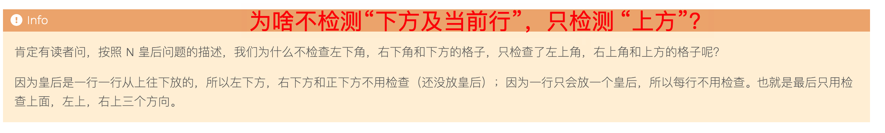

回溯算法中，如果只需要一个结果即可，如上题中，只需要一个符合规范的 N 皇后布局，外部变量标识是否找到，找到直接 `return` 即可，如下代码：
```javascript
// 函数找到一个答案后就返回 true
var found = false;

function backtrack(board, row) {
    // 已经找到一个答案了，不用再找了
    if (found) {
        return;
    }
    // 触发结束条件
    if (row === board.length) {
        res.push(board);
        // 找到了第一个答案
        found = true;
        return;
    }
    ...
}
```

## 第 52 题「 N 皇后 II」
[https://leetcode.cn/problems/n-queens-ii/](https://leetcode.cn/problems/n-queens-ii/)
把 上题： [[#第 51 题「 N 皇后」]]   改成返回 个数 而已，其他都不需要变，把 `res = 0`  即可，因为 `res=[]` 肯定更占内存。代码如下：
```javascript

let totalNQueens = function (n) {
    let res = 0;
    let board = Array.from({length: n}, () => Array(n).fill('.'));
    /**
     * @param board 棋盘二维数组
     * @param row 当前第几行
     * */
    let backtrack = function (board, row) {
        // :::: 满足结束条件, 即已经放置了 n 个皇后
        if (row === board.length) {
            res++;
            return;
        }
        // :::: 从选择列表中选择,这里的选择列表是【二维数组的第 row 行】
        // 换句话来说，从 第row行  中去选择 某一列
        let currentRowLen = board[row].length;
        for (let col = 0; col < currentRowLen; col++) {
            if (!isValid(board, row, col)) {
                continue;
            }
            // :::: 做选择
            board[row][col] = 'Q';
            backtrack(board, row + 1);
            // :::: 撤销选择
            board[row][col] = '.';
        }
    };

    let isValid = function (board, row, col) {
        let totalRow = board.length;
        // 检查 【上方】 是否有皇后互相冲突
        // 所以 列数col不变，行数变化
        for (let i = 0; i < row; i++) {
            if (board[i][col] === 'Q') {
                return false;
            }
        }
        // 检查【右上方】是否有皇后互相冲突
        for (let i = row - 1, j = col + 1; i >= 0 && j < totalRow; i--, j++) {
            if (board[i][j] === 'Q') {
                return false;
            }
        }
        // 检查【左上方】 是否有皇后互相冲突
        for (let i = row - 1, j = col - 1; i >= 0 && j >= 0; i--, j--) {
            if (board[i][j] === 'Q') {
                return false;
            }
        }
        return true;
    };
    backtrack(board, 0);
    return res;
};


```


### 复杂度分析
当 N = 8 时，就是`八皇后问题`，数学大佬`高斯穷尽一生`都没有数清楚八皇后问题到底有几种可能的放置方法，但是我们的算法只需要一秒就可以算出来所有可能的结果。
==所以，计算机真的很强大==
N 行棋盘中，第一行有 `N` 个位置可能可以放皇后，第二行有 `N - 1` 个位置，第三行有 `N - 2` 个位置，以此类推，再叠加每次放皇后之前 `isValid` 函数所需的 `O(N)` 复杂度，所以总的时间复杂度上界是 `O(N! * N)`  。


## 第 78 题「 子集 」
[https://leetcode.cn/problems/subsets/](https://leetcode.cn/problems/subsets/)
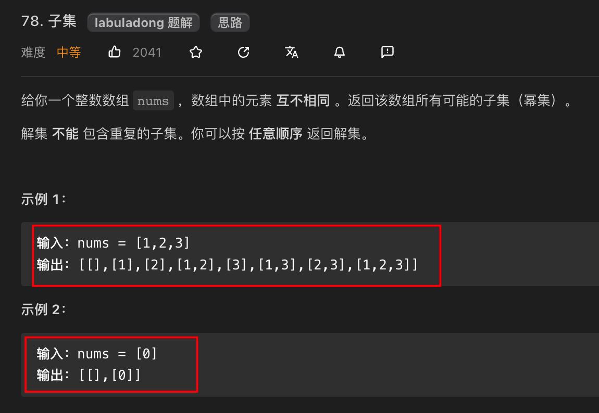

- 元素互不相同
- 子集不可重复：我们通过保证元素之间的`相对顺序`不变来防止出现重复的子集

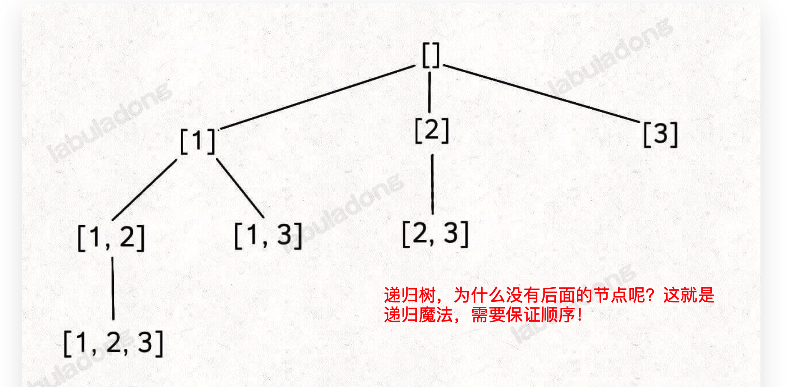
代码如下：
```javascript
/**
 * @param {number[]} nums
 * @return {number[][]}
 */
var subsets = function (nums) {
    // 用于存储结果
    const res = [];
    // 用于记录回溯路径
    const track = [];
    /**
     * 回溯算法的核心函数，用于遍历子集问题的回溯树
     * @param {number} start - 控制树枝的遍历，避免产生重复子集
     */
    const backtrack = (start) => {
        // 前序遍历位置，每个节点的值都是一个子集
        res.push([...track]); // 这里需要浅拷贝才行
        // ::::其实这里可以不用判断，因为for循环的条件已经限制了i的取值范围
        // ::::这里加上是为了方便理解 【回溯算法的框架】
        if (start === nums.length) return;
        // 回溯算法标准框架
        for (let i = start; i < nums.length; i++) {
            // 做选择
            track.push(nums[i]);
            // 回溯遍历下一层节点
            backtrack(i + 1);
            // 撤销选择
            track.pop();
        }
    };
    backtrack(0);
    return res;
};

console.log(subsets([1, 2, 3]));
console.log(subsets([1, 2, 3, 4]));

```

## 第 77 题「 组合 」
[https://leetcode.cn/problems/combinations/](https://leetcode.cn/problems/combinations/)
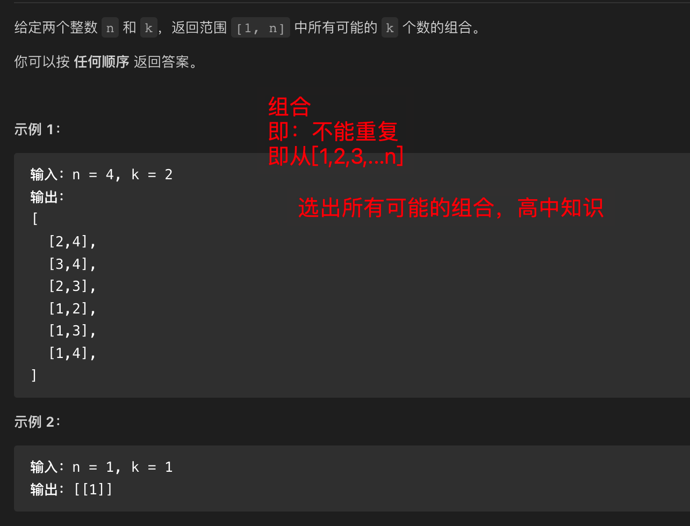
给你输入一个数组 `nums = [1,2..,n]` 和一个正整数 `k`，请你生成所有`大小为 k 的子集` ，是不是 就是 [[#第 78 题「 子集」]] 的一种特殊场景而已。所以两种思路：

### 思路 1：
复用  [[#第 78 题「 子集」]] 的代码，最终返回结果 `再过滤长度=k` 的子集不就行了嘛？

### 思路 2：
修改 `base case` ，代码如下：
```javascript
/**
 * @param {number} n 
 * @param {number} k 
 * @return {number[][]} 
 */
var combine = function(n, k) {
    const res = [];
    const track = [];
    // 主函数
    function backtrack(start, n, k) {
        // base case
        if (k === track.length) {
            // 遍历到了第 k 层，收集当前节点的值
            res.push([...track]);
            return;
        }
        // 回溯算法标准框架
        for (let i = start; i <= n; i++) {
            // 选择
            track.push(i);
            // 通过 start 参数控制树枝的遍历，避免产生重复的子集
            backtrack(i + 1, n, k);
            // 撤销选择
            track.pop();
        }
    }
    backtrack(1, n, k);
    return res;
};
```


## 第 90 题「 子集 II 」
[https://leetcode.cn/problems/subsets-ii/](https://leetcode.cn/problems/subsets-ii/)
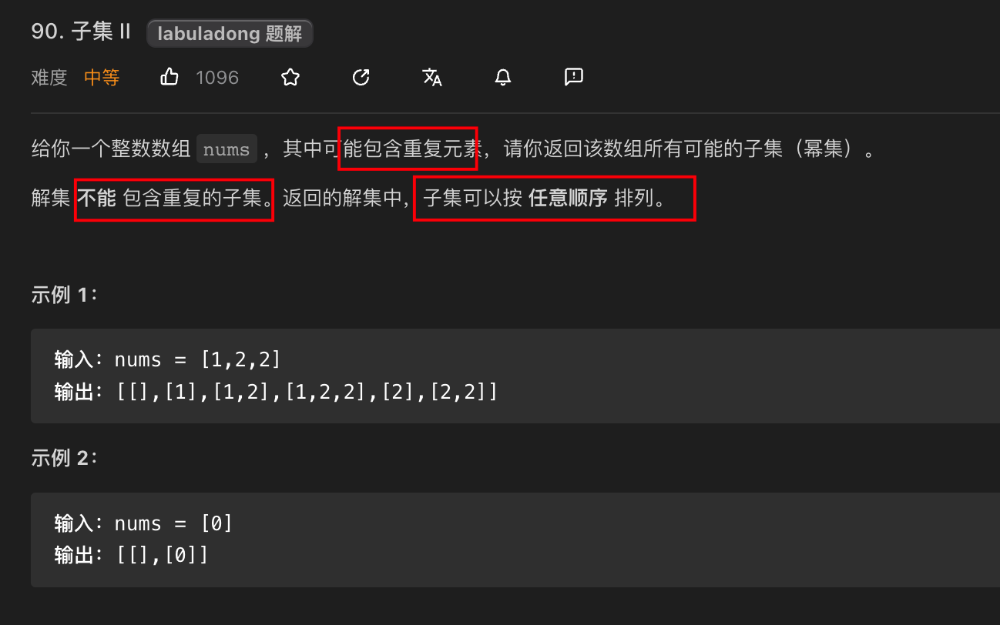
相较于 [[#第 78 题「 子集 」]] 主要区别在于：

- 可能有重复元素
- 但子集中不能含有重复元素

所以，`先排序`，让相同的元素靠在一起，如果发现 `nums[i] == nums[i-1]`，则跳过，所以简单改下 [[#第 78 题「 子集 」]]  的代码，即可，如下：
```javascript
var subsetsWithDup = function(nums) {
    // 定义结果数组和回溯时的路径数组
    let res = [];
    let track = [];
    // 排序，以便于剪枝算法的实现
    nums.sort((a, b) => a - b);
    // 回溯算法
    const backtrack = (nums, start) => {
        // 前序位置，每个节点的值都是一个子集
        res.push([...track]);
        // 遍历子集树枝
        for (let i = start; i < nums.length; i++) {
            // 剪枝逻辑，值相同的相邻树枝，只遍历第一条
            if (i > start && nums[i] === nums[i - 1]) {
                continue;****
            }
            // 选择当前元素，加入路径数组
            track.push(nums[i]);
            // 向子节点递归
            backtrack(nums, i + 1);
            // 回溯，撤销选择
            track.pop();
        }
    }
    backtrack(nums, 0);
    return res;
};

```

## 第 40 题「 组合总和 II」
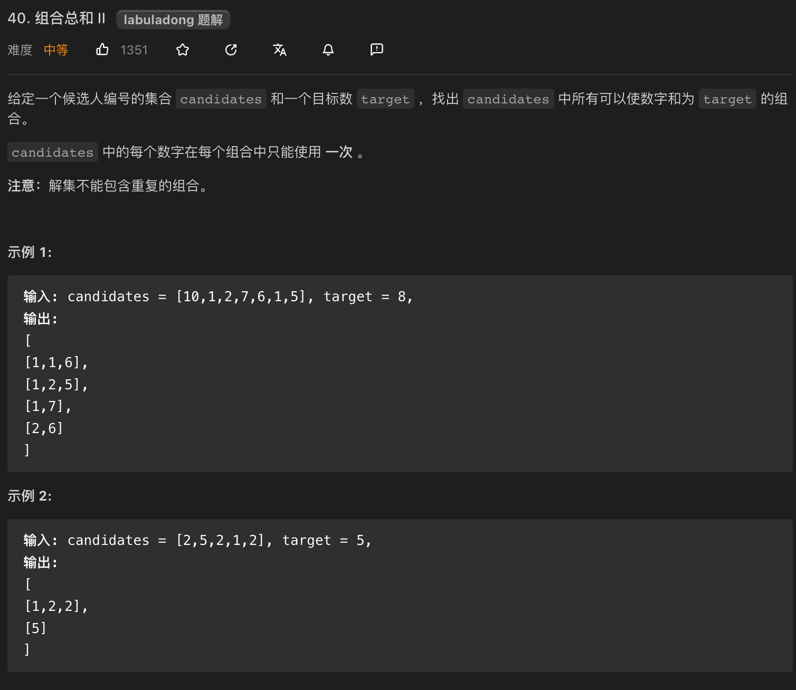

- 即，换种思路理解题解：从一个班中，找到体重和为 `1000kg` 的同学去，划船，因为船最大载重为 `1000 kg`
```javascript
/**
 * @param {number[]} candidates
 * @param {number} target
 * @return {number[][]}
 */
var combinationSum2 = function (candidates, target) {
    let res = [];
    let track = [];
    let trackSum = 0;
    let sortedCandidates = candidates.sort((a, b) => a - b); // 排序
    // 回溯函数
    const backtrack = (nums, start, target) => {
        // 达到目标和，找到符合条件的组合，记录结果
        if (trackSum === target) {
            res.push([...track]);
            return;
        }
        // 先剪枝，超过目标和，直接结束
        if (trackSum > target) {
            return;
        }
        // 回溯算法标准框架
        for (let i = start; i < nums.length; i++) {
            // 剪枝逻辑，值相同的树枝，只遍历第一条
            if (i > start && nums[i] === nums[i - 1]) {
                continue;
            }
            // 做选择
            track.push(nums[i]);
            trackSum += nums[i];
            // 递归遍历下一层回溯树
            backtrack(nums, i + 1, target);
            // 撤销选择
            track.pop();
            trackSum -= nums[i];
        }
    }
    backtrack(sortedCandidates, 0, target);
    return res;
};

```

> [!question]
很早很早以前刷过这题，那时候还不知道这叫 **回溯算法**，搞出来了还沾沾自喜？


## 第 47 题「 全排列 II」
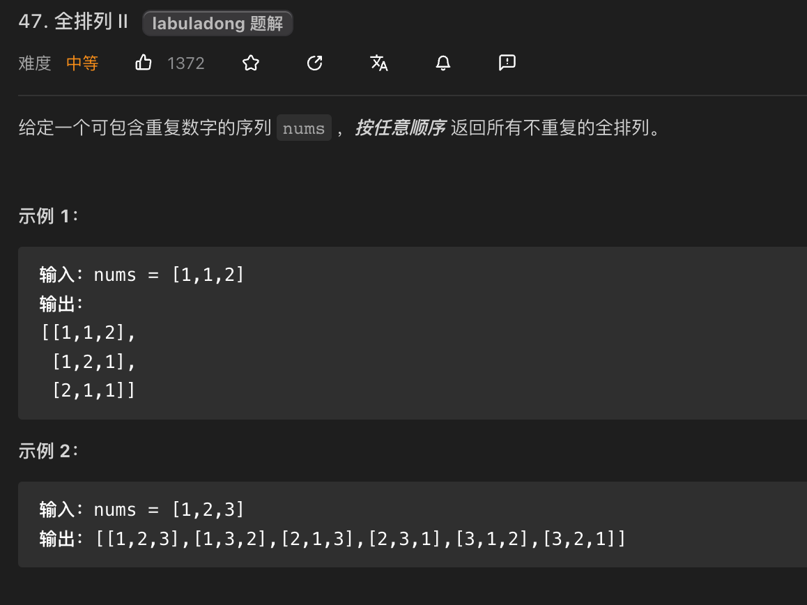
改题的可选数组可能`有重复`，我们来看看前面提到的  [[#第 46 题「 全排列」]]  `没有重复元素的场景` 
先看能否通过  [[#解法一：使用 ` Array.includes` 来判断是否选中过了]]  改造支持？ 代码如下：
```javascript
var permute = function (nums) {
    const len = nums.length;
    const res = []; // 结果集
    const options = []; // 选择列表
    function backtrack(options) {
        // 递归终止条件
        if (options.length === len) {
            return res.push(options)
        }
        for (let i = 0; i < len; i++) {
            // 已经选择过的数字不能再做选择
            if (!options.includes(nums[i])) {
                // 做选择
                options.push(nums[i]);
                backtrack([...options]);
                // 撤销选择
                options.pop()
            }
        }
    }
    backtrack(options)
    return res
};
```
能否通过上面的 `includes` 方法来判断，剪枝呢，答案是很麻烦，因为 `includes` 只是标识数组是否包含某个元素，元素重复时就会比较麻烦，所以还是使用 `used 数组`变量来标识是否被选中了，即参考  [[#解法二：使用 `used` 标识选择过的节点]] 的实现：代码如下
```javascript
var permute = function (nums) {
    const len = nums.length;
    const res = []; // 结果集
    const used = new Array(nums.length).fill(false); // 选择列表

    /**
     * @param {Array} track 已经选择的列表
     * */
    function backtrack(track) {
        // 递归终止条件
        if (track.length === len) {
            return res.push(track)
        }
        for (let i = 0; i < len; i++) {
            // 已经选择过的数字不能再做选择
            if(used[i]) continue;
            // 做选择
            track.push(nums[i]);
            used[i] = true;
            backtrack([...track]);
            // 撤销选择
            track.pop();
            used[i] = false;
        }
    }
    backtrack([]);
    return res
};

console.log(permute([1, 2, 3]));
console.log(permute([1, 2, 3, 4]));
```
这里需要`剪枝` , 代码如下：
```javascript
/**
 * @param {number[]} nums
 * @return {number[][]}
 */
var permuteUnique = function (nums) {
    const len = nums.length;
    const res = []; // 结果集
    const track = []; // 选择列表
    const used = new Array(len).fill(false); // 记录元素是否使用过
    // ::::排序，让相同的元素靠在一起,以便于剪枝算法的实现
    nums.sort((a, b) => a - b);
    
    function backtrack(track) {
        // 递归终止条件
        if (track.length === len) {
            return res.push([...track]);
        }
        for (let i = 0; i < len; i++) {
            // :::: 已经选择过的数字不能再做选择
            if (used[i]) {
                continue;
            }
            // :::: 两个元素相邻，并且还未选择前一个元素
            if (i > 0 && nums[i-1] === nums[i] && !used[i-1]) {
                // 如果前面的相邻相等元素没有用过，则跳过
                continue;
            }
            // 做选择
            track.push(nums[i]);
            used[i] = true;
            backtrack([...track]);
            // 撤销选择
            track.pop();
            used[i] = false;
        }
    }
    // 传入空数组，代表选择列表
    backtrack(track)
    return res
};

console.log(permuteUnique([1, 1, 2]));
console.log(permuteUnique([1, 3, 2]));

```
**分析：**
当出现重复元素时，比如输入  `nums = [1,2,2',2'']`，`2'` 只有在 `2` 已经被使用的情况下才会被选择，同理，`2''` 只有在 `2'` 已经被使用的情况下才会被选择，这就 `保证了相同元素在排列中的相对位置保证固定`。
> [!tip]
另外你会发现，**只要涉及到重复**，就得`对可选列表排序`


## 参考
[https://labuladong.github.io/algo/di-ling-zh-bfe1b/hui-su-sua-c26da/](https://labuladong.github.io/algo/di-ling-zh-bfe1b/hui-su-sua-c26da/)
[https://labuladong.github.io/algo/di-ling-zh-bfe1b/hui-su-sua-56e11/](https://labuladong.github.io/algo/di-ling-zh-bfe1b/hui-su-sua-56e11/)

<div class="liguwe-doc-footer" id="liguwe.site.blog-doc-footer">
            <div class="liguwe-doc-footer-edit-link">
                <p class="liguwe-doc-footer-p">
                    <svg t="1687912573060" class="icon" viewBox="0 0 1024 1024" version="1.1" xmlns="http://www.w3.org/2000/svg" p-id="1498">
                        <path d="M854.6 370.6c-9.9-39.4 9.9-102.2 73.4-124.4l-67.9-3.6s-25.7-90-143.6-98c-117.8-8.1-194.9-3-195-3 0.1 0 87.4 55.6 52.4 154.7-25.6 52.5-65.8 95.6-108.8 144.7-1.3 1.3-2.5 2.6-3.5 3.7C319.4 605 96 860 96 860c245.9 64.4 410.7-6.3 508.2-91.1 20.5-0.2 35.9-0.3 46.3-0.3 135.8 0 250.6-117.6 245.9-248.4-3.2-89.9-31.9-110.2-41.8-149.6z m-204.1 334c-10.6 0-26.2 0.1-46.8 0.3l-23.6 0.2-17.8 15.5c-47.1 41-104.4 71.5-171.4 87.6-52.5 12.6-110 16.2-172.7 9.6 18-20.5 36.5-41.6 55.4-63.1 92-104.6 173.8-197.5 236.9-268.5l1.4-1.4 1.3-1.5c4.1-4.6 20.6-23.3 24.7-28.1 9.7-11.1 17.3-19.9 24.5-28.6 30.7-36.7 52.2-67.8 69-102.2l1.6-3.3 1.2-3.4c13.7-38.8 15.4-76.9 6.2-112.8 22.5 0.7 46.5 1.9 71.7 3.6 33.3 2.3 55.5 12.9 71.1 29.2 5.8 6 10.2 12.5 13.4 18.7 1 2 1.7 3.6 2.3 5l5 17.7c-15.7 34.5-19.9 73.3-11.4 107.2 3 11.8 6.9 22.4 12.3 34.4 2.1 4.7 9.5 20.1 11 23.3 10.3 22.7 15.4 43 16.7 78.7 3.3 94.6-82.7 181.9-182 181.9z"
                              p-id="1499" ></path>
                    </svg>
                    <a href="https://www.yuque.com/liguwe/post/gi3twisq3b1337qz" target="_blank" class="liguwe-doc-footer-edit-link-a">
                        View this page on Yuque（语雀）
                    </a>
                </p>
                <p class="liguwe-doc-footer-p">
                    <svg t="1687913054251" class="icon" viewBox="0 0 1024 1024" version="1.1" xmlns="http://www.w3.org/2000/svg" p-id="5173"><path d="M853.333333 501.333333c-17.066667 0-32 14.933333-32 32v320c0 6.4-4.266667 10.666667-10.666666 10.666667H170.666667c-6.4 0-10.666667-4.266667-10.666667-10.666667V213.333333c0-6.4 4.266667-10.666667 10.666667-10.666666h320c17.066667 0 32-14.933333 32-32s-14.933333-32-32-32H170.666667c-40.533333 0-74.666667 34.133333-74.666667 74.666666v640c0 40.533333 34.133333 74.666667 74.666667 74.666667h640c40.533333 0 74.666667-34.133333 74.666666-74.666667V533.333333c0-17.066667-14.933333-32-32-32z"  p-id="5174"></path><path d="M405.333333 484.266667l-32 125.866666c-2.133333 10.666667 0 23.466667 8.533334 29.866667 6.4 6.4 14.933333 8.533333 23.466666 8.533333h8.533334l125.866666-32c6.4-2.133333 10.666667-4.266667 14.933334-8.533333l300.8-300.8c38.4-38.4 38.4-102.4 0-140.8-38.4-38.4-102.4-38.4-140.8 0L413.866667 469.333333c-4.266667 4.266667-6.4 8.533333-8.533334 14.933334z m59.733334 23.466666L761.6 213.333333c12.8-12.8 36.266667-12.8 49.066667 0 12.8 12.8 12.8 36.266667 0 49.066667L516.266667 558.933333l-66.133334 17.066667 14.933334-68.266667z"  p-id="5175"></path></svg>
                    <a href="https://github.com/liguwe/liguwe.github.io/blob/master/post/gi3twisq3b1337qz.md" target="_blank" class="liguwe-doc-footer-edit-link-a">Edit this page on Github</a>
                </p>
            </div>
            <div id="liguwe-comment"></div></div>