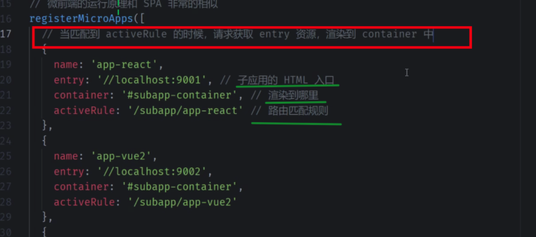
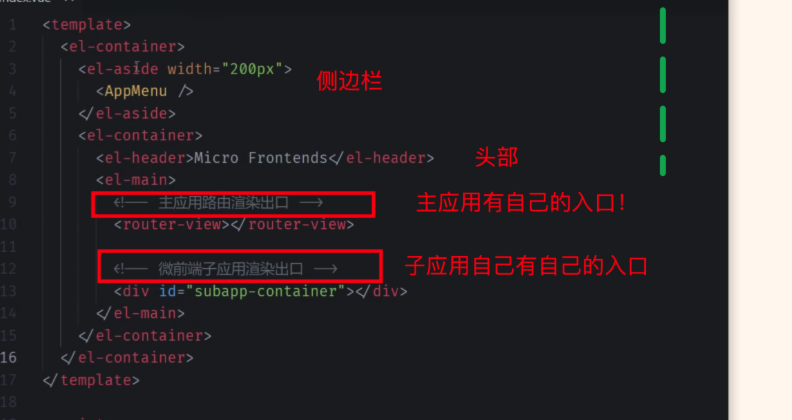

---

## updateAt: 2023.04.22
category: 前端
done: false
#前端 #微前端

有一个基座应用（主应用），来管理各个子应用的加载和卸载
微前端的核心三大原则就是：独立运行、独立部署、独立开发
从`single-spa`  到 `qiankun`
基于 WebComponent   的 micro-app
webpack5 实现的 Module Federation 

## single-spa 原理
总结：
详见  : [single-spa 的加载流程及使用示例](https://www.figma.com/file/9ykLrmg5xwkZvY8cxFinog/0022%E7%AF%87%EF%BC%9A%E5%B8%B8%E8%A7%81%E7%9A%84%E5%BE%AE%E5%89%8D%E7%AB%AF%E6%96%B9%E6%A1%88%E3%80%81%E5%8F%8A%E5%BE%AE%E5%89%8D%E7%AB%AF%E7%9A%84%E5%8E%9F%E7%90%86%E8%A7%A3%E6%9E%90?type=whiteboard&node-id=205-372&t=vvZ8xgbzUKAyFOdq-11)

## 乾坤微前端的实现原理
基座应用里，需要做一下几件事情：

- ① **负责注册子应用**，示例如下
  
  渲染子应用应放到**自己的入口**处，如下是主应用自己的 `layout 模板`
  
  ②  **基座里，需要监听全局路由，然后找到匹配子应用，然后加载子应用，再然后卸载或切换等**
   - fetch 子应用的入口文件 `index.html` ，然后需要抽取 js , eval 执行它
      - 所以，需要处理成兼容的 umd 格式，故需要修改 webpack
      - fetch 所以要求同域
      - 执行完子应用的脚本后，需要挂载 `#app` 上，但可能会直接覆盖丢主应用；所以才会要求子应用有 自己的 `container` 属性，这也是为什么建议子应用 name/id 唯一；
      - 图片路径可能 404，所以需要注入正确的子应用 public path
      - 两个子应用相互跳转时，如果不及时卸载，可能会出现两个子应用**同时展示**的情况
   - 关于**样式隔离**，两种方案
      - 命名空间，类似于vue style scopt
      - webcomponet 方案

>  关于乾坤微前端一些实际经验和答疑分析，实际使用时建议阅读 : [https://www.yuque.com/kuitos/gky7yw/gesexv](https://www.yuque.com/kuitos/gky7yw/gesexv)

微前端的几种实现方式：

- `iframe`内嵌
- fetch api 获取 HTML，`js`部分 `eval` 运行，css和HTML部分`append`到`基座留下的占位`

微前端也会考验前端基础设施的，所有如果传统的公司慎重考虑

## 个人之前总结微前端知识：

- [Figma](https://www.figma.com/file/9ykLrmg5xwkZvY8cxFinog/%E5%BE%AE%E5%89%8D%E7%AB%AF?node-id=0-1&t=WP1zZkfOuyDzk6rU-11)
