## createAt: 2023-12-23 15:17:13
updateAt: 2023-12-23
category: 算法
private: true
done: false
tags:
#算法/链表


## 第 1 题：合并两个有序单链表
[https://leetcode.cn/problems/merge-two-sorted-lists/](https://leetcode.cn/problems/merge-two-sorted-lists/)
**仔细重复的** 看下面的`动图`，有`6个`变量

- `l1` 代表链表 `list1` 
- `p1`  指针指向 链表 `list1` 
- `l2`  代表链表 `list2`
- `p2` 指针指向链表 `list2` 
- `dummy 节点`  , 「虚拟头结点」
- `p` 指针指向 虚拟头结点


```javascript
/**
 * Definition for singly-linked list.
 * function ListNode(val, next) {
 *     this.val = (val===undefined ? 0 : val)
 *     this.next = (next===undefined ? null : next)
 * }
 */
/**
 * @param {ListNode} list1
 * @param {ListNode} list2
 * @return {ListNode}
 */
var mergeTwoLists = function (list1, list2) {
    let p1 = list1;
    let p2 = list2;
    let d = new ListNode(0);
    let p = d;
    // while (p1 && p2) {
    // 下面这种while会开快一些，不涉及到自动转化
    while (p1 != null && p2 != null) {
        if (p1.val < p2.val) {
            p.next = p1;
            p1 = p1.next;
        } else {
            p.next = p2;
            p2 = p2.next;
        }
        p = p.next;
    }
    // 剩余的直接放在尾部即可
    if (p1 !== null) {
        p.next = p1;
    }
    if (p2 !== null) {
        p.next = p2;
    }
    return d.next;

};

```
上面 `while 条件`  的两种写法还是会有性能差异的，如下图：
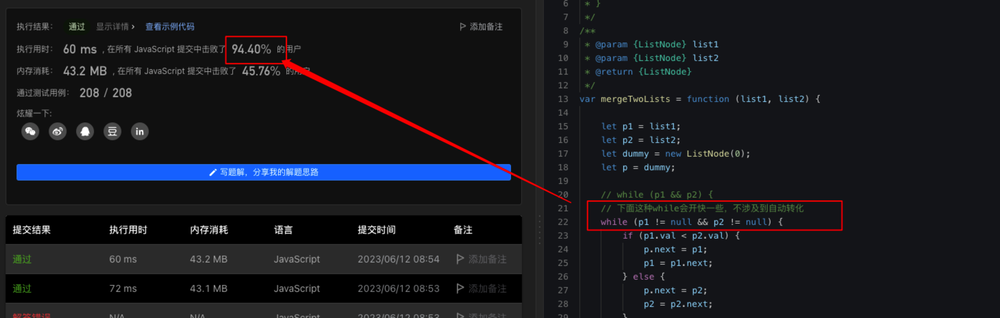


## 「虚拟头结点」技巧
`dummy` 节点，其实就是一个`占位符` ，有了它，方便处理 `p` 为空指针的场景
什么时候需要用虚拟头结点？
**当你需要创造一条新链表的时候，可以使用虚拟头结点简化边界情况的处理。**，比如 [[#第 1 题：合并两个有序单链表]] 中 是不是需要创建一个`新的链表`
> [!info]
以后虚拟头结点都使用 变量 `d` 代替，方便 code


## 第 2 题：分隔链表
[https://leetcode.cn/problems/partition-list/](https://leetcode.cn/problems/partition-list/)
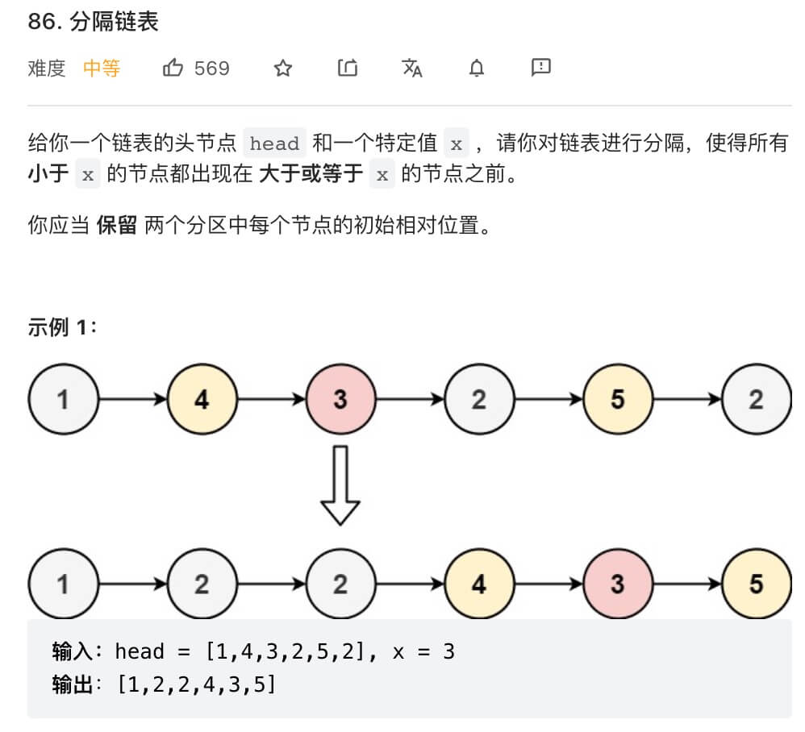
**分析：**
原链表分成`两个小链表`，一个链表中的元素大小都小于 `x`，另一个链表中的元素都大于等于 `x`，最后再把这两条链表接到一起
**要点分析：**

- 两个虚拟头结点 `dummy1 和 dummy2`，分别用于存储大于和小于  `x` 的节点，并使用两个指针 `p1`  `p2` ，并指向它对应的虚拟头结点
- `p` 指向`原链表` ，并且每次` while` 循环都更新 `p`  (一定要注意断开每个节点的 `next` 指针)
- 最后，连接两个 虚拟头结点，返回 `dummy1.next`

```javascript
var partition = function (head, x) {
    // 存放小于 x 的链表的虚拟头结点
    var dummy1 = new ListNode(-1);
    // 存放大于等于 x 的链表的虚拟头结点
    var dummy2 = new ListNode(-1);
    
    // p1, p2 指针负责生成结果链表
    var p1 = dummy1, p2 = dummy2;
    // p 负责遍历原链表，类似合并两个有序链表的逻辑
    // 这里是将一个链表分解成两个链表
    var p = head;
    while (p !== null) {
        if (p.val >= x) {
            p2.next = p;
            p2 = p2.next;
        } else {
            p1.next = p;
            p1 = p1.next;
        }

    // 原链表的指针不断前进 
    // p = p.next;
    
    ////////// ==============>

        // 断开原链表中的每个节点的 next 指针
        var temp = p.next;
        p.next = null;
        p = temp;
    }

    
    // 连接两个链表
    p1.next = dummy2.next;
    return dummy1.next;
}

```

### 踩过的坑
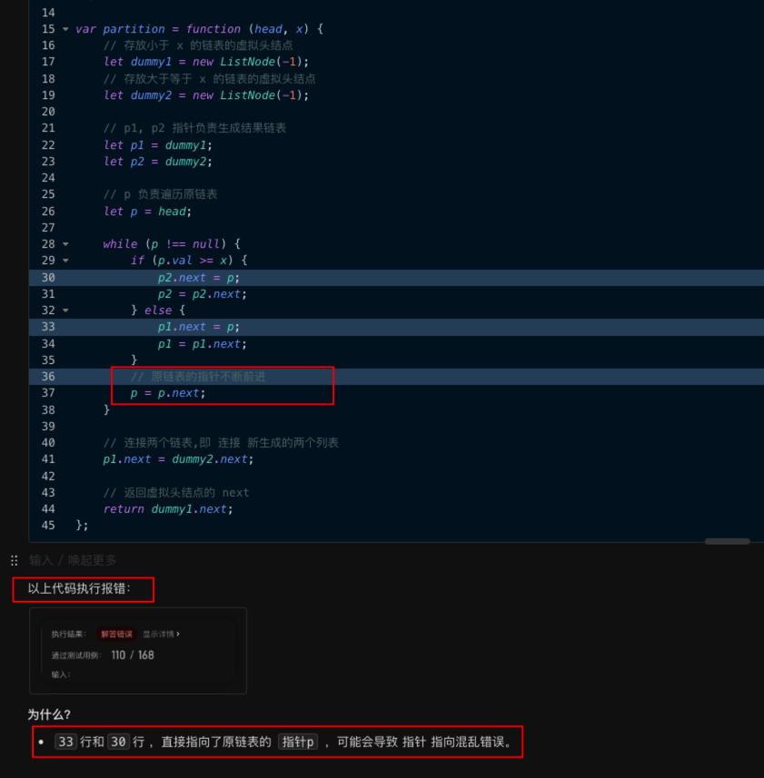

#### 解决方法 1
断开原链表中的每个节点的 `next` 指针 ，具体代码如上

#### 解决方法 2


## 第 3 题：合并 k 个有序链表@TODO
[https://leetcode.cn/problems/merge-k-sorted-lists/](https://leetcode.cn/problems/merge-k-sorted-lists/)

### 题目
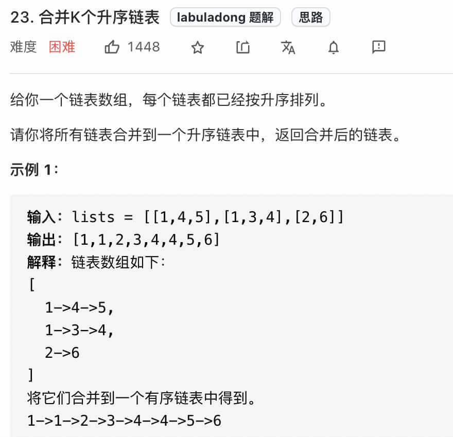

### 看代码
```javascript
/**
 * Definition for singly-linked list.
 * function ListNode(val, next) {
 *     this.val = (val===undefined ? 0 : val)
 *     this.next = (next===undefined ? null : next)
 * }
 */

/**
 * @param {ListNode[]} lists
 * @return {ListNode}
 * 分析:
 * 1、关键是 优先级队列的 【入队函数】的实现
 * 2、优先级队列的【权重】就是单链表Node节点的val值
 *
 */
var mergeKLists = function (lists) {
    if (lists.length === 0) {
        return null
    }
    // 虚拟头结点
    let dummy = new ListNode(-1);
    // 指针指向 虚拟头结点 , 用于移动
    let p = dummy;
    // 优先级队列，值最小的先入队，即优先级最高
    let q = [];
    // 优先队列的【入队函数】，值最小的先入队列
    let enqueue = (node) => {
        if (q.length === 0) {
            q.push(node);
        } else {
            // 是否插入了
            let added = false;
            for (let i = 0; i < q.length; i++) {
                if (node.val < q[i].val) {
                    q.splice(i, 0, node)
                    added = true;
                    break;
                }
            }
            // 没找到合适的插入位置，则添加到末尾
            if (!added) {
                q.push(node);
            }
        }
    }
    // 遍历lists , 入队链表数组的每个元素
    for (let i = 0; i < lists.length; i++) {
        if (lists[i] !== null) {
            enqueue(lists[i])
        }
    }
    // 优先级队列有值，则继续遍历
    while (q.length !== 0) {
        // 取出 优先级队列里的第一个
        let node = q.shift();
        // p指针指向 把取出的节点
        p.next = node;
        // 检测node.next 否则，重新入队
        if (node.next !== null) {
            // ::::关键
            enqueue(node.next);
        }
        // p 指针不断前进
        p = p.next;
    }
    return dummy.next;
};

```

### 时间复杂度分析
> [!todo]
 复杂度，没弄明白，再研究！

分析：`q` 代表优先级队列，假设所有节点都会入队，所以 q 的长度为上限为 `N`
这个算法复杂度，没弄明白？ 因为并不是自己实现了
> 算法整体的时间复杂度是 `O(Nlogk)`
> - 其中 `k` 是 **链表的条数**，即有几个链表，即 提设中，`lists` 的长度
> - `N` 是 **这些链表的节点总数**。

> [!question]
这个题，并没有双指针，就是单指针


## 第 4 题：删除链表的倒数第 N 个结点
[https://leetcode.cn/problems/remove-nth-node-from-end-of-list/](https://leetcode.cn/problems/remove-nth-node-from-end-of-list/)

### 先找到单链表的倒数第 k 个节点
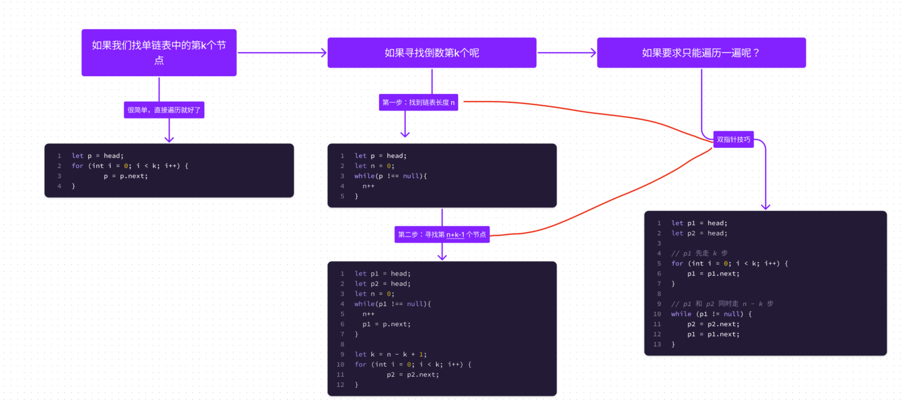
代码如下：
```javascript
/**
 * @param {ListNode} head
 * @param {number} n
 * @return {ListNode}
 */
var removeNthFromEnd = function (head, n) {
    // 使用了虚拟头结点的技巧，也是为了防止出现空指针的情况，见备注
    let dummy = new ListNode(-1);
    // 第一步，使用双指针 先找到 倒数第 n 个节点
    let p1 = head;
    let p2 = dummy;
    p2.next = head;

    // p1 先走 n 步
    for (let i = 0; i < n; i++) {
        p1 = p1.next;
    }
    // p1 和 p2 同时走 k 步
    while (p1 != null) {
        p2 = p2.next;
        p1 = p1.next;
    }

    // 这个时候找到了
    
    // 删掉倒数第 n 个节点
    p2.next = p2.next.next;

    return dummy.next;
};

```
>  使用了`虚拟头结点`的技巧，也是为了防止出现空指针的情况，比如说链表总共有 5 个节点，题目就让你删除倒数第 5 个节点，也就是第一个节点，那按照算法逻辑，应该首先找到倒数第 6 个节点。但第一个节点前面已经没有节点了，这就会出错。


## 第 5 题：单链表的中点
[https://leetcode.cn/problems/middle-of-the-linked-list/](https://leetcode.cn/problems/middle-of-the-linked-list/)

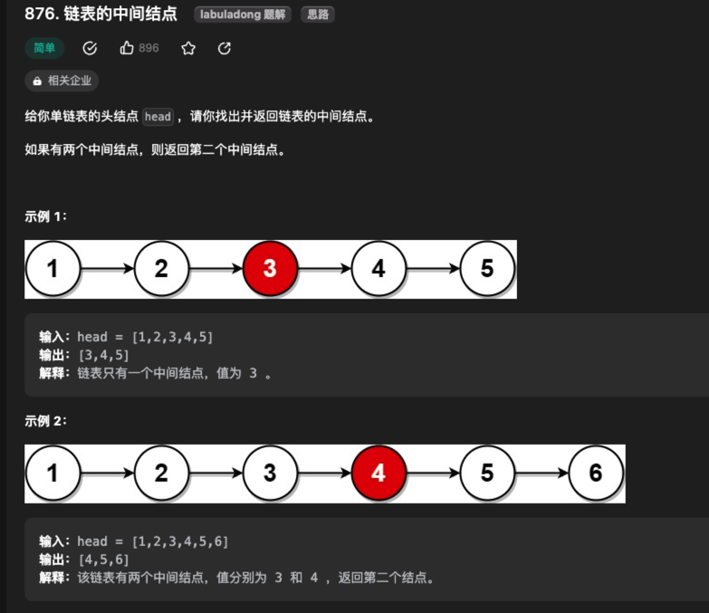


### 使用快慢指针
```javascript
/**
 * @param {ListNode} head
 * @return {ListNode}
 */
var middleNode = function (head) {
    let slow = head;
    let fast = head;

    // 需要判断fast.next.next 是否存在
    while (fast !== null && fast.next !== null) {
        slow = slow.next;
        fast = fast.next.next;
    }
    return slow;
};
```
>  注：需要注意的是，如果链表长度为`偶数`，也就是说中点有两个的时候，我们这个解法返回的节点是`靠后的那个节点`。


## 第 6 题：判断链表是否包含环
每当`慢指针 slow` 前进一步，`快指针 fast` 就前进两步。

- 如果 `fast` 最终遇到空指针，说明链表中没有环；
- 如果 `fast` 最终和 slow `相遇`，那肯定是 `fast` 超过了 `slow` 一圈，说明链表中含有环。

代码如下：
```javascript
function hasCycle(head) {
    // 快慢指针初始化指向 head
    var slow = head, fast = head;
    // 快指针走到末尾时停止
    while (fast != null && fast.next != null) {
        // 慢指针走一步，快指针走两步
        slow = slow.next;
        fast = fast.next.next;
        // 快慢指针相遇，说明含有环
        if (slow == fast) {
            return true;
        }
    }
    // 不包含环
    return false;
}
```

> [!NOTE]
疑问❓
不会死循环嘛？比如这是一个循环列表 → 最终是会相遇的，如何相遇？ 理解成学校操场 400m 场地跑步，一个跑的快，一个跑得慢。**所以，最终还是会追上的** 


## 第 7 题：环形链表 II
[https://leetcode.cn/problems/linked-list-cycle-ii/](https://leetcode.cn/problems/linked-list-cycle-ii/)
如果已经已知 链表中含有环，如何计算这个`环的起点`？
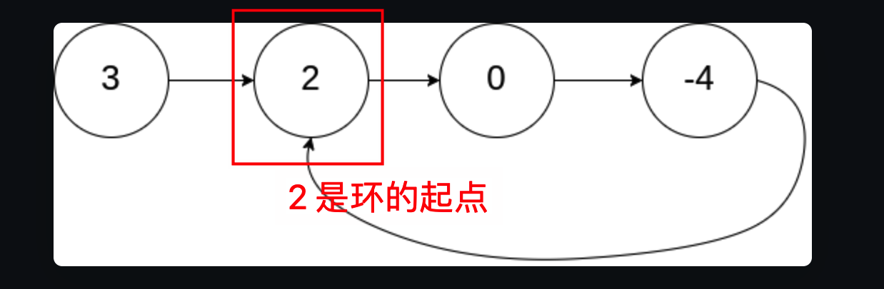

### 先说结论
当`快慢指针`相遇时，让其中任一个指针指向`头节点`，然后让它俩以`相同速度`前进，`再次相遇时`所在的节点位置就是环开始的位置

### 结论的推导过程
假设**快慢指针相遇**时，慢指针 `slow` 走了 `k` 步，那么快指针 `fast` 一定走了 `2k` 步，且 ==K 一定是环长度的整数倍==，如下图：
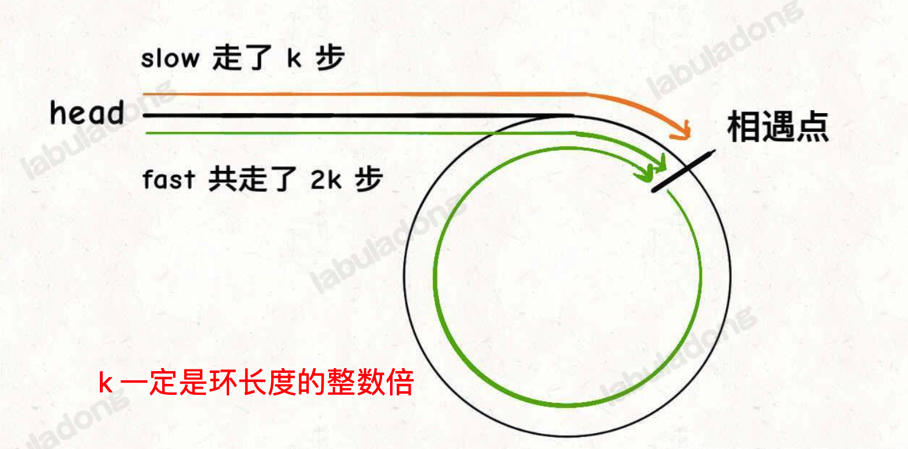
再假设相遇点距环的起点的距离为 `m` ， 那么结合上图的 `slow` 指针，环的起点距`头结点 head` 的距离为 `k - m`，也就是说如果从 `head` 前进 `k - m` 步就能到 达`环起点`。
巧的是，如果从`相遇点`继续前进 `k - m` 步，也恰好到达`环起点`。因为结合上图的 fast 指针，从相遇点开始走k步可以转回到相遇点，那走 k - m 步肯定就走到环起点了
所以，只要我们把快慢指针中的任一个重新指向 `head`，然后两个指针**同速前进**，`k - m` 步后一定会相遇，相遇之处就是环的起点了。
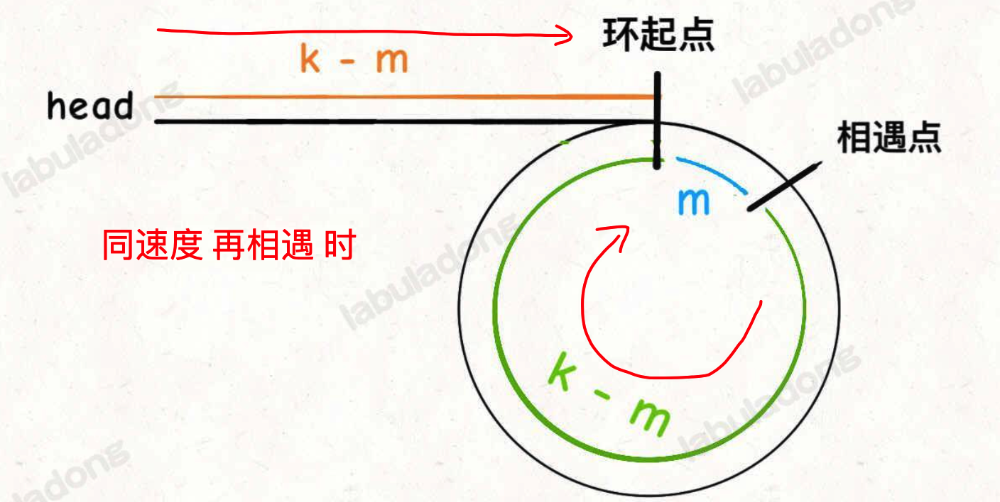

### 代码
```javascript
var detectCycle = function (head) {
    var fast, slow;
    fast = slow = head;
    //// ::::第一步： 相遇时，即相遇点，
    while (fast != null && fast.next != null) {
        fast = fast.next.next;
        slow = slow.next;
        if (fast === slow) break;
    }
    // 上面的代码类似 hasCycle 函数
    if (fast == null || fast.next == null) {
        // fast 遇到空指针说明没有环
        return null;
    }
    // ::::第二步：在相遇点，重新同速度前进
    
    // 重新指向头结点
    slow = head;
    // 快慢指针同步前进，相交点就是环起点
    while (slow !== fast) {
        fast = fast.next;
        slow = slow.next;
    }
    return slow;
};
```

## 第 8 题：两个链表是否相交
[https://leetcode.cn/problems/intersection-of-two-linked-lists/](https://leetcode.cn/problems/intersection-of-two-linked-lists/)
如下面，相交，所以返回 `c1`
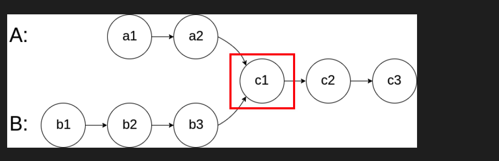
又如下面，返回，`8`
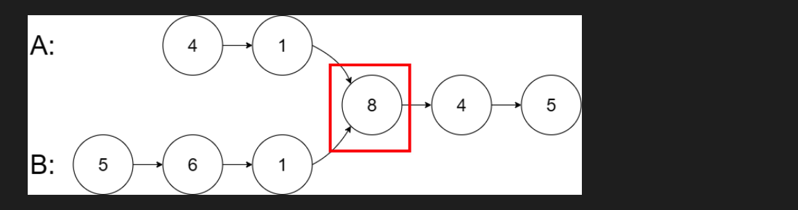

### 思路 1
通过 `hash` 来判断出现过的次数，如果出现过两次，则说明相交了，但空间复杂度略高，需要额外的空间。即空间复杂度为 `O(m+n)`

### 思路 2
关键点在于，拼接，哪个先遍历完，指针指向另外一个
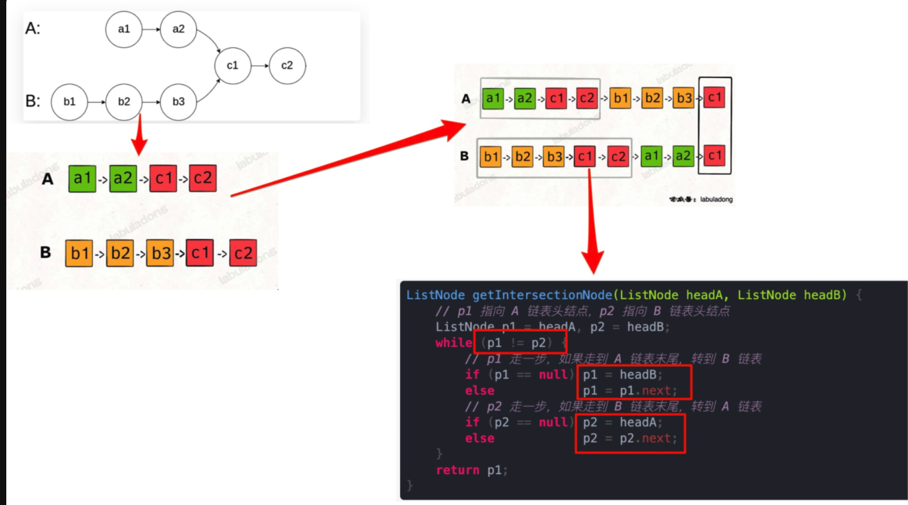

空间复杂度为 `O(1)`，时间复杂度为 `O(N)`

### 代码
```javascript
var getIntersectionNode = function (headA, headB) {
    // 都指向各自的头结点
    let p1 = headA;
    let p2 = headB;
    while (p1 !== p2) {
        if (p1 === null) {
            p1 = headB;
        } else {
            p1 = p1.next;
        }
        if (p2 === null) {
            p2 = headA;
        } else {
            p2 = p2.next;
        }
    }
    return p1;
};

```

### 疑问
那你可能会问，如果说**两个链表没有相交点**，是否能够正确的返回 `null` 呢？
这个逻辑可以覆盖这种情况的，相当于 c1 节点是  `null空指针`，可以正确返回 null


## 参考
[https://labuladong.github.io/algo/di-yi-zhan-da78c/shou-ba-sh-8f30d/shuang-zhi-0f7cc/#%E4%B8%A4%E4%B8%AA%E9%93%BE%E8%A1%A8%E6%98%AF%E5%90%A6%E7%9B%B8%E4%BA%A4](https://labuladong.github.io/algo/di-yi-zhan-da78c/shou-ba-sh-8f30d/shuang-zhi-0f7cc/#%E4%B8%A4%E4%B8%AA%E9%93%BE%E8%A1%A8%E6%98%AF%E5%90%A6%E7%9B%B8%E4%BA%A4)

<div class="liguwe-doc-footer" id="liguwe.site.blog-doc-footer">
            <div class="liguwe-doc-footer-edit-link">
                <p class="liguwe-doc-footer-p">
                    <svg t="1687912573060" class="icon" viewBox="0 0 1024 1024" version="1.1" xmlns="http://www.w3.org/2000/svg" p-id="1498">
                        <path d="M854.6 370.6c-9.9-39.4 9.9-102.2 73.4-124.4l-67.9-3.6s-25.7-90-143.6-98c-117.8-8.1-194.9-3-195-3 0.1 0 87.4 55.6 52.4 154.7-25.6 52.5-65.8 95.6-108.8 144.7-1.3 1.3-2.5 2.6-3.5 3.7C319.4 605 96 860 96 860c245.9 64.4 410.7-6.3 508.2-91.1 20.5-0.2 35.9-0.3 46.3-0.3 135.8 0 250.6-117.6 245.9-248.4-3.2-89.9-31.9-110.2-41.8-149.6z m-204.1 334c-10.6 0-26.2 0.1-46.8 0.3l-23.6 0.2-17.8 15.5c-47.1 41-104.4 71.5-171.4 87.6-52.5 12.6-110 16.2-172.7 9.6 18-20.5 36.5-41.6 55.4-63.1 92-104.6 173.8-197.5 236.9-268.5l1.4-1.4 1.3-1.5c4.1-4.6 20.6-23.3 24.7-28.1 9.7-11.1 17.3-19.9 24.5-28.6 30.7-36.7 52.2-67.8 69-102.2l1.6-3.3 1.2-3.4c13.7-38.8 15.4-76.9 6.2-112.8 22.5 0.7 46.5 1.9 71.7 3.6 33.3 2.3 55.5 12.9 71.1 29.2 5.8 6 10.2 12.5 13.4 18.7 1 2 1.7 3.6 2.3 5l5 17.7c-15.7 34.5-19.9 73.3-11.4 107.2 3 11.8 6.9 22.4 12.3 34.4 2.1 4.7 9.5 20.1 11 23.3 10.3 22.7 15.4 43 16.7 78.7 3.3 94.6-82.7 181.9-182 181.9z"
                              p-id="1499" ></path>
                    </svg>
                    <a href="https://www.yuque.com/liguwe/post/yaz2vh30ea8p7x43" target="_blank" class="liguwe-doc-footer-edit-link-a">
                        View this page on Yuque（语雀）
                    </a>
                </p>
                <p class="liguwe-doc-footer-p">
                    <svg t="1687913054251" class="icon" viewBox="0 0 1024 1024" version="1.1" xmlns="http://www.w3.org/2000/svg" p-id="5173"><path d="M853.333333 501.333333c-17.066667 0-32 14.933333-32 32v320c0 6.4-4.266667 10.666667-10.666666 10.666667H170.666667c-6.4 0-10.666667-4.266667-10.666667-10.666667V213.333333c0-6.4 4.266667-10.666667 10.666667-10.666666h320c17.066667 0 32-14.933333 32-32s-14.933333-32-32-32H170.666667c-40.533333 0-74.666667 34.133333-74.666667 74.666666v640c0 40.533333 34.133333 74.666667 74.666667 74.666667h640c40.533333 0 74.666667-34.133333 74.666666-74.666667V533.333333c0-17.066667-14.933333-32-32-32z"  p-id="5174"></path><path d="M405.333333 484.266667l-32 125.866666c-2.133333 10.666667 0 23.466667 8.533334 29.866667 6.4 6.4 14.933333 8.533333 23.466666 8.533333h8.533334l125.866666-32c6.4-2.133333 10.666667-4.266667 14.933334-8.533333l300.8-300.8c38.4-38.4 38.4-102.4 0-140.8-38.4-38.4-102.4-38.4-140.8 0L413.866667 469.333333c-4.266667 4.266667-6.4 8.533333-8.533334 14.933334z m59.733334 23.466666L761.6 213.333333c12.8-12.8 36.266667-12.8 49.066667 0 12.8 12.8 12.8 36.266667 0 49.066667L516.266667 558.933333l-66.133334 17.066667 14.933334-68.266667z"  p-id="5175"></path></svg>
                    <a href="https://github.com/liguwe/liguwe.github.io/blob/master/post/yaz2vh30ea8p7x43.md" target="_blank" class="liguwe-doc-footer-edit-link-a">Edit this page on Github</a>
                </p>
            </div>
            <div id="liguwe-comment"></div></div>