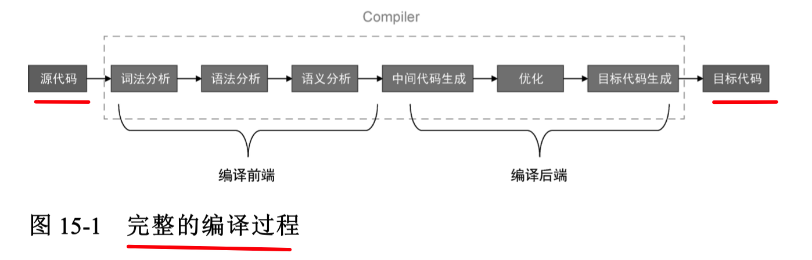
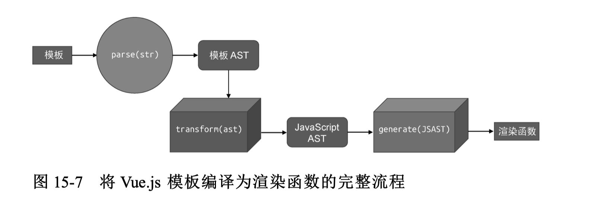

#vue #2023/06/24 

`Vue.js 的模板`和 `JSX`  都属于 `领域特定语言(DSL)`  
**编译器其实只是一段程序**，它用来将“一种语言 A”  `翻译成`  “另外一 种语言 B”。
完整的编译流程如下：

教科书式的编译模型如上，但 Vue 模板有所不同，如下：[[#Vue.js 模板编译为渲染函数的完整流程]]

## Vue.js 模板编译为渲染函数的 完整流程

其中，`str` 即为 `.vue文件`的内容，总结下就是：

1. `const templateAST = parse(template)`   , 生成 **模板 AST**
2. `const jsAST = transform(templateAST)`，生成 `JS AST 转换器`
3. `const code =  generate(jsAST)`，生成最终可执行的 **渲染函数**

详见 _fj_   [https://www.figma.com/file/yadsH3JL06697MH3uWxPXd/2023.06.LOG?type=whiteboard&node-id=25-165&t=7hpuSezXXG2VwuOu-4](https://www.figma.com/file/yadsH3JL06697MH3uWxPXd/2023.06.LOG?type=whiteboard&node-id=25-165&t=7hpuSezXXG2VwuOu-4)


## parser 的实现原理

### 第一步：词法分析
需要实现一个词法分析器 `tokenize`，使得 `tokenize(<div><p>Vue</p><p>Template</p></div>)` ,  可得到如下结果：
```json
[
    {
        "type": "tag",
        "name": "div"
    },
    {
        "type": "tag",
        "name": "p"
    },
    {
        "type": "text",
        "content": "Vue"
    },
    {
        "type": "tagEnd",
        "name": "p"
    },
    {
        "type": "tag",
        "name": "p"
    },
    {
        "type": "text",
        "content": "Template"
    },
    {
        "type": "tagEnd",
        "name": "p"
    },
    {
        "type": "tagEnd",
        "name": "div"
    }
]
```
**词法分析的过程就是，状态机在不同状态之间的迁移过程**。

### 第二步：将上面构造出的 token 列表转成 AST
即实现一个 `parse` 函数，将上面的 `token 列表`输出为如下结构，如下结构就是 `AST` 或者说是  `Vnode`
```json
{
    "type": "Root",
    "children": [
        {
            "type": "Element",
            "tag": "div",
            "children": [
                {
                    "type": "Element",
                    "tag": "p",
                    "children": [
                        {
                            "type": "Text",
                            "content": "Vue"
                        }
                    ]
                },
                {
                    "type": "Element",
                    "tag": "p",
                    "children": [
                        {
                            "type": "Text",
                            "content": "Template"
                        }
                    ]
                }
            ]
        }
    ]
}
```

### 最后
完成流程见： [https://www.figma.com/file/9busNTH6MZx5E6ZU8Xfahx/2023.07?type=whiteboard&node-id=6-49&t=IdGCzyhhvJYkysLf-4](https://www.figma.com/file/9busNTH6MZx5E6ZU8Xfahx/2023.07?type=whiteboard&node-id=6-49&t=IdGCzyhhvJYkysLf-4)
