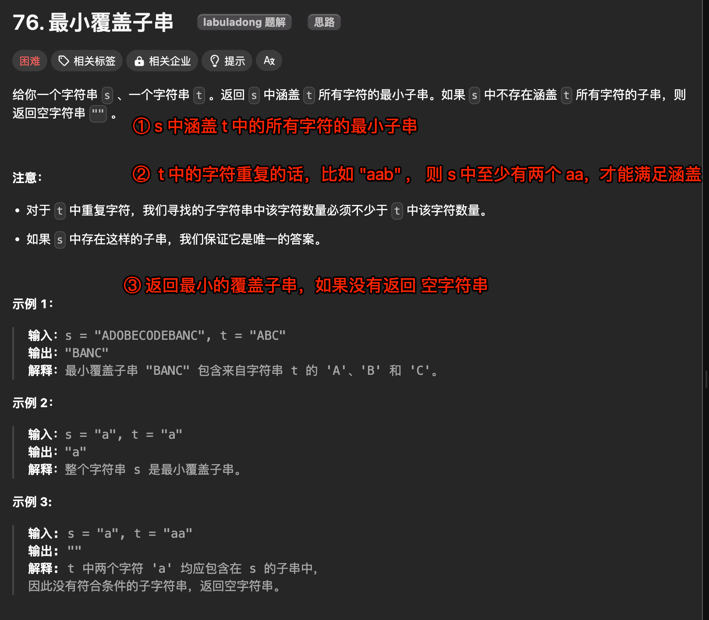

# 最小覆盖子串


`#leetcode`   `#2024/08/11`  `#算法/滑动窗口`  `#算法/双指针` 


## 目录
<!-- toc -->
 ## 1. 题目及理解 



## 2. 解题思路：滑动窗口

- 定义 7 个变量
	- 两个 Map：`need` 和 `window`
		- `need` 存储 `t` 中每个字符需要的数量
		- `window` 存储当前窗口中每个字符的数量
	- 两个指针 `left` 和 `right` ：用于定义滑动窗口
	-  `valid 变量`来记录当前窗口中**已经满足条件的字符数量**
	- `start` 和 `len` 记录最小覆盖子串的起始索引及长度
- 滑动窗口
	-  `右指针 right` 不断向右移动，**扩大窗口**，将字符加入 `window`。
	- 当 `valid === need` 时
		- 说明窗口中已经包含了 `t` 的所有字符，此时开始尝试**缩小窗口**
			- 当一个字符加入 window 后，如果它的数量与 need 中的数量相等，则 valid 加 1。
				- `左指针 left` 向右移动，缩小窗口，同时更新 window 和 valid。
				- 在每次找到可行解时，更新最小覆盖子串的`起始位置`和`长度`。
- 最后返回最小覆盖子串，如果没有找到，则返回空字符串。

## 3. 代码实现

```javascript hl:8,27,43
/**
 * @param {string} s
 * @param {string} t
 * @return {string}
 */
var minWindow = function (s, t) {
    /*************************************************
     * ::::① 第一步： 定义 7 个变量并初始化
     ************************************************/
        // 记录窗口所需要的字符及其个数
    const need = new Map();
    // 初始化 need
    for (const c of t) {
        need.set(c, (need.get(c) || 0) + 1);
    }
    // 记录当前窗口中的字符及其个数
    const window = new Map();
    // 双指针
    let left = 0;
    let right = 0;
    // 已经符合条件的字符个数
    let valid = 0;
    // 记录最小覆盖子串的起始索引及长度
    let start = 0;
    let len = Infinity;
    /*************************************************
     * :::::② 第二步：开始移动右指针，扩大窗口
     ************************************************/
    for (let i = 0; i < s.length; i++) {
        const c = s[i]; // c 是将移入窗口的字符
        right++;// 右移窗口
        // 如果 c 是所需字符，则更新窗口数据
        if (need.has(c)) {
            window.set(c, (window.get(c) || 0) + 1);
            // 如果 window 中字符 c 的数量达到 need 中字符 c 的数量，则 valid++
            // valid 表示窗口中满足 need 条件的字符个数，所以它是去重的
            // 例如 need 中有 2 个 a，window 中也有 2 个 a，那么 valid 只会加 1
            if (window.get(c) === need.get(c)) {
                valid++;
            }
        }
        /*************************************************
         * ::::③ 第三步：判断左侧窗口是否要收缩，条件是 valid === need.size
         ************************************************/
        while (valid === need.size) {
            // 这个时候满足条件，记录最小覆盖子串
            // 更新 start 和 len, 用于最后返回结果
            if (right - left < len) {
                start = left;
                len = right - left;
            }

            const d = s[left];// d 是将移出窗口的字符
            // 左移窗口
            left++;

            // 如果 d 是所需字符，同事需要更新窗口数据 和 valid 值
            if (need.has(d)) {
                if (window.get(d) === need.get(d)) {
                    valid--;
                }
                window.set(d, window.get(d) - 1);
            }
        }
    }
    return len === Infinity ? '' : s.substr(start, len);
};

```

### 3.1. 复杂度分析

- 时间复杂度是 `O(n)`，其中 n 是**字符串 s 的长度**。
- 空间复杂度是 `O(k)`，其中 k 是**字符集的大小**（在这个问题中，**k 最大为 52**，因为字母区分大小写）

