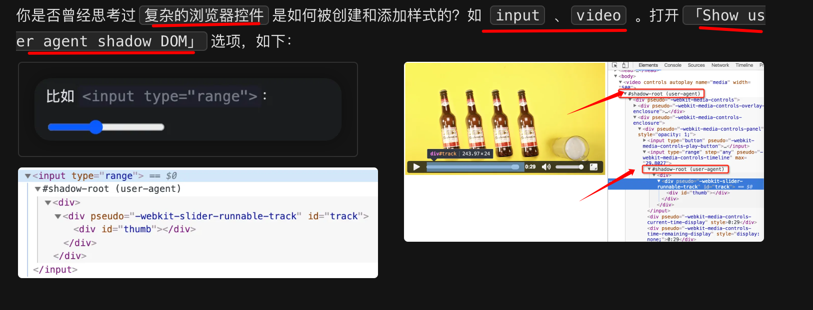
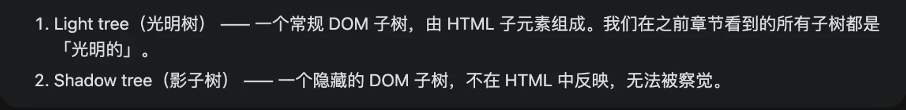
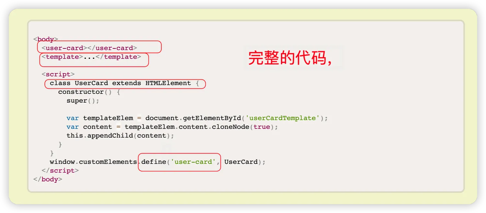
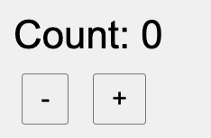
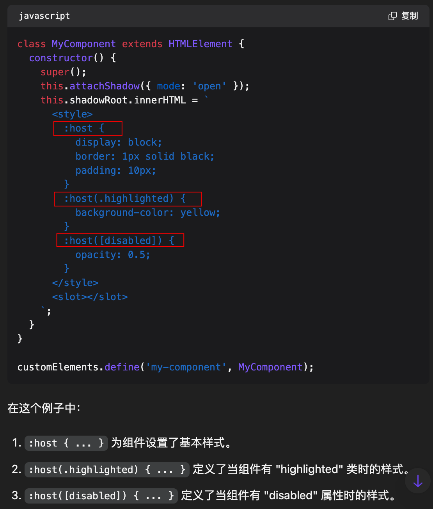
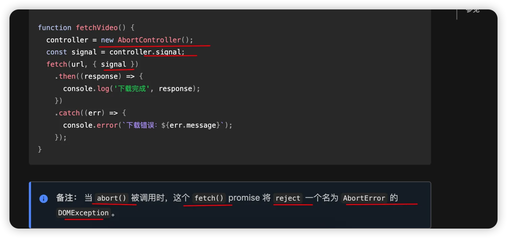

# 常见面试题三

`#前端面试` 


## 目录
<!-- toc -->
 ## 1. shadow dom  

### 1.1. 两种 DOM


所以，有两种 DOM，如下图：



### 1.2. 定义

Shadow DOM是Web Components标准的一个重要部分，它提供了一种封装和隔离Web组件的方法

### 1.3. 优势

- 样式隔离
- 性能优化，因为浏览器可以独立渲染更新他们
- 安全性：比如  `dom.attachShadow({mode: 'closed'})` ，外部 js 无法访问他们
- 封装性与可维护性

## 2. 聊聊 Web Component

> 它里面的，一些概念如`template` 与 `插槽slot` 影响如`Vue`类的框架

- `window.customElements.define()` 方法来自定义 `组件` ，下面是一个简单实现 `<user-card>`
	- 
		- 要点 1：`<template id="userCardTemplate"/>`
		- 要点 2：定义  `window.customElements.define('user-card',UserCard)`
		- 要点 3：定义 `UserCard`

Web Components 的核心特性：
- 自定义元素：创建新的 HTML 标签
- Shadow DOM：封装组件的内部结构和样式
- HTML 模板：定义组件的结构

### 2.1. 实现一个  custom-counter 



```html hl:17,15,36,34
<!doctype html>
<html lang="en">
    <head>
        <meta charset="UTF-8" />
        <meta name="viewport" content="width=device-width, initial-scale=1.0" />
        <title>Custom Counter Web Component</title>
    </head>
    <body>
        <custom-counter></custom-counter>
        <script>
            class CustomCounter extends HTMLElement {
                constructor() {
                    super();
                    this.count = 0;
                    this.attachShadow({ mode: "open" });
                }
                // connectedCallback是Web Components 生命周期中的一个关键钩子函数。
                // 它是自定义元素规范定义的四个生命周期回调之一
                // 另外三个是：connectedCallback、disconnectedCallback 和 adoptedCallback
                // 当自定义元素被移除时，disconnectedCallback 会被调用
                // 当自定义元素首次被插入到文档的 DOM 中时，connectedCallback 会被自动调用
                // 通常在这里进行一些初始化的操作，比如创建 shadow DOM、添加事件监听器等
                connectedCallback() {
                    this.render();
                    this.shadowRoot
                        .querySelector("#increment")
                        .addEventListener("click", () => this.increment());
                    this.shadowRoot
                        .querySelector("#decrement")
                        .addEventListener("click", () => this.decrement());
                }

                render() {
                    this.shadowRoot.innerHTML = `
								          <style>
								            :host {
								              display: block;
								              font-family: Arial, sans-serif;
								              background-color: `#f0f0f0;`
								              padding: 20px;
								              border-radius: 5px;
								            }
								            `#counter` {
								              font-size: 24px;
								              margin-bottom: 10px;
								            }
								            button {
								              font-size: 16px;
								              margin: 0 5px;
								              padding: 5px 10px;
								              cursor: pointer;
								            }
								          </style>
								          <div id="counter">Count: ${this.count}</div>
								          <button id="decrement">-</button>
								          <button id="increment">+</button>
								        `;
                }

                increment() {
                    this.count++;
                    this.updateCounter();
                }

                decrement() {
                    this.count--;
                    this.updateCounter();
                }

                updateCounter() {
                    this.shadowRoot.querySelector("#counter").textContent =
                        `Count: ${this.count}`;
                }
            }

            customElements.define("custom-counter", CustomCounter);
        </script>
    </body>
</html>


```

## 3. Web Components 定义组件样式时，`:host`的作用是？

`":host" 选择器`用于选择自定义元素本身，即**组件的根元素**



## 4. 使用 React Hooks 实现一个 useFetchData

> 和 vue 的 hooks 真的很像

```javascript  hl:16,28,37
// 使用 React Hooks 实现一个 useFetchData
// 在我们的业务中经常会遇到列表或者表格页面
// 需要支持翻页，加载更多，错误处理， loading 的功能。希望能够实现一个 Hook 来抽象这部分逻辑

function useFetchData() {
  const [data, setData] = useState([]);
  const [loading, setLoading] = useState(false);
  const [error, setError] = useState(null);
  // 这些参数适合都放到 options 里面
  const [page, setPage] = useState(1);
  const [total, setTotal] = useState(0);
  const [pageSize, setPageSize] = useState(10);
  const [reload, setReload] = useState(false);

  // 用于保存 ref 的引用
  const ref = useRef();
  // 用于保存 AbortController 的引用, 用于取消请求
  const abortControllerRef = useRef();

  function destroy() {
    ref.current = true;
    setData([]);
    setLoading(false);
    setError(null);
    
    setPage(1);
    setTotal(0);
    setPageSize(10);
    setReload(false);
    // 销毁时取消请求
    abortControllerRef.current && abortControllerRef.current.abort();
  }

  useEffect(() => {
    setLoading(true);

    // 保存 AbortController 的引用
    abortControllerRef.current = new AbortController();
    const { signal } = abortControllerRef.current;

    fetch(
      "https://api.example.com/data?page=" + page + "&pageSize=" + pageSize,
      { signal },
    )
      .then((res) => res.json())
      .then((res) => {
        setData(res.data);
        setTotal(res.total);
        setLoading(false);
      })
      .catch((err) => {
        setError(err);
        setLoading(false);
      })
      .finally(() => {
        setLoading(false);
      });

    return () => {
      destroy();
    };
  }, [page, pageSize, reload]);

  return {
    data,
    loading,
    error,
  };
}

export default useFetchData;

```

## 5. git merge 与 git rebase 有什么区别

- 提交历史
	- `git merge` 会保留历史记录
	-  `git rebase`  会合并记录，可以有**线性**的提交历史，能够所以会丢历史记录
- 我之前所在的团队都是禁用`git rebase`  的

## 6. 深拷贝与浅拷贝

### 6.1. 常见的浅拷贝方式

```javascript
function shadowCopy(obj) {
  const newObj = {};
  for (let prop in obj) {
    if (obj.hasOwnProperty(prop)) {
      newObj[prop] = obj[prop];
    }
  }
  return newObj;
}

Object.assign({}, {});

Array.prototype.slice();

Array.prototype.concat();

let a = [...b];
```

### 6.2. 深拷贝的简易实现

```javascript
function deepCopy(obj) {
  if (typeof obj !== "object") {
    return obj;
  }
  const newObj = Array.isArray(obj) ? [] : {};
  for (let key in obj) {
    newObj[key] = deepCopy(obj[key]);
  }
  return newObj;
}
```

### 6.3. 如何解决循环引用问题：WeakMap

```javascript hl:5,9,2
function deepCopy(obj, hash = new WeakMap()) {
  // 基本类型
  if (typeof obj !== "object") {
    return obj;
  }
  if (hash.has(obj)) {
    return hash.get(obj);
  }
  const newObj = Array.isArray(obj) ? [] : {};
  hash.set(obj, newObj);
  for (let key in obj) {
    newObj[key] = deepCopy(obj[key], hash);
  }
  return newObj;
}
```


### 6.4. 考虑其他类型

```javascript hl:15
// 考虑 RegExp、Date、Function、Symbol、Map、Set、WeakMap、WeakSet、Error、Promise、BigInt 等特殊对象
function deepCopy(obj, hash = new WeakMap()) {
  if (obj instanceof RegExp) return new RegExp(obj);
  if (obj instanceof Date) return new Date(obj);
  if (obj instanceof Function) return new Function(obj);
  if (obj instanceof Symbol) return new Symbol(obj);
  if (obj instanceof Map) return new Map(obj);
  if (obj instanceof Set) return new Set(obj);
  if (obj instanceof WeakMap) return new WeakMap(obj);
  if (obj instanceof WeakSet) return new WeakSet(obj);
  if (obj instanceof Error) return new Error(obj);
  if (obj instanceof Promise) return new Promise(obj);
  if (obj instanceof BigInt) return new BigInt(obj);

  // 基本类型
  if (typeof obj !== "object") {
    return obj;
  }
  if (hash.has(obj)) {
    return hash.get(obj);
  }
  const newObj = Array.isArray(obj) ? [] : {};
  hash.set(obj, newObj);
  for (let key in obj) {
    newObj[key] = deepCopy(obj[key], hash);
  }
  return newObj;
}
```

### 6.5. 上面的代码肯定有问题的，比如函数，symbol ， map 、set 等

```javascript
function deepCopy(obj, hash = new WeakMap()) {
  // 处理null和undefined
  if (obj === null || typeof obj === 'undefined') return obj;

  // 处理基本类型
  if (typeof obj !== "object" && typeof obj !== "function") {
    return obj;
  }

  // 处理已经复制过的对象（循环引用）
  if (hash.has(obj)) {
    return hash.get(obj);
  }

  // 处理特殊对象类型
  if (obj instanceof Date) return new Date(obj);
  if (obj instanceof RegExp) return new RegExp(obj);
  if (obj instanceof Error) return new Error(obj.message);

  // 处理函数
  if (typeof obj === 'function') {
    return function() {
      return obj.apply(this, arguments);
    };
  }

  // 处理 Symbol
  if (typeof obj === 'symbol') return Object(Symbol.prototype.valueOf.call(obj));

  // 处理 Map
  if (obj instanceof Map) {
    const newMap = new Map();
    hash.set(obj, newMap);
    obj.forEach((value, key) => {
      newMap.set(deepCopy(key, hash), deepCopy(value, hash));
    });
    return newMap;
  }

  // 处理 Set
  if (obj instanceof Set) {
    const newSet = new Set();
    hash.set(obj, newSet);
    obj.forEach(value => {
      newSet.add(deepCopy(value, hash));
    });
    return newSet;
  }

  // 处理 WeakMap 和 WeakSet
  if (obj instanceof WeakMap || obj instanceof WeakSet) {
    // 这些对象不能被深拷贝，返回新的空实例
    return new obj.constructor();
  }

  // 处理 Promise
  if (obj instanceof Promise) {
    return new Promise((resolve, reject) => {
      obj.then(
        value => resolve(deepCopy(value, hash)),
        error => reject(deepCopy(error, hash))
      );
    });
  }

  // 处理 BigInt
  if (typeof obj === 'bigint') return BigInt(obj.toString());

  // 处理普通对象和数组
  const newObj = Array.isArray(obj) ? [] : {};
  hash.set(obj, newObj);
  
  for (const key in obj) {
    if (Object.prototype.hasOwnProperty.call(obj, key)) {
      newObj[key] = deepCopy(obj[key], hash);
    }
  }

  // 处理不可枚举属性
  const symbolProperties = Object.getOwnPropertySymbols(obj);
  for (const sym of symbolProperties) {
    newObj[sym] = deepCopy(obj[sym], hash);
  }

  return newObj;
}

```

### 6.6. JSON 的方式实现

`json`的方式会丢失很多内容，比如 map、regexp、set、date、set、函数以及循环引用的问题


### 6.7. 最后

还是使用 loadsh 、Ramda 等库吧 ，细节还有很多需要考虑的 

## 7. 实现一个 Object.create(null)

```javascript
Object.myCreate = function (proto) {
  function F() {}
  F.prototype = proto;
  return new F();
};

Object.myCreate = function (proto) {
  return Object.setPrototypeOf({}, proto);
};

```

## 8. 统计HTML标签中以`b`开头的标签数量

```javascript hl:2,10
// 方法一：循环
const tags = document.getElementsByTagName('*');
// tags是类数组对象，内部实现了，部署 Iterator 接口，可以使用扩张运算符，否则不能使用扩张运算符
// 要使用数组的方法必须将类数组转为真正的数组
// tagName 都是大写的
const value = [...tags].filter((item) => item.tagName.startsWith('B'))

// 方法二：树查找
const prefixBElements = [];
function dfs(ele) {
    if (ele.tagName.startsWith('B')) {
        prefixBElements.push(ele);
    }
    for (const child of ele.children) {
        dfs(child);
    }
}
// 从HTML根节点开始找
dfs(document.documentElement);
console.log(prefixBElements);
```


## 9. 统计HTML标签中出现次数最多的标签

```javascript hl:1,11,13
const tags = document.getElementsByTagName('*');


let map = new Map();
let maxStr = '';
let max = 0;
// 只是使用下标来获取，没有使用数组的方法，所以不需要将类数组转为数组
for(let i = 0; i < tags.length; i++) {
    let value = map.get(tags[i].tagName)
    if(value) {
        map.set(tags[i].tagName, ++value)
    } else {
        map.set(tags[i].tagName, 1);
    }
    // 统计，计算最大，实时更新，max和maxStr
    if(value > max) {
        maxStr = tags[i].tagName;
        max = value;
    }
}
console.log(`当前最多的标签为 ${maxStr}，个数为 ${max}` );
```


## 10. 给一段 HTML 字符串判断合法性

```javascript hl:2
// 判断闭合标签
// \1 的使用
let tagClose = /<([a-zA-Z]+)[\s\S]*>[\s\S]*?<\/\1>/

let tagCloseNoContent = /<[a-zA-Z]+[\s\S]*\/>/

// 遍历，const tags = document.getElementsByTagName('*'); 来统一判断，校验各种合理性
// 或者通过查找树，递归来处理，校验合理性

① 标签正则：闭合或者非闭合的
② span 中不能包含 div , table td tr 的嵌套合理性
③ 所以，还是很麻烦的，很多需要考虑的点
```


## 11. 自己实现一个模板引擎

短时间内写不出来的，但需要考虑的点

- 模板正则匹配
- 可使用 `with` 注入变量，改变作用域
- 可使用 `new Function` 执行特定规则后的代码
- 使用 replace ，可能需要嵌套使用 replace 等等
- 可以参考的：
	- vue template
	- handlebar 
	- ejs
	- 等等

所以，这个别浪费时间了，pass 吧，真遇到 那么就说说思路，除非做小抄，不然很难段时间写出来的

## 12. 跨页面通讯的方式都有哪些？

### 12.1. 同源

#### 12.1.1. BroadCast Channel

```javascript hl:1,3,9
const bc = new BroadcastChannel('AlienZHOU');
// 复制代码各个页面可以通过 onmessage 来监听被广播的消息：
bc.onmessage = function (e) {
    const data = e.data;
    const text = '[receive] ' + data.msg + ' —— tab ' + data.from;
    console.log('[BroadcastChannel] receive message:', text);
};
// 复制代码要发送消息时只需要调用实例上的postMessage方法即可：
bc.postMessage(mydata);
```

#### 12.1.2. `sw` ，也可以用来检测页面是否崩溃

```javascript hl:2,7,23
/* 页面逻辑 */
navigator.serviceWorker.register('../util.sw.js').then(function () {
    console.log('Service Worker 注册成功');
});

/* ../util.sw.js Service Worker 逻辑 */
self.addEventListener('message', function (e) {
    console.log('service worker receive message', e.data);
    e.waitUntil(
        self.clients.matchAll().then(function (clients) {
            if (!clients || clients.length === 0) {
                return;
            }
            // 通过调用每个 client（即页面）的 postMessage 方法，向页面发送消息。
            clients.forEach(function (client) {
                client.postMessage(e.data);
            });
        })
    );
});

/* 页面逻辑 */
navigator.serviceWorker.addEventListener('message', function (e) {
    const data = e.data;
    const text = '[receive] ' + data.msg + ' —— tab ' + data.from;
    console.log('[Service Worker] receive message:', text);
});
```

#### 12.1.3. storage事件

- localStorage → window.addEventListener('storage' , fun)
- “共享存储+长轮询” → 其实只用在 Tab A 中监听`visibilitychange`这样的事件，来做一次信息同步即可

#### 12.1.4. Shared Worker

Shared Worker 是 Web Workers API 的一种特殊类型，它允许多个浏览器上下文（如窗口、标签页或 iframe）共享同一个 worker 实例。这使得不同的页面可以通过这个共享的 worker 进行通信和数据共享

```javascript
// 在页面中创建 Shared Worker
const worker = new SharedWorker('sharedworker.js');

// 在 worker 中
self.onconnect = function(e) {
  const port = e.ports[0];
  port.onmessage = function(e) {
    // 处理消息
  }
};

```

- Shared Workers 遵循同源策略
- 不能访问 DOM


#### 12.1.5. window.open 与 window.opener 

- 当我们使用`window.open`打开页面时，方法会返回一个被打开页面`window`的引用。
- 而在未显示指定`noopener`时，被打开的页面可以通过`window.opener`获取到打开它的页面的引用

#### 12.1.6. 服务中转

如`websocket`等

#### 12.1.7. 轮询 + indexedDB

`IndexedDB`，消息发送方将消息存至 `IndexedDB` 中；接收方（例如所有页面）则通过**轮询**去获取最新的信息

### 12.2. 非同源


## 13. iframe 通讯的方法有哪些

- 1. **对于主域相同而子域不同的例子**，可以通过设置`document.domain`的办法来解决。
	- 
- 使用 window.postMessage，**不同域也可以**
	- `window.frames[0].postMessage('Hello from parent!', 'https://child-domain.com')`
	- 
- 利用 window.name 属性在**不同域**之间传递信息
- **同域**下，使用 Web Storage (localStorage 或 sessionStorage) 来通讯
- 两个**不同域**的页面可以通过向**同一个服务器**发送请求来间接通信

> 使用 postMessage 方法是最推荐的跨域 iframe 通信方式，因为它既安全又简单。
> - 它允许你指定目标源，从而防止信息被发送到不信任的目标。
> - 同时，接收方也可以验证消息的来源，进一步增强安全性

## 14. CORS ： 预检 option 请求 , 即平时看到的 `PreFlight`

浏览器一旦发现AJAX请求跨源，就会`自动添加一些附加的头信息`，`有时还会多出一次附加的请求，但用户不会有感觉`

实现CORS通信的关键是服务器。只要服务器实现了CORS接口，就可以跨源通信

- **简单请求
	- 浏览器发现跨域了，就直接在请求头加 `Origin`字段
	- `sever端` **判断** `Origin` **是否给数据**
- 非简单请求：比如 `put/delete 及 application/json`
	- 浏览器预检 `OPTIONS` 请求
	- 请求头三个字段:
		- **Access-Control-Request-Method**
		- **Access-Control-Request-Headers**
		- `Origin`
	- 响应头返回
		- **Access-Control-Allow-Methods**
		- **Access-Control-Allow-Credentials**
		- **Access-Control-Allow-Headers**
		- **Access-Control-Max-Age**
	- 之后就跟简单请求一样了

## 15. 实现一个简易版本的前端路由

### 15.1. 哈希路由简易实现

- 关键点
	- 监听两个事件
		- DOMContentLoaded ->  onLoad
			- 主动触发一次 onHashChange
		- hashchange  ->  onHashChange
			- 每次更新直接修改 `#app` 的 `innerHtml`

```html
<body>
    <ul>
        <!-- 定义路由 -->
        <li><a href="#/home">home</a></li>
        <li><a href="#/about">about</a></li>
    </ul>
    <!-- 渲染路由对应的 UI -->
    <div id="app"></div>
</body>

<script type="text/javascript">
    // 页面加载完不会触发 hashchange
    // 所以这里需要主动触发一次 hashchange 事件
    window.addEventListener("DOMContentLoaded", onLoad);
    // 监听路由变化
    window.addEventListener("hashchange", onHashChange);

    // 路由视图，用于渲染路由对应的 UI
    var routerView = null;

    function onLoad() {
        routerView = document.querySelector("#app");
        onHashChange();
    }

    // 路由变化时，根据路由渲染对应 UI
    function onHashChange() {
        switch (window.location.hash) {
            case "#/home":
                routerView.innerHTML = "Home";
                return;
            case "#/about":
                routerView.innerHTML = "About";
                return;
            default:
                return;
        }
    }
</script>

```

### 15.2. history 路由简易实现

- 关键点
	- 监听两个事件
		- DOMContentLoaded ->  onLoad
			- 主动触发一次 onPopState
		- popstate  ->  onPopState
			- 每次更新直接修改 `#app` 的 `innerHtml`
			- 拦截 a 标签的默认行为

```html
<body>
    <ul>
        <!-- 定义路由 -->
        <li><a href="#/home">home</a></li>
        <li><a href="#/about">about</a></li>
    </ul>
    <!-- 渲染路由对应的 UI -->
    <div id="app"></div>
</body>

<script type="text/javascript">
    // 页面加载完不会触发 hashchange
    // 这里主动触发一次 hashchange 事件
    window.addEventListener("DOMContentLoaded", onLoad);
    // 监听路由变化
    window.addEventListener("popstate", onPopState);

    // 路由视图
    var routerView = null;

    function onLoad() {
        routerView = document.querySelector("#app");
        onPopState();

        // 拦截 <a> 标签点击事件默认行为， 点击时使用 pushState 修改 URL并更新手动 UI，
        // 从而实现点击链接更新 URL 和 UI 的效果。
        var linkList = document.querySelectorAll("a[href]");
        linkList.forEach((el) =>
            el.addEventListener("click", function (e) {
                e.preventDefault();
                history.pushState(null, "", el.getAttribute("href"));
                onPopState();
            }),
        );
    }

    // 路由变化时，根据路由渲染对应 UI
    function onPopState() {
        switch (location.pathname) {
            case "/home":
                routerView.innerHTML = "Home";
                return;
            case "/about":
                routerView.innerHTML = "About";
                return;
            default:
                return;
        }
    }
</script>

```

#### 15.2.1. 附：popstate 事件

- 仅仅调用`pushState()`方法或`replaceState()`方法 ，并不会触发该事件; 
	- 只有用户`点击浏览器倒退按钮和前进按钮`，
	- 或者使用 JavaScript 调用`History.back()、History.forward()、History.go()` 方法时才会触发。
	- 或者点击 `a 标签`的跳转
- 另外，该事件只针对同一个文档，如果浏览历史的切换，导致加载不同的文档，该事件也不会触发。
- 页面 `第一次加载的时候`，浏览器不会触发`popstate`事件
- `pushState 与 replaceState` 调用后 History 对象会变化，地址栏会变化，但不会触发页面刷新事件
	- 


### 15.3. 一个简单的 Router 类实现

#### 15.3.1. 入口

```html
<!DOCTYPE html>
<html>
<body>
  <nav>
    <a href="/" data-link>Home</a>
    <a href="/about" data-link>About</a>
    <a href="/contact" data-link>Contact</a>
  </nav>
  <div id="app"></div>
  <script src="router.js"></script>
</body>
</html>

```

#### 15.3.2. Router 实现

```javascript
class Router {
  constructor(routes) {
    this.routes = routes;
    this.rootElement = document.getElementById("app");
    this.init();
  }

  init() {
    window.addEventListener("popstate", this.handlePopState.bind(this));
    this.handleRouteChange();
    this.bindLinks();
  }

  // 为所有带有 data-link 属性的链接添加点击事件监听器
  // 阻止默认行为并调用 navigateTo 方法
  bindLinks() {
    document.addEventListener("click", (e) => {
      if (e.target.matches("[data-link]")) {
        e.preventDefault();
        this.navigateTo(e.target.href);
      }
    });
  }

  handlePopState() {
    this.handleRouteChange();
  }

  // 获取当前路径
  // 查找匹配的路由
  // 如果找到匹配的路由，渲染对应的组件
  // 如果没有找到匹配的路由，显示 404 页面
  handleRouteChange() {
    // 获取当前路径
    const path = window.location.pathname;
    const route = this.routes.find((route) => route.path === path);

    if (route) {
      this.rootElement.innerHTML = route.component();
    } else {
      this.rootElement.innerHTML = "<h1>404 Not Found</h1>";
    }
  }

  // 使用 History API 更新 URL
  // 触发路由变化处理
  navigateTo(url) {
    history.pushState(null, null, url);
    this.handleRouteChange();
  }
}

// 使用示例
const routes = [
  {
    path: "/",
    component: () => "<h1>Home Page</h1>",
  },
  {
    path: "/about",
    component: () => "<h1>About Page</h1>",
  },
  {
    path: "/contact",
    component: () => "<h1>Contact Page</h1>",
  },
];

const router = new Router(routes);


```

### 15.4. mini-react-router-dom 的简易实现

> 使用最新的 Hooks 的方式实现

`#todo` 

很多细节需要慢慢实现，比如
- 嵌套路由等
- 路由守卫
- 支持参数查询
- 路由过渡动画
- 路由懒加载
- 更复杂的路径匹配模式
- 路由元信息
- 路由钩子（beforeEach, afterEach）等

## 16. 如何终止或取消一个请求：AbortController 

`AbortController` 接口表示一个控制器对象，允许你根据需`要中止一个或多个 Web 请求`。



### 16.1. 使用 

```javascript
// `AbortController` 是 JavaScript 中的一个全局类，
const controller = new AbortController();  

// 可以将它传递给要中断的 API，来响应中断事件并进行相应处理，例如，传递给 `fetch()` 方法就可以终止这个请求了
controller.signal;  
// 调用这个方法会触发 `signal` 上的中止事件，并将信号标记为已中止
controller.abort();

// 监听 abort 事件
controller.signal.addEventListener('abort', () => {  
  // 实现中止逻辑  
});
```


### 16.2. 不仅可以使用请求，还可以用于各类事件

```javascript hl:14
useEffect(() => {  
  const controller = new AbortController();  
  
  window.addEventListener('resize', handleResize, {  
    signal: controller.signal,  
  });  
  window.addEventListener('hashchange', handleHashChange, {  
    signal: controller.signal,  
  });  
  window.addEventListener('storage', handleStorageChange, {  
    signal: controller.signal,  
  });  

 // 在清理函数中，我只需调用一次 `controller.abort()` 就可以删除所有添加的监听器
  return () => {  
    // 调用 `.abort()` 会删除所有关联的事件监听器  
    controller.abort();  
  };  
}, []);
```


### 16.3. Node.js 中由 `http` 模块发出的请求也支持 `signal` 属性


### 16.4. 一个示例：终止错误原因

```javascript
async function fetchData() {
  const controller = new AbortController();
  const signal = controller.signal; // 监听 abort 事件，并打印中止原因

  signal.addEventListener("abort", () => {
    console.log("请求中止原因:", signal.reason); // 打印自定义的中止原因
  });

  try {
    const response = await fetch(
      "https://jsonplaceholder.typicode.com/posts/1",
      { signal },
    );
    const data = await response.json();
    console.log("请求成功:", data);
  } catch (error) {
    if (error.name === "AbortError") {
      console.error("请求因中止被取消:", error.message);
    } else {
      console.error("请求出错:", error.message);
    }
  } // 保存 controller 以便取消操作
  window.currentAbortController = controller;
}

fetchData(); // 监听取消按钮的点击事件

document.getElementById("cancelButton").addEventListener("click", () => {
  if (window.currentAbortController) {
    window.currentAbortController.abort("用户取消了请求"); // 提供自定义的中止原因
    console.log("点击了取消请求按钮");
  } else {
    console.log("没有正在进行的请求");
  }
});

```