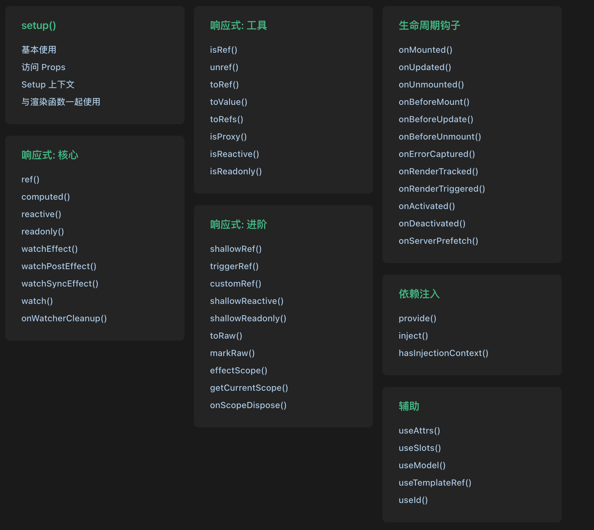
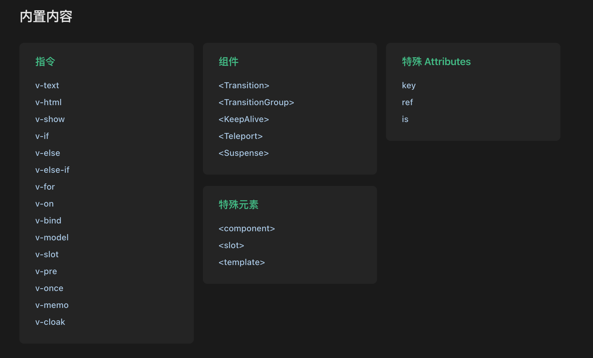
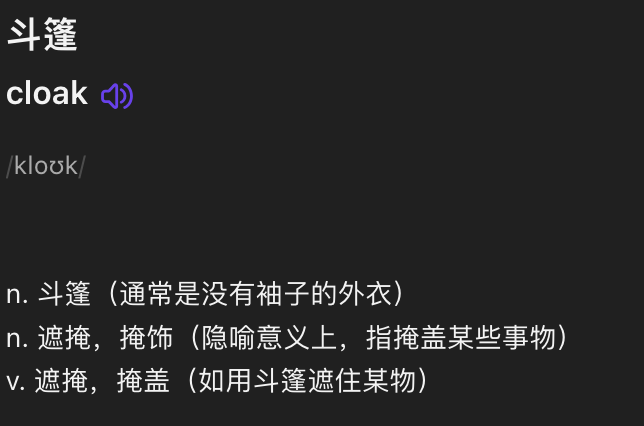

# Vue3 中不常用的 API

`#vue` 

## 目录
<!-- toc -->
 ## 1. 总结 

- v-pre：
	- **跳过该元素及其所有子元素的编译**
- v-memo：
	- 用于缓存
- v-once：
	- 仅渲染元素和组件一次，并跳过之后的更新
- v-cloak：
	- 用于隐藏尚未完成编译的 DOM 模板

## 2. 全局 API 

## 3. 组合式 API

- onErrorCaptured

- `useSlots` 和 `useAttrs` 是真实的运行时函数
	- 它的返回与 `setupContext.slots` 和 `setupContext.attrs` 等价
- `useTemplateRef`：
	- 返回一个浅层 ref，其值将与模板中的具有匹配 ref attribute 的元素或组件同步

## 4. 内置内容

- v-pre：
	- **跳过该元素及其所有子元素的编译**
- v-memo：
	- 用于缓存
- v-once：
	- 仅渲染元素和组件一次，并跳过之后的更新
- v-cloak：用于隐藏尚未完成编译的 DOM 模板
	- 
- TransitionGroup：
	- 为列表中的**多个**元素或组件提供过渡效果

更多参考：
- [29. v-memo 介绍](/post/iJaZvxgr.html)

## 5. 单文件组件

## 6. 进阶 API

