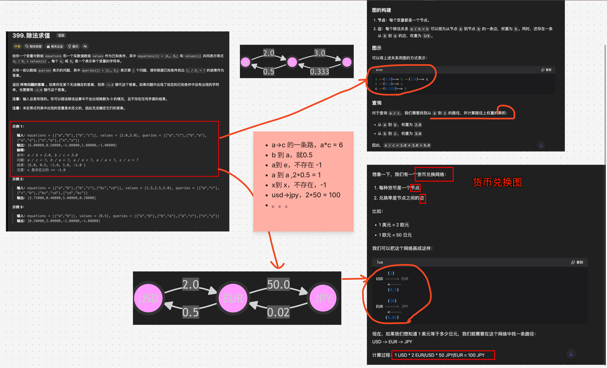
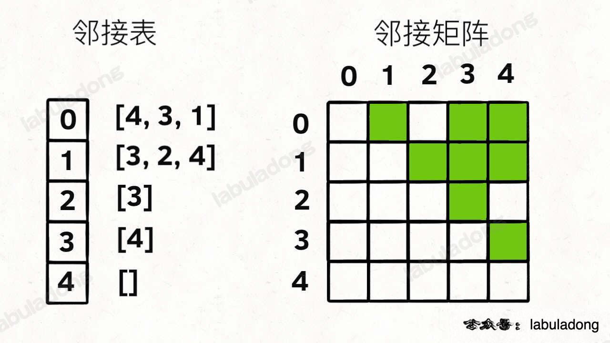

# 除法求值


`#leetcode`   `#2024/09/14`  `#算法`  `#算法/图`  `#有向加权图` `#DFS` 


## 目录
<!-- toc -->
 ## 1. 题目及理解 



## 2. 思路：使用 DFS

1. **图的构建（buildGraph 函数）**:
    - 将方程式转换为一个加权有向图。
    - 每个变量是图中的一个节点。
    - 每个方程 a/b = val 在图中表示为两条边：a->b（权重为val）和b->a（权重为1/val）。
    - 使用**邻接表**来表示这个图。
    - 
2. **主函数（calcEquation）**:
    - 首先调用 buildGraph 构建图。
    - 对每个查询 (a, b)：
        - 如果 a 或 b 不在图中，返回 -1。
        - 否则，调用 dfs 函数来计算结果。
3. **深度优先搜索（dfs 函数）**:
    - 用于计算两个节点之间的路径值（即除法结果）。
    - 基本情况
        - 如果 a === b，返回 1。
    - 使用 visited 集合避免循环。
    - 递归探索 a 的所有邻居节点。
    - 如果找到通向 b 的路径，返回路径上边权重的乘积。
    - 如果没有找到路径，返回 -1。

流程图如下：


## 3. 代码实现

```javascript
/**
 * @param {string[][]} equations
 * @param {number[]} values
 * @param {string[][]} queries
 * @return {number[]}
 */
var calcEquation = function (equations, values, queries) {
  const graph = buildGraph(equations, values);

  const res = [];

  for (const [a, b] of queries) {
    // 如果 a 或 b 不存在，则 a / b 不存在,返回 -1
    if (!graph[a] || !graph[b]) {
      res.push(-1);
    } else {
      // 否则，使用深度遍历计算 a / b 的值
      res.push(dfs(a, b, graph, new Set()));
    }
  }

  return res;
};

/**
 * @description 构建图
 * @param {string[][]} equations, 二维数组，每个元素是一个长度为 2 的数组，表示方程式的两个变量
 * @param {number[]} values, 数组，表示方程式的结果
 * @return {object} 图，使用邻接表表示
 */
function buildGraph(equations, values) {
  const graph = {};
  for (let i = 0; i < equations.length; i++) {
    const [a, b] = equations[i];
    const val = values[i];

    //////////////////////////// a -> b
    // a / b = val
    // b / a = 1 / val
    if (!graph[a]) {
      graph[a] = [];
    }
    // a -> b, val 代表 a/b
    graph[a].push({ node: b, val });

    //////////////////////////// b -> a
    if (!graph[b]) {
      graph[b] = [];
    }
    // b -> a, 1/val 代表 b/a
    graph[b].push({ node: a, val: 1 / val });
  }
  return graph;
}

/**
 * @description 使用深度遍历 计算 a / b 的值，如果 a / b 不存在，则返回 -1
 * @param {string} a
 * @param {string} b
 * @param {object} graph
 * @param {Set} visited
 * @return {number}
 */
function dfs(a, b, graph, visited) {
  // 如果 a === b，则 a / b = 1
  if (a === b) {
    return 1;
  }

  visited.add(a);

  for (const { node, val } of graph[a]) {
    if (visited.has(node)) {
      continue;
    }

    const res = dfs(node, b, graph, visited);
    if (res !== -1) {
      return val * res;
    }
  }

  return -1;
}

```

