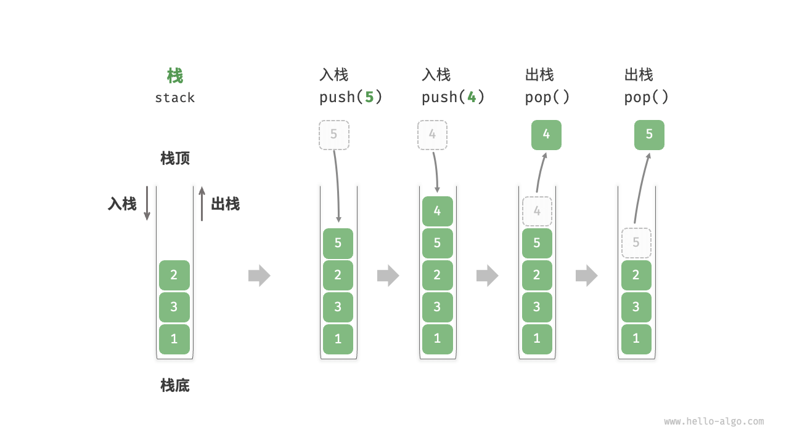
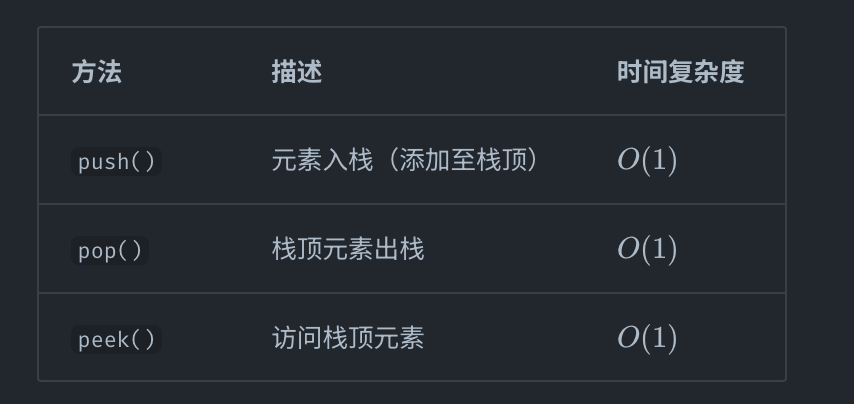
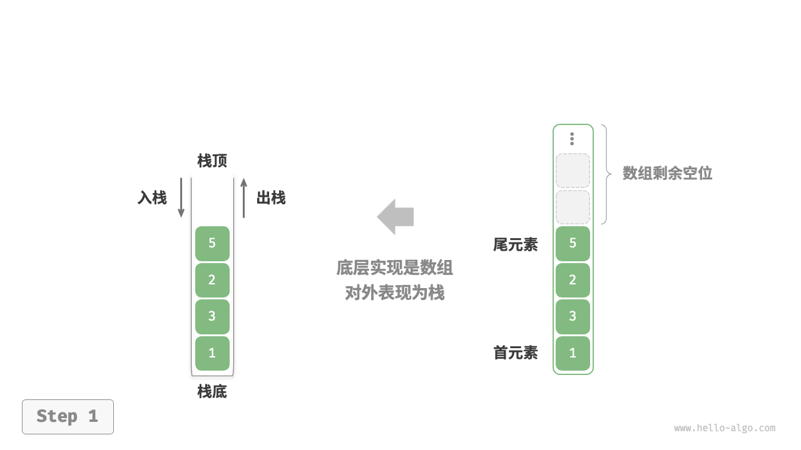
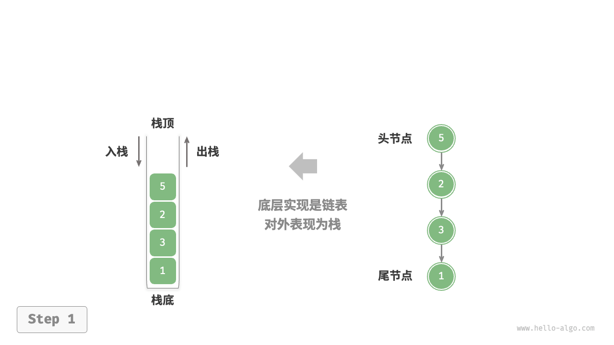

# 栈：Python 描述

`#数据结构/栈`  `#栈`


## 目录
<!-- toc -->
 ## 1. 栈的定义 



## 2. 栈的常用操作



## 3. 基于数组的实现



```python
class ArrayStack:
    """构造方法：初始化一个空栈"""
    def __init__(self):
        self.data = []
    """返回栈的大小"""
    def size(self):
        return len(self.data)
    """判断栈是否为空"""
    def isEmpty(self):
        return len(self.data) == 0
    """将 item 压入栈中"""
    def push(self, item):
        self.data.append(item)
    """将栈顶元素弹出"""
    def pop(self):
        if self.isEmpty():
            raise Exception("stack is empty")
        return self.data.pop()
    """返回栈顶元素"""
    def peek(self):
        if self.isEmpty():
            raise Exception("stack is empty")
        return self.data[-1]
```

## 4. 基于链表的实现



> [!danger]
> 关键是要关注上图，其实就是一条单链表 5→2→3→1→null ，然后入栈出栈都参考单链表来操作即可

```python
"""节点类: 用于构造链表节点"""
class ListNode:
    def __init__(self,val:int) -> None:
        # 节点值
        self.val = val
        # listNode | Node 代表 self.next 的值可能是 listNode | Node
        self.next:ListNode | None = None

class LinkedStack:
    """构造方法：初始化一个空栈"""
    def __init__(self):
        # 栈顶元素
        self.head:ListNode | None = None
        self.sz = 0

    """返回栈的大小"""
    def size(self):
        return self.sz

    """判断栈是否为空"""
    def isEmpty(self):
        return self.sz == 0

    """将 item 压入栈中"""
    def push(self, val):
        node = ListNode(val)
        # 将新节点的 next 指向原来的栈顶元素
        node.next = self.head
        # 更新栈顶元素
        # 将 head 指向新节点
        self.head = node
        self.sz += 1

    """将栈顶元素弹出"""
    def pop(self):
        if self.isEmpty():
            raise Exception("stack is empty")
        # 临时保存栈顶元素
        item = self.head
        # 将 head 指向下一个元素
        # 删除栈顶元素，直接将 head 指向下一个元素即可
        if self.head is not None:
            self.head = self.head.next
        self.sz -= 1
        return item

    """返回栈顶元素"""
    def peek(self):
        if self.isEmpty():
            raise Exception("stack is empty")
        if self.head is not None:
            return self.head

```

## 5. 两种实现的对比

- 时间
	- 基于数组实现的栈在触发扩容时效率会降低，但由于扩容是低频操作，因此平均效率更高。
	- 基于链表实现的栈可以提供更加稳定的效率表现
- 空间
	- 数组需要可能会造成一点的空间浪费
	- 链表节点需要额外存储指针，**因此链表节点占用的空间相对较大**

## 6. 栈的应用

- 浏览器中的后退与前进
- 软件中的撤销与反撤销
- 程序内存管理。每次调用函数时，系统都会在栈顶添加一个**栈帧**，用于记录函数的**上下文信息**。在递归函数中，向下递推阶段会不断执行入栈操作，而向上回溯阶段则会不断执行出栈操作