# 字节跳动现代 Web 开发实践

>  源于 GMTC 大会分享

## 目录
<!-- toc -->
 ## 1. 前端框架演变 

- 脚手架的问题：
	- ==泼出去的水==
- 模板的问题，==太多模板了==
	- M
	- 中后台
	- TS 项目
	- BFF 项目
	- React 
	- vue项目
	- ==桌面应用==
	- 活动页面
	- 微前端
- webpack 包装的问题
	- 问题一：业务项目仍包含大量配置
	- 问题二：编译工具演进，高级语言，如何兼容，
		- ==→ 只会导致配置更复杂==
	- 问题三： dev 和 build 远远不够，开发者体验，上手成本等等
- 前端工程化的问题
	- 前端工程需求不止「代码初始化」和「代码层面的基建」
	- 还包含如何==内置平台基建能力==
		- 集成、发布、多版本、运维、模拟、工作流等等
		- 规范，流程、标准等等
- → React？ 围绕 围绕 React 做基建？
	- 生态还是最好！
- NodeJS的问题
	- ==服务器端应用架构 != 客户端应用架构==，比如下面的 DB
		- 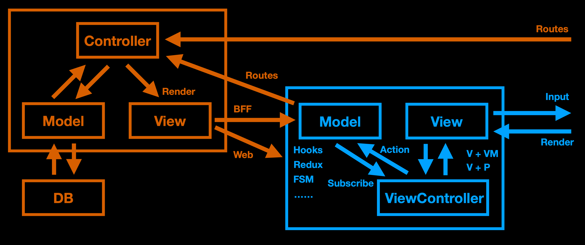
- 前后端一体化？
	- 一套业务逻辑分散在客户端和服务器端
	- 服务器端需求通常只是:
 
		- Web(含 SSR) 和 BFF
- 前端部署需求？
	- 微前端分发？
	- SSR 缓存
	- SSR 兜底？
	- ISG 递增生成
	- NSR ？
	- BFF 分发
	- 路由分发
	- NGINX 转发
	- 运维
	- 交给业务的后端
- 传统的 Web 开发模式
	- LAMP 、ruby on rails 、`MEAN` 即传统的 MVC 架构
- 现代 Web 开发
	- JAMStack
	- SHAMStack
		- SH：`static Hosting`
		- A：api 
			- GraphQL 
			- SeverLess Functions
		- Markup： 
	- STAR App 
		- 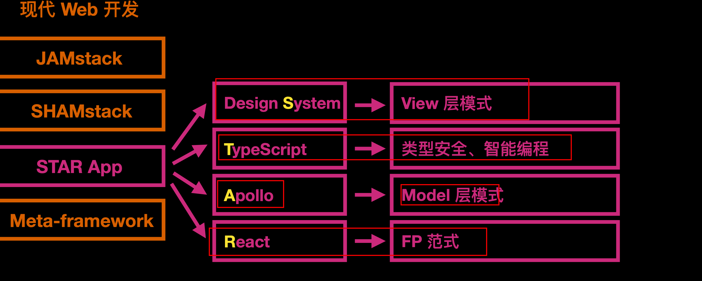
	- 元框架
		- 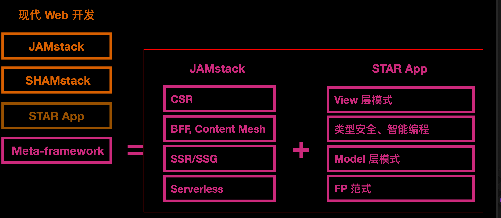
- 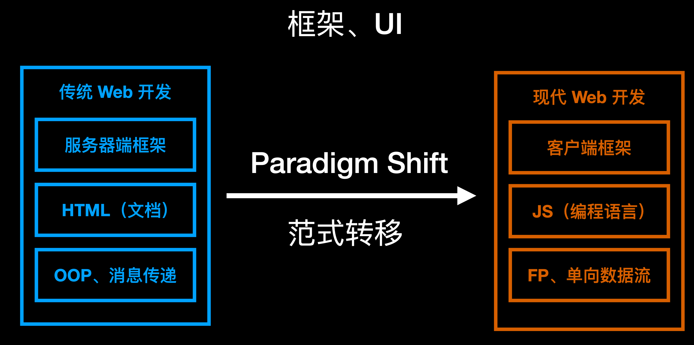
- 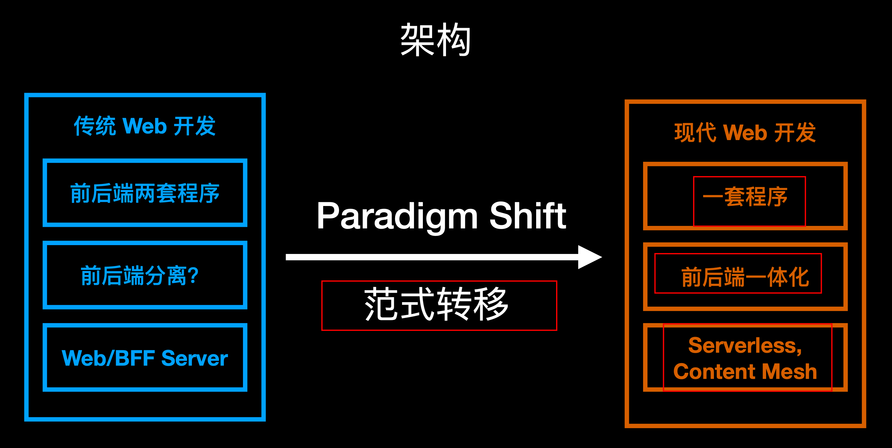

==前后端分离 →  前后端一体化==
- 前端研发：平台
	- ==前端 PaaS==
	- ==一体化云研发平台==
	- 底码提效

## 2. 前端研发体系

- 底码中台：
- 工程方案：

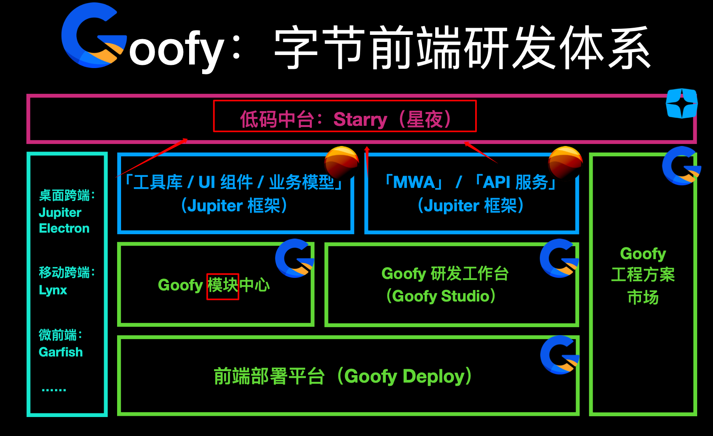

### 2.1. 三个运行时

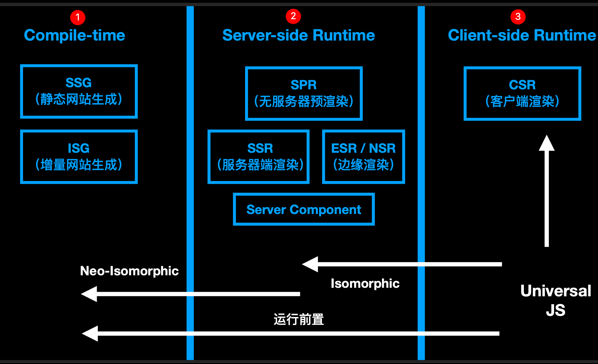

## 3. 前端工程

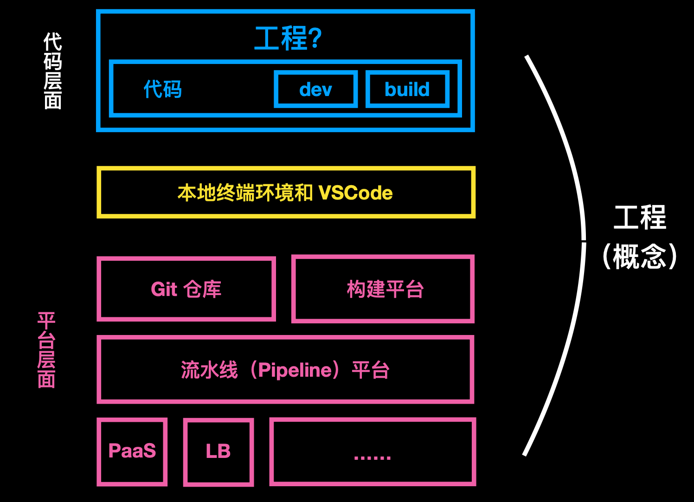

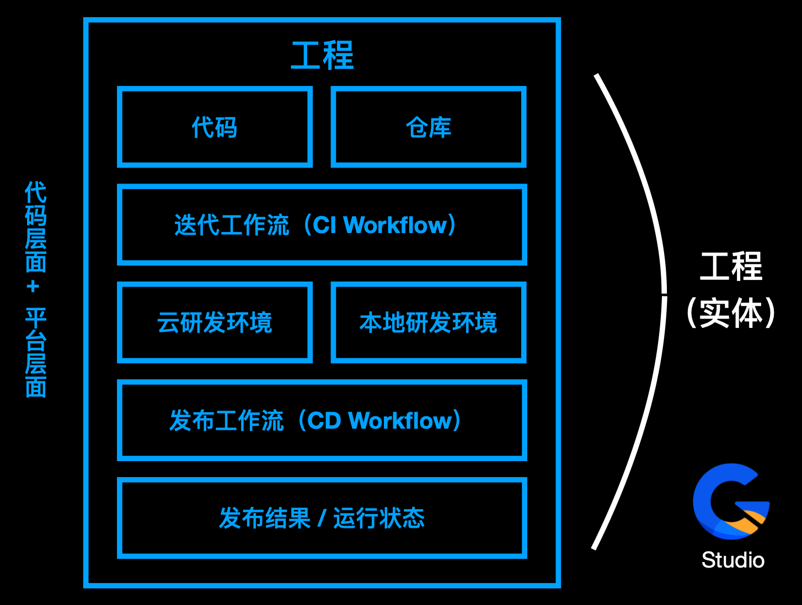

- 工程&仓库
- 工作流
- ==云研发环境==
- ==本地研发环境==
- 发布结果&运行环境

### 3.1. 工程模板收敛

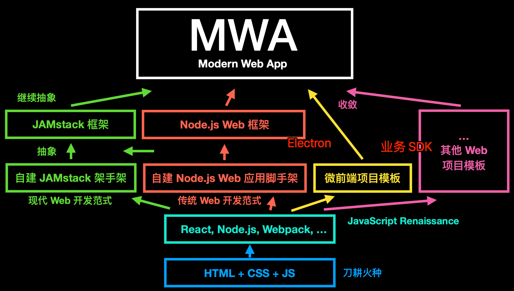

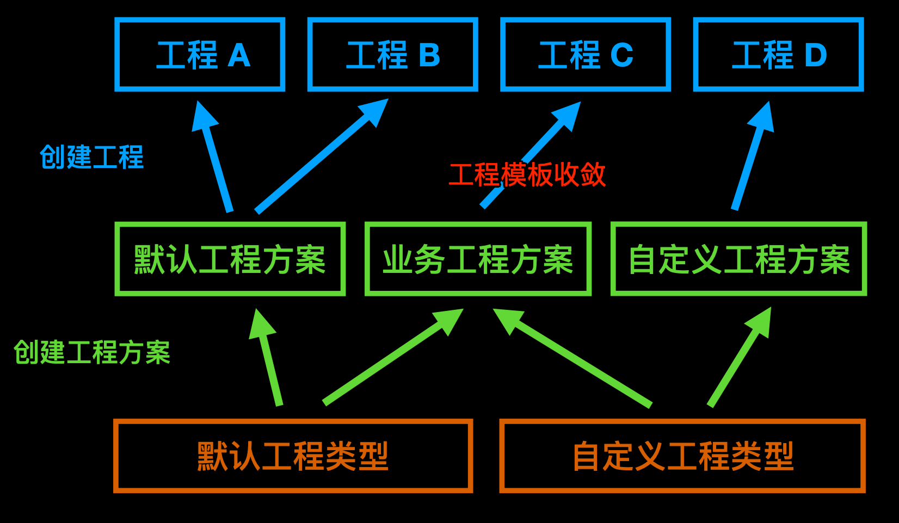

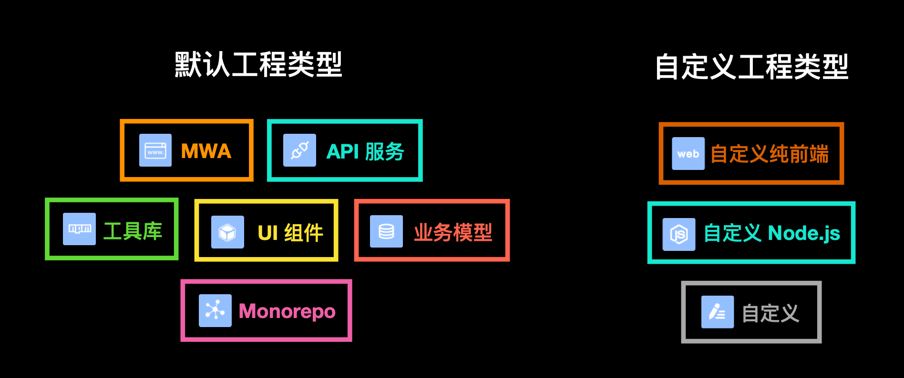

## 4. 标准解决方案：类似于 umi

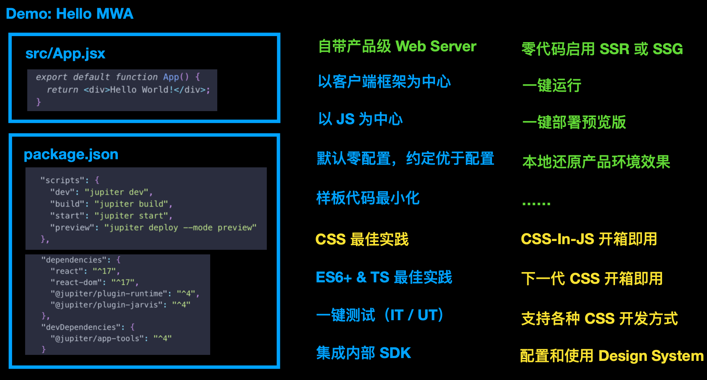

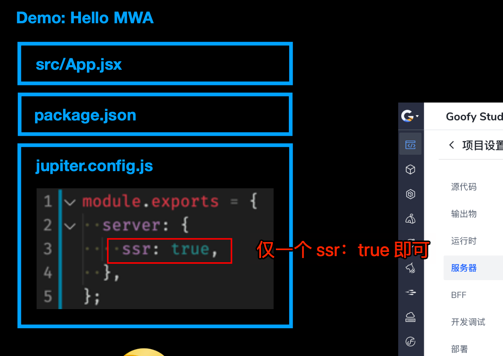

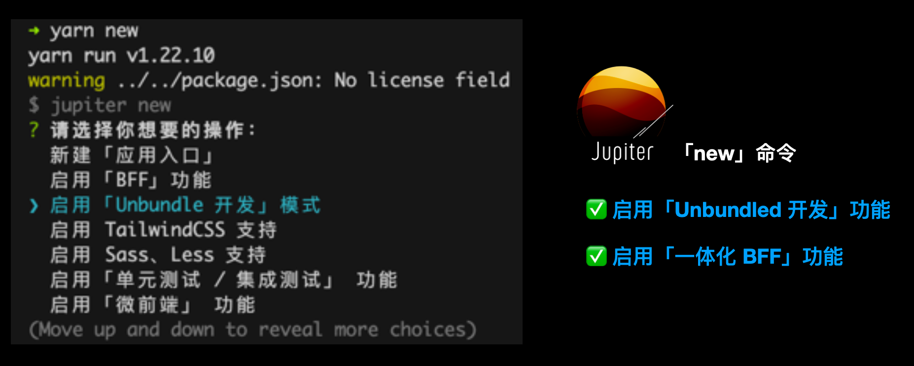

## 5. 本地&云端同步开发

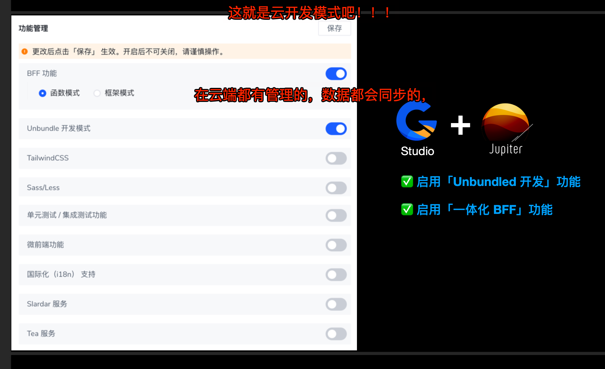

## 6. 开发 API，约定就好

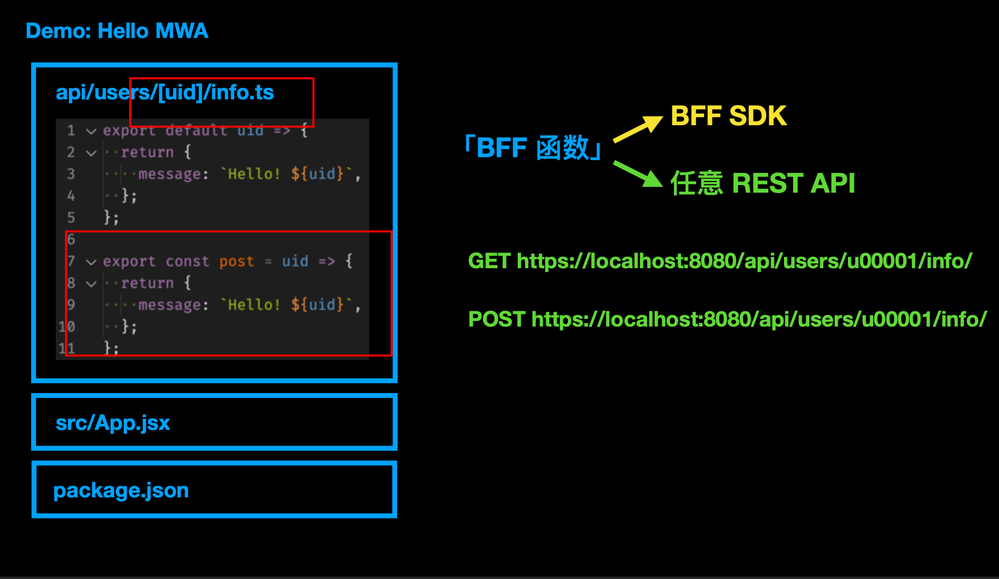

## 7. 另外一个维度：==编写时、运行时、编译时、构建部署时==

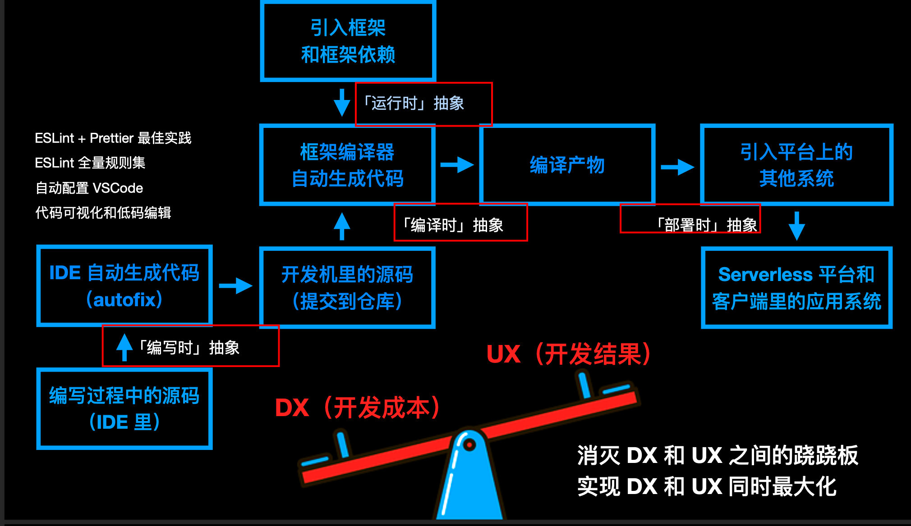

