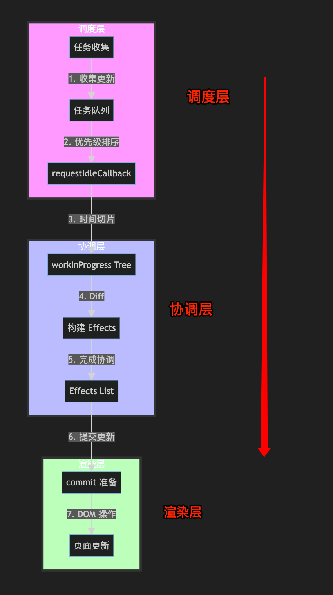

# React Fiber 架构的原理和工作模式

`#react` 

前文 [6.  React 的演变及 Fiber 架构](/post/b06d08c454c05ec6b4a51160337ab717.html) 介绍了基本的 React Fiber架构，本文继续


## 目录
<!-- toc -->
 ## 1. Fiber 架构概述 

Fiber 是 React 16 引入的新架构，它的主要目标是实现增量渲染：能够将渲染工作分片，并将其分散到多个帧中。

### 1.1 为什么需要 Fiber

在旧的架构中，React 的更新过程是同步的，称为 `Stack Reconciler`。这可能导致以下问题：

- 当组件树很大时，更新过程会占用主线程太长时间
- 无法中断更新过程
- 可能导致掉帧和页面卡顿

Fiber 是 React 16 引入的新架构，其核心目标是实现：
1. **增量渲染**：能够将渲染工作分片，并将其分散到多个帧中
2. **任务暂停和恢复**：能够暂停正在进行的工作，稍后再恢复
3. **任务优先级**：能够为不同的更新分配优先级
4. **并发模式**：支持并发更新

### 1.2 Fiber 的核心特性

```javascript
// Fiber 节点的基本结构
type Fiber = {
  // 标记节点类型
  tag: WorkTag,
  
  // 节点的唯一标识
  key: null | string,
  
  // 节点的类型信息
  elementType: any,
  
  // 对应的 DOM 节点
  stateNode: any,
  
  // 指向其他 Fiber 节点的指针
  return: Fiber | null,
  child: Fiber | null,
  sibling: Fiber | null,
  
  // 更新相关
  pendingProps: any,
  memoizedProps: any,
  updateQueue: UpdateQueue<any> | null,
  memoizedState: any,
  
  // 副作用相关
  flags: Flags,
  subtreeFlags: Flags,
  deletions: Array<Fiber> | null,
}
```

## 2. Fiber 工作原理

### 2.1 双缓冲技术

Fiber 使用`双缓冲技术`来管理更新：

```javascript
// 当前屏幕上显示的 Fiber 树
let current: Fiber | null = null;

// 正在构建的 Fiber 树
let workInProgress: Fiber | null = null;

function createWorkInProgress(current: Fiber, pendingProps: any): Fiber {
  let workInProgress = current.alternate;
  
  if (workInProgress === null) {
    // 首次渲染，创建新的 Fiber
    workInProgress = createFiber(current.tag, pendingProps, current.key);
    workInProgress.elementType = current.elementType;
    workInProgress.type = current.type;
    workInProgress.stateNode = current.stateNode;
  } else {
    // 复用已有的 Fiber
    workInProgress.pendingProps = pendingProps;
    workInProgress.flags = NoFlags;
    workInProgress.subtreeFlags = NoFlags;
    workInProgress.deletions = null;
  }
  
  workInProgress.alternate = current;
  return workInProgress;
}
```

## 2.2 Fiber 的工作循环



Fiber 的工作循环分为两个阶段：

#### 1. Render 阶段（可中断）：

```javascript
function workLoopConcurrent() {
  while (workInProgress !== null && !shouldYield()) {
    performUnitOfWork(workInProgress);
  }
}

function performUnitOfWork(unitOfWork: Fiber): void {
  // 1. 处理当前 Fiber 节点
  const current = unitOfWork.alternate;
  const next = beginWork(current, unitOfWork);
  
  // 2. 如果没有子节点，完成当前节点
  if (next === null) {
    completeUnitOfWork(unitOfWork);
  } else {
    workInProgress = next;
  }
}
```

#### 2. Commit 阶段（不可中断）：

```javascript
function commitRoot(root: FiberRoot) {
  // 1. 执行前置操作
  commitBeforeMutationEffects(root);
  
  // 2. 执行 DOM 操作
  commitMutationEffects(root);
  
  // 3. 执行布局副作用
  commitLayoutEffects(root);
}
```

## 3. Fiber 调度机制

### 3.1 优先级系统

Fiber 使用不同的优先级来调度任务：

```javascript hl:3

export const NoLanes: Lanes = /*                        */ 0b0000000000000000000000000000000;
export const SyncLane: Lanes = /*                       */ 0b0000000000000000000000000000001;
// 输入的任务优先级就很高
export const InputContinuousLane: Lanes = /*            */ 0b0000000000000000000000000000100;
export const DefaultLane: Lanes = /*                    */ 0b0000000000000000000000000010000;
export const IdleLane: Lanes = /*                       */ 0b0100000000000000000000000000000;
```

### 3.2 时间切片

```javascript
// 检查是否需要让出主线程
function shouldYield(): boolean {
  const currentTime = getCurrentTime();
  if (currentTime >= deadline) {
    if (needsPaint || scheduling.isInputPending()) {
      return true;
    }
    return currentTime >= maxYieldInterval;
  } else {
    return false;
  }
}
```

## 4. 副作用处理

### 4.1 副作用标记

```javascript
export const NoFlags = /*                      */ 0b000000000000000000;
export const PerformedWork = /*                */ 0b000000000000000001;
export const Placement = /*                     */ 0b000000000000000010;
export const Update = /*                        */ 0b000000000000000100;
export const Deletion = /*                      */ 0b000000000000001000;
```

### 4.2 副作用收集

```javascript
function completeWork(current: Fiber | null, workInProgress: Fiber): void {
  const newProps = workInProgress.pendingProps;
  
  switch (workInProgress.tag) {
    case HostComponent: {
      // 更新 DOM 属性
      updateHostComponent(current, workInProgress, newProps);
      break;
    }
    // ... 其他类型的处理
  }
  
  // 冒泡副作用标记
  bubbleProperties(workInProgress);
}
```

## 5. 并发特性

### 5.1 中断和恢复

```javascript
function ensureRootIsScheduled(root: FiberRoot) {
  const nextLanes = getNextLanes(root, NoLanes);
  
  if (nextLanes === NoLanes) {
    return;
  }
  
  let newCallbackPriority = getHighestPriorityLane(nextLanes);
  let newCallbackNode;
  
  if (newCallbackPriority === SyncLane) {
    scheduleSyncCallback(performSyncWorkOnRoot.bind(null, root));
  } else {
    newCallbackNode = scheduleCallback(
      priorityLevel,
      performConcurrentWorkOnRoot.bind(null, root),
    );
  }
  
  root.callbackPriority = newCallbackPriority;
  root.callbackNode = newCallbackNode;
}
```

### 5.2 优先级调度

```javascript
function markUpdateLaneFromFiberToRoot(fiber: Fiber, lane: Lane): FiberRoot | null {
  fiber.lanes = mergeLanes(fiber.lanes, lane);
  let alternate = fiber.alternate;
  if (alternate !== null) {
    alternate.lanes = mergeLanes(alternate.lanes, lane);
  }
  
  // 向上遍历更新祖先节点的 lanes
  let node = fiber;
  let parent = fiber.return;
  while (parent !== null) {
    parent.childLanes = mergeLanes(parent.childLanes, lane);
    alternate = parent.alternate;
    if (alternate !== null) {
      alternate.childLanes = mergeLanes(alternate.childLanes, lane);
    }
    node = parent;
    parent = parent.return;
  }
}
```

## 6. 性能优化

### 6.1 批量更新

```javascript
function batchedUpdates<A, R>(fn: (a: A) => R, a: A): R {
  const prevExecutionContext = executionContext;
  executionContext |= BatchedContext;
  try {
    return fn(a);
  } finally {
    executionContext = prevExecutionContext;
    if (executionContext === NoContext) {
      // 刷新同步队列
      flushSyncCallbackQueue();
    }
  }
}
```

### 6.2 优化策略

### 1. 跳过不必要的更新：

```javascript
function bailoutOnAlreadyFinishedWork(
  current: Fiber | null,
  workInProgress: Fiber,
): Fiber | null {
  if (current !== null) {
    workInProgress.dependencies = current.dependencies;
  }
  
  // 标记子树跳过
  markSkippedUpdateLanes(workInProgress.lanes);
  
  return null;
}
```

### 2. 优化渲染路径：

```javascript
function attemptEarlyBailoutIfNoScheduledUpdate(
  current: Fiber,
  workInProgress: Fiber,
) {
  switch (workInProgress.tag) {
    case ClassComponent: {
      const instance = workInProgress.stateNode;
      if (typeof instance.shouldComponentUpdate === 'function') {
        if (!instance.shouldComponentUpdate(
          workInProgress.pendingProps,
          workInProgress.memoizedState,
        )) {
          return true;
        }
      }
    }
  }
  return false;
}
```

Fiber 架构是 React 的核心，它通过可中断的更新过程和优先级调度机制，实现了更好的性能和用户体验。理解 Fiber 的工作原理对于深入理解 React 的运行机制和优化应用性能都很重要。