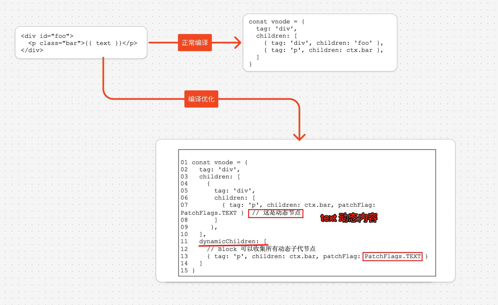

# Vue3 的编译器原理（篇三：编译优化）

 `#vue` `#vue3` 

编译优化的核心在于，区分动态节点与静态节点。Vue.js 3 会为`动态节点`打上补丁标志，即 patchFlag。同时，Vue.js 3 还提出了 Block 的概念，一个 Block 本质上也是一个虚拟节点，但与普通虚拟 节点相比，会多出一个 dynamicChildren 数组。该数组用来收集所有动态子代节点，这利用了 createVNode 函数和 createBlock 函数的层层嵌套调用的特点，即以“由内向外”的方式执行。再配合一个 用来临时存储动态节点的节点栈，即可完成动态子代节点的收集。

由于 Block 会收集所有动态子代节点，所以对动态节点的比对操 作是忽略 DOM 层级结构的。这会带来额外的问题，即 v-if、v-for 等结构化指令会影响 DOM 层级结构，使之不稳定。这会间接导致基于 Block 树的比对算法失效。而解决方式很简单，只需要让带有 v- if、v-for 等指令的节点也作为 Block 角色即可。

除了 Block 树以及补丁标志之外，Vue.js 3 在编译优化方面还做 了其他努力，具体如下。

静态提升:能够减少更新时创建虚拟 DOM 带来的性能开销和内存 占用。 预字符串化:在静态提升的基础上，对静态节点进行字符串化。 这样做能够减少创建虚拟节点产生的性能开销以及内存占用。 缓存内联事件处理函数:避免造成不必要的组件更新。

v-once 指令:缓存全部或部分虚拟节点，能够避免组件更新时重 新创建虚拟 DOM 带来的性能开销，也可以避免无用的 Diff 操 作。

## 目录
<!-- toc -->
 ## 传统 Diff 算法的问题 

 

为什么虚拟 DOM 会产生额外的性能开销呢?
- 根本原因在于，渲染器在运行时得不到足够的信息。传统 Diff 算法无法利用编译时提取到的任何关键信息，这导致渲染器在运行时不可能去做相关的优化

## 解决方案：编译优化

- 编译优化指的是通过编译的手段提取`关键信息`，并以此指导生成最优代码的过程。
- 具体来说，Vue.js 3 的编译器会充分分析模板，提取关键信息并将其附着到对应的虚拟节点上。
- 在运行时阶段，渲染器通过这些`关键信息`执行 “快捷路径” ，从而提升性能。

 

### Block 和 PatchFlags

