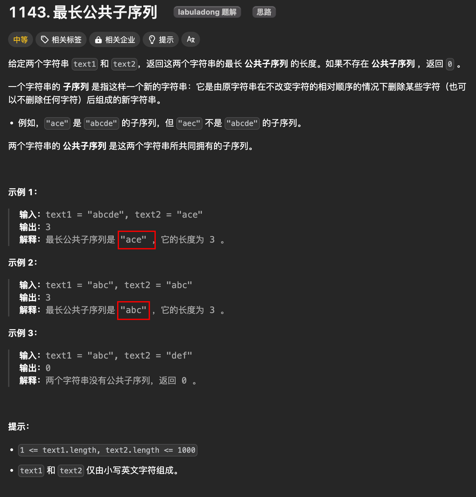
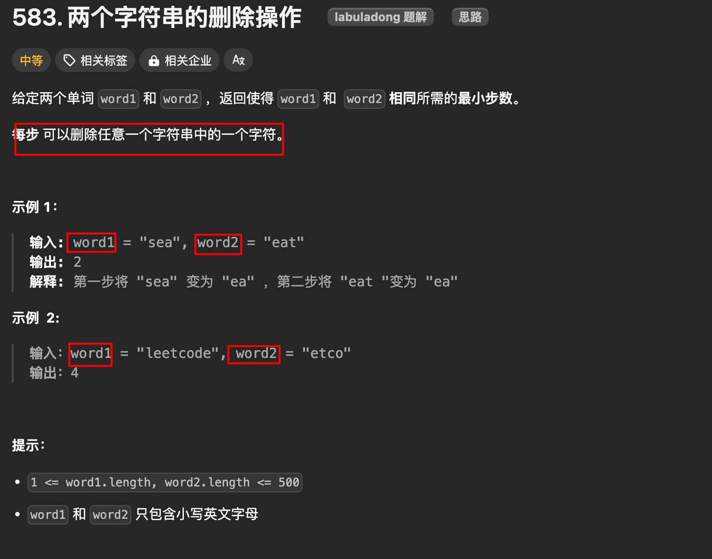
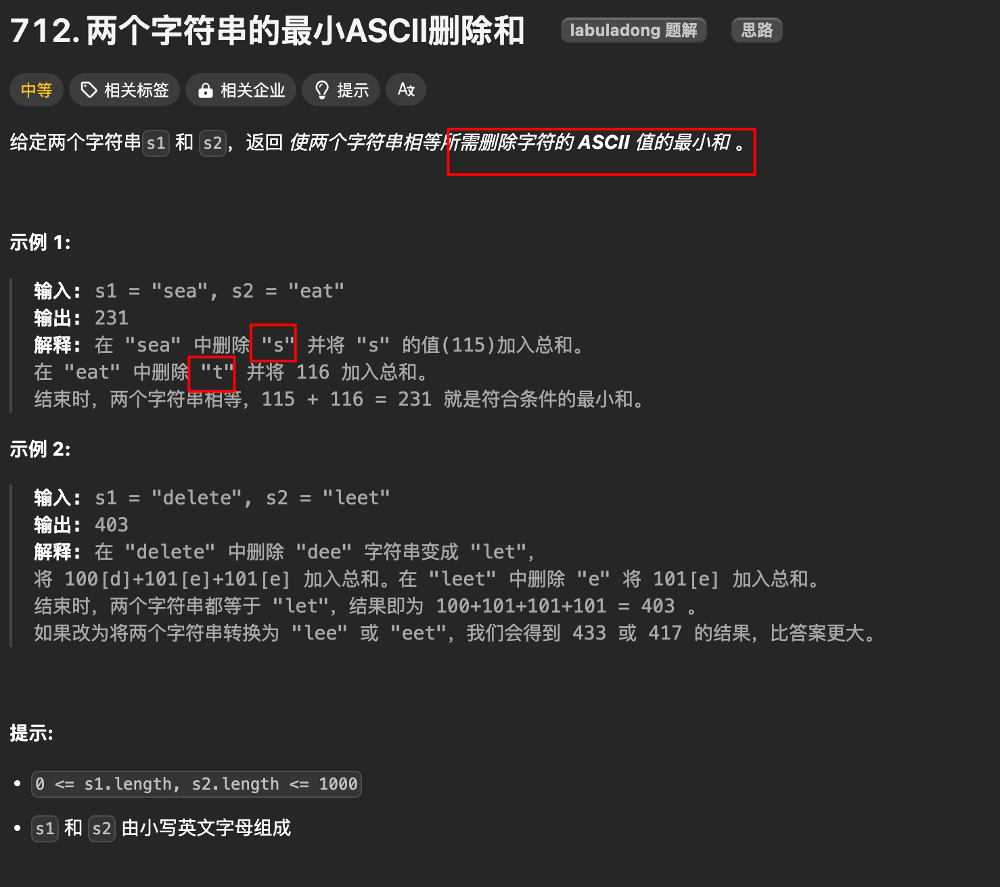

# 子序列：最长公共子序列问题

`#算法/动态规划` 


## 目录
<!-- toc -->
 ## 1. 最长公共子序列 



> https://leetcode.cn/problems/longest-common-subsequence/description/

比如说输入 `s1 = "zabcde", s2 = "acez"`，它俩的最长公共子序列是 `lcs = "ace"`，长度为 3，所以算法返回 3。

### 1.1. dp 函数定义

```javascript
// 定义：计算 s1[i..] 和 s2[j..] 的最长公共子序列长度
var dp = function(s1, i, s2, j) {

};
```

- 根据这个 `dp` 函数的定义，那么我们想要的答案就是 `dp(s1, 0, s2, 0)`
- 且 base case 就是 `i == len(s1)` 或 `j == len(s2)` 时，因为这时候 `s1[i..]` 或 `s2[j..]` 就相当于空串了，最长公共子序列的长度显然是 0

```javascript
// 定义：计算 s1[i..] 和 s2[j..] 的最长公共子序列长度
var dp = function(s1, i, s2, j) {
    if (s1.charAt(i) == s2.charAt(j)) {
       // s1[i] 和 s2[j] 必然在 lcs 中， 
       // 加上 s1[i+1..] 和 s2[j+1..] 中的 lcs 长度，就是答案
        return 1 + dp(s1, i + 1, s2, j + 1);
    } else {
        // s1[i] 和 s2[j] 中至少有一个字符不在 lcs 中，
        // 穷举三种情况的结果，取其中的最大结果
        return Math.max(
            // 情况一、s1[i] 不在 lcs 中
            dp(s1, i + 1, s2, j),
            // 情况二、s2[j] 不在 lcs 中
            dp(s1, i, s2, j + 1),
            // 情况三、都不在 lcs 中
            dp(s1, i + 1, s2, j + 1)
        );
    }
};
```

### 1.2. 最终代码

```javascript hl:9,41
var longestCommonSubsequence = function (s1, s2) {
  // 备忘录，消除重叠子问题
  let memo = [];

  // 主函数
  const m = s1.length,
    n = s2.length;
  // 备忘录值为 -1 代表未曾计算
  // 初始化二维数组 memo,直接使用 for吧，别用其他的了
  // 这样不容易出错
  for (let i = 0; i < m; i++) {
    memo[i] = [];
    for (let j = 0; j < n; j++) {
      memo[i][j] = -1;
    }
  }

  // 计算 s1[0..] 和 s2[0..] 的 lcs 长度
  return dp(s1, 0, s2, 0);

  // 定义：计算 s1[i..] 和 s2[j..] 的最长公共子序列长度
  function dp(s1, i, s2, j) {
    // base case：任何一个字符串到头了，返回 0
    // 因为这个时候，lcs 的长度是空字符串
    if (i === s1.length || j === s2.length) {
      return 0;
    }
    // 如果之前计算过，则直接返回备忘录中的答案
    if (memo[i][j] !== -1) {
      return memo[i][j];
    }
    // 根据 s1[i] 和 s2[j] 的情况做选择
    if (s1.charAt(i) === s2.charAt(j)) {
      // s1[i] 和 s2[j] 必然在 lcs 中
      memo[i][j] = 1 + dp(s1, i + 1, s2, j + 1);
    } else {
      // s1[i] 和 s2[j] 至少有一个不在 lcs 中
      memo[i][j] = Math.max(
        dp(s1, i + 1, s2, j), // 情况一： s2[j] 不在 lcs 中
        dp(s1, i, s2, j + 1), // 情况二： s1[i] 不在 lcs 中
        // dp(s1, i + 1, s2, j + 1), // 情况三： 都不在 lcs 中
      );
    }
    return memo[i][j];
  }
};

```

> 情况三可以注释掉，因为被 情况一 和 情况二包含了

## 2. 两个字符串同时删除后相等，最少需要几步？



删除的结果不就是它俩的`最长公共子序列`嘛，

那么，要计算删除的次数，就可以通过最长公共子序列的长度**推导**出来：

```javascript hl:4
var minDistance = function(s1, s2) {
    var m = s1.length, n = s2.length;
    // 复用前文计算 lcs 长度的函数
    var lcs = longestCommonSubsequence(s1, s2);
    return m - lcs + n - lcs;
};
```

## 3. 使两个字符串相等所需删除字符的 `ASCII 值`的最小和



比如输入 `s1 = "sea", s2 = "eat"`，算法返回 231。
- 因为在 `"sea"` 中删除 `"s"`
- 在 `"eat"` 中删除 `"t"`，可使得两个字符串相等，且**删掉字符的 ASCII 码之和最小**
	- 即 `s(115) + t(116) = 231`

### 3.1. dp 函数定义

```javascript
  // 定义：将 s1[i..] 和 s2[j..] 删除成相同字符串，
  // 最小的 ASCII 码之和为 dp(s1, i, s2, j)。
  function dp(s1, i, s2, j) {
  
  }
```

### 3.2. 代码实现

```javascript hl:19,26,43
var minimumDeleteSum = function (s1, s2) {
  // 备忘录
  let memo = [];
  const m = s1.length,
    n = s2.length;

  // 备忘录值为 -1 代表未曾计算
  for (let i = 0; i < m; i++) {
    memo.push(new Array(n).fill(-1));
  }

  // 定义：将 s1[i..] 和 s2[j..] 删除成相同字符串，
  // 最小的 ASCII 码之和为 dp(s1, i, s2, j)。
  function dp(s1, i, s2, j) {
    let res = 0;
    // base case start:
    // 如果一个字符串到头了, 另一个字符串的所有字符都得删除
    // ASCII 码之和就是删除的字符 ASCII 码之和
    if (i === s1.length) {
      // 如果 s1 到头了，那么 s2 剩下的都得删除
      for (; j < s2.length; j++) {
        res += s2.charCodeAt(j);
      }
      return res;
    }
    if (j === s2.length) {
      // 如果 s2 到头了，那么 s1 剩下的都得删除
      for (; i < s1.length; i++) {
        res += s1.charCodeAt(i);
      }
      return res;
    }
    // base case end

    if (memo[i][j] !== -1) {
      return memo[i][j];
    }

    if (s1.charAt(i) === s2.charAt(j)) {
      // s1[i] 和 s2[j] 都是在 lcs 中的，不用删除
      memo[i][j] = dp(s1, i + 1, s2, j + 1);
    } else {
      // s1[i] 和 s2[j] 至少有一个不在 lcs 中，删一个
      memo[i][j] = Math.min(
        s1.charCodeAt(i) + dp(s1, i + 1, s2, j),
        s2.charCodeAt(j) + dp(s1, i, s2, j + 1),
      );
    }
    return memo[i][j];
  }

  return dp(s1, 0, s2, 0);
};

```

