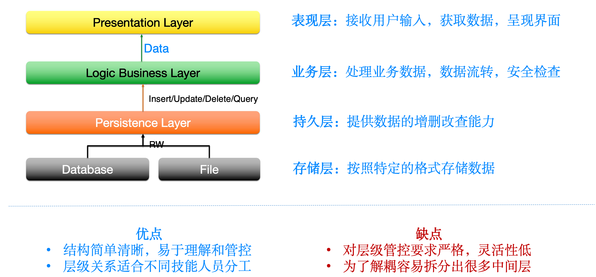
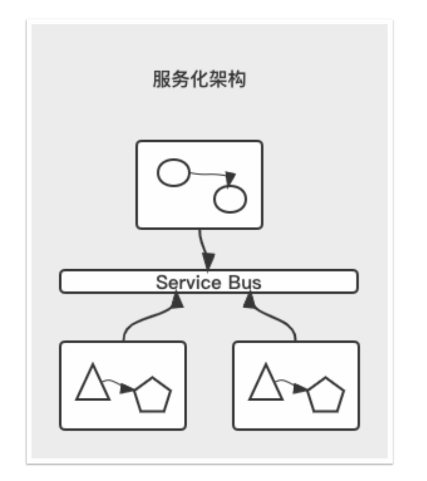
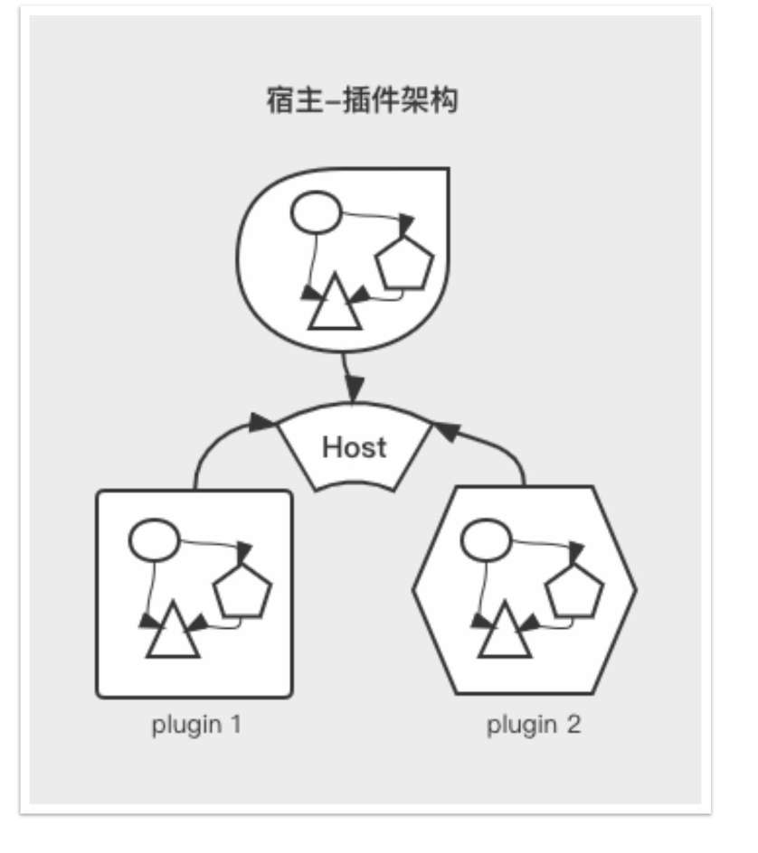
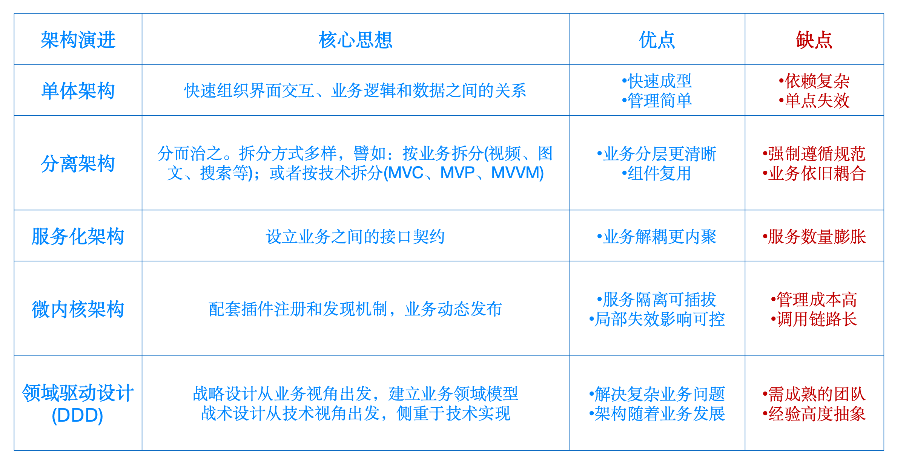
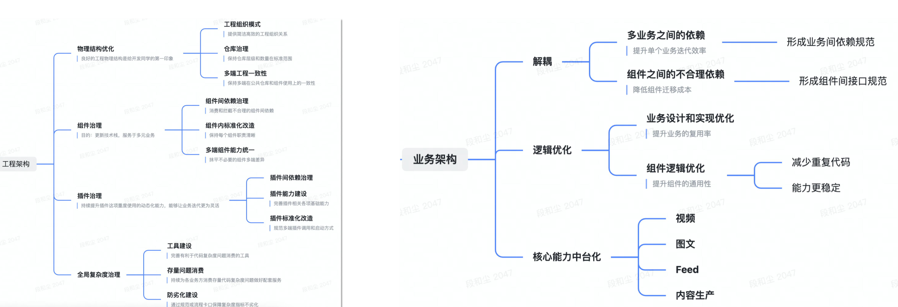
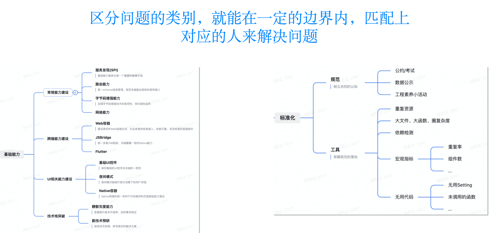

# 前端常见的架构思路：篇二

`#前端架构` 


## 目录
<!-- toc -->
 ## 1. 软件的可持续迭代 

- ==只要业务继续发展，越来越复杂就是必然趋势==。
	- 业务变化不可预测
	- 技术变化不可预测
- ==架构设计==是为了解决特定领域不同发展阶段的==业务问题==
	- Ioc：控制反转，是一种`模块化`的编程思想，有不同的实现方式。
		- 依赖注入？
	- MVC：
	- MVP：
		- M 和 V 完全独立，交互都发生 Presenter
	- MVVM
	- 单体架构
	- 微服务架构
	- 领域模型架构
	- 分层架构
		- 
	- 服务化架构：==事件驱动架构==
		- 
	- 宿主-插件架构：微内核架构
		- 
	- 架构随业务发展由简单变得复杂是规律 
	- 没必要最初用复杂架构来解决简单问题 
	- 需要用==规范持续重==构来对抗**代码的腐朽**

## 2. 架构设计的演进

- 单体架构
- 分离架构：
	- MVC
	- MVVM
	- 等
- 服务化架构
	- 业务之间的接口契约
- 微内核架构
	- 动态注册和发现
- 领域驱动设计



### 2.1. 单体架构

单体架构（Monolithic Architecture是一种传统的软件架构模式，**将应用程序的所有功能模块都打包在一个单独的单元中运行**。

1. ==所有功能集中在一个代码库==
2. 统一的`技术栈`
3. `单一部署单元`
4. `共享数据库`

比如==分层架构==

```
├── 表现层 (Presentation Layer)
│   ├── 控制器 (Controllers)
│   └── 视图 (Views)
├── 业务层 (Business Layer)
│   ├── 服务 (Services)
│   └── 领域模型 (Domain Models)
└── 数据访问层 (Data Access Layer)
    ├── DAO/Repository
    └── 数据模型 (Data Models)
```

单体架构虽然有其局限性，但在==特定场景==下仍然是一个很好的选择。

## 3. 工程架构和业务架构

- 工程架构
	- 插件间依赖问题
	- 物理结构
	- 组件治理
- 业务架构
	- ==核心能力中台化==
	- ==业务模块==解耦
- 工具保障
	- 规范制度
	- 大文件、大函数
	- 不规范
	- 无用代码





