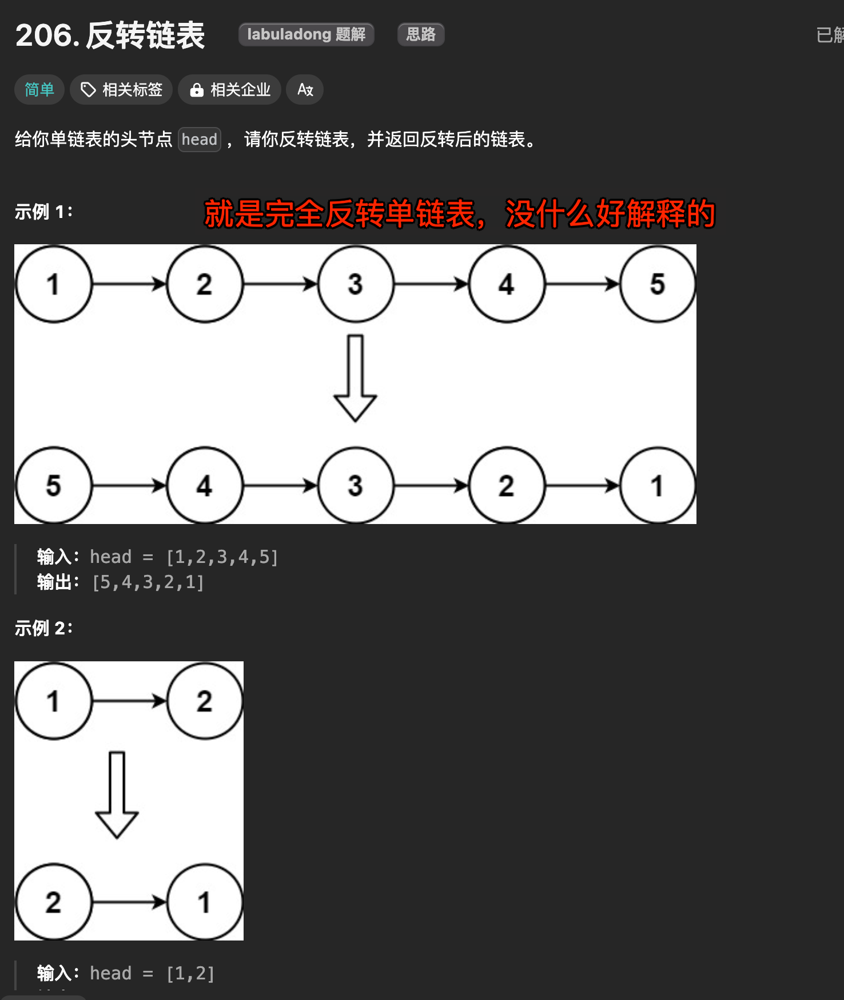
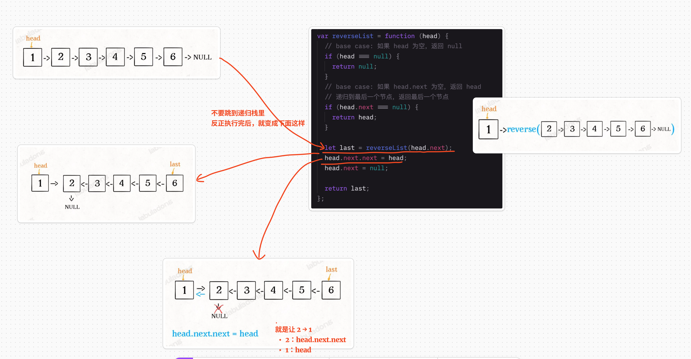

# 反转链表


#leetcode   #2024/08/10  #算法/链表   #算法/链表  

## 题目及理解



## 解题思路

### 思路一：递归魔法



#### 代码实现

```javascript
/**
 * Definition for singly-linked list.
 * function ListNode(val, next) {
 *     this.val = (val===undefined ? 0 : val)
 *     this.next = (next===undefined ? null : next)
 * }
 */
/**
 * @param {ListNode} head
 * @return {ListNode}
 */
var reverseList = function (head) {
  // base case 1: 如果 head 为空，返回 null
  if (head === null) {
    return null;
  }
  // base case 2: 链表只有一个节点（head.next === null），直接返回这个节点。
  // 递归到最后一个节点，返回最后一个节点
  if (head.next === null) {
    return head;
  }

  let last = reverseList(head.next);
  head.next.next = head;
  head.next = null;

  return last;
};

```

> `head.next === null` 时，代表链表只有一个节点

#### 复杂度分析

- 时间复杂度：`O(n)`
    - 其中 n 是链表的长度
    - 函数会递归 n 次，每次递归的操作是常数时间
- 空间复杂度：`O(n)`
    - 递归调用会使用栈空间，最大深度为 n
    - 没有使用额外的数据结构，所有额外空间都来自递归调用栈

