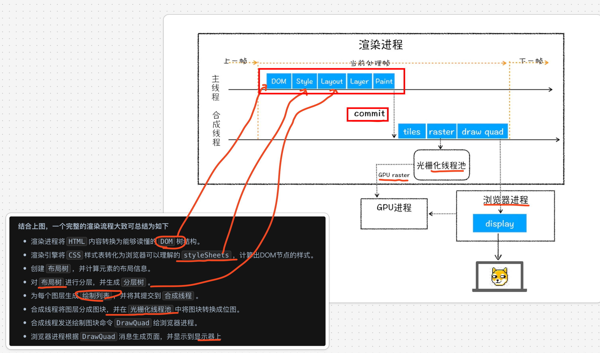
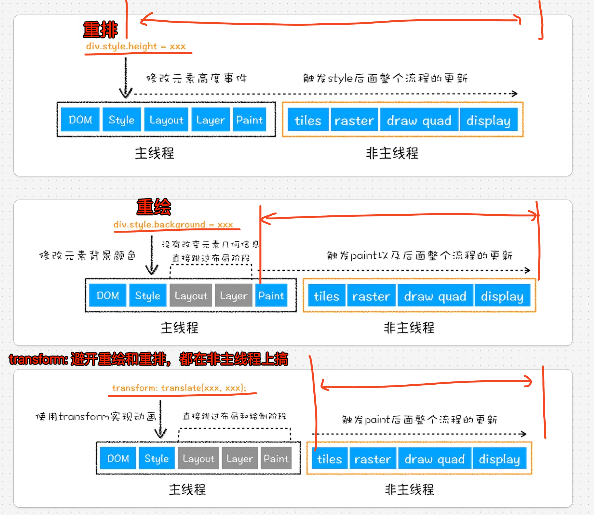
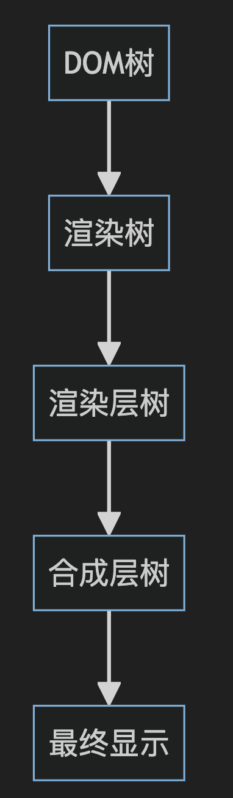
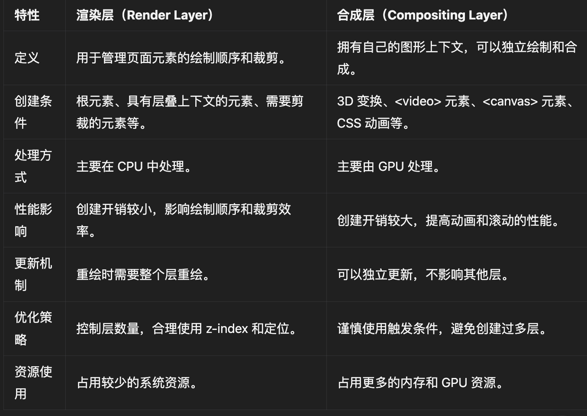
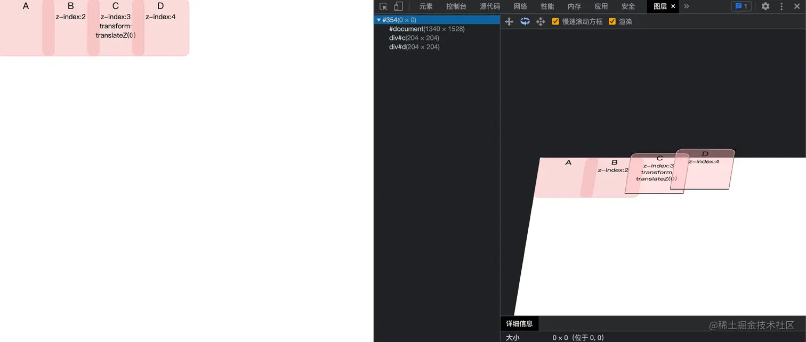
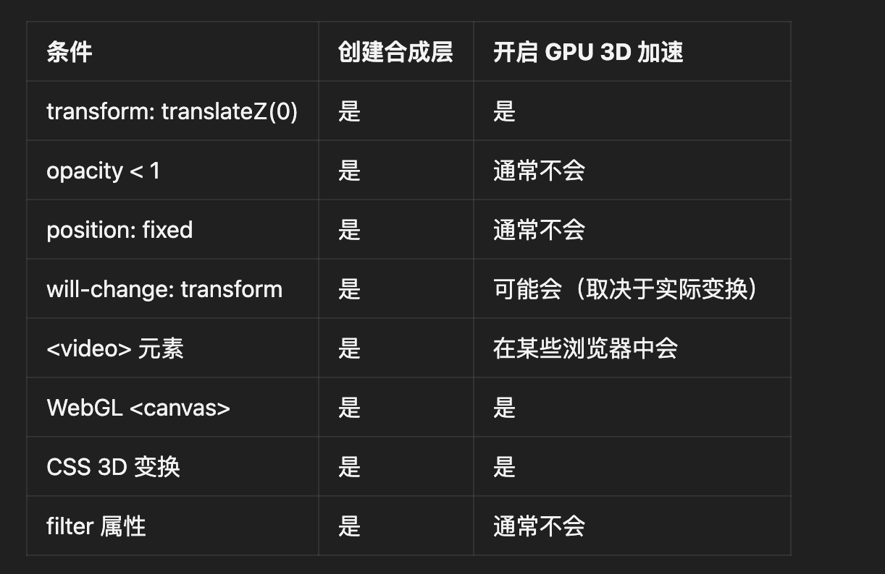
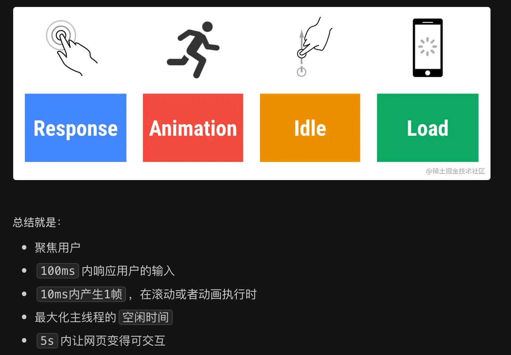
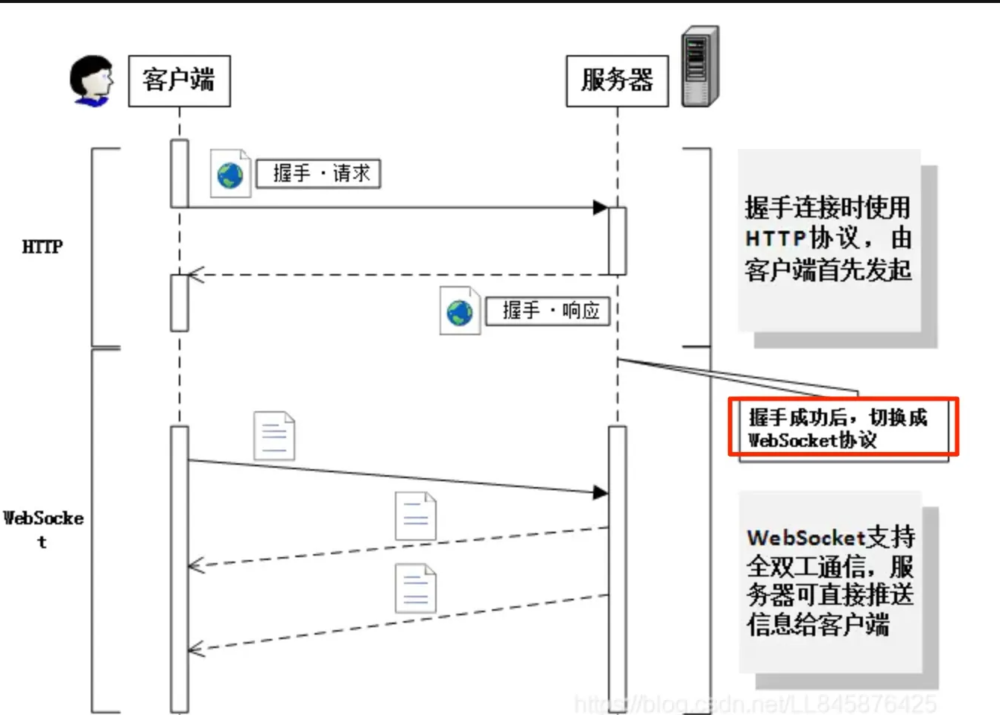

# 渲染、性能、网络

`#前端面试` 


## 目录
<!-- toc -->
 ## 1. 说说浏览器是如何把网页渲染到显示器上的 



## 2. 重排、重绘、直接在非主线程上执行合成动画操作

注意点：
- 主线程与非主线程
- 渲染路径：重排 >  重绘 > 合成，如下图
- 合成
	- 合成层的transform、opacity修改，只需要将多个图层再次合并，而后生成位图，最终展示到屏幕上




## 3. 渲染流程、渲染层、合成层、开启 GPU 加速的关系


### 3.1. 渲染过程概述

首先,让我们简要回顾一下浏览器的基本渲染过程:


1) 解析HTML构建DOM树
2) 解析CSS构建CSSOM树
3) 将DOM和CSSOM合并成渲染树(Render Tree)
4) 布局(Layout):计算每个可见元素的几何信息
5) 绘制(Paint):将渲染树中的各个节点绘制到屏幕上
6) 合成(Compositing):  将不同的绘制层合成到一起


### 3.2. 渲染层和合成层主要区别


### 3.3. 渲染层

渲染层的概念跟“层叠上下文”密切相关，简单来说，拥有z-index属性的定位元素会生成一个层叠上下文，一个生成层叠上下文的元素就生成了一个渲染层

形成`渲染层`的条件也就是形成层叠上下文的条件

- document 元素
- 拥有z-index 属性的定位元素（position: relative|fixed|sticky|absolute）
- 弹性布局的子项（父元素display:flex|inline-flex)，并且 z-index 不是auto时
- opacity 非 1 的元素
- transform 非 none的元素
- filter非none的元素
- will-change = opacity | transform | filter
- 此外需要剪裁的元素也会形成一个渲染层，也就是overflow不是visible的元素


### 3.4. 合成层(Compositing Layer)

- 定义: **可以独立于普通文档流中的其他层进行绘制和缓存**。
- 特点:  合成层的内容会被**缓存**为一个独立的图像,可以直接用于显示。
- 优势:   合成层的更新不会影响其他层,可以提高渲染性能。

#### 3.4.1. 在开发者工具看到的全部都是合成层



#### 3.4.2. 创建合成层的条件

下面这些条件属于生成渲染层的“加强版”，也就是说形成合成层的条件要更苛刻

| 条件                             | 说明                             | 示例                                                                                                   |
| ------------------------------ | ------------------------------ | ---------------------------------------------------------------------------------------------------- |
| 3D 或透视变换 CSS 属性                | 使用 3D 变换可以创建合成层                | `transform: translateZ(0);`<br>`transform: translate3d(0,0,0);`<br>`transform: perspective(1000px);` |
| 包含硬件加速的 2D 变换                  | 某些 2D 变换也可能触发合成层               | `transform: translateZ(0);`                                                                          |
| `will-change` 属性               | 预先告知浏览器元素可能发生的变化               | `will-change: transform;`<br>`will-change: opacity;`<br>`will-change: top, left, bottom, right;`     |
| 应用 `animation` 或 `transition`  | 对特定属性应用动画或过渡效果                 | 适用于 `opacity`, `transform`, `filter`, `backdrop-filter`                                              |
| `position: fixed`              | 固定定位的元素会创建合成层                  | `position: fixed;`                                                                                   |
| 具有 `alpha` 通道或使用 `mask`/`clip` | 半透明元素或使用遮罩/剪切的元素               | `opacity: 0.9;`<br>`mask-image: url(mask.png);`                                                      |
| 使用 CSS `filter` 属性             | 应用滤镜效果                         | `filter: blur(5px);`                                                                                 |
| 后代元素中存在合成层                     | 如包含 `<video>` 或 `<iframe>` 等标签 | `<div><video src="..."></video></div>`                                                               |
| CSS `reflection` 属性            | 使用倒影效果                         | `-webkit-box-reflect: below 1px linear-gradient(transparent, `#0004);``                                |
| `mix-blend-mode` 属性            | 设置元素的内容应该与父元素的内容混合             | `mix-blend-mode: multiply;`                                                                          |
| CSS 动画的 `@keyframe` 规则         | 使用关键帧动画                        | `@keyframes example { ... }`                                                                         |
| `<video>` 元素                   | 视频元素通常会创建合成层                   | `<video src="..."></video>`                                                                          |
| 使用 WebGL 的 `<canvas>` 元素       | WebGL 内容会触发合成层                 | `<canvas id="webgl-canvas"></canvas>`                                                                |
| 硬件加速的 `<iframe>` 元素            | 嵌入的 iframe 可能创建合成层             | `<iframe src="..."></iframe>`                                                                        |
| 使用剪裁（clip）或遮罩（mask）属性          | 应用复杂的剪裁或遮罩效果                   | `clip-path: circle(50%);`                                                                            |
| CSS 多列布局                       | 使用多列布局可能触发合成层                  | `column-count: 3;`<br>`column-width: 100px;`                                                         |
| CSS regions                    | 使用区域布局                         | 较少使用，主要在特定布局中                                                                                        |
| CSS `isolation` 属性             | 创建新的堆叠上下文                      | `isolation: isolate;`                                                                                |
| `z-index` 属性                   | 在某些情况下可能触发合成层                  | `z-index: 100;`                                                                                      |

### 3.5. GPU加速

- 定义:  GPU加速是指利用图形处理器(GPU)来加速页面渲染和动画执行。
- 原理:  通过将某些渲染任务转移到GPU上处理,可以显著提高性能。
- 触发: **创建合成层通常会触发GPU加速**。

创建合成层的条件和开启 GPU 3D 加速的条件虽然有很大的重叠，但并不完全相同，具体如下表：




### 3.6. 新开GPU加速

"新开GPU加速"通常指的是某个元素因为特定的CSS属性或DOM操作而创建了新的合成层,从而触发了GPU加速。这个过程包括:

1) 元素被提升为独立的**合成层**
2) 该层的渲染被转移到GPU上处理
3) GPU独立处理该层的绘制和合成

### 3.7. 实际应用和注意事项

- 性能优化: 合理使用合成层可以提高动画性能和页面滚动流畅度。
- 过度使用的问题:  创建过多的合成层可能会增加内存使用,反而降低性能。
- 调试工具:  Chrome DevTools的 "Layers"  面板可以帮助可视化和调试复合层

### 3.8. 代码示例

触发GPU加速的CSS示例:

```css
.gpu-accelerated {
  transform: translateZ(0);
  will-change: transform;
}
```

这段CSS会强制创建一个新的合成层,并触发GPU加速。

### 3.9. 最佳实践

- 只在需要的地方使用GPU加速
- 使用 will-change 属性来提前告知浏览器即将发生的变化
- 避免大量使用固定定位元素
- 对于不需要频繁重绘的元素, 考虑使用 opacity 和 transform 来实现动画效果

### 3.10. 注意项

如果有一个元素，它的兄弟元素在复合层中渲染，而这个兄弟元素的`z-index`比较小，那么这个元素（不管是不是应用了硬件加速样式）也会被放到复合层

换言之，浏览器有可能给复合层之后的所有相对或绝对定位的元素都创建一个`复合层`来渲染

所以，使用3D硬件加速提升动画性能时，最好给元素增加一个`z-index`属性，**人为干扰复合层的排序**，可以有效减少chrome创建不必要的复合层，提升渲染性能，移动端优化效果尤为明显

### 3.11. 复合层 = 合成层

## 4. 渲染相关的可优化点

- DOM元素`读写分离`
- 让进行大量动画的元素`脱离文档流，`减少重排开销
- 通过改变元素的`class或csstext一``次性的更改样式`
- `缓存DOM元素的位置信息`，避免不必要的属性读取
- 尽量使用`离线DOM`
- 使用`css3 transform`优化动画性能
- 精简DOM，合理布局
- 使用`transform`代替`left`、`top`减少使用引起页面重排的属性
- 开启`硬件加速`
- 尽量`避免浏览器创建不必要的图形层`
- 尽量减少`js动画`，如需要，使用对性能友好的`requestAnimationFrame`
- 使用`chrome performance工`具调试动画性能
- `requestIdleCallback(fn);`


## 5. RAIL  模型



- 用户的输入到响应的时间不超过`100ms`，给用户的感受是瞬间就完成了
	- 事件处理函数在`50ms`内完成
- 产生每一帧的时间不要超过`10ms`
	- 为了保证浏览器`60帧，`每一帧的时间在`16ms`左右，
	- 但浏览器需要用`6ms`来渲染每一帧
-  最大化空闲时间，以增大`50ms`内响应用户输入的几率
- 打开时间不超过5秒
	- 对于第二次打开，尽量不超过2秒

## 6. 性能优化思路

### 6.1. 缓存

- 本地缓存：localStorage、sessionStorage、indexedDB
- 内存缓存：Memory Cache
- Cache API：Service Worker
- HTTP 缓存
	- 强缓存：
		-  控制强制缓存的字段分别是`Expires`和`Cache-Control`，其中 `Cache-Control：max-age=xxx`优先级更高
		- 浏览器会在`js和图片等文件`解析执行后直接存入`内存缓存`中，即 `from Memory Cache`
		- css文件：每次渲染页面都需要从硬盘读取缓存，即 from disk cache
	- 协商缓存：
		- 即 问一问服务器本地资源可以用吗
			- 200 更新了
			- 304 没更新，直接用吧
		- `Etag / If-None-Match`的优先级比 `Last-Modified / If-Modified-Since`高
	- Push Cache ： HTTP2 支持，访问 index.html ，同时推送必要css 和 js 等
		- 


### 6.2. 客户端请求

- 避免过多多余重重定向
- `<link rel="dns-prefetch" href="//yourwebsite.com">`
- `<link rel="preconnect" href="//sample.com" crossorigin>`

### 6.3. 服务端响应

- 流响应
- 前端聚合与后端聚合：nodejs 局域网内聚合后端多个服务肯定快于 前端聚合，另外注意首屏数据就好
- Nodejs
	- 能并行的并行，少串行：async await 
	- 守护进程（pm2/supervisor）又将进程重启
	- 异常监控，少重启
	- 代码问题
		- JSON.parse 大对象
		- 闭包，内存泄漏

### 6.4. 静态资源

#### 6.4.1. js  
- 拆、按需加载  
- 合并压缩  
- Tree Shaking  
- 避免 Long Task  
- 反其道而行之，不用框架  
- 基础库代码打包合并  
#### 6.4.2. css  

- 避免使用昂贵的属性 ：border-radius box-shadow opacity transform filter position: fixed  
- flex 布局取代 float  
- 选择器简化  

#### 6.4.3. 图片

- 根据设备的分辨率优化图片大小  
- 使用图片的 缩略图  
- 首屏优先加载，懒加载
	- background-url  懒加载规则
		- 这个样式规则，如果不应用到具体的元素，浏览器不会去下载该图片。
		- 所以你可以通过切换 className 的方式，放心得进行 CSS 中图片的懒加载。
	- 自己实现
		- 
- 选择适合大小和分辨率
- 图片压缩，删除冗余信息，比如jpg大小能减少15%
- webp
- `svg`压缩

#### 6.4.4. 字体

- 最简单的优化方式是尽可能使用**系统字体**。这样可以避免额外的字体文件下载，从而提高页面加载速度
- 内联关键字体，`base64`
- 字体子集化（Subsetting）
	- 如果必须使用自定义字体，可以考虑字体子集化。这意味着只包含网站实际使用的字符，而不是整个字体文件
	- 不少工具支持
- 使用 WOFF2 格式的字体文件。这是目前压缩率最高的字体格式，可以显著减小文件大小
- 字体预加载：使用 `<link rel="preload">` 来预加载关键字体文件，这可以确保字体尽早开始下载
- 使用 `font-display` 属性来控制字体加载时的显示行为
- 异步加载非关键字体：使用 `new FontFace` 类似于 `new Image`

#### 6.4.5. 视频

- 压缩
- 选择合适格式
- 使用流

### 6.5. 运行时&页面渲染

- 使用 window.requestAnimationFrame 避免**同步布局**
- 批量化操作，或者说是 读写分离
- 长列表优化
- 任务分解：把 10 亿次分散为十个 1 亿次的子任务
	- 
- 非关键路径延迟执行：`setTimeout()/ requestIdleCallback`
- 新开线程辅助计算: `worker`
- 善用合成： `Composite`
	- 会交由 GPU 合成，比 CPU 处理要快
- 节流 和 防抖
- Passive event listeners 优化滚动性能
	- 随着移动端普及，浏览器在处理某些事件（如 scroll、touchstart、touchmove 等）时面临一个**困境**：
		- 浏览器不知道事件监听器是否会调用 preventDefault()
		- 为了安全起见，浏览器必须等待事件监听器执行完毕
		- 这导致了主线程阻塞，造成滚动响应延迟
	- 浏览器开发者面临一个两难选择：
		- 等待 JavaScript 执行完毕再滚动，保证正确性但牺牲性能
		- 立即滚动，提高性能但可能导致不正确的行为
	- 解决方案：
		- 当添加事件监听器时，指定 `{passive: true}` 选项
			- 允许开发者明确告知浏览器：事件监听器不会调用 preventDefault()
				- 即使 JavaScript 尝试调用 preventDefault()，也会被忽略
			- 浏览器可以立即开始滚动，而不必等待 JavaScript 执行


### 6.6. 预加载 与 预渲染

- `<link rel="preload" href="./nextpage.js" as="script">`
- `<link rel="preload" as="video" href="/static/sample.mp4">
- `<link rel="prerender" href="//sample.com/nextpage.html">`

## 7. websocket 与 HTTP 的区别

- 连接方式
	- ws：长连接、有状态
	- http：短连接、无状态
- 都基于 TCP，都使用 res/req 模型
- wss 与 https
- 传递方式：
	- http：文本 
	- http2：二进制
	- ws： 协议帧
- ws 使用 HTTP 建立连接，如下图
	- 

