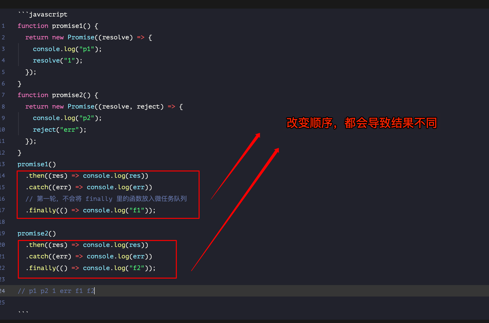
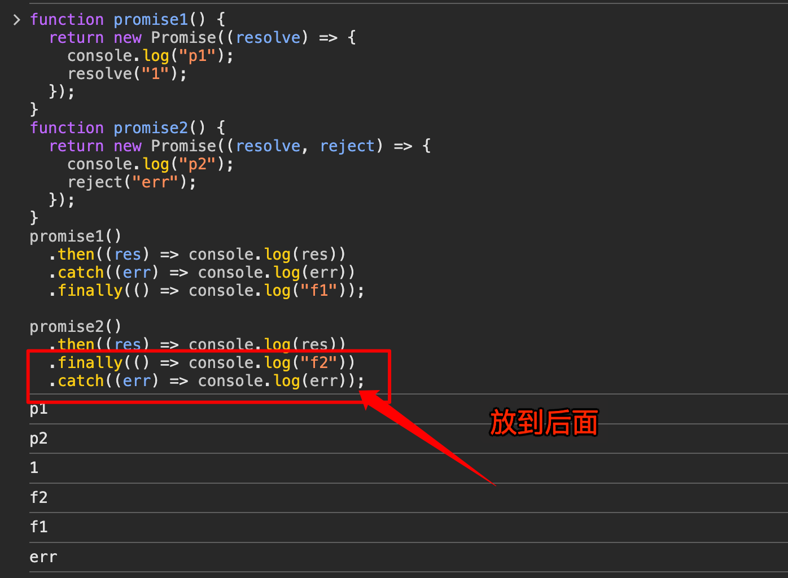

# JavaScript 异步编程：Promise 专题篇一

`#js` `#javascript` `#R2` 


## 目录
<!-- toc -->
 ## 1. 要点总结 

- `Promise`的状态一经改变就不能再改变
- `.then`和`.catch`都会返回一个新的`Promise`
- `catch`不管被连接到哪里，都能**捕获上层的错误**
	- 但也有可能被它上面的 then 的第二个参数捕获，捕获后 catch 就捕获不到错误了
- 在`Promise`中，返回任意一个非 `promise` 的值都会被包裹成 `promise` 对象
	- 例如`return 2`会被包装为`return Promise.resolve(2)`。
- `Promise` 的 `.then` 或者 `.catch` **可以被调用多次**,
	- 但如果`Promise`内部的状态一经改变，并且有了一个值
		- 那么后续每次调用`.then`或者`.catch`的时候==都会直接拿到该值==
			- 注意，状态改变了，后面仍然可以调用 then 和 catch，一直调用
- `.then` 或者 `.catch` 中 `return` 一个 `error` 对象并不会抛出错误
	- 所以不会被后续的 `.catch` 捕获 
- `.then` 或 `.catch` 返回的值不能是 **promise 本身**，否则会造成**死循环**
- `.then` 或者 `.catch` 的参数期望是函数，传入非函数则会发生**值透传**。
- `.then`方法是能接收两个参数的
	- 第一个是处理成功的函数
	- 第二个是处理失败的函数
	- 在某些时候你可以认为`catch`是`.then`第二个参数的简便写法
- `.finally`方法也是返回一个`Promise`
	- 他在`Promise`结束的时候，无论结果为`resolved`还是`rejected`，都会执行里面的回调函数
	- 它**不接受任何参数**

## 2. 打印 new Promise 的效果

```javascript hl:1
Promise { <fulfilled>: value }   // 注意：不是 Promise { <resolved> } 
Promise { <pending> }
Promise { <rejected>: reason }  
```

## 3. 没有 resolve 不会执行 then

```javascript hl:14
const promise = new Promise((resolve, reject) => {
  console.log(1);
  console.log(2);
});
promise.then(() => {
  console.log(3);
});
console.log(4);

//**************************************
// output:
// 1 2 4
//
// 3 不会被输出，因为 Promise 里面没有 resolve
//**************************************
```

## 4. resolve 后会执行 then

```javascript hl:16
const promise1 = new Promise((resolve, reject) => {
  console.log("promise1");
  resolve("resolve1");
});
const promise2 = promise1.then((res) => {
  console.log(res);
});
console.log("1", promise1);
console.log("2", promise2);

//**************************************
// output: 下面序号表示每次打印的顺序
// ① promise1
// ② 1 Promise { <resolved> }  // 因为 promise1 是 resolved 状态
// ③ 2 Promise { <pending> }   // 因为 promise2 是 pending 状态
// ④ resolve1  // 因为 promise1 是 resolved 状态，所以 promise2 的 then 方法会执行
//**************************************

```

## 5. `setTimeout` 里面嵌入 `Promise` 的场景


打印效果：

### 5.1. 左边代码

``` hl:4
'start'
'timer1'
'timer2'
'timer3'  // 这个还是最后执行，setTimeout 里面嵌入 setTimeout
```

### 5.2. 右边代码

``` hl:3
'start'
'timer1'
'promise'
'timer2'
```

## 6. `catch`不管被连接到哪里，都能捕获上层的错误，并且`catch()`也会返回一个`Promise`

### 6.1. catch函数里没有返回值

```javascript hl:13
const promise = new Promise((resolve, reject) => {
  reject("error");
  resolve("success2");
});
promise
  .then((res) => {
    console.log("then1: ", res);
  })
  .then((res) => {
    console.log("then2: ", res);
  })
  .catch((err) => {
    console.log("catch: ", err);
  })
  .then((res) => {
    console.log("then3: ", res);
  });

// Output:
// catch:  error
// then3:  undefined
```

### 6.2. catch函数里有返回值

```javascript hl:14,21
const promise = new Promise((resolve, reject) => {
  reject("error");
  resolve("success2");
});
promise
  .then((res) => {
    console.log("then1: ", res);
  })
  .then((res) => {
    console.log("then2: ", res);
  })
  .catch((err) => {
    console.log("catch: ", err);
    return "return catch";
  })
  .then((res) => {
    console.log("then3: ", res);
  });
// Output:
// catch:  error
// then3:  return catch

```

## 7. `return 2` 会被包装成`resolve(2)`

```javascript
Promise.resolve(1)
  .then((res) => {
    console.log(res);
    return 2; // 等价于 return resolve(2)
  })
  .catch((err) => {
    return 3;
  })
  .then((res) => {
    console.log(res);
  });
// output: 1 2
```

## 8. resolve 后每个 then 和 catch **能被调用多次**

- `Promise` 的 `.then` 或者 `.catch` **可以被调用多次**
- 但这里 `Promise` 构造函数只执行一次
- 或者说 `promise` 内部状态一经改变，并且有了一个值
	- 那么后续每次调用 `.then` 或者 `.catch` 都会直接拿到该值。

```javascript
const promise = new Promise((resolve, reject) => {
  setTimeout(() => {
    console.log("timer");
    resolve("success");
  }, 1000);
});
const start = Date.now();
promise.then((res) => {
  console.log(res, Date.now() - start);
});
promise.then((res) => {
  console.log(res, Date.now() - start);
});

// Output:
// timer
// success 1003
// success 1003 or success 1004

```

## 9. `return new Error('error!!!')` 不走 `reject`

```javascript
Promise.resolve()
  .then(() => {
    return new Error("error!!!");
  })
  .then((res) => {
    console.log("then: ", res);
  })
  .catch((err) => {
    console.log("catch: ", err);
  });

// Output:
// then:  Error: error!!!
```

## 10. 走 catch 的场景

```javascript hl:3,5
Promise.resolve()
  .then(() => {
    return Promise.reject(new Error("error!!!"));
    // or
    throw new Error("error!!!");
  })
  .then((res) => {
    console.log("then: ", res);
  })
  .catch((err) => {
    console.log("catch: ", err);
  });

// Output:
// catch:  Error: error!!!
```

>  `return Promise.reject(new Error("error!!!"));` 一定会走 catch ，别管 return ，因为会先执行 `Promise.reject`

## 11. 没有 catch ，也不会导致同步代码中断

```javascript hl:11
console.log(1);

setTimeout(() => console.log(2));

Promise.resolve().then(() => console.log(3));

Promise.resolve().then(() => setTimeout(() => console.log(4)));

Promise.resolve().then(() => {
  throw Error();
  console.log(5); // 不打印，但是 Promise 的错误会被 window unRejectError? 捕获
});

setTimeout(() => console.log(6));

console.log(7);

1 7
3 
2 6 
4

Uncaught (in promise) Error
```

> 关于 Promise 的错误捕获，更多参考，[22. window.onerror 和 window.addEventListener 的区别？](/post/Kt25kgey.html)

## 12. 死循环

```javascript hl:2
const promise = Promise.resolve().then(() => {
   // 返回了本身，会死循环
  return promise;
})
promise.catch(console.err)
```

## 13. 值穿透 

```javascript
// 发生了 值穿透
Promise.resolve(1)
  .then(2)
  .then(Promise.resolve(3))
  // console.log 是一个函数，它被作为参数传递给 .then()
  // 当 Promise 解析时，.then() 会调用这个函数，并将前一个 Promise 的值作为参数传入
  // 所以这里的 console.log 会打印出 1
  .then(console.log);
```

- `.then` 或者 `.catch` 的参数期望是`函数`，传入非函数则会发生**值透传**
- `.then()` 会**执行**传入的函数参数，并把参数传**递给它**

下面打印出 `4`

```javascript hl:5
Promise.resolve(1)  
    .then(2)  
    .then(Promise.resolve(3))  
    .then(() => {  
        return Promise.resolve(4);  
    }).then(console.log)  
  
// 打印结果 4
```

## 14. 需要注意是否有 reject 函数

> `.then()`方法的第二个参数`reject`也是可以捕获错误

```javascript hl:7,8,13
Promise.reject("err!!!")
  .then(
    (res) => {
      // 这里不会执行
      console.log("success", res);
    },
    // 这里会执行: error err!!!
    (err) => {
      console.log("error", err);
    },
  )
  .catch((err) => {
    // 所以，这里没错误可以捕获了
    console.log("catch", err);
  });

```

## 15. finally 虽然一定会执行，但还**是有顺序的** 

```javascript hl:13,20,3,7
Promise.resolve("2")
  .finally(() => {
    console.log("f2");
    return "3";
  })
  .then((res) => {
    console.log(res);
  });
// 打印结果 f2 2

```

```javascript
Promise.resolve("1")
  .finally(() => {
    console.log("f1");
    throw new Error("f1 error");
  })
  .then((res) => {
    console.log(res);
  })
  .catch((err) => {
    console.log(err);
  });

// 打印结果：
// f1
// VM327:10 Error: f1 error
//     at <anonymous>:4:11
//     at <anonymous>

```

## 16. `finally()`也是微任务队列

```javascript 
function promise1() {
  return new Promise((resolve) => {
    console.log("p1");
    resolve("1");
  });
}
function promise2() {
  return new Promise((resolve, reject) => {
    console.log("p2");
    reject("err");
  });
}
promise1()
  .then((res) => console.log(res))
  .catch((err) => console.log(err))
  // 第一轮，不会将 finally 里的函数放入微任务队列
  .finally(() => console.log("f1"));

promise2()
  .then((res) => console.log(res))
  .catch((err) => console.log(err))
  .finally(() => console.log("f2"));

p1 p2 
1 err 
f1 f2

```

## 17. 注意：每次碰到 then/catch/finally 都会产生一个栈，注意先后顺序，都有层级关系在的

> 比如上题



比如换个顺序，打印就不一样了，如下图



## 18. `.catch()`函数能够捕获到`.all()`里**最先**的那个异常，并且**只执行一次**

> [!danger]
> - 并不是只要有异常就完事了，每个都会执行
> - catch 只捕获最新的那个异常，并且执行一次
> - `Promise.all().then()`结果中数组的顺序和`Promise.all()`接收到的数组顺序一致

```javascript
function runAsync(x) {
  return new Promise((resolve) =>
    setTimeout(() => resolve(x, console.log(x)), 1000),
  );
}
function runReject(x) {
  return new Promise((resolve, reject) =>
    setTimeout(() => reject(`Error: ${x}`, console.log(x)), 1000 * x),
  );
}
Promise.all([runAsync(1), runReject(4), runAsync(3), runReject(2)])
  .then((res) => console.log(res))
  .catch((err) => console.log(err));

1; // 1s后输出
3; // 1s后输出
2; // 2s后输出
Error: 2; // 2s后输出
4; // 4s后输出

```

再看下面一段代码，第 4s 即使 reject 了，也不再触发17 行了

```javascript hl:14,17
function runAsync(x) {
  return new Promise((resolve) =>
    setTimeout(() => resolve(x, console.log(x)), 1000),
  );
}
function runReject(x) {
  return new Promise((resolve, reject) =>
    setTimeout(() => reject(`Error: ${x}`, console.log(x)), 1000 * x),
  );
}
Promise.all([runAsync(1), runReject(4), runAsync(3), runReject(2)])
  .then(
    (res) => console.log(res),
    // 添加 reject 回调函数参数
    (reason) => console.log("reject", reason),
  )
  // 这段代码不执行
  .catch((err) => console.log("catch:", err));

1; // 1s 后输出 1
3; // 1s 后输出 3
2; // 2s 后输出 2
reject Error: 2; // 2s 后输出 Error: 2
4; // 4s 后输出 4

```

现在，让我们解释为什么上面 `catch` 没有被触发：

1. `Promise.all` 的特性：
    - 当其中任何一个 Promise 被拒绝时，`Promise.all` 就会立即拒绝，并返回第一个被拒绝的 Promise 的原因。
    - 在这个例子中，`runReject(2)` 会在 2 秒后首先被拒绝。
2. `then` 方法的处理：
    - 您在 `then` 方法中提供了两个回调函数：
        - 一个用于成功（第一个参数）
        - 一个用于失败（第二个参数）。
    - 当 `Promise.all` 被拒绝时，它会调用 `then` 中的第二个回调函数（失败回调）。
    - 在这个例子中，失败回调 `(reason) => console.log("reject", reason)` 被调用。
3. 错误被处理：
    - 一旦错误在 `then` 的第二个回调中被处理，JavaScript 认为这个错误已经被"捕获"和"处理"了。
    - 因此，错误不会继续传播到后面的 `catch` 语句。
4. `catch` 的作用：
    - ==`catch` 主要用于捕获在前面的 `then` 链中未被处理的错误。==
    - 在这个例子中，错误已经在 `then` 的第二个回调中被处理了，所以 `catch` 不会被触发

> 总结就是：**Promise.all 只处理一个异常，其他的都被吞了**


### 注意：上面的写法很诱惑人


## 19. race **会获取最新有结论的任务**，然后走==后一个==then 或者 catch，其他的**正常执行**，==再之后==的 then和 catch 了,执行结果会被抛弃

```javascript
function runAsync(x) {
  return new Promise((r) => setTimeout(() => r(x, console.log(x)), 1000));
}
Promise.race([runAsync(1), runAsync(2), runAsync(3)])
  // 只需要有一个promise实例率先改变状态，新的Promise状态就跟着改变
  // 然后就会调用then方法，绑定回调函数
  // 之后就不会在理会其他promise实例的状态，但还是会继续执行
  // 只不过不走后面 then 和 catch 方法了
  .then((res) => console.log("result: ", res))
  .catch((err) => console.log(err));

// 1
// 'result: ' 1
// 2
// 3
```

## 20. `await async2()` 会立即同步执行 `async2`

```javascript hl:3
async function async1() {
  console.log("1");
  // 这里 async2() 会立即执行，所以立即同步打印 3
  await async2();
  console.log("2");
}
async function async2() {
  console.log("3");
}
async1();
console.log("4");
// 打印结果 1 3 4 2
```

## 21. 并不需要 sync 一定返回一个 promise，然后才执行下面的东西，因为 async 默认有返回值

```javascript
async function async1() {
  console.log("1");
  await async2();
  console.log("2");
}

// 并不需要 async2 一定返回一个 promise
// 下面这个没有返回值，那么返回 undefined
// async 函数 默认的返回 promise 
async function async2() {
  // 下一轮宏任务，所以最后执行
  setTimeout(() => {
    console.log("3");
  }, 0);
  console.log("4");
}
async1();
console.log("5");

1;
4;
5;
2;
3;
```

## 22. 注意 setTimeout(fn,0) 的第一次解析的顺序

```javascript hl:18,5
async function async1() {
  console.log("1");
  await async2();
  console.log("2");  // 肯定先于 3
  setTimeout(() => {
    console.log("3");
  }, 0);
}
async function async2() {
  setTimeout(() => {
    console.log("4");
  }, 0);
  console.log("5");
}

async1();

// 先于第 5 行解析到
setTimeout(() => {
  console.log("6");
}, 0);

console.log("7");

// 1 5 7 2 4 6 3

```

## 23. async 的返回值

```javascript
async function fn() {
  // return await 1234
  // 等同于 相等于 resolve(123)
  return 123;
}
fn().then((res) => console.log(res));
```

## 24. await new Promise() 注意有没有 resolve 或者 reject 

```javascript
async function async1() {
  console.log("1");
  // Promise是没有返回值的，也就是它的状态始终是pending状态
  // 因此相当于一直在await,后面的 3 和 4 不会被打印
  await new Promise((resolve) => {
    console.log("2");
    // 下面的注释放开就能正常打印所有的 log
    // resolve("22");
  });
  console.log("3");
  return "4";
}
console.log("5");
async1().then((res) => console.log(res));
console.log("6");

// 5 1 2 6

```

## 25. 如果在`async函数`中抛出了错误，则终止**错误结果**，不会继续向下执行

```javascript hl:3
async function async1() {
  await async2();
  // 下面都是执行了，因为 async2 报错了
  console.log("2");
  return "3";
}
async function async2() {
  return new Promise((resolve, reject) => {
    console.log("3");
    reject("e4");
  });
}
async1().then((res) => console.log(res));

// 3
// Uncaught (in promise) e4

```
