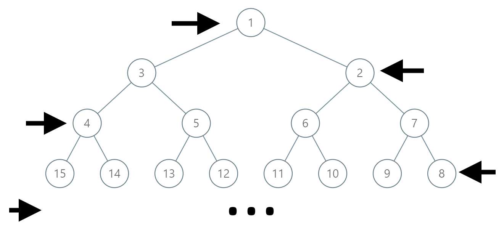

# 二叉树寻路：之字形状标序号


>  [1104. 二叉树寻路](https://leetcode.cn/problems/path-in-zigzag-labelled-binary-tree/)


## 目录
<!-- toc -->
 ## 题目 

```javascript
输入：label = 14
输出：[1,3,4,14]
```



## 代码

思路：**完全二叉树可以通过索引来模拟左右指针以及父节点指针**

```javascript
var pathInZigZagTree = function (label) {
    // 计算 label 所在的层级
    let level = Math.floor(Math.log2(label)) + 1;
    const res = [];
    // 将 label 加入结果
    res.unshift(label);
    // 当还没到达根节点时
    while (level > 1) {
        // 计算当前层的起始和结束节点
        const start = Math.pow(2, level - 1);
        const end = Math.pow(2, level) - 1;
        // 如果是偶数层，需要找到实际的位置
        if (level % 2 === 0) {
            label = start + (end - label);
        }

        // 找父节点
        label = Math.floor(label / 2);
        // 如果即将进入的是偶数层，需要翻转
        if ((level - 1) % 2 === 0) {
            const parentStart = Math.pow(2, level - 2);
            const parentEnd = Math.pow(2, level - 1) - 1;
            label = parentStart + (parentEnd - label);
        }
        res.unshift(label);
        level--;
    }
    return res;
};

```