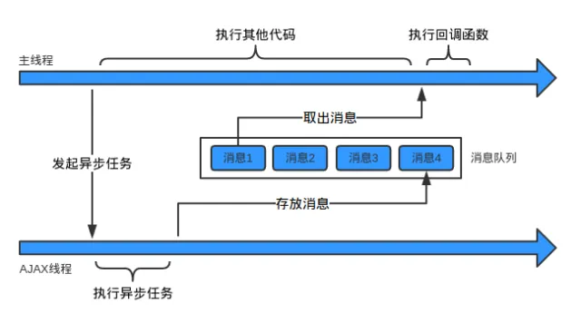

# 如何理解 JavaScript 的单线程


## 目录
<!-- toc -->
 ## 1. 前置知识：单核、多核、进程、线程、互斥锁、信号量、并发、并行 

### 1.1. 单核与多核

- 想象一个工厂的**生产线**：
	- 单核 CPU：就像一条生产线**只有一个工人**。这个工人需要一个接一个地完成所有任务。
	- 多核 CPU：相当于一条生产线上**有多个工人**。每个工人（核心）可以同时处理不同的任务，大大提高了整体效率。

### 1.2. 进程

把进程想象成一个**独立的烹饪项目**。
- 每个进程都有自己的"厨房"（**内存空间**）和"食材"（**资源**）。
- 比如，同时烤蛋糕和煮汤
	- 这两个就可以看作是两个不同的**进程**。

### 1.3. 线程

- 如果**进程**是一个烹饪项目
- 那么**线程**就是完成这个项目的**具体步骤**。
	- 一个进程可以包含多个线程
		- 就像烤蛋糕这个进程可能包含"搅拌面糊"、"预热烤箱"、"倒入模具"等多个步骤（线程）。
		- 这些步骤可以由一个厨师轮流进行，也可以由多个助手同时进行。

### 1.4. 互斥锁

- 想象一把**钥匙**，用来锁住一个**资源**。
- 当一个线程需要使用这个资源时，它必须先获得这把钥匙。
- 使用完后，它会归还钥匙，让其他线程使用。
- 这就保证了在任何时刻，只有一个线程能访问这个资源，防止了资源的混乱使用。

例如，在厨房里**只有一个烤箱**。当一个厨师在使用烤箱时，他会"锁住"烤箱，其他厨师就需要等待，直到烤箱空闲。

### 1.5. 信号量

信号量可以看作是一个**管理员**，控制着可同时访问某个资源的线程数量。

想象一个**停车场**，信号量就像是负责管理车位的工作人员：

- 如果还有空位（资源可用），他会允许车辆（线程）进入。
- 如果车位已满（资源耗尽），他会要求新来的车辆等待。
- 当有车离开时（资源被释放），他会允许等待的车辆进入。

**信号量比互斥锁更灵活**，因为它可以允许多个线程同时访问资源，而不仅仅是一个。

### 1.6. 并发与并行

- 并发：
	- 在`单核CPU`上，通过**快速切换不同的任务**，
	- 给人一种"同时"进行的**错觉**。
	- 就像一个厨师快速地在烤蛋糕和煮汤之间切换工作。
- 并行：
	- 在`多核CPU`上，不同的核心可以真正同时执行不同的任务。
	- 就像**多个厨师**在同一时间分别处理不同的菜品

### 1.7. 总结

操作系统的设计，因此可以归结为三点

- 以`多进程`形式，允许多个任务同时运行；
- 以`多线程`形式，允许单个任务分成不同的部分运行；
- **提供**`协调机制`
	- 一方面防止进程之间和线程之间产生冲突
	- 另一方面允许进程之间和线程之间共享资源

### 1.8. 进程与线程的主要区别

1. `进程`要分配**一大部分的**`内存`，而`线程`只需要分配`一部分栈`就可以了.
2. 一个 `程序`至少有一个`进程`, 一个`进程`至少有一个`线程`.
3. `进程`是**资源分配的最小单位**，`线程`是程序`执行的最小单位`。
4. 一个`线程`可以创建和撤销另一个`线程`，同一个`进程`中的多个`线程`之间可以**并发执行**.

## 2. 如何理解 JavaScript 的单线程？

### 2.1. 历史原因

JavaScript 最初是为了在浏览器中操作 DOM 而设计的

### 2.2. 如果是多线程的

一个线程在某个DOM节点上添加内容，另一个线程删除了这个节点，这时浏览器应该以哪个线程为准

### 2.3. 缺点

- 性能限制：在处理 CPU 密集型任务时，可能会导致页面卡顿
- 不能充分利用多核 CPU 的优势
- 可靠性较低：
	- 如果某个任务崩溃，可能会影响整个应用程序

### 2.4. 如何克服单线程的限制

- 事件循环和异步编程：
	- JavaScript 使用事件循环（Event Loop）和回调函数来处理异步操作
- Web Workers : 
	- 可以新开线程
- 异步 API：
	- 许多浏览器 API 和 Node.js API 都是异步的，允许非阻塞操作
- 服务器端解决方案：
	- 在 Node.js 环境中，可以使用**集群（Cluster）模块**或 **PM2** 等**进程管理工具**来创建多个进程，充分利用多核 CPU

### 2.5. Web Worker 线程

- 允许 JavaScript 脚本创建多个线程，
	- 但是子线程完全受主线程控制，且不得操作DOM。
- 这个新标准并没有改变 JavaScript 单线程的本质 

## 3. 事件循环与消息队列

- **消息队列：** 消息队列是一个先进先出的 `队列`，它里面存放着各种消息
- **事件循环：** 
	- 事件循环是指 `主线程` 重复从**消息队列**中取消息、执行的过程
	- 事件循环 是 JavaScript 引擎等待任务、执行任务和进入休眠状态等待更多任务的一种机制
	- JavaScript 是单线程的，**事件循环**使得它能够非阻塞地执行 I/O 操作



类似于下面代码：

```javascript
while(true) {     
  var message = queue.shift();     
  execute(message); 
}
```

## 4. 宏任务与微任务

```javascript hl:1
即 同步代码，一个宏任务，所有微任务，一个宏任务，所有微任务......
while (true) {
  宏任务队列.shift()
  微任务队列全部任务()
}
```

- 谁发起的
	- 宏任务：由宿主（Node 或者 浏览器）发起
	- 微任务：js 引擎发起
- 微任务是宏任务的组成部分，不能分开谈
- DOM 操作是同步任务
- `window.requestAnimationFrame()` 不能算宏任务也不能算微任务，而是一个**特定时机**
	- 你希望执行一个动画，并且要求浏览器在**下次重绘之前**调用指定的回调函数更新动画
	- 执行时机是在当前宏任务范围内,  执行完**同步代码和微任务队列后**再执行
		- 它仍然属于宏任务范围内，但是是在微任务队列执行完毕后才执行
- 常见的**宏任务**包括：
	- **script（整体代码**）
	- setTimeout/setInterval
	- I/O
	- UI 渲染
	- postMessage
	- setImmediate（Node.js 环境）
- 常见的微任务包括：
	- `Promise.then/catch/finally`
	- process.nextTick（Node.js 环境）
	- MutationObserver
	- queueMicrotask()
- 执行顺序：
	- a. 执行同步代码，这属于宏任务。
	- b. 执行栈为空，查询是否有微任务需要执行。
	- c. 执行所有微任务。
	- d. 必要的话进行 UI 渲染。
	- e. 然后开始下一轮事件循环，执行宏任务中的异步代码

### 4.1. Node.js 版本（v12 及以后）与浏览器环境中宏任务和微任务的区别

- 事件循环的基本结构：
	- 浏览器：事件循环相对简单，主要包括宏任务队列和微任务队列。
	- Node.js：事件循环更复杂，包含**多个阶段**（timers、pending callbacks、idle、prepare、poll、check、close callbacks）
- 宏任务和微任务的执行顺序
	- 都是在每个宏任务执行完毕后，会立即执行所有微任务
- Node.js 中的 `process.nextTick` 是一个特殊的微任务，**它的优先级高于其他微任务**。
	- 在每个阶段结束时，如果存在 nextTick 队列，会优先执行完 nextTick 队列中的所有任务，然后才会执行其他微任务
- Nodejs  中 ：
	-  同步任务 > `process.nextTick()` > 微任务
- 如果在一个 I/O 周期内调用
	- setImmediate 总是先于 setTimeout 执行，否则不确定

