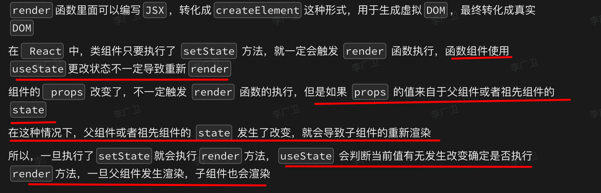

# 面试题

`#前端面试` 


## 目录
<!-- toc -->
 ## 1. mouseenter 与 mouseover 的区别 

### 1.1. 事件冒泡行为

   - mouseover：会冒泡
   - mouseenter：不会冒泡。它只在鼠标指针进入绑定事件的元素时触发，不会在进入其子元素时重复触发。

### 1.2. 触发频率

   - mouseover：当鼠标移动到元素或其子元素上时都会触发。
	   - 这意味着，如果一个元素有子元素，移动到子元素上也会触发父元素的 mouseover 事件。
   - mouseenter：
	   - 只有当鼠标从元素外部首次进入元素时才会触发。
	   - 移动到其子元素上不会重复触发该事件。

### 1.3. 相应的离开事件

   - mouseover 对应的离开事件是 `mouseout`
   - mouseenter 对应的离开事件是 `mouseleave`

### 1.4. 性能影响

   - mouseover：由于其冒泡特性和频繁触发的性质，在复杂的 DOM 结构中可能会导致性能问题。
   - mouseenter：通常具有更好的性能，因为它不会在子元素间移动时重复触发。

### 1.5. 使用场景

   - mouseover：
	   - 适用于**需要精确跟踪鼠标在元素内部移动的情况**，
	   - 或者当你需要利用事件冒泡来处理大量元素的情况。
   - mouseenter：适用于只需要知道鼠标是否进入了整个元素区域的情况，而不关心内部的移动。

## 2. 如何使得`var [a,b] = {a:1,b:2}` 解构成功


## 3. Vue3 中 created 和 mounted 这两个生命周期钩子的区别

### 3.1. 执行时机不同

```javascript hl:18
// Options API 方式
export default {
  created() {
    // 在实例创建完成后被立即调用
    // 此时组件实例已经创建完成，但还没有挂载到 DOM
  },
  mounted() {
    // 在组件被挂载到 DOM 后调用
    // 此时可以访问到真实的 DOM 元素
  }
}

// Composition API 方式
import { onMounted } from 'vue'

export default {
  setup() {
    // 相当于 created
    console.log('setup执行，组件创建完成')
    
    onMounted(() => {
      // 组件挂载到 DOM 后执行
      console.log('组件已挂载到 DOM')
    })
  }
}
```

### 3.2. 可访问的内容不同

```javascript
export default {
  data() {
    return {
      message: 'Hello'
    }
  },
  created() {
    // ✅ 可以访问响应式数据
    console.log(this.message)
    
    // ❌ 不能访问 DOM
    console.log(this.$el) // undefined
    
    // ✅ 可以进行数据请求
    this.fetchData()
  },
  mounted() {
    // ✅ 可以访问响应式数据
    console.log(this.message)
    
    // ✅ 可以访问 DOM
    console.log(this.$el)
    console.log(document.getElementById('app'))
    
    // ✅ 可以进行 DOM 操作
    this.$el.querySelector('.title').style.color = 'red'
  }
}
```

### 3.3. 使用场景不同

```javascript
export default {
  created() {
    // 适合做的事情：
    // 1. 初始化数据
    this.initData()
    
    // 2. 进行数据请求
    this.fetchUserInfo()
    
    // 3. 添加事件监听（不涉及 DOM）
    window.addEventListener('resize', this.handleResize)
  },
  mounted() {
    // 适合做的事情：
    // 1. DOM 操作
    this.$refs.myInput.focus()
    
    // 2. 第三方库初始化（需要 DOM）
    new Chart(this.$refs.chart)
    
    // 3. 需要元素尺寸的计算
    this.elementWidth = this.$el.offsetWidth
  }
}
```

### 3.4. 在异步组件中的表现

```javascript hl:7
// AsyncComponent.vue
export default {
  async setup() {
    const data = await fetchData() // 异步操作
    
    onMounted(() => {
      // 只有在异步操作完成并组件挂载后才会执行
      console.log('组件挂载完成')
    })
    
    return { data }
  }
}
```

### 3.5. 父子组件的执行顺序

```javascript
// Parent.vue
export default {
  created() {
    console.log('Parent created')
  },
  mounted() {
    console.log('Parent mounted')
  }
}

// Child.vue
export default {
  created() {
    console.log('Child created')
  },
  mounted() {
    console.log('Child mounted')
  }
}

// 执行顺序：
// 1. Parent created
// 2. Child created
// 3. Child mounted
// 4. Parent mounted
```

### 3.6. 主要区别总结

1. 执行时机：
   - created：在组件实例创建完成后立即执行
   - mounted：在组件挂载到 DOM 后执行
2. DOM 访问：
   - created：无法访问 DOM，因为组件还未挂载
   - mounted：可以访问 DOM，组件已经挂载完成
3. 适用场景：
   - created：
     * 初始化数据
     * 数据请求
     * 设置事件监听（不涉及 DOM）
   - mounted：
     * DOM 操作
     * 第三方库初始化（需要 DOM）
     * 需要访问子组件
     * 需要元素尺寸计算
4. Composition API 中：
   - created 钩子对应 setup 函数本身
   - mounted 钩子对应 onMounted 函数
5. 注意事项：
   - 在 created 中进行的数据请求可能导致**页面闪烁**
   - mounted 不保证**所有子组件都已挂载完成**，如需要可以使用 nextTick

### 3.7. 使用建议

1. 如果不需要访问 DOM，优先在 created 中进行数据初始化和请求
2. 涉及 DOM 操作的逻辑都放在 mounted 中
3. 使用 Composition API 时，优先考虑使用 setup + onMounted 的组合
4. 需要在服务器端渲染时，要注意 mounted 钩子只会在客户端执行

## 4. Node.js 在使用 ES modules 时要求加上文件扩展名有几个重要原因

### 4.1. 明确性和性能

Node.js 要求在导入 ES modules 时使用文件扩展名，主要是为了提高模块解析的明确性和性能。

```javascript
// 正确的导入方式
import { someFunction } from './myModule.js';

// 错误的导入方式（在 ES modules 中）
import { someFunction } from './myModule'; // 这将导致错误
```

通过明确指定文件扩展名，Node.js 可以直接定位到正确的文件，而不需要尝试多种可能的文件扩展名。这样可以减少文件系统的查找次数，提高模块加载的效率。

### 4.2. 与浏览器环境的一致性

在浏览器环境中，使用 ES modules 时通常需要指定完整的文件名（包括扩展名）。Node.js 采用相同的方式可以保持与浏览器环境的一致性，使得代码在不同环境中的行为更加一致。

```html hl:2
<!-- 在浏览器中 -->
<script type="module" src="./myModule.js"></script>
```

### 4.3. 避免歧义

在 Node.js 中，不同的文件扩展名可能对应不同的模块类型或处理方式。例如，`.js`、`.mjs`、`.cjs` 分别可能表示不同的模块系统。通过明确指定扩展名，可以避免潜在的歧义。

```javascript
import { func1 } from './module1.js';  // ES module
import { func2 } from './module2.mjs'; // ES module（显式）
const { func3 } = require('./module3.cjs'); // CommonJS module
```

### 4.4. 简化模块解析逻辑

通过要求明确的文件扩展名，Node.js 可以简化其模块解析逻辑。这不仅提高了性能，还减少了可能的错误和意外行为。

### 4.5. 区分文件类型

在一个项目中，可能存在同名但不同类型的文件（如 `data.json` 和 `data.js`）。强制使用扩展名可以明确指定要导入的确切文件。

```javascript
import data from './data.json';
import { processData } from './data.js';
```

### 4.6. 未来兼容性

这种做法为未来可能出现的新文件类型或模块系统留下了扩展空间，而不会破坏现有的导入语句。

## 5. package.json 文件中的 devDependencies 和 dependencies

### 5.1. 主要区别

- dependencies：
  * **运行时**必需的依赖
  * 会被打包到生产环境
  * 项目运行必须的包
- devDependencies：
  * **开发时**需要的依赖
  * 不会被打包到生产环境
  * 仅在开发过程中使用的包

### 5.2. 安装命令的区别

```bash
# 安装到 dependencies
npm install axios --save
# 或
npm install axios -S
# 或
npm install axios

# 安装到 devDependencies
npm install webpack --save-dev
# 或
npm install webpack -D
```

### 5.3. 典型使用场景

dependencies 适用于：
```json
{
  "dependencies": {
    // 运行时框架
    "vue": "^3.3.0",
    "react": "^18.2.0",
    
    // 功能性库
    "axios": "^1.5.0",
    "lodash": "^4.17.21",
    
    // UI 组件库
    "element-plus": "^2.3.0",
    "ant-design-vue": "^4.0.0",
    
    // 路由
    "vue-router": "^4.2.0",
    
    // 状态管理
    "vuex": "^4.1.0"
  }
}
```

devDependencies 适用于：
```json
{
  "devDependencies": {
    // 构建工具
    "webpack": "^5.88.0",
    "vite": "^4.4.0",
    
    // 代码检查
    "eslint": "^8.45.0",
    "prettier": "^3.0.0",
    
    // 测试工具
    "jest": "^29.6.0",
    "vitest": "^0.34.0",
    
    // 类型定义
    "@types/node": "^20.4.0",
    
    // 开发服务器
    "webpack-dev-server": "^4.15.0",
    
    // 编译器/转译器
    "typescript": "^5.1.0",
    "babel-loader": "^9.1.0"
  }
}
```

### 5.4. 环境影响

开发环境：
```bash
# 安装所有依赖
npm install
# 会同时安装 dependencies 和 devDependencies 中的所有包
```

生产环境：
```bash
# 只安装 dependencies
npm install --production
# 或
NODE_ENV=production npm install
```

### 5.5. 项目部署考虑

```json hl:4
{
  "scripts": {
    "build": "webpack --mode production",
    "deploy": "npm ci --production && node server.js"
  }
}
```

在部署时，通常只需要安装 dependencies，可以减少安装包的大小和时间。

### 5.6. 依赖分类的建议

```json
{
  "dependencies": {
    // 1. 项目运行必需的框架和库
    "vue": "^3.3.0",
    // 2. 生产环境需要的功能模块
    "axios": "^1.5.0",
    // 3. 用户交互必需的UI组件
    "element-plus": "^2.3.0"
  },
  "devDependencies": {
    // 1. 开发工具和构建工具
    "webpack": "^5.88.0",
    // 2. 代码质量和测试工具
    "eslint": "^8.45.0",
    // 3. 类型定义文件
    "@types/node": "^20.4.0"
  }
}
```

### 5.7. 注意事项

#### 5.7.1. 依赖版本管理

```json
{
  "dependencies": {
    "package1": "^1.0.0",  // 自动更新小版本和补丁版本
    "package2": "~1.0.0",  // 只更新补丁版本
    "package3": "1.0.0"    // 固定版本
  }
}
```

#### 5.7.2. 安全考虑

```bash hl:2,3
# 定期更新依赖以修复安全漏洞
npm audit
npm audit fix

# 使用 package-lock.json 锁定版本
npm ci

# 开发环境
npm install  # 可以使用 npm install

# 测试/构建/部署环境
npm ci  # 推荐使用 npm ci

# 团队协作
git add package-lock.json  # 确保将 package-lock.json 提交到版本控制

```

### 5.8. 使用 npm ci 

```markdown hl:7,6
# npm install
- 会修改 package-lock.json
- 可以安装单个包
- 可以在没有 package-lock.json 的情况下工作

# npm ci
- 严格按照 package-lock.json 安装
- 不能安装单个包
- 必须有 package-lock.json
- 安装前会删除 node_modules

```

## 6. 为什么 React 需要 Fiber 架构，而 Vue 似乎不需要类似的机制

### 6.1. React 的特点和挑战

React 的核心理念是：

```javascript
UI = f(state)
```

这意味着 React 在**每次状态变化时都会重新渲染整个组件树**。

这种方法简单直接，但也带来了一些挑战：

```jsx
// React 组件示例
function App() {
  const [count, setCount] = useState(0);
  
  return (
    <div>
      <h1>Count: {count}</h1>
      <button onClick={() => setCount(count + 1)}>Increment</button>
      <LargeList items={generateItems(1000)} />
    </div>
  );
}
```

在这个例子中，即使只是更新了 `count`，React 也会重新渲染整个组件树，包括 `LargeList`。

### 6.2. Fiber 架构的必要性

Fiber 架构主要解决了以下问题：

#### 6.2.1. 大型应用的性能问题

```javascript
// 模拟大量计算
function heavyComputation() {
  let result = 0;
  for (let i = 0; i < 1000000000; i++) {
    result += Math.random();
  }
  return result;
}

function SlowComponent() {
  const result = heavyComputation();
  return <div>{result}</div>;
}
```

在旧的架构中，这种计算可能会阻塞主线程，导致页面卡顿。

#### 6.2.2. 优先级调度

```jsx
<div>
  <UserInfo />  // 高优先级
  <Newsfeed />  // 低优先级
  <Sidebar />   // 低优先级
</div>
```

Fiber 允许 React 根据优先级调度更新。

#### 6.2.3. 可中断的渲染过程

```javascript
// Fiber 允许将渲染工作分解成小单元
let nextUnitOfWork = null;

function workLoop(deadline) {
  while (nextUnitOfWork && deadline.timeRemaining() > 0) {
    nextUnitOfWork = performUnitOfWork(nextUnitOfWork);
  }
  requestIdleCallback(workLoop);
}

requestIdleCallback(workLoop);
```

### 6.3. Vue 的不同之处

Vue 采用了不同的策略：

#### 6.3.1. 细粒度的依赖追踪

```vue
<template>
  <div>
    <h1>{{ count }}</h1>
    <button @click="increment">Increment</button>
    <large-list :items="items" />
  </div>
</template>

<script>
export default {
  data() {
    return {
      count: 0,
      items: []
    }
  },
  methods: {
    increment() {
      this.count++
    }
  }
}
</script>
```

Vue 能够**精确地知道**哪些组件依赖于 `count`，只更新必要的部分。

#### 6.3.2. 异步更新队列

```javascript
// Vue 内部的更新队列机制
let queue = [];
let waiting = false;

function queueJob(job) {
  if (!queue.includes(job)) {
    queue.push(job);
    if (!waiting) {
      waiting = true;
      Promise.resolve().then(flushJobs);
    }
  }
}

function flushJobs() {
  for (let i = 0; i < queue.length; i++) {
    queue[i]();
  }
  queue = [];
  waiting = false;
}
```

Vue 通过这种机制来批量处理更新，减少不必要的渲染。

#### 6.3.3. 编译时优化

```vue
<template>
  <div>
    <p>Static content</p>
    <p>{{ dynamicContent }}</p>
  </div>
</template>
```

Vue 的模板编译器可以在编译时识别静态内容，从而减少运行时的工作。

### 6.4. 总结比较

React（使用 Fiber）:
- 适合大型、复杂的应用
- 提供更细粒度的控制和调度
- 能够处理长时间运行的任务而不阻塞 UI
Vue:
- 依赖追踪系统更精确
- 默认情况下性能已经很好
- 编译时优化减少了运行时的工作量

### 6.5. 结论

React 需要 Fiber 架构主要是因为它的设计理念（**整体重新渲染**）带来的挑战。Fiber 使 React 能够更好地控制渲染过程，提高大型应用的性能。

Vue 通过其响应式系统和编译时优化，在大多数情况下已经能够提供良好的性能，因此不需要像 Fiber 这样复杂的架构。

然而，这并不意味着 Vue 完全不需要类似的优化。事实上，Vue 3 引入了 Composition API 和基于 Proxy 的响应式系统，这些也是为了提高性能和灵活性。但总的来说，Vue 的设计使得它不需要像 Fiber 这样彻底的架构改变。

## 7. React 中的 Portal  的点击事件，同样冒泡到在事件冒泡方面


首先，让我们明确一下什么是 Portal：

```jsx
import ReactDOM from 'react-dom';

function Modal({ children }) {
  return ReactDOM.createPortal(
    children,
    document.getElementById('modal-root')
  );
}
```

Portal 允许我们将子节点渲染到存在于父组件以外的 DOM 节点中。

现在，关于你的问题：**在 React 中，即使子组件是一个 Portal，发生在其中的点击事件仍然能够冒泡到父组件。**

这看起来可能有点反直觉，因为在 DOM 结构中，Portal 的内容实际上是在父组件之外的。但是 React 特意设计了这种行为，以保持一致性和方便性。

这种行为有几个重要的特点：

1. **一致性**：无论子组件是否通过 Portal 渲染，事件冒泡的行为都是一致的。这使得开发者可以更容易地理解和预测事件的流动。
2. **灵活性**：你可以在 Portal 内部处理事件，同时也可以让事件冒泡到 Portal 之外的父组件。
3. **控制**：如果你不想让事件冒泡到 Portal 外部，你可以在 Portal 内部的事件处理函数中调用 `e.stopPropagation()`。
4. **注意 DOM 结构**：虽然在 React 的事件系统中事件会冒泡，但在实际的 DOM 结构中，Portal 的内容是在父组件之外的。这意味着如果你使用原生 DOM 事件监听器，行为可能会有所不同。

总结：
- 在 React 中，Portal 内部的事件可以冒泡到 Portal 外部的父组件。
- 这是 React 特意设计的行为，为了保持一致性和方便性。
- 你可以使用 `e.stopPropagation()` 来阻止事件冒泡，如果需要的话。
- 这个行为是 React 事件系统的特性，与实际的 DOM 结构无关。

这种设计使得 Portal 在保持灵活性的同时，也能够与 React 的组件树结构保持一致的事件传播行为。

## 8. React 为什么要废弃 componentwillMount、componentWillReceiveProps、componentWillUpdate 这三个生命周期钩子？它们有哪些问题呢？ React 又是如何解决的呢？


## 9. React render 方法的原理和触发时机

### 9.1. Render 方法的基本原理

React 的 render 方法主要负责将组件转换为虚拟 DOM（Virtual DOM）：

```jsx hl:3,15
// 类组件中的 render
class MyComponent extends React.Component {
  render() {
    return (
      <div>
        <h1>{this.props.title}</h1>
        <p>{this.props.content}</p>
      </div>
    );
  }
}

// 函数组件
function MyFunctionalComponent(props) {
  // 整个函数体相当于 render 方法
  return (
    <div>
      <h1>{props.title}</h1>
      <p>{props.content}</p>
    </div>
  );
}
```

### 9.2. Render 的执行过程

```jsx
// 简化的 render 过程
const render = (Component, props) => {
  // 1. 执行 render 方法，获取虚拟 DOM
  const vdom = Component(props);
  
  // 2. 对比虚拟 DOM（Diffing）
  const patches = diff(previousVDOM, vdom);
  
  // 3. 更新真实 DOM
  patch(realDOM, patches);
}
```

### 9.3. Render 的触发时机

#### 9.3.1. 首次渲染

```jsx
// 组件首次挂载时
ReactDOM.render(
  <App />,
  document.getElementById('root')
);
```

#### 9.3.2. Props 改变

```jsx
function Parent() {
  const [count, setCount] = useState(0);
  
  return (
    <Child count={count} /> // props 改变会触发 Child 重新渲染
  );
}
```

#### 9.3.3. State 改变

```jsx
function Counter() {
  const [count, setCount] = useState(0);
  
  return (
    <div>
      <p>{count}</p>
      <button onClick={() => setCount(count + 1)}>
        Increment
      </button>
    </div>
  );
}
```

#### 9.3.4. 父组件重新渲染

```jsx
function Parent() {
  const [update, setUpdate] = useState(0);
  
  return (
    <div>
      <Child /> {/* Parent 重新渲染会导致 Child 也重新渲染 */}
      <button onClick={() => setUpdate(update + 1)}>
        Update Parent
      </button>
    </div>
  );
}
```

#### 9.3.5. 性能优化方法

##### 9.3.5.1. React.memo 用于函数组件
```jsx
const MemoizedComponent = React.memo(function MyComponent(props) {
  return (
    <div>{props.value}</div>
  );
});
```

##### 9.3.5.2. PureComponent 用于类组件

```jsx
class MyPureComponent extends React.PureComponent {
  render() {
    return (
      <div>{this.props.value}</div>
    );
  }
}
```

##### 9.3.5.3. shouldComponentUpdate 用于自定义更新逻辑

```jsx
class MyComponent extends React.Component {
  shouldComponentUpdate(nextProps, nextState) {
    return this.props.value !== nextProps.value;
  }
  
  render() {
    return (
      <div>{this.props.value}</div>
    );
  }
}
```

### 9.4. 常见的渲染优化问题

#### 9.4.1. 避免在渲染中创建新对象或函数
```jsx
// 不好的写法
function BadComponent() {
  return (
    <button onClick={() => console.log('clicked')}>  // 每次渲染都创建新函数
      Click me
    </button>
  );
}

// 好的写法
function GoodComponent() {
  const handleClick = useCallback(() => {
    console.log('clicked');
  }, []);
  
  return (
    <button onClick={handleClick}>
      Click me
    </button>
  );
}
```

#### 9.4.2. 使用 useMemo 缓存计算结果
```jsx
function ExpensiveComponent({ data }) {
  const processedData = useMemo(() => {
    return data.map(item => expensiveCalculation(item));
  }, [data]);
  
  return <div>{processedData}</div>;
}
```

### 9.5. 渲染阶段的生命周期

对于类组件，render 相关的生命周期方法执行顺序：
```jsx
class LifecycleComponent extends React.Component {
  // 1. 在 render 之前
  static getDerivedStateFromProps(props, state) {
    return null;
  }
  
  // 2. 判断是否需要更新
  shouldComponentUpdate(nextProps, nextState) {
    return true;
  }
  
  // 3. render 方法
  render() {
    return <div>Content</div>;
  }
  
  // 4. render 后，更新前
  getSnapshotBeforeUpdate(prevProps, prevState) {
    return null;
  }
  
  // 5. 更新后
  componentDidUpdate(prevProps, prevState, snapshot) {
  }
}
```

### 9.6. 总结

1. Render 方法是 React 组件的核心，负责生成虚拟 DOM。
2. 触发时机包括：首次渲染、props 变化、state 变化、父组件重渲染。
3. React 提供了多种优化方法来避免不必要的渲染。
4. 合理使用这些优化方法可以显著提升应用性能。
5. 理解渲染原理和触发时机对于编写高性能的 React 应用至关重要。



## 10. 详细解释 RESTful 接口规范

RESTful（Representational State Transfer）是一种设计 Web 服务的架构风格，它提供了一套规则来创建可扩展的 Web API。以下是 RESTful 接口规范的主要方面：

### 10.1. 资源（Resources）

RESTful API 的核心概念是**资源**。每个资源都应该有一个唯一的 URI（统一资源标识符）。

**系统中所有事务都是资源**

例如：
```
/users         // 用户集合
/users/123     // 特定用户
/articles      // 文章集合
/articles/456  // 特定文章
```

### 10.2. HTTP 方法（HTTP Methods）

使用标准的 HTTP 方法来对资源进行操作：

- GET：获取资源
- POST：创建新资源
- PUT：更新资源（全量更新）
- PATCH：部分更新资源
- DELETE：删除资源

例如：

```
GET /users         // 获取所有用户
POST /users        // 创建新用户
GET /users/123     // 获取特定用户
PUT /users/123     // 更新特定用户
DELETE /users/123  // 删除特定用户
```

### 10.3. 无状态（Stateless）

每个请求应该包含所有必要的信息，服务器不应该在不同请求之间保存客户端状态。

### 10.4. 统一接口（Uniform Interface）

API 应该有一个一致的接口，这包括：

- 资源标识
- 通过表述来操作资源
- 自描述消息
- 超媒体作为应用状态引擎（HATEOAS）

### 10.5. 响应状态码（Response Status Codes）

使用适当的 HTTP 状态码来表示请求的结果：

```
200 OK              // 成功
201 Created         // 创建成功
204 No Content      // 成功但无返回内容
400 Bad Request     // 客户端错误
401 Unauthorized    // 未授权
403 Forbidden       // 禁止访问
404 Not Found       // 资源不存在
500 Internal Server Error  // 服务器错误
```

### 10.6. 数据格式（Data Formats）

通常使用 JSON 作为数据交换格式，但也可以支持其他格式如 XML。

```json
{
  "id": 123,
  "name": "John Doe",
  "email": "john@example.com"
}
```

### 10.7. 版本控制（Versioning）

在 URI 中包含 API 版本：

```
/api/v1/users
/api/v2/users
```

### 10.8. 过滤、排序和分页（Filtering, Sorting, and Pagination）

使用查询参数来实现：

```
/users?role=admin          // 过滤
/users?sort=name_asc       // 排序
/users?page=2&limit=20     // 分页
```

### 10.9. 错误处理（Error Handling）

提供清晰和一致的错误消息：

```json
{
  "error": {
    "code": 404,
    "message": "User not found"
  }
}
```

### 10.10. 安全性（Security）

使用 HTTPS 来加密所有通信。对于需要认证的端点，使用 token 或 OAuth 等机制。

### 10.11. 文档（Documentation）

提供完整和清晰的 API 文档，包括每个端点的描述、参数、响应格式等。

### 10.12. 实际应用示例

假设我们有一个博客 API，下面是一些符合 RESTful 规范的端点设计：

```
GET /api/v1/posts           // 获取所有文章
GET /api/v1/posts?author=john&sort=date_desc  // 获取 John 的文章，按日期降序排列
POST /api/v1/posts          // 创建新文章
GET /api/v1/posts/789       // 获取特定文章
PUT /api/v1/posts/789       // 更新特定文章
DELETE /api/v1/posts/789    // 删除特定文章
GET /api/v1/posts/789/comments  // 获取特定文章的评论
POST /api/v1/posts/789/comments // 为特定文章添加评论
```

遵循这些 RESTful 接口规范可以使你的 API 更加一致、可预测和易于使用，从而提高开发效率和系统的可维护性。

## 11. 实现一个压缩算法，比如 aabcccccaaa会变为a2b1c5a3

### 11.1. 方法一：分割成数组遍历

### 11.2. 方法二：直接遍历字符串


## 12. new 操作具体干了什么

如下图：发生了 4 件事情


## 13. Webpack 5 的主要更新和新特性

### 13.1. 持久化缓存（Persistent Caching）

Webpack 5 引入了更好的**持久化缓存机制**，可以显著提升构建性能：

```javascript hl:4
// webpack.config.js
module.exports = {
  cache: {
    type: 'filesystem', // 使用文件系统缓存
    buildDependencies: {
      config: [__filename] // 构建依赖
    },
    name: 'my-cache' // 缓存名称
  }
}
```

### 13.2. 资源模块（Asset Modules）

取代了 file-loader、url-loader 和 raw-loader，直接内置支持资源文件：

```javascript hl:7
// webpack.config.js
module.exports = {
  module: {
    rules: [
      {
        test: /\.(png|jpg|gif)$/i,
        type: 'asset', // 可选 'asset/resource'、'asset/inline'、'asset/source'
        parser: {
          dataUrlCondition: {
            maxSize: 8 * 1024 // 8kb
          }
        }
      }
    ]
  }
}
```

### 13.3. 模块联邦（Module Federation） 

允许多个独立的构建可以组成一个应用程序：

```javascript
// host/webpack.config.js
const ModuleFederationPlugin = require('webpack/lib/container/ModuleFederationPlugin');

module.exports = {
  plugins: [
    new ModuleFederationPlugin({
      name: 'host',
      remotes: {
        app1: 'app1@http://localhost:3001/remoteEntry.js'
      }
    })
  ]
}

// remote/webpack.config.js
module.exports = {
  plugins: [
    new ModuleFederationPlugin({
      name: 'app1',
      filename: 'remoteEntry.js',
      exposes: {
        './Button': './src/Button'
      }
    })
  ]
}
```

#### 13.3.1. Tree Shaking 优化

改进了 Tree Shaking 机制，支持更多场景：

```javascript
// package.json
{
  "sideEffects": [
    "*.css",
    "*.scss"
  ]
}

// webpack.config.js
module.exports = {
  optimization: {
    usedExports: true,
    minimize: true
  }
}
```

### 13.4. 更好的代码生成

支持 ECMAScript 模块的输出：

```javascript hl:6,7
module.exports = {
  experiments: {
    outputModule: true
  },
  output: {
    library: {
      type: 'module'
    }
  }
}
```

### 13.5. Node.js Polyfills 自动加载被移除

不再自动引入 Node.js polyfills：

```javascript
// webpack.config.js
module.exports = {
  resolve: {
    fallback: {
      "http": require.resolve("stream-http"),
      "https": require.resolve("https-browserify"),
      "stream": require.resolve("stream-browserify")
    }
  }
}
```

### 13.6. 顶层 await 支持

支持在异步模块中使用顶层 await：

```javascript
// 支持直接在模块顶层使用 await
const data = await fetch('https://api.example.com/data');
export { data };
```

### 13.7. 改进的开发体验

更好的错误提示和开发工具支持：

```javascript
module.exports = {
  stats: {
    errorDetails: true
  }
}
```

### 13.8. 新的 WebAssembly 支持

改进了对 WebAssembly 的支持：

```javascript
module.exports = {
  experiments: {
    asyncWebAssembly: true,
    syncWebAssembly: true
  }
}
```

### 13.9. 改进的长期缓存

通过确定性的模块 ID 和 chunk ID 生成算法：

```javascript
module.exports = {
  optimization: {
    moduleIds: 'deterministic',
    chunkIds: 'deterministic'
  }
}
```

### 13.10. 更新的配置验证

更严格的配置验证：

```javascript
module.exports = {
  mode: 'production', // 必须指定 mode
  entry: './src/index.js',
  output: {
    clean: true // 构建前清理输出目录的新选项
  }
}
```

### 13.11. 改进的打包体积

优化了打包体积，移除了一些内部结构：

```javascript
module.exports = {
  optimization: {
    minimize: true,
    splitChunks: {
      chunks: 'all',
      minSize: 20000
    }
  }
}
```

### 13.12. 主要优势总结

1. 性能提升：
   - 持久化缓存提升构建速度
   - 改进的 Tree Shaking
   - 更优的长期缓存策略

2. 开发体验：
   - 内置资源模块处理
   - 更好的错误提示
   - 更严格的配置验证

3. 新功能：
   - 模块联邦支持微前端架构
   - 原生支持 WebAssembly
   - 支持顶层 await

4. 包体积优化：
   - 移除自动的 Node.js polyfills
   - 优化内部结构
   - 更好的代码生成

## 14. try-catch不能捕获异步错误


## 15. 如何实现 Tab 之间通讯，不能 websocket


## 16. e.target 和 e.currentTarget 的区别？


## 17. 如何确保你的构造函数只能被 `new` 调用


## 18. React的合成事件(Synthetic Event)和原生事件(Native Event)的执行顺序

### 18.1. 事件执行顺序

```javascript
function App() {
  const divRef = useRef(null);

  useEffect(() => {
    const div = divRef.current;
    
    // 添加原生事件监听器
    div.addEventListener('click', () => {
      console.log('原生事件：冒泡阶段');
    });

    div.addEventListener('click', () => {
      console.log('原生事件：捕获阶段');
    }, true);  // true表示捕获阶段

    return () => {
      // 清理事件监听
      div.removeEventListener('click');
    };
  }, []);

  return (
    <div 
      ref={divRef}
      onClick={() => console.log('React事件：冒泡阶段')}
      onClickCapture={() => console.log('React事件：捕获阶段')}
    >
      点击我
    </div>
  );
}
```

当点击div时，事件执行顺序为：

1. 原生事件（捕获阶段）
2. React事件（捕获阶段）
3. React事件（冒泡阶段）
4. 原生事件（冒泡阶段）

### 18.2. 更复杂的嵌套结构来展示事件传播

```javascript
function Parent() {
  useEffect(() => {
    document.addEventListener('click', () => {
      console.log('document 原生事件：捕获阶段');
    }, true);

    document.addEventListener('click', () => {
      console.log('document 原生事件：冒泡阶段');
    });
  }, []);

  return (
    <div 
      onClick={() => console.log('父元素 React事件：冒泡')}
      onClickCapture={() => console.log('父元素 React事件：捕获')}
    >
      <Child />
    </div>
  );
}

function Child() {
  const childRef = useRef(null);

  useEffect(() => {
    const child = childRef.current;
    child.addEventListener('click', () => {
      console.log('子元素 原生事件：冒泡阶段');
    });

    child.addEventListener('click', () => {
      console.log('子元素 原生事件：捕获阶段');
    }, true);
  }, []);

  return (
    <button 
      ref={childRef}
      onClick={() => console.log('子元素 React事件：冒泡')}
      onClickCapture={() => console.log('子元素 React事件：捕获')}
    >
      点击我
    </button>
  );
}
```

点击按钮时的执行顺序：

```
1. document 原生事件：捕获阶段
2. 子元素 原生事件：捕获阶段
3. 父元素 React事件：捕获
4. 子元素 React事件：捕获
5. 子元素 React事件：冒泡
6. 父元素 React事件：冒泡
7. 子元素 原生事件：冒泡阶段
8. document 原生事件：冒泡阶段
```

### 18.3. 主要区别

#### 18.3.1. 事件委托机制

- React事件是委托到root节点统一管理
- 原生事件是直接绑定到DOM元素上

#### 18.3.2. 事件对象

```javascript hl:4,3,6
function HandleEvent({ onClick }) {
  const handleClick = (e) => {
    console.log('React合成事件对象：', e); // SyntheticEvent
    console.log('原生事件对象：', e.nativeEvent); // 原生Event
    
    // React 17之后，e.persist()不再需要
    // 事件对象可以被异步访问
    setTimeout(() => {
      console.log('异步访问事件对象：', e);
    }, 0);
    
  };

  return <button onClick={handleClick}>点击</button>;
}
```

### 18.4. 阻止事件传播

```javascript hl:7,8
function StopPropagation() {
  const handleParentClick = (e) => {
    console.log('父元素被点击');
  };

  const handleChildClick = (e) => {
    e.stopPropagation(); // 阻止React事件传播
    e.nativeEvent.stopImmediatePropagation(); // 阻止原生事件传播
    console.log('子元素被点击');
  };

  return (
    <div onClick={handleParentClick}>
      <button onClick={handleChildClick}>点击我</button>
    </div>
  );
}
```

### 18.5. 实际应用场景

```javascript hl:3,4
function Modal({ onClose }) {
  const handleBackdropClick = (e) => {
    // 确保只有点击背景时才关闭
    if (e.target === e.currentTarget) {
      onClose();
    }
  };

  const handleContentClick = (e) => {
    // 阻止事件冒泡，避免触发背景点击
    e.stopPropagation();
  };

  return (
    <div className="backdrop" onClick={handleBackdropClick}>
      <div className="modal-content" onClick={handleContentClick}>
        模态框内容
      </div>
    </div>
  );
}
```

### 18.6. 注意事项

#### 18.6.1. 在使用原生事件时，记得在组件卸载时清理

```javascript
useEffect(() => {
  const handler = () => console.log('原生事件');
  element.addEventListener('click', handler);
  return () => element.removeEventListener('click', handler);
}, []);
```

### 18.7. React 17 前后的事件委托变化

- 事件不再绑定到 `document`，而是绑定到`root节点`
- 这使得多个 React 版本共存成为可能


### 18.8. 性能考虑

- 优先使用React的合成事件系统
- 只在特殊情况下使用原生事件（如需要捕获特定的键盘事件）

## 19. Vue3 的页面渲染流程

### 19.1. 初始化阶段

```javascript
// 创建应用实例
const app = createApp({
  setup() {
    const count = ref(0)
    return { count }
  },
  template: '<div>{{ count }}</div>'
})

// 挂载应用
app.mount('#app')
```

渲染流程：

#### 19.1.1. 创建应用实例
```javascript
// 简化的createApp实现
function createApp(rootComponent) {
  const app = {
    mount(selector) {
      // 创建根组件的 vnode
      const vnode = createVNode(rootComponent)
      
      // 获取容器元素
      const container = document.querySelector(selector)
      
      // 渲染vnode
      render(vnode, container)
    }
  }
  return app
}
```

#### 19.1.2. 编译模板

```javascript
// template 会被编译成 render 函数
function render() {
  return createVNode('div', null, [ctx.count])
}
```

#### 19.1.3. 创建虚拟DOM

```javascript
function createVNode(type, props, children) {
  return {
    type,
    props,
    children,
    el: null,
    shapeFlag: getShapeFlag(type)
  }
}
```

### 19.2. 响应式系统初始化

```javascript
// 创建响应式对象
const state = reactive({
  count: 0
})

// 创建计算属性
const double = computed(() => state.count * 2)

// 创建副作用
watchEffect(() => {
  console.log('count changed:', state.count)
})
```

### 19.3. 挂载过程

```javascript
function mount(vnode, container) {
  // 创建DOM元素
  const el = document.createElement(vnode.type)
  
  // 处理props
  if (vnode.props) {
    for (const key in vnode.props) {
      patchProp(el, key, null, vnode.props[key])
    }
  }
  
  // 处理children
  if (vnode.children) {
    mountChildren(vnode.children, el)
  }
  
  // 插入到容器
  container.appendChild(el)
  
  // 保存真实DOM引用
  vnode.el = el
}
```

### 19.4. 更新流程

```javascript
function patch(n1, n2, container) {
  if (n1 && !isSameVNodeType(n1, n2)) {
    unmount(n1)
    n1 = null
  }
  
  const { type } = n2
  
  if (typeof type === 'string') {
    // 处理普通元素
    processElement(n1, n2, container)
  } else if (typeof type === 'object') {
    // 处理组件
    processComponent(n1, n2, container)
  }
}
```

### 19.5. diff 算法

```javascript
function patchChildren(n1, n2, container) {
  const c1 = n1.children
  const c2 = n2.children
  
  // 新旧子节点的处理
  if (typeof c2 === 'string') {
    // 文本节点的处理
    if (Array.isArray(c1)) {
      unmountChildren(c1)
    }
    if (c1 !== c2) {
      container.textContent = c2
    }
  } else if (Array.isArray(c2)) {
    // 数组节点的处理
    if (Array.isArray(c1)) {
      // 双端diff算法
      patchKeyedChildren(c1, c2, container)
    } else {
      container.textContent = ''
      mountChildren(c2, container)
    }
  }
}
```

### 19.6. 完整的渲染示例

```javascript
// 组件定义
const MyComponent = {
  setup() {
    const count = ref(0)
    
    const increment = () => {
      count.value++
    }
    
    // 监听变化
    watch(count, (newVal, oldVal) => {
      console.log(`Count changed from ${oldVal} to ${newVal}`)
    })
    
    return {
      count,
      increment
    }
  },
  
  template: `
    <div>
      <p>Count: {{ count }}</p>
      <button @click="increment">Increment</button>
    </div>
  `
}

// 创建应用并挂载
const app = createApp(MyComponent)
app.mount('#app')
```

### 19.7. 生命周期钩子的执行顺序

```javascript
const MyComponent = {
  setup() {
    onBeforeMount(() => {
      console.log('Before Mount')
    })
    
    onMounted(() => {
      console.log('Mounted')
    })
    
    onBeforeUpdate(() => {
      console.log('Before Update')
    })
    
    onUpdated(() => {
      console.log('Updated')
    })
    
    return {}
  }
}
```

### 19.8. 异步组件的渲染

```javascript
const AsyncComponent = defineAsyncComponent({
  loader: () => import('./components/MyComponent.vue'),
  loadingComponent: LoadingComponent,
  errorComponent: ErrorComponent,
  delay: 200,
  timeout: 3000
})
```

### 19.9. 性能优化相关

```javascript hl:1,8,13
// 1. 使用v-memo优化列表渲染
<template>
  <div v-for="item in list" :key="item.id" v-memo="[item.id, item.name]">
    {{ item.name }}
  </div>
</template>

// 2. 使用shallowRef/shallowReactive优化大数据
const state = shallowRef({
  deepNestedData: {...}
})

// 3. 使用v-once优化静态内容
<template>
  <div v-once>
    {{ staticContent }}
  </div>
</template>
```

### 19.10. 错误处理

```javascript
app.config.errorHandler = (err, vm, info) => {
  // 处理渲染过程中的错误
  console.error('Render Error:', err)
  console.log('Error Component:', vm)
  console.log('Error Info:', info)
}
```

### 19.11. 整个渲染流程可以总结为

1. 初始化
   - 创建应用实例
   - 初始化响应式系统
   - 编译模板
2. 挂载
   - 创建虚拟DOM
   - 渲染真实DOM
   - 建立响应式联系
3. 更新
   - 触发响应式更新
   - diff算法比较
   - 最小化DOM操作
4. 卸载
   - 清理副作用
   - 移除事件监听
   - 删除DOM节点

## 20. js 的 `==` 机制


> 实际工程中还是使用 `===` 吧


