# 精读：低代码的组件体系的建设和实践

`#lowcode` 

> 源于精读： https://mp.weixin.qq.com/s/rnvbGHImGt6oJuX2wCtaqw

## 目录
<!-- toc -->
 ## 1. 基础组件 

- 大部分的前端团队已经很少再从零开始写基础组件库
- 挑选一个合适的符合自己业务特点和技术选型的**基础组件库**，并基于此生产适合自己业务的业务组件库，相信是更多人的选择。
	- 常用的组件库如下图

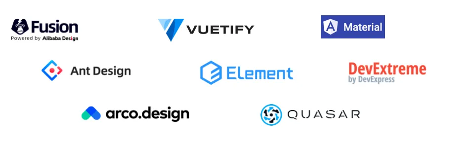

通常我们会从四个角度出发去封装我们的**业务组件库**：

- 业务数据：
	- 将基础组件与**业务数据**接口结合，如**选人、选部门、选城市**等
		- 比如房产？按城市区域筛选房子就很常见
- 业务场景：
	- **业务中出现的一些通用场景**，以大颗粒度的形式封装起来，常见于表格、表单、图表场景
- 业务特色：
	- 业务里**独有的交互形式**，可以由一些基础组件拼合而成
- 品牌主题：
	- 将基础组件修改为和**业务产品品牌设计相符合的样式**

## 2. 业务组件与低代码

**普通物料**和**低代码项目**的物料的差异主要在于
- 除了正常的组件渲染逻辑外
- 低代码应用需要**物料的名称、描述、截图、logo 等**信息
- 以及**哪些属性**可以供用户配置和更改

比如下图的`Pro 基础组件`和`低代码按钮组件`

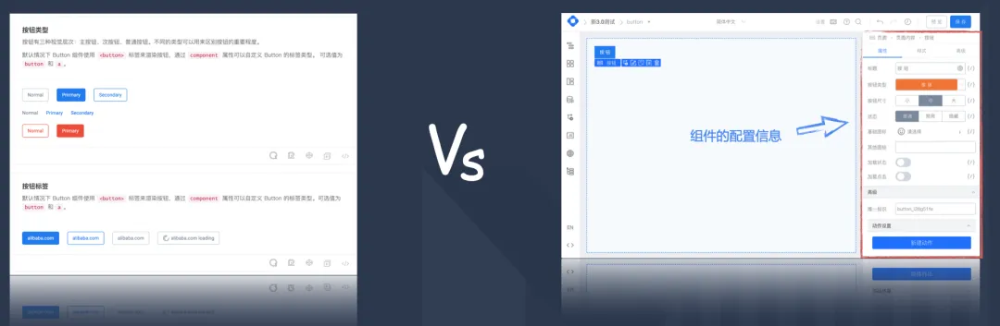

## 3. 已有物料 → 添加配置信息 → 可搭建物料？

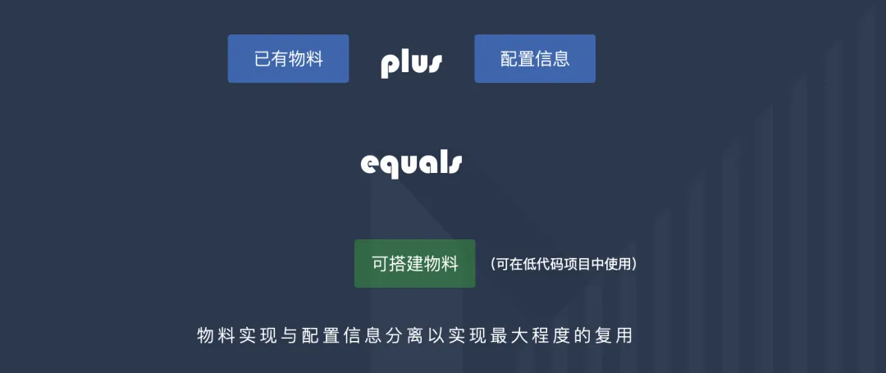

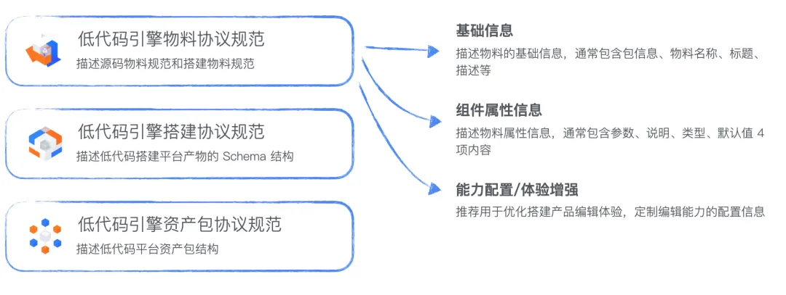

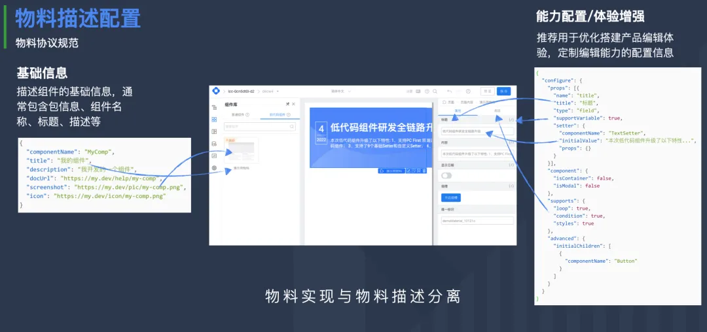

业务组件：
- 通常是基于基础组件之上完成的，封装接口、业务逻辑提高复用性是他的主要场景，所以大部分没有复杂的交互
- 但相比起基础组件来说，变更会更频繁。
- 用低代码生产很高地适应了这些特点，它具备极低的上手门槛，更高的研发效率以及对低代码项目天然的友好性。

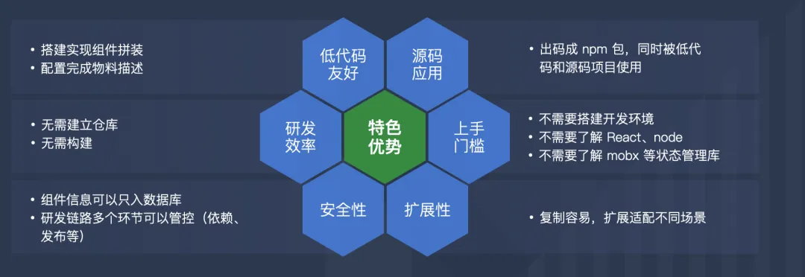

## 4. 组件是什么？

### 4.1. 组件的特性

- 封装性：逻辑和 UI 被封装在一个黑盒中，对外部使用者不可见，外部使用者也无法直接修改被封装的逻辑和 UI。
- 接口性：由于封装性的存在，这个黑盒需要暴露一些对外的接口，从而实现与外部的通信以及外部对组件的控制。
- 切面性：组件从初次渲染到最终卸载过程中会经历多个阶段，通常情况下需要提供这些阶段的控制能力，如生命周期的概念。
- 独立性：组件不必和应用的维护和发版保持一致，可以独立维护和发版。
- 复用性：组件不会只被应用消费，本身应该可以引用其他组件或者被其他组件引用

### 4.2. 组件的能力分层

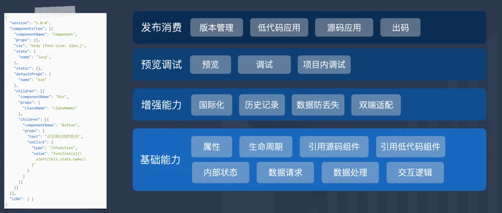

- 基础能力的部分是一个组件必备的部分，用于实现**组件最基本的功能**。
- 增强能力则是有了之后会比没有的情况下更易用的部分。
- 预览调试的功能用来帮助用户开发地更顺畅。
- 而发布消费则是在组件生产结束后如何给到项目中去使用

### 4.3. 属性

即特殊的组件状态 `props`
- 组件内可以直接绑定 `props`
- 或者在逻辑块中通过 `props.xxx` 来获取

### 4.4. 声明周期

我们需要在低代码组件的**最外层容器组件**上对这个**五个声明周期**进行实现

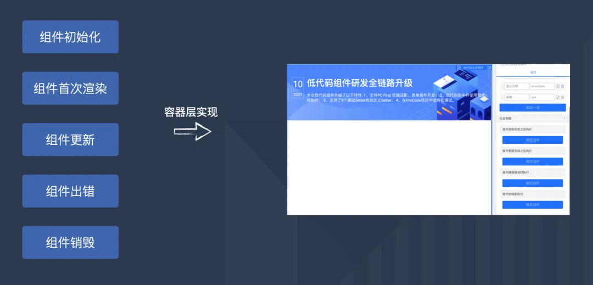

### 4.5. 预览和调试

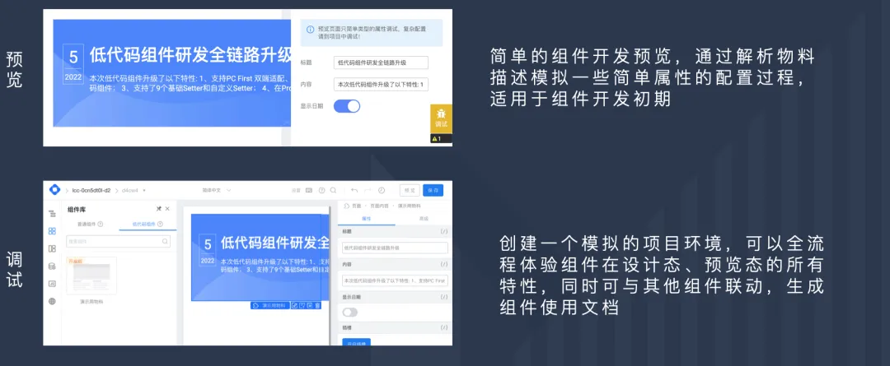

### 4.6. 低代码消费组件

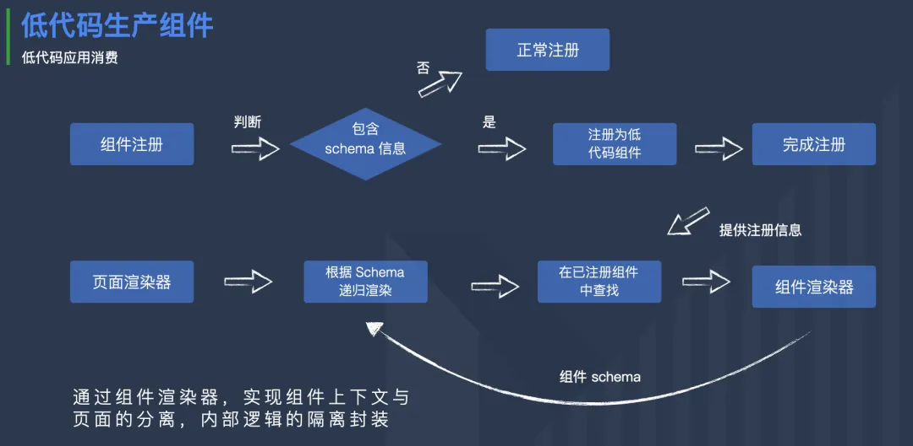

### 4.7. 项目内调试

- 源码组件是通过启动一个本地 server 的形式来和页面进行通信的
- 低代码组件的调试：
	- 用 BroadCastChannel 进行 Tab 间通信，当一个低代码组件的设计器被打开时，会告知页面有组件处于调试中
	- 如果页面是后打开的，他也会通过这个通道询问目前是否有正处于调试状态的插件。
	- 建立链接后，当组件更新，就可以通过这个通道，告知页面最新的组件 schema，页面拿到后进行重新渲染实现实时调试。

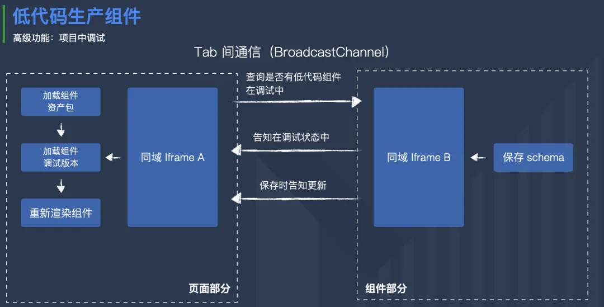

### 4.8. 低代码组件拥有自己的依赖管理能力

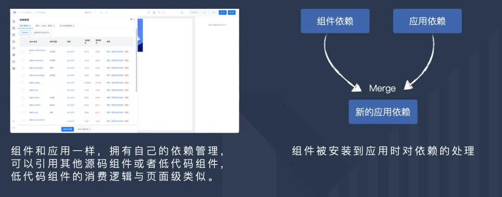

### 4.9. 组件的版本管理

- 一个组件应该可以在不同时刻发布不同的版本，应用可以选择性地安装不同版本。
- 低代码组件同样支持发布不同的版本，每个不同版本我们会根据版本号，记录他的 schema，物料描述以及依赖配置。
- 我们还**特意设计了一个调试版本 0.1.0，这个版本永远与线上最新的记录同步，方便用户进行应用内的调试**。

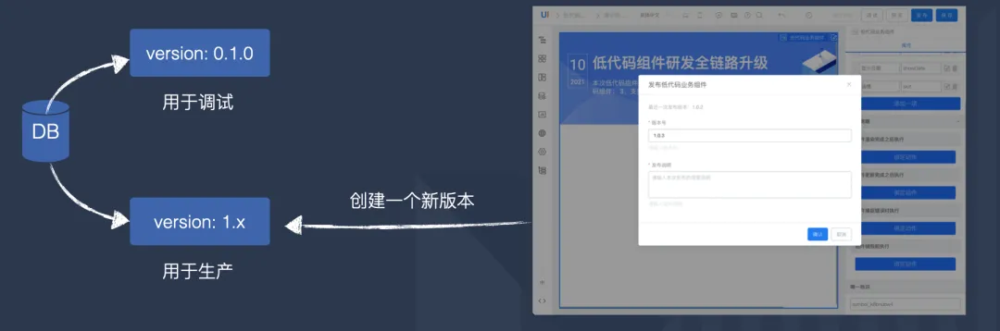

> 这样就不会冲突了，默认 0.1.0 版本用于调试

### 4.10. 低代码组件和源码项目的结合

- 低代码生产的组件**也应该能在源码中使用**。有两种方式
	- 方式一：渲染器提供渲染API
		- 在源码组件中直接调用 `lowcode.render(jsonSchema)` 即可
	- 方式二：出码
		- 使用 LowCodeEngine 的出码模块对组件的 schema 进行出码，转换为 React 代码，同时分析组件的依赖以及物料描述，生成组件所需的 package.json，再补充其他的工程文件。组成一个完整 React 组件脚手架，再利用这个脚手对组件进行构建发布，最终生成一个 npm 包。这个 npm 包其本质就是一个纯粹的 React 组件，因此他可以在任何 React 项目中直接使用。
			- 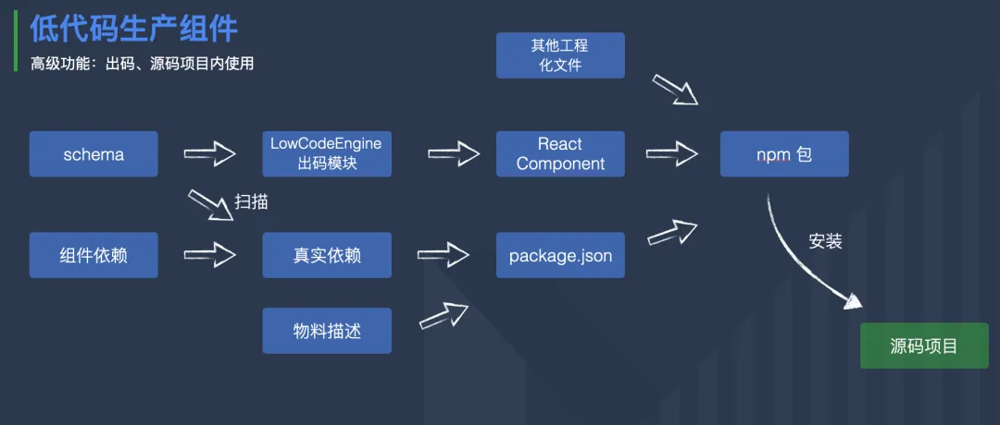

### 4.11. 历史记录 & 容灾

- 在 schema 的存储逻辑上，我们做了多层记录
	- 其中包括以保存时间为维度的**云端存储**「历史记录」
		- 「历史记录」可以帮助用户方便地切换至某次保存时的 schema，用于应对 hotFix，推倒重来等网络通信没有出现问题时的修改。
	- 还有以间隔时间为维度的**本地存储**「容灾存储」。
		- 「容灾存储」则会定时在本地记录用户的 schema，这样当平台的网络出现问题时，用户的修改也不会丢失，只是暂时没有与云端进行同步，可以等到网络恢复时再重新完成同步

## 5. 更多

- 面向多角色的协同：
	- P2C/D2C/C2D 等与产品、设计实现更高效率的协同
- 复杂交互能力增强：
	- 动效、手势、拖拽等复杂交互场景的封装
- 组件质量保障：
	- 代码规范检查、Code Review 和 自动化测试

