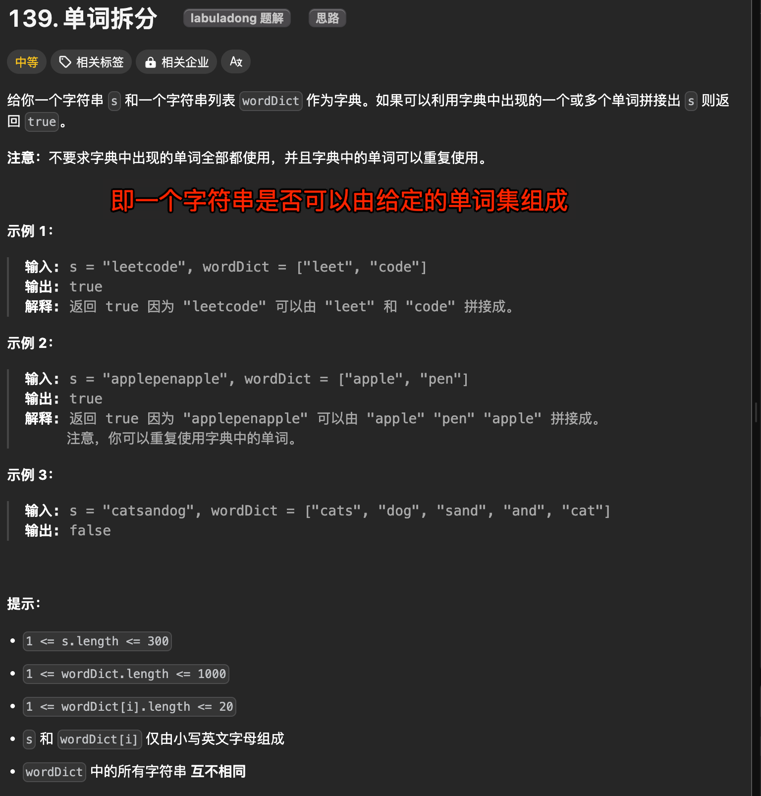
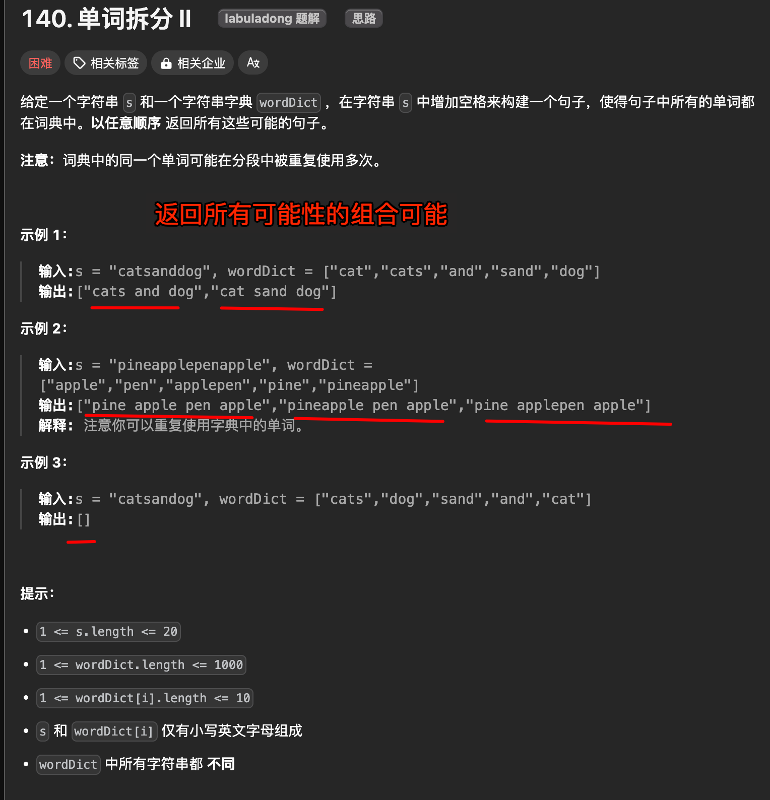

# 动态规划和回溯算法：单词拆分与单词拆分 II

`#算法/动态规划` `#回溯算法` 


| LeetCode                                                           | 力扣                                                          | 难度  |
| ------------------------------------------------------------------ | ----------------------------------------------------------- | --- |
| [140. Word Break II](https://leetcode.com/problems/word-break-ii/) | [140. 单词拆分 II](https://leetcode.cn/problems/word-break-ii/) | 🔴  |
| [139. Word Break](https://leetcode.com/problems/word-break/)       | [139. 单词拆分](https://leetcode.cn/problems/word-break/)       | 🟠  |


## 目录
<!-- toc -->
 ## 1. 单词拆分 



### 1.1. 回溯算法

```javascript hl:8,28,32
var wordBreak = function (s, wordDict) {
  let found = false;
  // 记录搜索过程中的路径
  let track = [];

  // 参数 s 表示当前搜索到的字符串
  // 参数 i 表示当前搜索到 s 中的第 i 个字符
  // 递归函数的定义：对于 s[i..] 这个后缀字符串，从 s[i] 开始搜索 wordDict
  function backtrack(s, i) {
    // base case
    if (found) {
      // 如果已经找到答案，就不要再递归搜索了
      return;
    }
    if (i == s.length) {
      // 整个 s 都被匹配完成，找到一个合法答案
      found = true;
      return;
    }
    // 回溯算法框架
    for (let word of wordDict) {
      // 看看哪个单词能够匹配 s[i..] 的前缀
      let len = word.length;
      // 代表从 i 开始的一个单词，长度为 len，看看是不是等于 word
      let newWord = s.substring(i, i + len);
      if (i + len <= s.length && newWord == word) {
        // 找到一个单词匹配 s[i..i+len)
        // 做选择
        track.push(word);
        // 进入回溯树的下一层，继续匹配 s[i+len..]
        backtrack(s, i + len);
        // 撤销选择
        track.pop();
      }
    }
  }

  backtrack(s, 0);
  return found;
};
```

这段代码无法通过所有测试用例

### 1.2. 回溯算法：剪枝

```javascript hl:6,27,26,48
var wordBreak = function (s, wordDict) {
  let found = false;
  // 记录搜索过程中的路径
  let track = [];

  // 记录不能切分的子串
  let memo = new Set();

  // 参数 s 表示当前搜索到的字符串
  // 参数 i 表示当前搜索到 s 中的第 i 个字符
  // 递归函数的定义：对于 s[i..] 这个后缀字符串，从 s[i] 开始搜索 wordDict
  function backtrack(s, i) {
    // base case
    if (found) {
      // 如果已经找到答案，就不要再递归搜索了
      return;
    }
    if (i == s.length) {
      // 整个 s 都被匹配完成，找到一个合法答案
      found = true;
      return;
    }

    // 当前子串（子树）不能被切分，就不用继续递归了
    // 新增的剪枝逻辑，查询子串（子树）是否已经计算过
    let suffix = s.substring(i);
    if (memo.has(suffix)) {
      // 当前子串（子树）不能被切分，就不用继续递归了
      return;
    }

    // 回溯算法框架
    for (let word of wordDict) {
      // 看看哪个单词能够匹配 s[i..] 的前缀
      let len = word.length;
      // 代表从 i 开始的一个单词，长度为 len，看看是不是等于 word
      let newWord = s.substring(i, i + len);

      if (i + len <= s.length && newWord == word) {
        // 找到一个单词匹配 s[i..i+len)
        // 做选择
        track.push(word);
        // 进入回溯树的下一层，继续匹配 s[i+len..]
        backtrack(s, i + len);
        // 撤销选择
        track.pop();

        // 后序位置，将不能切分的子串（子树）记录到备忘录
        if (!found) {
          memo.add(suffix);
        }
      }
    }
  }

  backtrack(s, 0);
  return found;
};

```

### 1.3. 动态规划：递归

- 对于 `s`
	- 如果能够从 `wordDict` 中找到一个单词匹配 `s` 的前缀 `s[0..k]`
		- 那么只要我能拼出 `s[k+1..]`，就一定能拼出整个 `s`

规模较大的原问题 `wordBreak(s[0..])` 分解成了规模较小的**子问题** `wordBreak(s[k+1..])`

#### 1.3.1. dp 函数定义

```javascript
// 定义：返回 s[i..] 是否能够被拼出
function dp(s, i) {}

// 计算整个 s 是否能被拼出，调用 dp(s, 0)
```

#### 1.3.2. 完整代码

```javascript
var wordBreak = function(s, wordDict) {
    // 用哈希集合方便快速判断是否存在
    let wordSet = new Set(wordDict);
    // 备忘录，-1 代表未计算，0 代表无法凑出，1 代表可以凑出
    let memo = Array(s.length).fill(-1);

    // 主函数
    function dp(i) {
        // base case
        if (i == s.length)
            return true;
        // 防止冗余计算
        if (memo[i] !== -1)
            return memo[i] == 0 ? false : true;

        // 遍历 s[i..] 的所有前缀
        for (let j = i + 1; j <= s.length; j++) {
            // 看看哪些前缀存在 wordDict 中
            let prefix = s.substring(i, j);
            if (wordSet.has(prefix)) {
                // 找到一个单词匹配 s[i..j)
                // 只要 s[j..] 可以被拼出，s[i..] 就能被拼出
                if (dp(j)) {
                    memo[i] = 1;
                    return true;
                }
            }
        }

        // s[i..] 无法被拼出
        memo[i] = 0;
        return false;
    }

    return dp(0);
};
```

## 2. 单词拆分 II



这道题不是单单问你 `s` 是否能被拼出，还要问你是`怎么拼`的

### 2.1. 回溯算法思路（遍历的思路）

基于上面的代码，添加以下行即可

```javascript hl:4,23,12
var wordBreak = function (s, wordDict) {
  // 记录结果
  let res = [];
  // 记录回溯算法的路径
  let track = [];

  // 回溯算法框架
  function backtrack(i) {
    // base case
    if (i === s.length) {
      // 找到一个合法组合拼出整个 s，转化成字符串
      res.push(track.join(" "));
      return;
    }

    // 回溯算法框架
    for (let word of wordDict) {
      // 看看哪个单词能够匹配 s[i..] 的前缀
      let length = word.length;
      if (i + length <= s.length && s.substring(i, i + length) === word) {
        // 找到一个单词匹配 s[i..i+len)
        // 做选择
        track.push(word);
        // 进入回溯树的下一层，继续匹配 s[i+len..]
        backtrack(i + length);
        // 撤销选择
        track.pop();
      }
    }
  }

  // 执行回溯算法穷举所有可能的组合
  backtrack(0);
  return res;
};
```

### 2.2. 不能利用后续位置优化：剪枝

不能使用备忘录优化

因为回溯算法的 `track` 变量仅维护了从根节点到当前节点走过的路径，并没有记录子树的信息。

### 2.3. 但可以使用分解问题（动态规划）可以剪枝

```javascript
var wordBreak = function(s, wordDict) {
    const wordDictSet = new Set(wordDict);
    // 备忘录
    const memo = new Map();
    
    // 定义：返回用 wordDict 构成 s[i..] 的所有可能
    const dp = (i) => {
        const res = [];
        if (i === s.length) {
            res.push("");
            return res;
        }
        // 防止冗余计算
        if (memo.has(i)) {
            return memo.get(i);
        }
        
        // 遍历 s[i..] 的所有前缀
        for (let j = i + 1; j <= s.length; j++) {
            // 看看哪些前缀存在 wordDict 中
            const prefix = s.slice(i, j);
            if (wordDictSet.has(prefix)) {
                // 找到一个单词匹配 s[i..i+len)
                const suffixList = dp(j);
                // 构成 s[i+len..] 的所有组合加上 prefix 
                // 就是构成构成 s[i] 的所有组合
                suffixList.forEach((suffix) => {
                    const space = suffix === "" ? "" : " ";
                    res.push(prefix + space + suffix);
                });
            }
        }
        // 存入备忘录
        memo.set(i, res);
        
        return res;
    };
    
    return dp(0);
};
```

这个解法依然用`备忘录`消除了`重叠子问题`，所以 `dp` 函数递归调用的次数减少为 O(N)O(N)，但 `dp` 函数本身的时间复杂度上升了，因为 `subProblem` 是一个子集列表，它的长度是指数级的。

再加上拼接字符串的效率并不高，且还要消耗备忘录去存储所有子问题的结果，所以从 Big O 的角度来分析，这个算法的时间复杂度并不比回溯算法低，依然是指数级别；但这个解法确实消除了重叠子问题，所以是要比回溯算法高明一些。

## 3. 最后

- **动态规划的思路也可以去解决回溯算法**
- 我们处理排列组合问题时**一般使用回溯算法去「遍历」回溯树，而不用「分解问题」的思路去处理**，
	- 因为存储子问题的结果就需要大量的时间和空间，除非重叠子问题的数量较多的极端情况，否则得不偿失。

