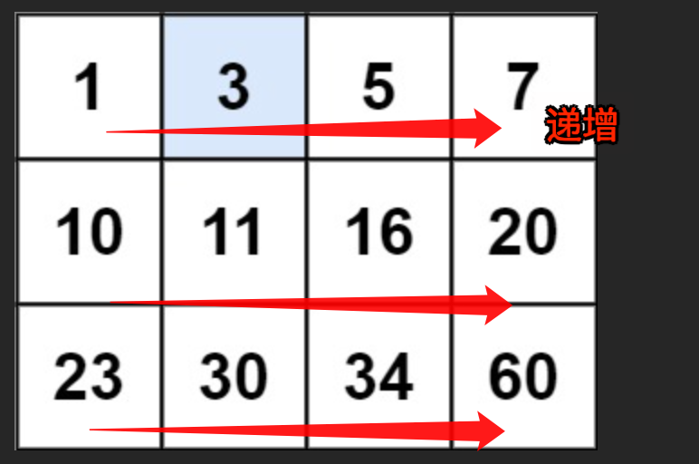

# 搜索二维矩阵：打平成一维也严格递增

`#算法/二维数组` `#算法/二分搜索` 

> [74. 搜索二维矩阵](https://leetcode.cn/problems/search-a-2d-matrix/)


## 目录
<!-- toc -->
 ## 题目 

> 注意打平成一维的也是递增的



## 思路

- 二维数组的的行数 `m` 和列数 `n`，二维数组的坐标 `(i, j)` 可以映射成一维的 `index = i * n + j`；
- 通过一维 `index` 反解出二维坐标 `i = index / n, j = index % n`

## 代码

```javascript
/**
 * @param {number[][]} matrix
 * @param {number} target
 * @return {boolean}
 */
var searchMatrix = function (matrix, target) {
  let m = matrix.length;
  let n = matrix[0].length;
  let left = 0;
  let right = m * n - 1;
  while (left <= right) {
    let mid = left + Math.floor((right - left) / 2);
    if (get(mid) === target) {
      return true;
    } else if (get(mid) < target) {
      left = mid + 1;
    } else if (get(mid) > target) {
      right = right - 1;
    }
  }
  return false;
  // 通过一维坐标访问二维数组中的元素
  function get(index) {
    let i = Math.floor(index / n);
    let j = index % n;
    return matrix[i][j];
  }
};

```

## 相关题目

- [240. 搜索二维矩阵 II：行递增、列递增](/post/FO9PLJ0R.html)