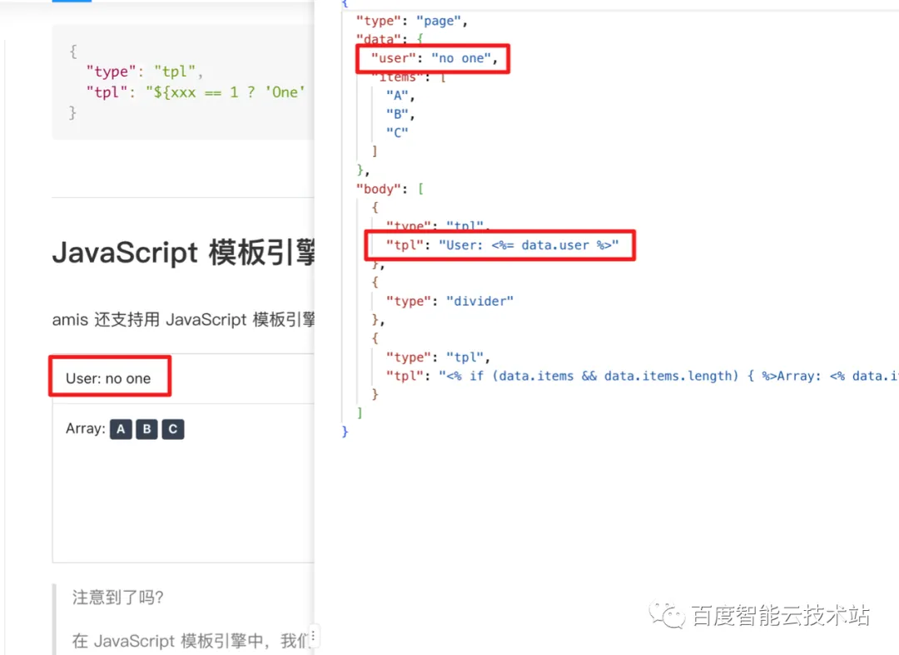

# 低代码篇：组件生态注册机制


## 目录
<!-- toc -->
 ## 前言 

在低代码平台的应用开发过程中，从创建页面、页面布局到数据连接的一系列能力，都围绕着对 “组件” 的排布和设置进行。由此可见，“组件” 是低代码平台生产应用的 “血肉” 。

如此重要的 “组件”，要怎样才能设计得灵活通用呢？百度智能云低代码平台爱速搭基于百度内外长期线上运行的经验，孵化出了一套能够覆盖绝大多数场景的组件体系。本文将分享我们在整个组件体系设计中的一些思路和心得。  


> 来自: [低代码组件扩展方案在复杂业务场景下的设计与实践](https://mp.weixin.qq.com/s/JvL90xBlOMQhdqZ8o1LR4g)

---

## 1. 爱速搭中的 “组件” 体系建设  

在爱速搭中，“页面编辑能力” 的主要构成如图 1 所示，总的来说可以分为 amis 开源框架 - 可视化编辑器 - 后端组件管理服务 这三大块。图中标蓝的部分，就是本文要重点讨论的 “组件” 相关内容。


图 1 爱速搭中的 “页面编辑” 能力

### 1.1 从前端 UI 组件库到低代码组件体系

在低代码框架出现之前，“节省前端研发人力” 的通常做法是将前端通用逻辑封装成 UI 组件库，以依赖包的形式提供出来供开发者引入项目使用。

试想一个这样的需求：页面上有一组 radio 和一个下拉框，下拉框中的选项需要随 radio 的变化拉取远程数据动态生成，如图 2 ，图 3 所示：


图 2 选中“选项 A”时远程接口返回“选项 A”的对应下拉框选项  


图 3 选中“选项 B”时远程接口返回“选项 B”的对应下拉框选项  

类似的需求在 jQuery 时代的 UI 组件库生态中，需要做的可能是为 radio 组件绑定一个 onChange 事件，然后在回调中触发请求并在请求回调中更新下拉框的选项值。这就陷入了 “回调地狱” 的陷阱，在 Promise 未被 ES 标准支持的年代，它还催生了经典的 “手写 Promise ” 面试题。  

在这里我们不再讨论过于古老的历史，在现今流行的 MVVM 框架生态中，这类需求通常需要由 UI 组件库配合相应的状态管理机制完成，这类状态管理机制可能是框架内置的，如 React 中的 useState 等一系列 hook ，或者是生态中约定俗成的选型，如 React 生态常用的 Redux 、MobX 、Vue 生态常用的 Vuex 等。

## 1.2 基于 React 生态的 UI 组件库实现的 “联动” 效果

为了让读者对 “低代码平台中联动的实现” 有一个更清晰的 “对比印象”，此处先援引一个传统手工模式下基于 React 和 UI 组件库开发这样一个联动模式的例子，这里 UI 组件库采用 AntD ，配合 React 中的各种 Hook 实现联动效果。

完整代码如下：

```jsx
import React, { FC, useEffect, useState } from "react";
import { Radio, Select, Form } from "antd";
import type { RadioChangeEvent } from "antd";
import axios from "axios";
import "./App.css";
const { Option } = Select;
interface OptionData {
  label: string;
  value: string;
}
const App: FC = () => {
  const [value, setValue] = useState(1);
  const [options, setOptions] = useState([] as OptionData[]);
  const [loading, setLoading] = useState(false);
  useEffect(() => {
    setLoading(true);
    axios
      .get(
        `https://aisuda.bce.baidu.com/amis/api/mock2/options/level2?a=${value}`
      )
      .then((deferOptions) => {
        setOptions(deferOptions.data.data.options);
        setLoading(false);
      });
  }, [value]);
  const onChange = (e: RadioChangeEvent) => {
    setValue(e.target.value);
  };
  return (
    <div className="App">
      <Form
        name="basic"
        labelCol={{ span: 8 }}
        wrapperCol={{ span: 16 }}
        initialValues={{ remember: true }}
        autoComplete="off"
      >
        <Form.Item label="选项1">
          <Radio.Group onChange={onChange} value={value}>
            <Radio value={1}>选项A</Radio>
            <Radio value={2}>选项B</Radio>
            <Radio value={3}>选项C</Radio>
          </Radio.Group>
        </Form.Item>
        <Form.Item label="选项2">
          <Select style={{ width: 120 }} loading={loading}>
            {options.map((item, idx) => (
              <Option value={item.value} key={idx}>
                {item.label}
              </Option>
            ))}
          </Select>
        </Form.Item>
      </Form>
    </div>
  );
};
export default App;
```

实现的效果如图 4 所示，radio 选中不同选项时，select 组件请求数据接口并将返回的动态选项填充到菜单中。  


图 4 选中选项 A 或者 B 时拉取对应的菜单内容

倘若你是一个对 React 了解不多的开发人员，在制作这样一个效果的过程中，可能会遇到以下事情：

- 首先需要照着 UI 组件库官网上的教程把 DEMO 跑起来，期间可能会遇到诸如某些全局依赖包没有安装，某些依赖项的版本不对等等教程中并没有写明的问题。
- 包安装过程中网卡了，安装失败，重试 n 次之后终于成功。
- 克服一切障碍将 DEMO 跑起来之后，照着官网教程依样画葫芦复制粘贴，少贴了一个尖括号导致编译一直报错，而你由于对 React 不熟悉，纠结好久才发现问题。
- 什么？React 的组件还分 Function Component 和 Class Component ？
	- Redux 和 MobX 哪家强？Hook 又是什么？useState 和 useEffect ？迷失在生态的海洋里无法自拔。
- 当你阅读了数吨资料并且掌握了上述全部知识点之后，你已经忘了自己最初到底想干嘛，不过总之，你学会了 React，可喜可贺！
- 新来的技术负责人表示 React 不好，我们改用 XXX，React 学习进程中断。
- 换了个技术负责人，表示我们还是换回 React，你去官网拖了最新版，发现和你之前学的已经不太一样，重复前面的过程。

## 1.3 低代码模式下的联动效果实现

相比 React 考验智商和知识检索能力的学习曲线，“低代码” 模式的框架和平台则提供了一种更友好、更符合直觉的页面构建方式。

在爱速搭的可视化编辑器中，实现上述效果只需三步：

- 往页面中拖拽一个 radio 组件和一个 select 组件。

设置 radio 组件的字段名，选项和默认值，如图 5。


图 5 设置 radio 组件的属性

- 设置 select 组件的选项源和关联变量（以 ${} 语法形式），如图 6 ，当字段名为 'a' 的 radio 组件的值发生变化时，负责提供 select 组件 “选项” 数据的接口会 “感知” 到这个变更，并触发请求拉取数据。


图 6 用 ${} 语法实现接口联动  

在这个过程中，我们以可视化的方式在爱速搭的编辑器中 “使用” 了 amis 框架提供的 radio 和 select 组件，无需学习 React ，也无需纠结什么方案才是页面状态管理的最优解。

显而易见，低代码平台 “拖拽组件拼装页面” 的模式无论在上手的容易程度和类似功能的研发效率上，都远高于 “学习一款前端框架并熟练应用生态中的主流 UI 组件库搭建前端页面”。

即使是 amis 框架和组件库本身更新了，出于向后兼容的原则，原本的 json 配置也可以一直稳定复用。

## 2. 如何设计一个高度灵活的低代码组件体系

主流的前端 UI 组件库将前端研发人员从无休止的页面样式微调和分辨率兼容工作中解放了出来，而低代码平台的组件体系致力的方向通常包括以下两点：

- 将 “引入组件并通过状态管理方案对前端数据进行管理” 的开发模式转化为声明式的组件描述。
- 将原本需要由人工编写的，处理组件间关系的 “胶水” 代码转为由平台 / 框架提供配置项实现，例如在上一节的例子中，就以配置的方式代替传统的手工编码，实现了 radio 和 select 组件联动的效果。

对于习惯了前端 UI 库舒适圈的前端开发人员而言，最大的疑惑是低代码框架 / 平台的 “灵活性”，即满足各种刁钻需求的能力，是否能完全替代传统 UI 组件库 + “胶水” 代码的研发模式？

那么如何在简化成声明式的前提下保证足够的 “灵活” 呢？这里分步列举爱速搭中组件的关键设计，以及各设计对应的 “手工” 研发模式下的环节。

假设你是一名初级前端开发人员，被指派了一些 “适合初级前端人员” 的 “相对简单” 的工作。这些工作通常是给你一个交互 + 视觉设计稿，然后你需要使用团队内通用的 UI 库来将设计稿中描述的页面 “还原” 出来。本文开头所举的例子正是这些日常工作的一部分。

为了实现这个需求，你可能需要做以下事情：

- 在组件库中寻找合适的组件。
- 在页面上处理组件的排版和嵌套关系，将它们 “拼装” 成一个完整的页面。
- 处理页面上各组件的联动关系并将接口返回的数据填充到页面的指定位置。

在爱速搭中，我们要如何以 “低代码” 的方式来实现以上这些任务呢？这里分步进行阐述。

## 2.1 预置组件集的统筹设计

首先你需要寻找一些 “能够覆盖需求” 的组件。amis 框架包含大量默认预置组件（约 140+）。

这些组件都是基于 React 实现的（爱速搭也支持其他框架如 VUE ，jQuery 编写的自定义组件），并在底层使用 MobX + MobX-state-tree 作为全局的状态管理方案。

从功能上划分，amis 的预置组件包括 布局、功能、数据输入、数据展示、反馈、其他六大类，具体见这个文档 https://aisuda.bce.baidu.com/amis/zh-CN/components/page 这些组件是从实际业务场景逐步归纳而来，目前已经能够比较完整地覆盖各种常见需求。

而在爱速搭内，除了 amis 框架提供的预置组件外，还提供了一系列和平台后端数据相关的组件，如人员选择，部门选择等。这些和平台后端服务紧密关联的组件，是爱速搭 “前后端一体化” 应用解决方案的重要组成部分。


图 7 平台扩展组件

## 2.2 组件的树结构嵌套渲染

接下来，你需要处理组件之间的布局关系。在原生开发模式下，浏览器中的 DOM 节点就是基于树状结构来组织的，基于树状结构可以组合出各种复杂的布局，所以，将类似的树状结构描述 “平移” 到同为树状的 json 上，首先从基础理论角度而言就是可行的。

先前发布的[《低代码平台架构深度剖析》](http://mp.weixin.qq.com/s?__biz=MzkxOTM4MTM3Ng==&mid=2247483927&idx=1&sn=eac63dccee816bffe80d5dfe9d354f96&chksm=c1a3b6f8f6d43fee11d489b67d2a22318aafdad4d54932692e9e76961c8ca11184b2e7469788&scene=21#wechat_redirect)一文中曾提到，amis 框架暴露的 render 方法是实现配置到组件转换的关键方法。这里我们来看一段简单的配置代码及其渲染效果（ 图 8 ）：


图 8 通过拖拽方式往页面中添加的一个按钮  

当使用爱速搭的页面编辑器往页面中拖拽一个按钮时候，编辑器内置的 amis 框架会根据拖拽添加的组件类型（按钮对应的是 type: "button" ）在全局组件池中找到相应的组件实现，在画布中将其渲染出来。

amis 框架的整个页面以树状嵌套的方式来组织，当渲染器识别到容器类组件时，会首先将 “外框” 部分渲染出来，然后逐层往下寻找子组件并依次渲染，图 9 展示了页面组件的树状结构。


图 9 页面组件的树状嵌套结构

2.3 组件的数据下发和传递

在 amis 框架中有一个重要概念：“数据域和数据链”，这一部分也在[《低代码平台架构深度剖析》](http://mp.weixin.qq.com/s?__biz=MzkxOTM4MTM3Ng==&mid=2247483927&idx=1&sn=eac63dccee816bffe80d5dfe9d354f96&chksm=c1a3b6f8f6d43fee11d489b67d2a22318aafdad4d54932692e9e76961c8ca11184b2e7469788&scene=21#wechat_redirect)中有所提及，这里我们对其进行更深一步的讲解。

在上一节中我们提到，amis 的 “页面” 是以树型嵌套的方式来组织的，在这个模式下，页面的上下文数据也是以对应的树型结构来组织，并遵循“内层覆盖外层，后来覆盖先来” 的原则。即内层组件的同名字段会覆盖外层数据，支持配置 API 属性的组件如果执行刷新后接口返回了新的值，那么新返回的值会覆盖先前的值。

这是手工开发模式中 “页面状态管理” 的代偿方案。当 “使用” 了某个字段的组件监听到该字段的变更时，会触发自身的刷新，如图 10，图 11，为文本框组件指定字段名 “text” 并用模板的形式将文字组件的内容与文本框组件的输入进行绑定。


图 10 为文本框组件指定字段名  


图 11 文字组件绑定文本框输入  

运行效果如图 12，文字组件的内容随文本框的输入变化


图 12 组件内容联动  

在现今以 “数据驱动” 为主流的页面开发模式中，页面状态管理 —— 或者更通俗地称为 “监听数据变更并更新页面组件” 的方式有很多种。包括但不限于 React 的各种 Hook ，Redux，MobX 全家桶，VUEX，这些方案往往是“不那么符合人类直觉”的，即使是有一定经验的开发人员，也需要花上一定的时间来理解。

而 amis 把状态管理方案封装成了更符合人类直觉的 “声明式” 方案，在搭配可视化编辑器的前提下，能灵活地处理各种页面状态管理场景。

面向不同场景，在 amis 框架 / 爱速搭中 “使用” 上下文数据的方式有三种：数据映射，模板和表达式，这三种方式的主要区别在于语法和使用场景，其原理都是监听数据变化同时更新相应的组件。

2.3.1 数据映射

数据映射支持用户通过 ${xxx} 或 xxx 获取当前数据链中某个变量的值，上文中提到的文字组件绑定文本框输入的例子，利用的就是数据映射。

### 2.3.2 模板

模板语法基于 lodash 实现，如图 13：


图 13 利用模板语法实现数据引用和自定义渲染样式  

### 2.3.3 表达式

表达式通常用于控制页面显隐和动态计算一些值，如图 14，15：


图 14 设置 radio 组件的 name 和选项值  


图 15 文本组件的显隐条件和 radio 组件的取值联  

### 2.3.4 基于组件数据共享和传递机制实现组件联动

总而言之，当组件以数据映射、表达式、模板中的任一方式 “使用” 数据的时候，组件会监听自身和全局透传的数据域中相应的变量变化，然后触发组件的更新。例如开头的例子，select 组件以 ${a} 的格式在获取选项的 url 参数中引用了变量 a 的值，当 a 的值随 select 组件切换发生变化的时候，该值的变化会触发 select 组件的更新并重新请求选项数据，如图 16：


图 16 组件 B 修改公共数据域后触发组件 A 的刷新

显而易见，在爱速搭的组件体系中，日常开发需求中常见的 “组件联动” 效果，都可以通过对**数据共享和传递机制**的灵活使用，以纯配置的方式实现。

### 2.4 事件动作

事件动作是近期上线的新功能，属于 “更加灵活” 的组件联动解决方案，支持渲染器事件监听和响应设计。

具体见文档 https://aisuda.bce.baidu.com/amis/zh-CN/docs/concepts/event-action 事件动作也是一套相对复杂的体系，后续会有专门文章单独进行介绍，本文仅列举。

## 3. 背后的原理 —— 组件注册机制

上文中我们提到预置和自定义组件，二者都是通过统一的**组件注册机制**注册到全局组件池中，供开发阶段使用。下面我们将对组件注册机制进行深入说明。

### 3.1 预置组件的注册机制

在 amis 框架的加载阶段，预置组件会通过 `registerRenderer 方法`被统一注册到全局的组件池中，同时 registerRenderer 方法和封装了该方法的 Renderer 装饰器也被暴露出来供用户注册自定义组件使用，关于自定义组件的注册，在后文会有详细说明。爱速搭的平台扩展组件，也是使用了 registerRenderer 这个方法注册到全局组件池子中的。

在 amis 框架中，组件的注册实际上是通过 `@Renderer 装饰器`来实现的，该个装饰器的具体实现代码如下，可以看到在装饰器中调用了 registerRenderer 方法，registerRenderer方法会将包含组件全剧唯一唯一 type 以及其他附加信息的 config 和传入的 React 组件组合起来存入组件池子，在页面渲染的时候，渲染器就可以根据 schema 中的 type 在池子中找到相应的 React 组件，并将其渲染到页面上。

```tsx
export function Renderer(config: RendererBasicConfig) {
  return function <T extends RendererComponent>(component: T): T {
    const renderer = registerRenderer({
      ...config,
      component: component
    });
    return renderer.component as T;
  };
}
```

利用该装饰器将组件注册到全局组件池子的语法如下，此处实现的是将一个名为 'my-renderer' 的组件注册到全局的组件池中，注册后在页面配置中就可以以 {type: "my-renderer"} 的声明形式使用该组件。

```jsx
import * as React from 'react';
import {Renderer} from 'amis';


@Renderer({
  type: 'my-renderer',
  autoVar: true // amis 1.8 之后新增的功能，自动解析出参数里的变量
})
class CustomRenderer extends React.Component {
  render() {
    const {tip} = this.props;
    return <div>这是自定义组件：{tip}</div>;
  }
}
```

在 amis 框架的源代码中，预置组件也是通过同样的语法注册到全局组件池中，如图 17：


图 17 amis 框架中的预置组件

3.2 自定义组件注册机制

除了预置的默认组件外，为了更灵活地满足定制需求，百度智能云低代码平台爱速搭也支持多种方式的自定义组件接入。包括利用 custom 组件进行临时扩展和扩展代码接入等多种形式。

3.2.1 使用 Custom 组件临时扩展

临时扩展的配置代码如下，这是唯一一种可以在可视化编辑器中直接定义的方式（组件代码需要转成字符串格式），在组件暴露的 onMount 配置项中，可以挂接 DOM 节点构建、事件绑定相关逻辑的代码字符串，在 custom 组件初始化的时候，会将配置的代码字符串取出执行，生成组件的实际 “内容”。

```json
{
  "type": "page",
  "body": {
    "type": "form",
    "title": "custom 组件",
    "body": [
      {
        "type": "input-text",
        "name": "username",
        "label": "姓名"
      },
      {
        "name": "username",
        "type": "custom",
        "label": "自定义组件",
        "onMount": "const button = document.createElement('button'); button.innerText = '点击修改姓名'; button.onclick = event => { onChange('new name'); event.preventDefault(); }; dom.appendChild(button);"
      }
    ]
  }
}
```

3.2.2 以组件注册的方式扩展自定义组件

在爱速搭中，可以以上传代码的方式引入自定义组件，如图 18：


图 18 以上传代码方式引入自定义组件  

代码保存时，爱速搭的后台会结合创建时填写的组件名将直接编写的 React 组件的代码 “编译” 前文所说的带 @Renderer 装饰器的代码格式，并将其发布成独立的 js 文件。  

当编辑器初始化时，这个 js 文件会被加载，代码逻辑执行并将用户自定义的组件注册到全局的组件池子里。

这样一来，低代码平台的用户就可以在可视化编辑器中通过拖拽的方式来使用上传的自定义组件，如图 19：


图 19 在爱速搭的可视化编辑器中使用自定义组件

3.2.3 组件扩展包

爱速搭支持以 npm 扩展包的形式管理自定义组件，利用扩展包开发工具 https://github.com/aisuda/amis-widget 开发扩展包并发布到 npm 服务，就可以以 npm 包的形式引用并使用自定义组件，如图 20：


图 20 爱速搭平台中的组件扩展包管理  

4. 小结

丰富的预置组件和灵活的自定义组件扩展机制保证了爱速搭在应用搭建阶段原子能力方面的完备性，而基于数据链、事件动作，amis 框架和爱速搭实现了 “无需编写代码” 的组件间联动机制，以更简单的方式，完美覆盖了传统研发过程中的常见需求。


## NPM 组件扩展包的设计原理和开发实践


目前爱速搭已支持三种自定义组件扩展方式：
- Custom 自定义组件
- 线上版自定义组件和
- NPM 组件扩展包 

对于交互和功能较为简单的自定义组件，可以使用 Custom 自定义组件和线上版自定义组件；

而对于复杂的功能，我们建议使用 NPM 组件扩展包方式实现。


### 组件扩展包功能简介

NPM 组件扩展包是一种通过导入 NPM 包来扩展和补充爱速搭组件物料的机制，支持本地 IDE 纯 Coding 的开发模式，自由度较高，可用于开发任何复杂业务场景的自定义组件。

为了方便用户在本地开发自定义组件，百度智能云低代码平台爱速搭提供了一套自定义组件扩展包的开发工具（amis-widget-cli），支持各类自定义组件模板的下载、本地预览&调试、平台预览（linkDebug）和编译等一系列工具。

NPM组件扩展包主要包括如下四个功能点：
- 支持同时扩展多个自定义组件

一个组件扩展包中可放置多个不同类型的自定义组件，比如 multiple-custom-widget-template 内包括三种技术栈的自定义组件。如果我们将该组件添加到爱速搭应用中，会同时导入 react-info-card、hello-jquery、vue-info-card 三种不同类型的自定义组件。

#### 支持多种技术栈

爱速搭的组件扩展支持 Vue 2.0、Vue 3.0、React、jQuery 和 UniApp 等多种技术栈，用户可以使用自己熟悉的一种技术栈来开发自定义组件。

#### 支持三种自定义组件本地预览&调试方式

组件预览模式（preview）: 用于预览当前自定义组件内容。

1. 本地开发模式（dev）：在本地页面设计器中预览&调试自定义组件，用于确认页面设计器能否正常使用和展示当前自定义组件。
2. 外链调试（linkDebug）：在爱速搭中预览&调试本地的自定义组件，用于确认爱速搭平台中能否正常使用和展示当前自定义组件。

- 支持多种类型的自定义组件扩展

1. amis 自定义组件：用于扩展和补充 web 应用/普通页面的自定义组件物料。
2. 小程序自定义组件：用于扩展和补充小程序应用页面的自定义组件物料。
3. 快应用自定义组件：用于扩展和补充快应用和快应用卡片的自定义组件物料。

### 2 组件扩展包工作原理

NPM 组件扩展包的运行框架图如下所示


#### 2.1 NPM 自定义组件的两个核心模块

一个完整的自定义组件包含两个功能模块：amis 渲染器和 amis-editor 插件：

- 「amis 渲染器」是页面渲染时需要调取的模块，如果没有它则意味着页面中不能正常显示自定义组件内容。
- 「amis-editor 插件」是打通页面设计器的关键功能模块，可用于设置自定义组件在页面设计器中的组件物料面板中的显示位置（哪个分类下展示，展示顺序是什么，描述信息是什么等），也可用于设置首次插入页面时的初始数据是什么，所有和页面设计器关联的数据都在 amis-editor 插件中。

#### 2.2 本地开发 NPM 组件扩展包

开发 NPM 组件扩展包时会用到两个工具: amis-widget、amis-widget-cli。

其中 amis-widget 提供用于注册 amis 渲染器 和 amis-editor 插件的方法，而 amis-widget-cli 是用于开发 amis 自定义组件的脚手架，其核心是基于 AKFun （https://github.com/wibetter/akfun）现有的前端工程能力，为用户提供自定义组件模板下载、预览&调试、编译和多技术栈支持等功能。


用户在本地完成自定义组件的编码后，可通过构建工具（使用 amis-widget-cli 或者 webpack、rollup 等构建工具）进行编译，将自定义 amis 渲染器和自定义 amis-editor 插件分别打包成静态 js 脚本，并发布成一个 NPM 包。

关于开发 NPM 组件扩展包的一些建议：

- NPM 扩展包编译时默认会剔除第三方 npm 依赖，使用多个组件扩展包时，第三方依赖只会打包一次，避免平台运行时重复加载第三方依赖功能的代码。
- 尽可能将同一类型的自定义组件放在一个组件扩展包中，多个自定义组件或者多个组件扩展包用到的公共模块建议封装成单独的NPM模块，最后通过 NPM 依赖的形式进行引用。

#### 2.3 在应用中添加 NPM 组件扩展包

爱速搭支持组织级和应用级的 NPM 组件扩展包，组织级添加的组件扩展包，在组织下所有应用中可见可用，但不可编辑（不能设置显隐、排序和分类等操作）。


在组织或者应用中添加 NPM 组件扩展包后会自动触发构建工作，将当前组织或应用中的所有组件扩展包分别打包成来两个 js 静态脚本（渲染器和插件），存放到平台默认存储对象中，并将静态脚本路径分别记录在应用中的 npmCustomComponentSrc 和 npmCustomPluginSrc 上。之所以打包成两个 js 静态脚本，是为了在应用运行时环境仅加载渲染器脚本，避免加载多余的设计态脚本代码。

#### 多技术栈支持

爱速搭和 amis 属于 React 技术栈体系，对于其他技术栈的自定义组件是不能直接在平台运行的。因此我们在注册自定义组件时，支持将非 React 技术栈的自定义组件先包裹成 React 组件对象后再进行注册。

下面我们以 Vue 2.0 和 Vue 3.0 为例，展示转换为 React 组件的关键方法。


###### 将 Vue 2.0 组件对象转换成 React 组件关键方法

```tsx
import React from "react";
import ReactDOM from "react-dom";
import Vue from "vue";
import { ScopedContext, IScopedContext, RendererProps } from "amis-core";
import { extendObject } from "../utils";

export function createVue2Component(vueObj: any) {
  if (!vueObj || (typeof vueObj !== "function" && typeof vueObj !== "object")) {
    return;
  }
  class VueFactory extends React.Component<RendererProps> {
    domRef: any;
    vm: any;
    isUnmount: boolean;
    static contextType = ScopedContext;

    constructor(props: RendererProps, context: IScopedContext) {
      super(props);
      this.domRef = React.createRef();

      const scoped = context;
      scoped.registerComponent(this);

      this.resolveAmisProps = this.resolveAmisProps.bind(this);
      this.renderChild = this.renderChild.bind(this);
    }

    componentDidMount() {
      const { amisData, amisFunc } = this.resolveAmisProps();
      const { data, ...rest } = (vueObj =
        typeof vueObj === "function" ? new vueObj() : vueObj);
      const vueData = typeof data === "function" ? data() : data;
      const curVueData = extendObject(vueData, amisData);
      this.vm = new Vue({
        ...rest,
        data: () => curVueData,
        props: extendObject(amisFunc, rest.props || {}),
      });

      Object.keys(amisFunc).forEach((key) => {
        this.vm.$props[key] = amisFunc[key];
        if (key === "render") {
          this.vm.$props["renderChild"] = (
            schemaPosition: string,
            childSchema: any,
            insertElemId: string,
          ) => {
            this.renderChild(schemaPosition, childSchema, insertElemId);
          };
        }
      });
      this.domRef.current.appendChild(this.vm.$mount().$el);
    }

    renderChild(
      schemaPosition: string,
      childSchema: any,
      insertElemId: string,
    ) {
      let childElemCont = null;
      if (this.props["render"] && childSchema && insertElemId) {
        const childElem = this.props["render"](schemaPosition, childSchema);
        childElemCont = ReactDOM.render(
          childElem,
          document.getElementById(insertElemId),
        );
      }
      return childElemCont;
    }

    componentDidUpdate() {
      if (!this.isUnmount) {
        const { amisData } = this.resolveAmisProps();
        if (this.vm) {
          Object.keys(amisData).forEach((key) => {
            this.vm[key] = amisData[key];
          });
          this.vm.$forceUpdate();
        }
      }
    }

    componentWillUnmount() {
      this.isUnmount = true;
      const scoped = this.context as IScopedContext;
      scoped.unRegisterComponent(this);
      this.vm.$destroy();
    }

    resolveAmisProps() {
      let amisFunc: any = {};
      let amisData: any = {};

      Object.keys(this.props).forEach((key) => {
        const value = this.props[key];
        if (typeof value === "function") {
          amisFunc[key] = value;
        } else {
          amisData[key] = value;
        }
      });
      return { amisData, amisFunc };
    }

    render() {
      return <div ref={this.domRef}></div>;
    }
  }

  return VueFactory;
}

```

#### 将 Vue 3.0 组件对象转换成 React 组件的关键方法

```tsx
import React from "react";
import { ScopedContext, IScopedContext, RendererProps } from "amis-core";
import { createApp, getCurrentInstance, ref, isProxy, shallowRef } from "vue";
import { isObject, extendObject } from "../utils";
export function createVue3Component(vueObj: any) {
  if (!vueObj || (typeof vueObj !== "function" && typeof vueObj !== "object")) {
    return;
  }
  class VueFactory extends React.Component<RendererProps> {
    domRef: any;
    app: any;
    vm: any;
    isUnmount: boolean;
    static contextType = ScopedContext;
    constructor(props: RendererProps, context: IScopedContext) {
      super(props);
      this.domRef = React.createRef();
      const scoped = context;
      scoped.registerComponent(this);
      this.resolveAmisProps = this.resolveAmisProps.bind(this);
    }
    componentDidMount() {
      const { amisData, amisFunc } = this.resolveAmisProps();
      const { data, ...rest } = (vueObj =
        typeof vueObj === "function" ? new vueObj() : vueObj);
      const vueData = typeof data === "function" ? data() : data;
      const curVueData = extendObject(vueData, amisData);
      this.app = createApp({
        data: () => curVueData,
        ...rest,
        props: extendObject(amisFunc, rest.props || {}),
      });
      this.vm = this.app.mount(this.domRef.current);
    }
    componentDidUpdate() {
      if (!this.isUnmount) {
        const { amisData } = this.resolveAmisProps();
        if (this.vm) {
          Object.keys(amisData).forEach((key) => {
            this.vm[key] = amisData[key];
          });
          this.vm.$forceUpdate();
        }
      }
    }
    componentWillUnmount() {
      this.isUnmount = true;
      const scoped = this.context as IScopedContext;
      scoped.unRegisterComponent(this);
      this.app.unmount();
    }
    resolveAmisProps() {
      let amisFunc: any = {};
      let amisData: any = {};
      Object.keys(this.props).forEach((key) => {
        const value = this.props[key];
        if (typeof value === "function") {
          amisFunc[key] = value;
        } else {
          if (isProxy(value)) {
            amisData[key] = shallowRef(value);
          } else if (isObject(value)) {
            amisData[key] = ref(value);
          } else {
            amisData[key] = value;
          }
        }
      });
      return { amisData, amisFunc };
    }
    render() {
      return <div ref={this.domRef}></div>;
    }
  }
  return VueFactory;
}

```

####  小程序和快应用自定义组件扩展机制

在实际的开发过程中，往往会存在 H5、小程序、APP、大屏、快应用等多种展示终端。在传统的开发模式下，开发人员往往需要为多端重新编写对应的代码。

爱速搭通过「同一个 DSL 可视化编辑器」+「多套运行时」实现一次搭建构建多端应用，让用户可以通过爱速搭快速搭建 H5、APP、快应用和各类小程序应用。

当前，爱速搭移动应用和快应用通过 aipage-editor 实现可视化页面设计，可在线设计 H5、小程序、快应用和 APP 等页面。其中 APP 和各类小程序运行时使用 UniApp 运行时承载页面渲染和展示，快应用页面使用快应用运行时承载页面渲染和展示。

扩展小程序自定义组件时，开发 UniApp 版自定义组件的同时还需要额外「开发」一份对应的 H5 自定义组件。其中 H5 自定义组件是小程序自定义组件的「替身组件」，也叫预览组件（仅在平台端预览展示使用）。这个预览组件支持通过 UniApp 版的自定义组件编译生成，无需额外开发。当发布或导出小程序应用时，应用中用到的预览组件会替换成对应的 UniApp 版自定义组件。（一个小程序抽奖自定义组件示例：https://github.com/wibetter/lottery-custom-widget）

快应用自定义组件和小程序自定义组件的扩展机制是一样的，但对应的预览组件需要额外开发，用于充当快应用自定义组件的“替身组件”。


小程序自定义组件扩展机制原理图  

#### NPM 组件扩展包开发实战

下面我们将通过一个简单的示例（使用 Vue 2.0）来开发并发布一个 amis 组件扩展包。


需要准备的环境

- node（推荐 v17.4.0，或更新版本）
- npm（推荐 8.3.1，或更新版本）

需要使用到的 NPM 工具：

- amis-widget-cli（自定义组件开发脚手架）
- amis-widget（自定义组件注册器，支持 React 和 Vue2.0 技术栈，用于注册自定义渲染器和插件）

开发 amis 组件扩展包关键步骤：

步骤 1：全局安装 amis-widget-cli

yarn global add amis-widget-cli 或者 npm i -g amis-widget-cli

步骤 2：初始化 NPM 组件扩展包

amis init -e=amis -m=copy 或 amis init --editor=amis --mode=copy

目前已提供多种自定义组件类型：


比如使用 Vue 2.0 开发一个 amis 组件扩展包（amis 自定义组件），可选择 Vue 自定义组件，输入组件扩展包名称后，即可得到如下目录结构的自定义组件项目：


备注：自定义组件目录说明请见 vue-custom-widget-template# 目录说明

步骤 3：开发一个自定义组件

使用 Vue 2.0开发 amis 自定义组件（Vue 2.0 使用文档请见 Vue 官方文档）。


步骤 4：注册为一个爱速搭可用的 amis 自定义组件

开发完成的自定义组件，使用 amis-widget 中的 registerRendererByType 方法注册为爱速搭可识别的自定义组件（amis 渲染器）：

```
import InfoCard from './widget/info-card';
import { registerRendererByType } from 'amis-widget';


registerRendererByType(InfoCard, {
  type: 'vue-info-card',
  usage: 'renderer',
  weight: 99,
  framework: 'vue',
});
```

步骤 5：为 amis 自定义组件设置基本属性和可配置项

使用 amis-widget 中的 registerAmisEditorPlugin 方法为自定义组件制定基本属性和配置项，后续在编辑器端使用时，左侧组件物料面板会按照基本属性中的分类和排序展示当前自定义组件。

其中 scaffold 中的数据会作为自定义组件初次添加到页面中的默认数据，panelControls 中的数据则会用于生成自定义组件的配置项（编辑器端的右侧属性配置面板）。

```jsx
import { registerAmisEditorPlugin } from 'amis-widget';


export class InfoCardPlugin {
  rendererName = 'vue-info-card';
  $schema = '/schemas/UnkownSchema.json';
  name = 'vue组件';
  description = '信息展示卡片';
  tags = ['自定义'];
  icon = 'fa fa-file-code-o';
  scaffolds = [
    {
      type: 'vue-info-card',
      label: 'vue组件1',
      name: 'info-card1',
      scaffold: {
        type: 'vue-info-card',
        label: 'vue组件1',
        title:
          'amis 是一个低代码前端框架，它使用 JSON 配置来生成页面，可以减少页面开发工作量，极大提升效率。',
        backgroundImage:
          'https://suda.cdn.bcebos.com/widget-tpl/%E6%99%BA%E8%83%BD%E7%94%9F%E6%80%81.png',
        img_count: 5,
        comment_count: 2021,
      },
    }
  ];
  previewSchema = {
    type: 'vue-info-card',
    label: 'vue-info-card',
  };


  panelTitle = '配置';


  panelControls = [
    {
      type: 'textarea',
      name: 'title',
      label: '卡片title',
      value:
        'amis 是一个低代码前端框架，它使用 JSON 配置来生成页面，可以减少页面开发工作量，极大提升效率。',
    },
    {
      type: 'text',
      name: 'backgroundImage',
      label: '展示图片',
      value:
        'https://search-operate.cdn.bcebos.com/64c279f23794a831f9a8e7a4e0b722dd.jpg',
    },
    {
      type: 'input-number',
      name: 'img_count',
      label: '图片数量',
      value: 3,
    },
    {
      type: 'input-number',
      name: 'comment_count',
      label: '评论数',
      value: 2021,
    },
  ];
}


registerAmisEditorPlugin(InfoCardPlugin);


export default InfoCardPlugin;
```

步骤 6：本地预览&调试自定义组件内容

预览方式 1：在控制台输入 npm run preview ，打开浏览器预览自定义组件内容。

预览方式 2：在控制台输入 npm run dev 后，在本地打开一个页面编辑器（amis-editor），预览和调试自定义组件内容。


步骤 7：在爱速搭中调试自定义组件

当自定义组件开发完成，并可在编辑器端正常使用和展示时，我们还可以使用 linkDebug 调试工具验证当前自定义组件在爱速搭平台中能否正常使用。

在控制台输入：npm run linkDebug 后，复制控制台输出的脚本地址，添加到爱速搭/临时外链中并保存。


打开应用中一个普通页面，进入页面编辑器查看能否正常使用当前自定义组件：


步骤 8：发布 NPM 组件扩展包

当自定义组件开发完成，并能正常在爱搭平台中正常使用和展示，就可以将其发布成一个 NPM 组件扩展包。

- 构建自定义组件静态脚本

发布前需要先构建自定义组件，执行：npm run build2lib。构建完成的自定义组件静态脚本默认存放在dist目录下。

- 在 package.json 中声明自定义组件信息

package.json / amis-widgets 中添加自定义组件信息，导入爱速搭时会读取这里的信息：


- 发布到 npm 仓库

执行：npm publish，需确保当前NPM组件扩展包名称和版本号是唯一的。


至此我们已经成功发布了一个 NPM 组件扩展包。

### 6 常见使用疑问

###### _Q：为什么使用 NPM 方式托管自定义组件？_

A：爱速搭的主要客户是私有化部署使用，使用 NPM 托管方式可以更好的与平台解耦，用户在开发自定义组件无需过多关注平台功能，比如编译后的 js 静态资源不放对象存储也能正常使用。

###### _Q：现有业务组件能否快速发布成 NPM 组件扩展包？_

A：现有业务组件无需进行结构性改造，只需将其注册成 amis 渲染器，同时按需补充 amis-editor 插件，即可快速发布成 NPM 组件扩展包。

###### _Q：爱速搭支持单独使用 amis-widget 开发自定义组件吗？_

A：对于有一定前端工程能力的用户或者团队，可单独使用 amis-widget 开发自定义组件，无需额外引入 amis-widget-cli，可以完整保留业务现有的前端工程代码。

###### _Q：爱速搭支持使用私有 NPM 仓库发布组件扩展包吗？_

A：对于涉密业务组件，爱速搭私有化部署时支持配置私有 NPM 托管仓库（比如百度的私有 NPM 仓库、或者淘宝的私有仓库）。

爱速搭平台默认使用的官方 NPM 仓库的搜索接口（NPM_SEARCH）实现组件扩展包搜索导入功能，但如果私有化部署时配置成私有仓库（私有仓库自身没有NPM的搜索接口），会导致搜索导入功能失效。添加组件扩展包时，请使用「手动添加NPM组件扩展包」方式添加 NPM 组件扩展包。


  

