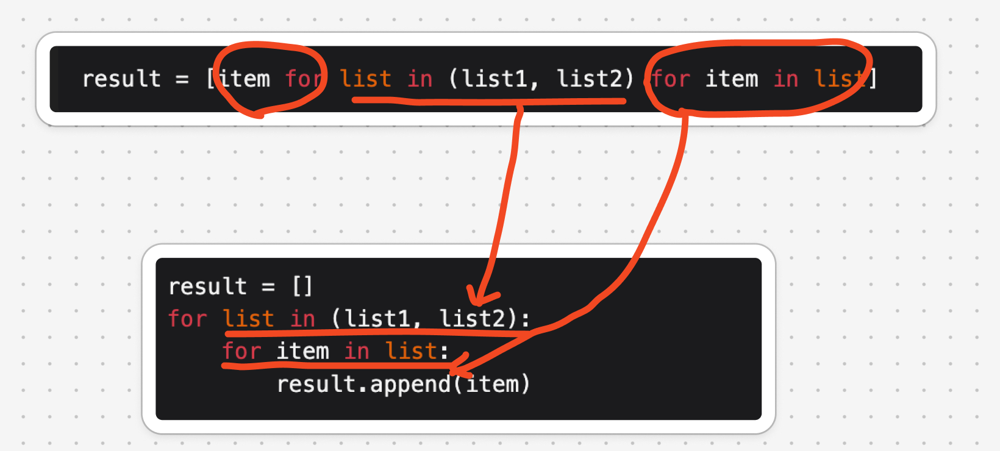

# 列表：Python 描述

`#数据结构/列表` `#数据结构` 


列表（list）是一个抽象的数据结构概念，它表示元素的有序集合，支持元素访问、修改、添加、删除和遍历等操作，无须使用者考虑容量限制的问题。列表可以基于链表或数组实现。

**许多编程语言中的标准库提供的列表是基于动态数组实现的**，例如
- Python 中的 `list` 
- Java 中的 `ArrayList` 
- Js 的 `Array` 


## 目录
<!-- toc -->
 ## 1. 初始化与更新 


```python
##############################
### 初始化列表
##############################
num1:list[int] = [1, 2, 3, 4, 5]

######### 列表的访问：复杂度为 O(1)
print(num1[0])  # 查
num1[0] = 0 # 更新
```

## 2. 列表的插入：复杂度为 O(n)

```python
##############################
### 列表的插入：复杂度为 O(n)
##############################

# 清空列表
num1.clear()

# 头部插入
# insert(index, value) index 为插入的位置，value 为插入的值
num1.insert(0, 1) # 复杂度为 O(n)
# 尾部插入
num1.append(2) # 复杂度为 O(1)
# 中间插入
num1.insert(1, 3) # 复杂度为 O(n)
```

## 3. 列表的遍历：复杂度为 O(n)

```python
##############################
### 列表的遍历：复杂度为 O(n)
##############################

# 方式一
for i in num1:
    print(i)

# 方式二
for i in range(len(num1)):
    print(num1[i])
```

## 4. 拼接列表

```python
##############################
### 拼接列表
##############################
num1 = [1, 2, 3, 4, 5]
num2 = [6, 7, 8, 9, 10]

# 方式一：使用 extend 方法
# ## 缺点：改变了原始的 num1
num1.extend(num2)

# 方式二：使用 + 运算符
### 缺点：创建了新的列表
new_list = num1 + num2

# 方式三：使用 * 运算符和列表解包
### 缺点：不适用于大列表,在 Python 3.5 之前的版本中不支持
new_list = [*num1, *num2]

# 方式四：使用列表解析
### 缺点：不适用于大列表
new_list = [i for i in num1] + [i for i in num2]

result = [item for list in (num1, num2) for item in list]
```

### 4.1. 关于列表解析的说明



### 4.2. 列表的删除

```python
##############################
### 列表的删除：复杂度为 O(n)
##############################
num1 = [1, 2, 3, 4, 5]
# remove 方法: 删除第一个匹配的元素,如果没有找到会报错
# remove(item) item 为需要删除的元素
num1.remove(3) # 删除第一个 3

# pop 方法: 删除指定索引的元素,参数为索引
num1.pop(1) # 删除索引为 1 的元素

# clear 方法: 清空列表
num1.clear()

# del 方法: 删除指定索引的元素,参数为索引
del num1[1] # 删除索引为 1 的元素
# 删除整个列表
del num1

```

## 5. 列表的排序

```python

##############################
### 列表的排序
##############################
num1 = [1, 3, 2, 5, 4]
num1.sort() # 默认升序
num1.sort(reverse=True) # 降序
```


## 6. 列表的实现原理

许多编程语言内置了列表，例如 Java、C++、Python 等。它们的实现比较复杂，各个参数的设定也非常考究，例如**初始容量、扩容倍数**等。

为了加深对列表工作原理的理解，我们尝试实现一个简易版列表，包括以下三个重点设计。
- **初始容量**：选取一个合理的数组初始容量。
- **数量记录**：声明一个变量 `size` ，用于记录列表当前元素数量，并随着元素插入和删除实时更新。根据此变量，我们可以定位列表尾部，以及判断是否需要扩容。
- **扩容机制**：若插入元素时列表容量已满，则需要进行扩容。先根据扩容倍数创建一个更大的数组，再将当前数组的所有元素依次移动至新数组。
	- 比如设置`扩容倍数` 
