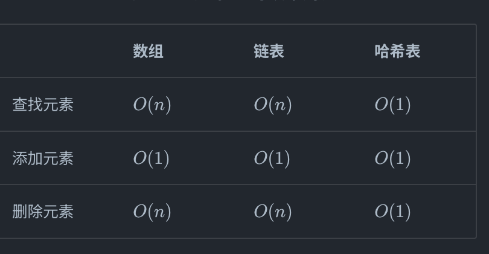
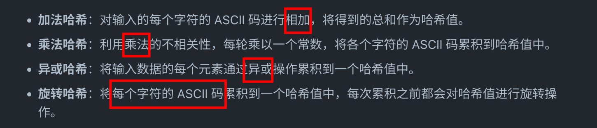
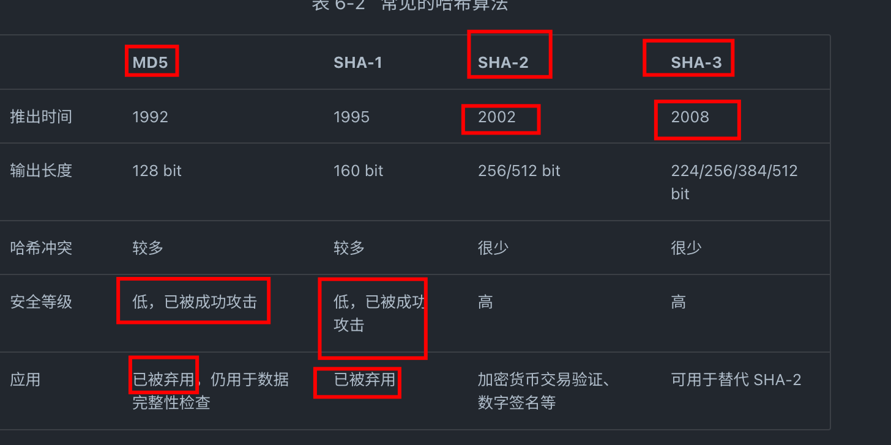
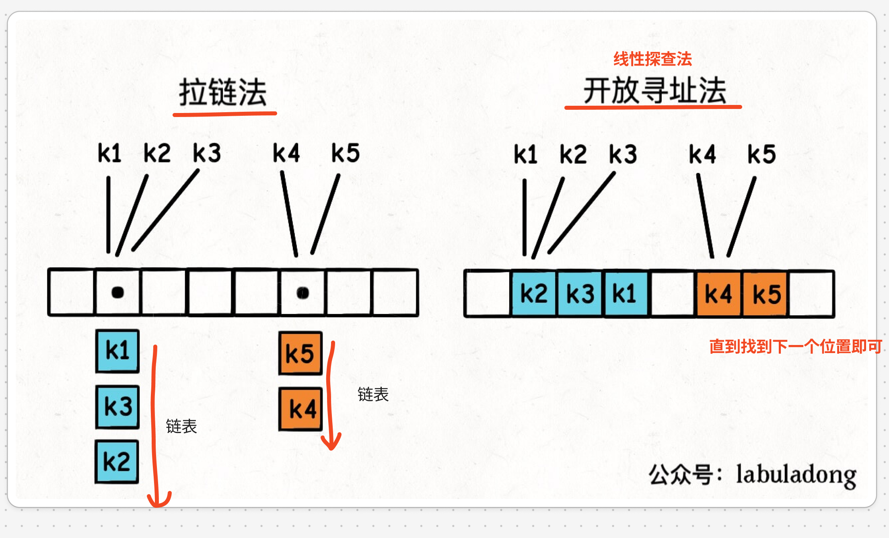
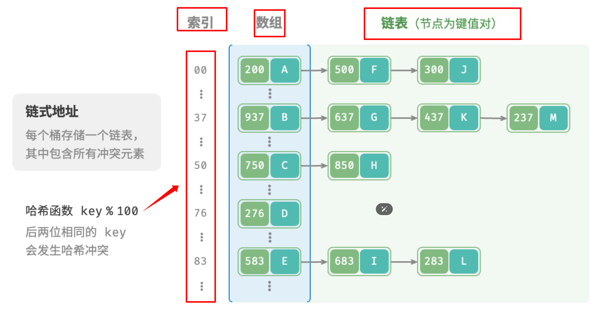

# 哈希表概述

`#哈希表` `#hash` `#数据结构`  `#2024/09/22` 


## 目录
<!-- toc -->
 ## 1. 哈希表的价值 

看下图数组、链表、及哈希的增删改成的复杂度就知道其价值了 


## 2. 哈希表和 Map（键值映射）的关系？

- 哈希表是一种具体的**数据结构**
	- 它使用哈希函数将键映射到存储桶或槽中，从而实现高效的插入、删除和查找操作。
	- 是许多高级编程语言中 Map 或字典实现的底层数据结构
	- 哈希表是一个具体的**数据结构**，描述了如何组织数据。
- Map 是一个抽象数据类型
	- Map 是一个**抽象数据类型**，它定义了一种存储键值对并允许通过键快速查找值的结构
	- 它定义了行为但不指定实现
- 哈希表是实现 Map 的一种常见且高效的方式，但不是唯一的方式
- 在许多编程语言中，默认的 Map 或字典实现通常基于哈希表
	- Python 中 `dict` 类型是 Map 的一种实现，内部使用**哈希表**

```python
# 创建一个字典（Map）
my_dict = {"apple": 1, "banana": 2, "orange": 3}

# 插入新的键值对
my_dict["grape"] = 4

# 查找值
print(my_dict["banana"])  # 输出：2

# 删除键值对
del my_dict["orange"]

# 遍历键值对
# items() 方法返回一个包含所有字典项的列表
# 类似于 JavaScript 中的 Object.entries()
for key, value in my_dict.items():
    print(f"{key}: {value}")

# 检查键是否存在
if "apple" in my_dict:
    print("Apple is in the dictionary")
```

## 3. 哈希表的三种方式遍历方式

```python
# 遍历哈希表
# 遍历键值对 key->value
for key, value in hmap.items():
    print(key, "->", value)
# 单独遍历键 key
for key in hmap.keys():
    print(key)
# 单独遍历值 value
for value in hmap.values():
    print(value)
```

## 4. 哈希表的基本原理

底层是数组，存在数组的哪个索引取决于`hash(key)`
- 哈希表可以理解为一个加强版的数组
- 数组可以通过索引（非负整数）在 `O(1)` 的时间复杂度内查找到对应元素。
- 哈希表是类似的，可以通过 `key` 在 `O(1)` 的时间复杂度内查找到这个 `key` 对应的 `value`。`key` 的类型可以是数字、字符串等多种类型。

看下伪码

```python
# 哈希表伪码逻辑
class MyHashMap:

    def __init__(self):
        self.table = [None] * 1000

    # 增/改，复杂度 O(1)
    def put(self, key, value):
        index = self.hash(key)
        self.table[index] = value

    # 查，复杂度 O(1)
    def get(self, key):
        index = self.hash(key)
        return self.table[index]

    # 删，复杂度 O(1)
    def remove(self, key):
        index = self.hash(key)
        self.table[index] = None

    # 哈希函数，把 key 转化成 table 中的合法索引
    # 时间复杂度必须是 O(1)，才能保证上述方法的复杂度都是 O(1)
    def hash(self, key):
        # ...
        return hash(key) % len(self.table)

```

## 5. 哈希函数（哈希算法）

**哈希函数**的作用是把`任意长度的输入（key）`转化成`固定长度的输出（索引）`
- key 的长度任意
- 索引需要合法，比如在数组长度范围内

### 5.1. 最简单的哈希算法



### 5.2. 常见的哈希算法



## 6. 盐值的主要作用

1. 防御彩虹表攻击
	- 彩虹表是一种预计算的哈希值表，用于加速密码破解过程。通过为每个密码添加唯一的盐值，可以使预计算的彩虹表变得无效，因为攻击者需要为每个可能的盐值创建一个新的彩虹表，这在计算上是不可行的。
2. 防止相同密码产生相同的哈希值
	- **如果两个用户使用相同的密码**，没有盐值的情况下，它们的哈希值将会相同。使用盐值可以确保即使密码相同，最终的哈希值也会不同，增加了安全性。
3. 增加密码的复杂性
	- 盐值增加了原始密码的长度和复杂性，使得暴力破解和字典攻击变得更加困难。
4. 缓解密码重用的风险
	- 如果用户在多个系统中使用相同的密码，盐值可以确保即使一个系统被攻破，其他系统的密码哈希也不会立即受到威胁。

比如 **因为 Python 解释器在每次启动时，都会为字符串哈希函数加入一个随机的盐（salt）值**。这种做法可以有效防止 HashDoS 攻击，提升哈希算法的安全性

## 7. 哈希冲突

哈希冲突是一定会出现的，因为这个 `hash` 函数相当于：是把一个**无穷大**的空间映射到了一个**有限的**索引空间，所以必然会有不同的 `key` 映射到同一个索引上

就好比三维物体映射到二维影子一样，这种有损压缩必然会出现信息丢失，有损信息本就无法和原信息一一对应

### 7.1. 解决哈希冲突的两种方式：拉链法和线性探查法



- 拉链法相当于是哈希表的底层数组并不直接存储 `value` 类型，而是存储一个链表，当有多个不同的 `key` 映射到了同一个索引上，这些 `key -> value` 对儿就存储在这个链表中，这样就能解决哈希冲突的问题。
- 而线性探查法的思路是，一个 `key` 发现算出来的 `index` 值已经被别的 `key` 占了，那么它就去 `index + 1` 的位置看看，如果还是被占了，就继续往后找，直到找到一个空的位置为止

### 7.2. 拉链法：链式地址



具体事项方式不展开了
### 7.3. 线性探测法

- 线性探测
- 平方探测
- 多次哈希

具体实现方式不展开了

## 8. 负载因子

负载因子是度量一个哈希表装满的程度指标。一般来说，负载因子越大，说明哈希表里面存储的 `key-value` 对越多，哈希冲突的概率就越大，哈希表的操作性能就越差

当哈希表内元素达到负载因子时，哈希表就会扩容。

## 9. 哈希表的增删查改效率一定是 `O(1)` 吗？

不一定，只有哈希函数的复杂度是 `O(1)`，且合理解决哈希冲突的问题，才能保证增删查改的复杂度是 `O(1)`，不然可能会退化为 `O(n)`

