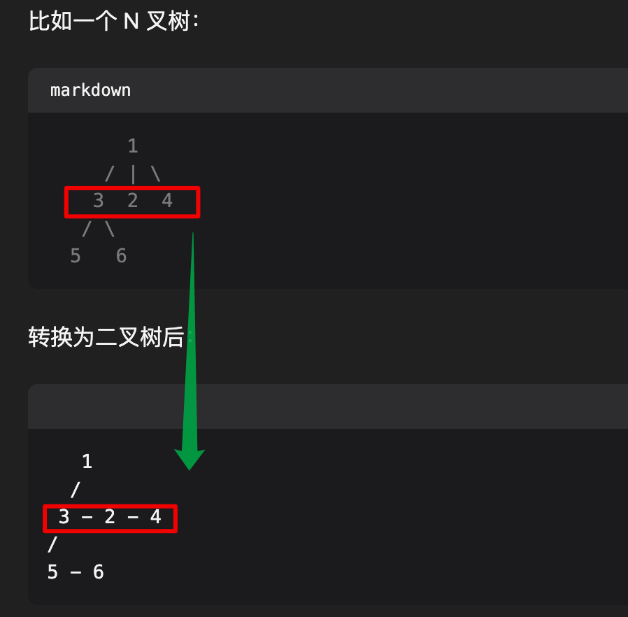

# 将 N 叉树编码为二叉树：可以将 N 叉树编码为二叉树，并能将该二叉树解码为原 N 叉树


> [431. 将 N 叉树编码为二叉树](https://leetcode.cn/problems/encode-n-ary-tree-to-binary-tree/)


## 目录
<!-- toc -->
 ## 1. 题目 



## 2. 代码

关键点：
- 指针 `p` 先指向 `left` 
- 然后一直指向 `right` 
	- `p = p.right`


```javascript

class Codec {
    // 将 N 叉树编码为二叉树
    encode(root) {
        if (!root) return null;
        let n = root.children.length;
        // 创建二叉树根节点
        const binaryRoot = new TreeNode(root.val);
        // 如果有子节点
        if (n > 0) {
            // 第一个子节点作为左子树
            binaryRoot.left = this.encode(root.children[0]);
        }
        // 处理其他子节点
        // 指针指向二叉树的left
        let p = binaryRoot.left;
        // 从第二个子节点开始，依次作为右子树
        for (let i = 1; i < n; i++) {
            p.right = this.encode(root.children[i]);
            p = p.right; // p 指针移动直到为空为止
        }
        return binaryRoot;
    }
    // 将二叉树解码为 N 叉树
    decode(root) {
        if (!root) return null;
        // 创建 N 叉树根节点
        const naryRoot = new Node(root.val, []);
        // 获取所有子节点
        let p = root.left;
        while (p) {
            // 递归处理每个子节点
            naryRoot.children.push(this.decode(p));
            p = p.right; // p 指针移动直到 p 为空为止
        }
        return naryRoot;
    }
}
```