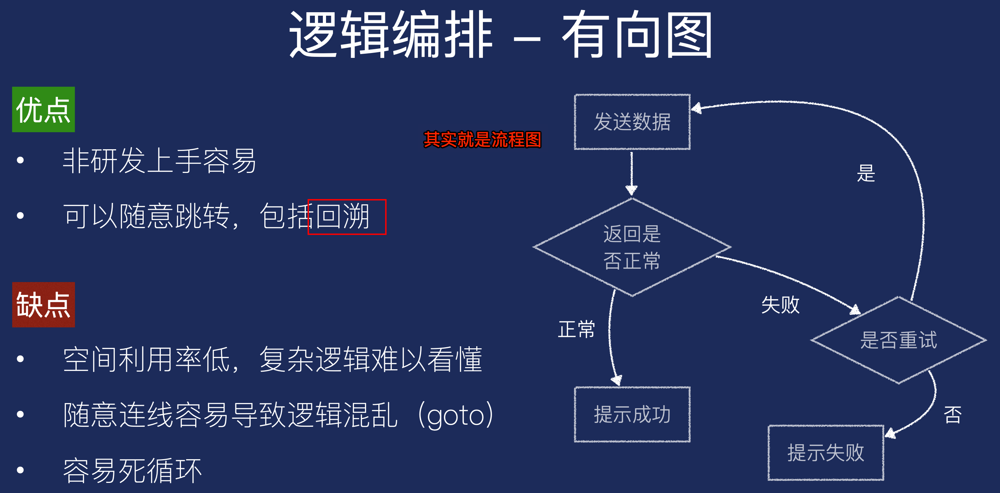
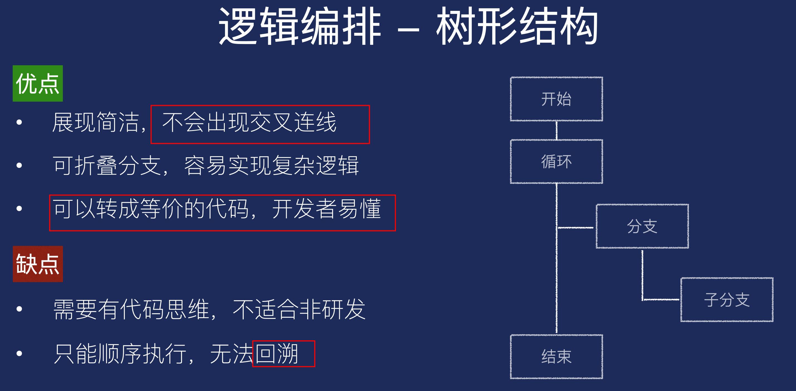
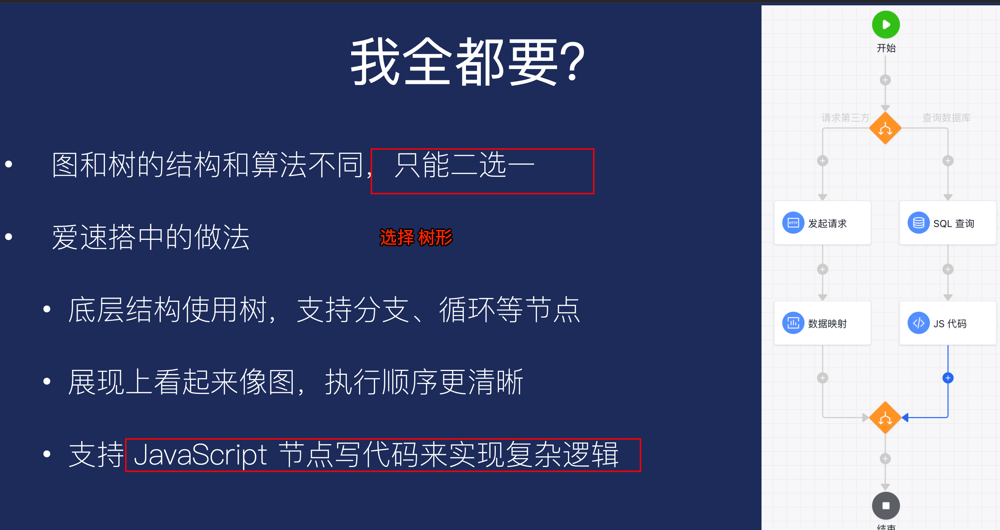

# 低代码原理与标准

`#lowcode` 

## 目录
<!-- toc -->
 ## 1. 前端 

- ① 生成可执行代码：出码
	- 类似脚手架，通过模板及树遍历的方式生成项目工程
		- **复杂的运行时功能难以生成**
		- 需要编译，**难以实时预览**
		- 代码二次修改后无法转回
		- 提效有限，只覆盖项目初期
- ② 运行引擎  
	- 运行时动态解析 JSON 配置进行渲染
		- 缺点
			- **DSL 没有公认的规范**
			- 性能受限于引擎的视线
			- 调试及黑盒
			- ==产商锁定==
		- 好处
			- ==实施预览==
			- 可使用实现复杂额运行时功能

我们的做法
- 运行时框架
- 另可通过高代码开发自由组件，通过**模块联邦**方式提高性能

## 2. 后端

### 2.1. 逻辑编排：流程图&有向图

### 2.2. 逻辑编排：树形结构

### 2.3. 选择

>  复杂逻辑，可以使用 JavaScript，内嵌到服务端！！
