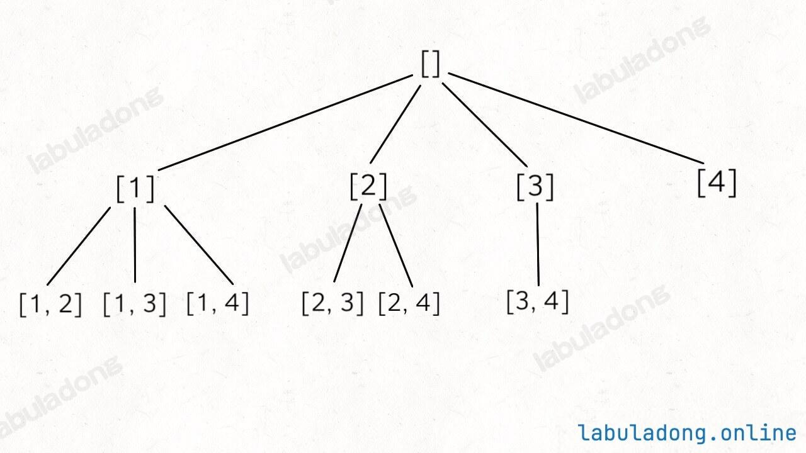

# 组合：元素不重复不可复选


> [77. 组合](https://leetcode.cn/problems/combinations/)


## 目录
<!-- toc -->
 ## 1. 题目 


给你输入一个数组 `nums = [1,2..,n]` 和一个正整数 `k`，请你生成所有`大小为 k 的子集` 

## 2. 思路



### 2.1. 思路 1：

- 复用 [78. 子集：元素不重复不可复选](/post/DiFK0hQo.html) 的代码，最终返回结果 `再过滤长度=k` 的子集不就行了嘛？

### 2.2. 思路 2：

- 要点
	- `start` 从 `0` 开始，方便处理
	- `if (track.length === k) {`

```javascript
var combine = function (n, k) {
  let res = [];
  function backtrack(track, start) {
    if (track.length === k) {
      res.push([...track]);
      return;
    }
    for (let i = start; i <= n; i++) {
      track.push(i);
      backtrack(track, i + 1);
      track.pop();
    }
  }

  backtrack([], 1);

  return res;
};
```

## 3. 请问

回溯算法的**剪枝逻辑**一般放到那儿？

和这题没关系，突然想到的