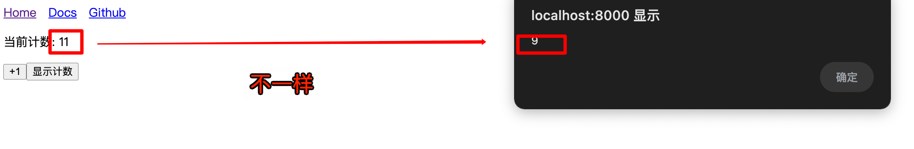

# React 的 Capture Value（捕获值）特性

`#react` 


## 目录
<!-- toc -->
 ## 1. 定义与要点 

- 原因：Capture Value 是 React 的重要特性，**每次渲染都有其独立的 props 和 state**
- 如何规避
	- 使用`函数式更新`可以避免闭包陷阱
	- `useRef` 可以用来保存最新值
	- 依赖数组**需要包含所有会变化的值**
	- `useCallback` 和 `useMemo` 可以帮助控制函数和值的捕获行为

## 2. 基本概念



```jsx hl:6
import React, { useState } from "react";
function Counter() {
  const [count, setCount] = useState(0);

  // 点击按钮，3 秒后弹出当前 count 值
  // 但是由于 setTimeout 是异步的，所以会捕获当时的 count 值
  const handleClick = () => {
    setTimeout(() => {
      alert(count); // 会捕获当时的 count 值
    }, 3000);
  };

  return (
    <div>
      <p>当前计数: {count}</p>
      <button onClick={() => setCount(count + 1)}>+1</button>
      <button onClick={handleClick}>显示计数</button>
    </div>
  );
}

export default Counter;

```

## 3. 闭包陷阱示例

```javascript hl:6
function Counter() {
  const [count, setCount] = useState(0);
  
  useEffect(() => {
    const id = setInterval(() => {
      // 这里的 count 永远是初始值 0
      setCount(count + 1);
    }, 1000);
    
    return () => clearInterval(id);
  }, []); // 空依赖数组
  
  return <h1>{count}</h1>;
}
```

## 4. 正确的更新方式

```javascript hl:6
function Counter() {
  const [count, setCount] = useState(0);
  
  useEffect(() => {
    const id = setInterval(() => {
      // 使用函数式更新
      setCount(c => c + 1);
    }, 1000);
    
    return () => clearInterval(id);
  }, []); // 空依赖数组是安全的
  
  return <h1>{count}</h1>;
}
```

## 5. 事件处理中的 Capture Value

```javascript
function Example() {
  const [message, setMessage] = useState('');
  
  const showMessage = () => {
    alert('你输入了: ' + message);
  };
  
  const handleClick = () => {
    setTimeout(showMessage, 3000);
  };
  
  return (
    <div>
      <input value={message} onChange={e => setMessage(e.target.value)} />
      <button onClick={handleClick}>3秒后显示</button>
    </div>
  );
}
```

## 6. 使用 ref 避免 Capture Value

```javascript hl:3,12,11
function Example() {
  const [message, setMessage] = useState('');
  const latestMessage = useRef('');
  
  // 更新 ref
  useEffect(() => {
    latestMessage.current = message;
  }, [message]);
  
  const showMessage = () => {
    // 使用 ref 获取最新值
    alert('你输入了: ' + latestMessage.current);
  };
  
  const handleClick = () => {
    setTimeout(showMessage, 3000);
  };
  
  return (
    <div>
      <input value={message} onChange={e => setMessage(e.target.value)} />
      <button onClick={handleClick}>3秒后显示</button>
    </div>
  );
}
```

## 7. 依赖数组中的 Capture Value

```javascript
function SearchResults() {
  const [query, setQuery] = useState('');
  const [results, setResults] = useState([]);
  
  useEffect(() => {
    // 这个效果会捕获特定的 query 值
    const fetchData = async () => {
      const response = await fetch(`/api/search?q=${query}`);
      const data = await response.json();
      setResults(data);
    };
    
    fetchData();
  }, [query]); // query 改变时重新运行
  
  return (
    <div>
      <input value={query} onChange={e => setQuery(e.target.value)} />
      <ul>
        {results.map(result => (
          <li key={result.id}>{result.title}</li>
        ))}
      </ul>
    </div>
  );
}
```

## 8. 常见问题和解决方案

```javascript hl:18,9
// 问题：在循环中使用异步操作
function App() {
  const [count, setCount] = useState(0);
  
  // 错误示例
  const handleClick = () => {
    for (let i = 0; i < 5; i++) {
      setTimeout(() => {
         // 没使用 函数式更新
        setCount(count + 1); // 每次都使用相同的 count 值
      }, i * 1000);
    }
  };
  
  // 正确示例
  const handleClickCorrect = () => {
    for (let i = 0; i < 5; i++) {
      setTimeout(() => {
	      // 使用函数式更新
        setCount(c => c + 1); 
      }, i * 1000);
    }
  };
  
  return <button onClick={handleClickCorrect}>{count}</button>;
}
```

## 9. 使用 useCallback 处理 Capture Value

```javascript hl:4
function Example() {
  const [count, setCount] = useState(0);
  
  // 每次 count 改变时都会创建新的回调
  const handleClick = useCallback(() => {
    console.log(`Count is: ${count}`);
  }, [count]);
  
  return (
    <div>
      <p>Count: {count}</p>
      <button onClick={() => setCount(count + 1)}>Increment</button>
      <button onClick={handleClick}>Log count</button>
    </div>
  );
}
```

## 10. 实际应用场景

```javascript hl:5
function ChatRoom() {
  const [messages, setMessages] = useState([]);
  const [newMessage, setNewMessage] = useState('');
  
  // 使用 useCallback 确保函数引用稳定
  const sendMessage = useCallback(() => {
    const messageToSend = newMessage; // 捕获当前的消息
    setNewMessage(''); // 清空输入
    
    // 异步发送消息
    api.sendMessage(messageToSend).then(() => {
      setMessages(msgs => [...msgs, messageToSend]);
    });
  }, [newMessage]);
  
  return (
    <div>
      <input
        value={newMessage}
        onChange={e => setNewMessage(e.target.value)}
      />
      <button onClick={sendMessage}>发送</button>
      <div>
        {messages.map((msg, index) => (
          <div key={index}>{msg}</div>
        ))}
      </div>
    </div>
  );
}
```

