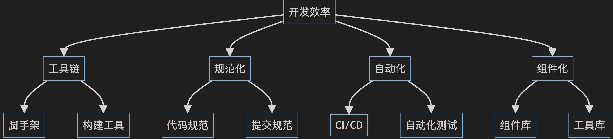
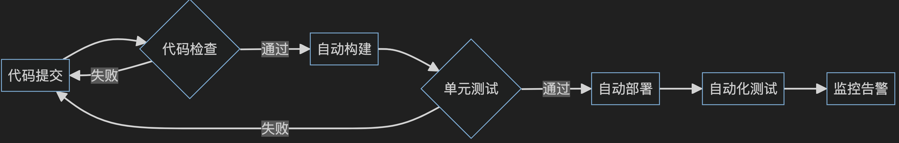
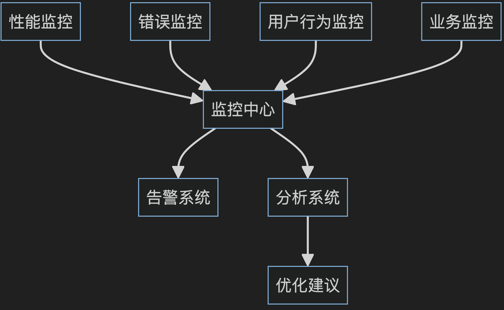
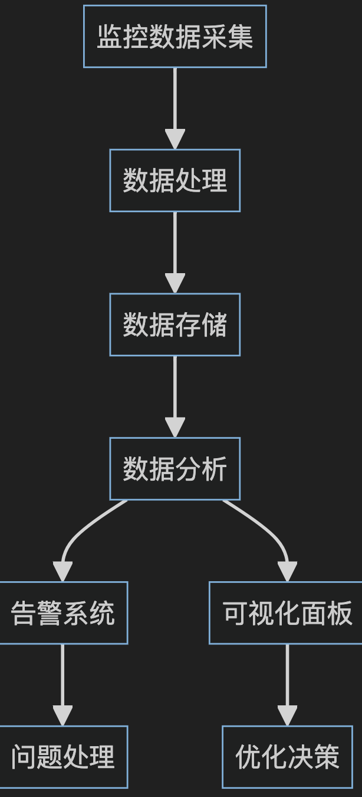

# 前端工程化

`#前端工程化` 


## 目录
<!-- toc -->
 ## 1. 总结 

- 前端工程化的==本质==：
	- 通过==工程手段==解决**前端开发中的==效率、规范、质量、性能、安全、监控==等问题**
	- 覆盖 ==开发 → 构建 → 部署 → 监控== 全过程
- 前端工程化==核心目的==是更好的==交付业务==
- 前端工程化的==好处==：
	- 提升研发效率
	- 优化研发体验：DX
	- 保障项目==质量与安全==
- 前端工程化的==架构设计==
	- 规范化&标准化：
		- 各类规范，比如 js/css/git/测试 等等
			- 代码规范标准化
			- 工程结构标准化
			- 开发==流程==标准化
	- 模块化
		- 业务模块设计：==分层==
			- 视图层、数据层、服务层、配置层
		- 服务模块化
			- API 服务
			- 工具服务
	- 组件化：
		- 基础组件 → 业务组件 → 页面 → 应用
	- 自动化：==能自动化的都自动化==
		- 代码提交 → 代码检测 → 自动扫描 → 自动构建 → 单元测试 → 自动化部署 → 自动化测试 → 自动告警监控
- 质量与安全
	- 测试体系：API、UI、关键路径、业务流程
	- 代码质量：
		- eslint sonar prettier 
		- code review 机制
	- 安全保证：xss、CSRF 、敏感数据、权限、输入验证等
- 性能优化
	- 核心性能指标
		- 加载性能：FCP、TTI、LCP
		- 交互性能：FID、TBT、CLS
	- 资源性能：
		- 首屏 js/css资源大小
		- 图片压缩率
	- 优化策略
		- 构建层面优化
		- 运行时优化
		- 资源加载优化
- 监控体系
	- 性能监控 
	- 错误监控
	- 用户行为监控
	- 业务监控
	- 告警反馈机制
	- 错误分级标准
- 开发者体验 DX
	- 开发工具链：IDE → 调试 → mock 服务 → 文档 → API 工具
	- 前端研发平台等
		- 集成前端开发全链路
- ==量化工程化是否好==？
	- 构建性能指标
		- **构建时间**
			- 冷启动完整构建 < 5分钟
			- 增量构建 < 30秒
			- 开发环境热更新 < 300ms
		- **产物体积**
			- 首屏 JS 体积 < 300KB
			- 首屏 CSS 体积 < 100KB
			- 图片资源压缩率 > 60%
	- 部署效率指标
		- 生产环境部署成功率 > 99%
		- 回滚时间 < 5分钟
		- 发布时长
	- 代码质量
		- 圈复杂度 ≤ 10
		- ==函数行数== ≤ 80行
		- ==文件行数== ≤ 300行
		- sonar ==扫描通过率==
		- ESLint 错误 = 0
		- TypeScript 类型覆盖率 > 90%
		- 代码注释率：15-20%
		- 单元测试
			- 测试覆盖率 > 80%
			- 核心业务覆盖率 > 90%
			- 测试用例通过率 100%
	- 运行时性能
		- 长任务(>50ms) < 5%
		- 内存泄漏 = 0
		- FPS > 50fps
		- FCP (First Contentful Paint) < 1.5s
		- LCP (Largest Contentful Paint) < 2.5s
		- TTI (Time to Interactive) < 3.5s
		- 内存使用
		- CPU 使用率
		- 资源缓存命中率
		- 是否有服务降级机制
	- API 接口性能
		- P95 响应时间 < 500ms
		- 接口成功率 > 99.9%
		- 接口错误率 < 0.1%
	- 研发效率指标
		- 通用组件复用率 > 80%
		- 工具函数复用率 > 60%
	- 开发效率
		- ==需求按期交付率== > 90%
		- 迭代速度？
			- 双周迭代 → 周迭代？
		- 缺陷修复周期 < 24小时
			- 不同级别的 Bug ==修复周期==不一样
		- 代码提交频率 > 3次/天
	- 自动化程度
		- 关键环节是否都自动化了？
		- 环境隔离度
		- 自动化工具覆盖率
	- 规范化程度
		- 命名规范遵守率
		- Git 提交规范
	- 安全
		- 安全漏洞修复时长
		- 定期安全扫描机制
	- 内部系统集成率
	- 告警系统
		- ==线上问题发现率==
		- 日志体系完备性
		- 开发环境一致性


> 另外见 [4. 前端工程化 SOP](/post/cFhJp1U4.html)

## 2. 前端工程化的本质

- 前端工程化的本质是通过==工程手段==解决**前端开发中的效率、规范、质量、性能、安全、监控等问题**。
	- 它不仅仅是工具的堆砌，而是一套完整的**系统工程方法论**
	- 它涉及**开发、构建、部署、运维**等多个环节

## 3. 核心目标

==核心目的==：**更好高效的的交付业务** 

### 3.1. **提升开发效率**



### 3.2. **保证项目质量**

```typescript
// 质量保证体系示例
interface QualitySystem {
  static: {
    eslint: ESLintConfig;
    typescript: TSConfig;
    prettier: PrettierConfig;
  };
  runtime: {
    errorBoundary: ErrorBoundaryConfig;
    monitoring: MonitoringConfig;
    testing: TestingStrategy;
  };
  process: {
    review: CodeReviewProcess;
    ci: ContinuousIntegration;
    deployment: DeploymentStrategy;
  }
}
```

### 3.3. **优化研发体验**

   - 开发工具链集成
   - 即时反馈机制
   - 开发环境标准化
   - 调试工具完善

## 4. 工程化架构设计

### 4.1. **基础设施层**

覆盖 ==开发 → 构建→ CI → 监控==

````ts
interface Infrastructure {
  // 构建系统
  build: {
    dev: () => void;      // 开发环境构建
    prod: () => void;     // 生产环境构建
    analyze: () => void;  // 构建分析
  };
  
  // 开发工具
  devTools: {
    lint: () => void;     // 代码检查
    format: () => void;   // 代码格式化
    debug: () => void;    // 调试工具
  };
  
  // 持续集成
  ci: {
    test: () => void;     // 自动化测试
    build: () => void;    // 自动化构建
    deploy: () => void;   // 自动化部署
  };
  
  // 监控系统
  monitoring: {
    performance: () => void; // 性能监控
    error: () => void;      // 错误监控
    business: () => void;   // 业务监控
  };
}
````

### 4.2. 规范标准层（标准化）

- 代码规范标准化
- 工程结构标准化
- 开发流程标准化

```yaml
standards:
  code:
    - JavaScript/TypeScript规范
    - CSS/Sass规范
    - 目录结构规范
  development:
    - Git工作流规范
    - 开发流程规范
    - 测试规范
  architecture:
    - 项目架构规范
    - 组件设计规范
    - API设计规范
```

### 4.3. 工具支持层

   - 脚手架工具
   - 构建工具
	   - （Webpack/Vite）
   - 测试工具
	   - （Jest/Cypress）
   - 部署工具

## 5. 工程化实践要素

### 5.1. **模块化设计**

- 组件模块化
- ==状态数据==模块化
- 服务模块化
	- API 服务封装
	- 工具服务封装
	- 业务逻辑服务封装

````ts
  // 业务模块设计
  interface ModuleStructure {
    // 视图层
    views: {
      components: React.Component[];
      layouts: Layout[];
      pages: Page[];
    };
    
    // 数据层
    models: {
      states: State[];
      actions: Action[];
      reducers: Reducer[];
    };
    
    // 服务层
    services: {
      api: APIService;
      utils: Utilities;
      helpers: Helpers;
    };
    
    // 配置层
    configs: {
      routes: Route[];
      constants: Constants;
      settings: Settings;
    };
  }
````

### 5.2. **组件化开发**

```typescript
// 组件分层示例
interface ComponentLayers {
  // 基础组件层
  basic: {
    Button: ButtonComponent;
    Input: InputComponent;
    // ...
  };
  
  // 业务组件层
  business: {
    UserCard: UserCardComponent;
    OrderList: OrderListComponent;
    // ...
  };
  
  // 页面组件层
  pages: {
    UserCenter: UserCenterPage;
    OrderManagement: OrderManagementPage;
    // ...
  };
}
```

### 5.3. **自动化流程**



- 构建自动化
- 测试自动化
- 部署自动化
	- CI/CD流程
	- 自动化测试
	- 自动化部署
- 监控告警自动化

> 单元测试，其实做的团队不多

## 6. 质量保证体系

### 6.1. **测试体系**

```typescript
// 测试策略
interface TestingStrategy {
  unit: {
    framework: 'Jest';
    coverage: {
      statements: 80;
      branches: 70;
      functions: 80;
      lines: 80;
    };
  };
  
  integration: {
    framework: 'Cypress';
    scope: ['API', 'UI'];
  };
  
  e2e: {
    framework: 'Playwright';
    scenarios: ['关键路径', '业务流程'];
  };
}
```

### 6.2. **代码质量控制**

   - ESLint 配置
   - **sonar 检测集成**
   - TypeScript 类型检查
   - Prettier 格式化
   - Code Review 机制
	   - 主动发起 
	   - Code review
	   - Review 机制
		   - **定期一起 review 代码**

## 7. 性能优化体系

### 7.1. **性能指标**

核心性能指标

加载性能

  - FCP (First Contentful Paint) < 1.8s
  - LCP (Largest Contentful Paint) < 2.5s
  - TTI (Time to Interactive) < 3.8s

交互性能

  - FID (First Input Delay) < 100ms
  - TBT (Total Blocking Time) < 200ms
  - CLS (Cumulative Layout Shift) < 0.1

### 7.2. 资源性能

  - 首屏 JS 资源 < 300 KB
  - 首屏 CSS 资源 < 100 KB
  - **图片资源优化&压缩率** > 70%

### 7.3. **优化策略**

- ==构建==层面优化
	- 代码分割
	- 树摇优化
	- 资源压缩
	- 缓存策略
- ==运行时==优化
	- 渲染优化
- ==资源加载==优化
	- 懒加载
	- 预加载
	- 并行加载
	- 资源合并

## 8. 安全保障体系

### 8.1. **安全策略**

```typescript
interface SecurityStrategy {
  // XSS防护
  xss: {
    contentSecurityPolicy: CSPConfig;
    sanitization: SanitizeConfig;
  };
  
  // CSRF防护
  csrf: {
    tokenValidation: TokenConfig;
    headerChecks: HeaderConfig;
  };
  
  // 数据安全
  data: {
    encryption: EncryptionConfig;
    storage: StorageConfig;
  };
}
```

### 8.2. **安全实践**

   - 输入验证
   - 权限控制
   - 敏感数据处理
   - 安全审计 

## 9. 持续优化

### 9.1. **监控体系**





### 9.2. 日志系统

### 9.3. **反馈机制**

   - 性能监控
   - 错误追踪
   - 用户反馈
   - 系统日志

## 10. 开发者体验

良好的开发体验可以提高团队效率：
- **开发工具链**
	- IDE 配置
	- 调试工具
	- 开发 服务器
	- Mock 服务
- 文档工具等
- **前端研发平台**

## 11. 工程化成熟度评估

### 11.1. **评估维度**

```typescript
interface MaturityAssessment {
  process: {
    automation: number;  // 自动化程度
    standardization: number;  // 规范化程度
    efficiency: number;  // 效率提升
  };
  
  quality: {
    codeQuality: number;  // 代码质量
    testCoverage: number;  // 测试覆盖
    performance: number;  // 性能指标
  };
  
  maintenance: {
    documentation: number;  // 文档完整性
    codeReusability: number;  // 代码复用性
    scalability: number;  // 可扩展性
  };
}
```

### 11.2. **优化方向**

   - 工具链优化
   - 流程优化
   - 规范完善
   - 技术升级

## 12. 总结

- 前端工程化是一个**持续演进的过程**，需要根据==团队和项目的实际情况==，选择合适的工程化策略和工具
- 好的工程化体系应该是
	- 能够支撑业务快速发展
	- 提高团队开发效率
	- 保证项目质量的完整解决方案
- 需要持续关注工程化领域的新技术和最佳实践，不断完善和优化工程化体系，
- 也要注意**平衡工程化投入与收益**，避免过度工程化带来的负担

