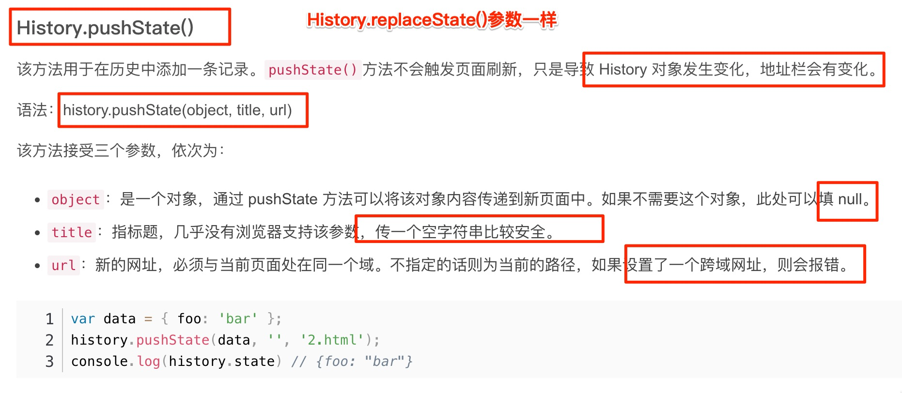

# 实现一个简易版本的前端路由

`#前端框架` `#R1` 


## 目录
<!-- toc -->
 ## 1. 哈希路由简易实现 

- 关键点
	- 监听两个事件
		- DOMContentLoaded -> onLoad
			- 主动触发一次 onHashChange
		- hashchange -> onHashChange
			- 每次更新直接修改 `#app` 的 `innerHtml`

```html
<body>
    <ul>
        <!-- 定义路由 -->
        <li><a href="#/home">home</a></li>
        <li><a href="#/about">about</a></li>
    </ul>
    <!-- 渲染路由对应的 UI -->
    <div id="app"></div>
</body>

<script type="text/javascript">
    // 页面加载完不会触发 hashchange
    // 所以这里需要主动触发一次 hashchange 事件
    window.addEventListener("DOMContentLoaded", onLoad);
    // 监听路由变化
    window.addEventListener("hashchange", onHashChange);

    // 路由视图，用于渲染路由对应的 UI
    var routerView = null;

    function onLoad() {
        routerView = document.querySelector("#app");
        onHashChange();
    }

    // 路由变化时，根据路由渲染对应 UI
    function onHashChange() {
        switch (window.location.hash) {
            case "#/home":
                routerView.innerHTML = "Home";
                return;
            case "#/about":
                routerView.innerHTML = "About";
                return;
            default:
                return;
        }
    }
</script>

```

## 2. history 路由简易实现

- 关键点
	- 监听两个事件
		- DOMContentLoaded -> onLoad
			- 主动触发一次 onPopState
		- popstate -> onPopState
			- 每次更新直接修改 `#app` 的 `innerHtml`
			- 拦截 a 标签的默认行为

```html
<body>
    <ul>
        <!-- 定义路由 -->
        <li><a href="#/home">home</a></li>
        <li><a href="#/about">about</a></li>
    </ul>
    <!-- 渲染路由对应的 UI -->
    <div id="app"></div>
</body>
<script type="text/javascript">
    // 页面加载完不会触发 hashchange
    // 这里主动触发一次 hashchange 事件
    window.addEventListener("DOMContentLoaded", onLoad);
    // 监听路由变化
    window.addEventListener("popstate", onPopState);

    // 路由视图
    var routerView = null;

    function onLoad() {
        routerView = document.querySelector("#app");
        onPopState();

        // 拦截 <a> 标签点击事件默认行为， 点击时使用 pushState 修改 URL并更新手动 UI，
        // 从而实现点击链接更新 URL 和 UI 的效果。
        var linkList = document.querySelectorAll("a[href]");
        linkList.forEach((el) =>
            el.addEventListener("click", function (e) {
                e.preventDefault();
                history.pushState(null, "", el.getAttribute("href"));
                onPopState();
            }),
        );
    }
    // 路由变化时，根据路由渲染对应 UI
    function onPopState() {
        switch (location.pathname) {
            case "/home":
                routerView.innerHTML = "Home";
                return;
            case "/about":
                routerView.innerHTML = "About";
                return;
            default:
                return;
        }
    }
</script>

```

### 2.1. 附：popstate 事件

- 仅仅调用`pushState()`方法或`replaceState()`方法 ，并不会触发该事件; 
	- 只有用户`点击浏览器倒退按钮和前进按钮`，
	- 或者使用 JavaScript 调用`History.back()、History.forward()、History.go()` 方法时才会触发。
	- 或者点击 `a 标签`的跳转
- 另外，该事件只针对同一个文档，如果浏览历史的切换，导致加载不同的文档，该事件也不会触发。
- 页面 `第一次加载的时候`，浏览器不会触发`popstate`事件
- `pushState 与 replaceState` 调用后 History 对象会变化，地址栏会变化，但不会触发页面刷新事件
	- 

## 3. 一个简单的 Router 类实现

### 3.1. 入口

```html
<!DOCTYPE html>
<html>
<body>
  <nav>
    <a href="/" data-link>Home</a>
    <a href="/about" data-link>About</a>
    <a href="/contact" data-link>Contact</a>
  </nav>
  <div id="app"></div>
  <script src="router.js"></script>
</body>
</html>

```

### 3.2. Router 实现

```javascript
class Router {
  constructor(routes) {
    this.routes = routes;
    this.rootElement = document.getElementById("app");
    this.init();
  }

  init() {
    window.addEventListener("popstate", this.handlePopState.bind(this));
    this.handleRouteChange();
    this.bindLinks();
  }

  // 为所有带有 data-link 属性的链接添加点击事件监听器
  // 阻止默认行为并调用 navigateTo 方法
  bindLinks() {
    document.addEventListener("click", (e) => {
      if (e.target.matches("[data-link]")) {
        e.preventDefault();
        this.navigateTo(e.target.href);
      }
    });
  }

  handlePopState() {
    this.handleRouteChange();
  }

  // 获取当前路径
  // 查找匹配的路由
  // 如果找到匹配的路由，渲染对应的组件
  // 如果没有找到匹配的路由，显示 404 页面
  handleRouteChange() {
    // 获取当前路径
    const path = window.location.pathname;
    const route = this.routes.find((route) => route.path === path);

    if (route) {
      this.rootElement.innerHTML = route.component();
    } else {
      this.rootElement.innerHTML = "<h1>404 Not Found</h1>";
    }
  }

  // 使用 History API 更新 URL
  // 触发路由变化处理
  navigateTo(url) {
    history.pushState(null, null, url);
    this.handleRouteChange();
  }
}

// 使用示例
const routes = [
  {
    path: "/",
    component: () => "<h1>Home Page</h1>",
  },
  {
    path: "/about",
    component: () => "<h1>About Page</h1>",
  },
  {
    path: "/contact",
    component: () => "<h1>Contact Page</h1>",
  },
];

const router = new Router(routes);
```

## 4. mini-react-router-dom 的简易实现

> 使用最新的 Hooks 的方式实现

`#todo` 


很多细节需要慢慢实现，比如
- 嵌套路由等
- 路由守卫
- 支持参数查询
- 路由过渡动画
- 路由懒加载
- 更复杂的路径匹配模式
- 路由元信息
- 路由钩子（beforeEach, afterEach）等

